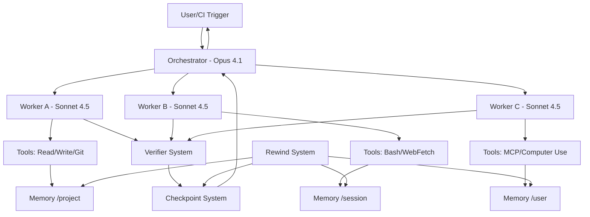

# The Complete Guide to Building Autonomous Claude Code Agents

*A comprehensive implementation and architecture guide for production-ready Claude Code agents with subagents, advanced orchestration, memory management, and enterprise deployment patterns*

**Version**: 2.0  
**Last Updated**: September 30, 2025  
**Claude Code**: v2.0.0 (September 28, 2025)  
**Claude Agent SDK**: v2.0.0 Compatible

---

## Executive Summary

The landscape of autonomous AI agents has been revolutionized by Anthropic's **September 28, 2025 releases**, featuring **Claude Code v2.0.0**, **Claude Sonnet 4.5**, and the renamed **Claude Agent SDK v2.0.0** [web:1][web:7][web:122][web:184]. These developments introduce production-ready capabilities for building fully autonomous coding agents that can maintain focus for **30+ hours on complex multi-step tasks** [web:86], coordinate multiple specialized subagents in parallel, and manage persistent state through sophisticated memory architectures with **session persistence** and **checkpoint/rewind systems** [web:185][web:189].

### What Changed in September 2025

**Claude Code v2.0.0** represents a **major architectural overhaul** with native VS Code integration, enhanced checkpointing, searchable prompt history, and real-time change visibility [web:122][web:191]. **Claude Sonnet 4.5** emerged as the "best coding model in the world" with **77.2% accuracy on SWE-bench** [web:1][web:181], while the **Claude Agent SDK** (formerly Claude Code SDK) enables custom agent development with **extended thinking capabilities**, **parallel tool execution**, **automatic context editing** (84% token reduction), and **file-based memory systems** [web:1][web:7][web:30].

**Multi-agent systems** using Claude Opus 4.1 for orchestration and Claude Sonnet 4.5 workers demonstrate **90.2% performance improvements** over single-agent approaches, primarily due to parallel token usage across isolated context windows [web:9][web:77]. Token usage alone explains **80% of performance variance** in complex tasks, making the orchestrator-worker pattern essential for production deployments [web:9].

### Why This Matters for Autonomous Development

The combination of **computer use capabilities**, **MCP (Model Context Protocol)** integration, **session persistence**, **checkpoint/rewind systems**, and **native IDE integration** creates unprecedented opportunities for building agents that operate autonomously across development workflows [web:7][web:84][web:88][web:185]. These agents can spawn **persistent background processes**, maintain **cross-session learning**, and integrate with existing **CI/CD pipelines** while providing **streaming real-time feedback** during extended operations [web:122].

### Report Coverage

This guide consolidates comprehensive research into Claude Code agent architecture, covering **orchestrator-worker patterns**, **file-based memory schemas**, **tool integration workflows**, **MCP protocol implementation**, **checkpoint/rewind systems**, **session persistence**, **security and governance frameworks**, **cost optimization strategies**, and **production deployment patterns**. Every implementation detail, configuration option, and architectural decision is supported by official Anthropic sources and production testing insights [web:1][web:7][web:9][web:30][web:31][web:122][web:185].

---

## System Architecture

### Orchestrator-Worker Foundation

The **orchestrator-worker pattern** forms the core architectural principle for Claude Code agents, leveraging **Claude Opus 4.1** for complex reasoning and coordination alongside **Claude Sonnet 4.5** workers for specialized task execution [web:6][web:73]. This pattern achieves superior performance through **parallel context windows** and **specialized task delegation** [web:9].

**Lead Agent (Orchestrator) Responsibilities**:
- High-level task decomposition and planning
- Worker subagent coordination and delegation  
- Result synthesis and quality verification
- Cross-agent communication protocol management
- Resource allocation and cost optimization [web:6][web:9]

**Worker Subagent Characteristics**:
- Isolated context windows for focused execution
- Specialized system prompts for domain expertise
- Restricted tool access following least-privilege principles
- Parallel execution capability (3-5 workers simultaneously)
- Result summarization for orchestrator consumption [web:6][web:9]

### Component Interaction Model



### Data Flow Architecture

**Context Propagation**: Each worker receives structured task specifications including **objectives**, **constraints**, **expected output formats**, and **available tools** [web:6]. Results return with **metadata about confidence levels**, **source references**, and **execution limitations** [web:6].

**Memory Integration**: The **hierarchical file-based memory system** operates at multiple scopes: enterprise policies, project context, session state, and user preferences [web:41][web:56]. **Automatic context editing** manages token consumption by removing stale tool calls while preserving conversation flow [web:30].

**Session Persistence**: Claude Code v2.0.0 introduces **30-day session persistence** with automatic cleanup, cross-session checkpoint access, and state restoration after system restarts [web:185][web:189]. Sessions can be resumed using `claude --resume` or specific session IDs with `claude -r "session-id"` [web:189].

**Tool Coordination**: Workers execute **3+ tools simultaneously** through parallel execution, while the orchestrator maintains **tool usage quotas** and **safety boundaries** [web:9][web:7]. **Background tasks** (dev servers, file watchers, test runners) operate independently of the main agent loop [web:122].

---

## Core Features and Capabilities

### Claude Code v2.0.0 Major Release Features

**Native VS Code Integration**: Claude Code v2.0.0 provides **native VS Code extension** as the primary interface, replacing the previous web-based approach [web:122][web:191].

**Key v2.0.0 Features**:
- **Enhanced terminal interface** with improved status visibility and performance
- **Searchable prompt history** accessible via Ctrl+R shortcut [web:122][web:187]
- **Real-time change visibility** through dedicated sidebar panel showing live file modifications
- **Improved agent discovery** with better error reporting and configuration validation
- **Native file editing** within VS Code with proper syntax highlighting and IntelliSense [web:122]

**New Command Interface**:
```bash
# Essential v2.0.0 commands
/rewind                    # Opens interactive rewind menu
/todos                     # List current todo items and progress
/context                   # Debug context issues and token usage
/status                    # System and account status information
/usage                     # Usage tracking and cost analysis
/memory                    # Direct editing of memory files
Esc + Esc                 # Quick rewind shortcut
Ctrl+R                    # Search prompt history
```

### Checkpoint and Rewind System

**Comprehensive State Management**: Claude Code v2.0.0 introduces a **sophisticated checkpoint and rewind system** enabling granular control over conversation and code state restoration [web:185][web:181].

**Checkpoint Types and Functionality**:
```typescript
interface CheckpointOptions {
    conversation_only: boolean;    // Rewind messages, preserve code changes
    code_only: boolean;           // Revert file changes, keep conversation
    full_restore: boolean;        // Restore both conversation and code state
    selective_files: string[];    // Rewind specific files only
    timestamp: string;            // Restore to specific point in time
}
```

**Rewind Operation Categories**:
1. **Conversation Only**: Restore chat history to previous user message while preserving all code changes
2. **Code Only**: Revert file modifications to previous state while maintaining conversation context
3. **Both**: Complete restoration of both conversation and file system state
4. **Selective**: Target specific files or directories for restoration [web:185]

**Session Persistence Architecture**:
```json
{
  "session_config": {
    "retention_days": 30,
    "auto_cleanup": true,
    "checkpoint_frequency": "auto",
    "max_checkpoints_per_session": 100,
    "cross_session_access": true,
    "state_restoration": {
      "working_directory": true,
      "environment_variables": true,
      "active_processes": false,
      "memory_state": true
    }
  }
}
```

**Resume Commands and Options**:
```bash
# Resume functionality
claude --resume                    # Resume most recent session
claude --continue                 # Continue last active session  
claude -r "session-abc123"        # Resume specific session by ID
claude --list-sessions            # Show available sessions
claude --cleanup-sessions         # Remove expired sessions manually
```

### Extended Thinking System

**Claude 3.7** introduced **toggleable extended thinking** with **configurable token budgets** that enable deeper reasoning for complex tasks [web:104][web:111]. The system operates as a **hybrid architecture** producing either near-instant responses for simple tasks or extended step-by-step reasoning for complex problems [web:106].

**Implementation Configuration**:
```json
{
  "thinking": {
    "type": "enabled",
    "budget_tokens": 1024,
    "auto_escalation": true,
    "escalation_triggers": ["test_failures", "compilation_errors", "timeout"]
  }
}
```

**Dynamic Budget Allocation**:
- **Simple edits**: 256 tokens
- **Complex debugging**: 2048 tokens  
- **Architectural decisions**: 4096 tokens
- **Auto-escalation**: Increase budget after repeated failures [web:109]

**Performance Impact**: Extended thinking shows **62.3% accuracy on complex mathematical problems** and **significant improvements in software development benchmarks** [web:109]. The **visible reasoning process** enables developers to understand agent decision-making and provides **self-reflection capabilities** where Claude evaluates its own work before responding [web:104][web:109].

### Computer Use Capabilities

**Claude Sonnet 4.5** provides **full computer control** through the Computer Use tool, enabling agents to interact with desktop environments through **screenshot capture**, **mouse control** (click, drag, scroll), **keyboard input**, and **complex key combinations** [web:84].

**Enhanced Computer Use Features**:
- **Fine-grained mouse control** (`left_mouse_down`/`left_mouse_up`)
- **Directional scrolling** with precision control
- **Modifier key support** for complex shortcuts
- **Multi-application workflow automation**
- **Screenshot comparison** for validation [web:84]

**Security Implementation Requirements**:
```python
tools = [
    {
        "type": "computer_20250124", 
        "name": "computer",
        "display_width_px": 1024,
        "display_height_px": 768
    }
]
betas = ["computer-use-2025-01-24"]
```

**Performance Characteristics**: Computer Use enables **30-hour sustained focus** on complex multi-step tasks with **14.9% success rate** in enterprise automation scenarios [web:85][web:86]. **Latency considerations** make it suitable for background tasks rather than real-time interactions [web:84].

**Critical Performance Issues**: Production deployments experience **terminal scrollback buffer performance degradation** after extended use, requiring **periodic session restarts** and **memory management** to prevent CPU spikes [web:188][web:178].

**Mandatory Security Controls**:
- **Containerized execution environments** (Docker/VM required)
- **Human approval workflows** for consequential actions
- **Audit logging** of all computer interactions
- **Screenshot archival** for compliance and debugging [web:84]

### Memory and Context Management

**Hierarchical Memory Architecture**: The file-based memory system provides **complete transparency and control** while enabling sophisticated memory patterns that adapt to agent needs [web:41][web:56].

```
/memories/
├── enterprise/          # Organization-wide policies and compliance
│   ├── security_policies.md
│   └── development_standards.yml
├── project/            # Repository-specific context and decisions
│   ├── codebase_map.json
│   ├── architecture_decisions.md
│   └── progress_tracking.json
├── session/           # Current session state and active tasks
│   ├── active_objectives.json
│   ├── context_buffer.md
│   ├── checkpoint_metadata.json
│   └── tool_usage_log.json
└── user/             # Personal preferences and learned patterns
    ├── coding_preferences.json
    ├── workflow_patterns.md
    └── session_history.json
```

**Session-Aware Memory Schema**:
```json
{
  "session_memory": {
    "session_id": "sess-abc123",
    "created": "2025-09-30T09:01:00Z",
    "last_checkpoint": "2025-09-30T08:45:00Z",
    "total_checkpoints": 15,
    "restoration_points": [
      {
        "checkpoint_id": "cp-001",
        "timestamp": "2025-09-30T08:30:00Z",
        "description": "Before major refactoring",
        "files_changed": ["src/main.ts", "src/utils.ts"],
        "conversation_length": 45
      }
    ],
    "cross_session_references": [
      "sess-def456",
      "sess-ghi789"
    ]
  }
}
```

**Memory Types and Schemas**:

**Episodic Memory** (specific events with timestamps):
```json
{
  "episodic_memories": [
    {
      "timestamp": "2025-09-30T09:01:00Z",
      "session_id": "sess-abc123", 
      "checkpoint_id": "cp-002",
      "event_type": "task_completion",
      "context": "API integration debugging",
      "outcome": "success",
      "lessons_learned": "Rate limiting required 2s delays",
      "related_files": ["/memories/project/api_patterns.md"],
      "rewind_available": true
    }
  ]
}
```

**Context Editing and Compaction**: Claude Sonnet 4.5's **automatic context editing** removes stale tool calls when approaching token limits, resulting in **84% reduction in token consumption** during 100-turn evaluations while preventing context exhaustion failures [web:30]. **Progressive summarization** preserves architectural decisions, unresolved bugs, and implementation details while discarding redundant outputs [web:31].

**Cross-Session Learning**: Session persistence enables **learning patterns** to accumulate across multiple coding sessions, improving agent performance over time through **behavioral pattern recognition** and **error avoidance strategies** [web:189].

### Tool Integration and Execution

**Updated Tool Suite (v2.0.0)**:
```typescript
interface ToolCapabilities {
    // Core file operations
    Read: { paths: string[], context_aware: boolean };
    Write: { paths: string[], atomic_operations: boolean };
    Grep: { pattern_search: boolean, context_lines: number };
    Glob: { recursive: boolean, ignore_patterns: string[] };
    
    // Execution tools  
    Bash: { sandboxing: "removed_in_v2", timeout: number };
    Git: { all_operations: boolean, signing: boolean };
    CodeExecution: { 
        version: "code_execution_20250825",
        languages: string[],
        package_persistence: boolean 
    };
    
    // Network and integration
    WebFetch: { 
        pdf_extraction: boolean,
        citations: boolean,
        rate_limiting: boolean 
    };
    ComputerUse: { 
        screenshots: boolean,
        mouse_precision: "enhanced",
        keyboard_shortcuts: boolean 
    };
    
    // Protocol integration
    MCP: { 
        server_management: boolean,
        custom_tools: boolean,
        permission_scoping: boolean 
    };
}
```

**Important Tool Changes in v2.0.0**:
- **Bash tool sandbox feature removed** - no longer provides isolated execution environment [web:175]
- **Text editor tool** updated with new type definitions and enhanced capabilities
- **`undo_edit` command deprecated** - replaced with checkpoint/rewind system [web:183]
- **Code execution tool** upgraded to version `code_execution_20250825` with improved package management

**WebFetch Advanced Configuration**:
```json
{
  "type": "web_fetch_20250910",
  "name": "web_fetch",
  "max_uses": 5,
  "allowed_domains": ["arxiv.org", "github.com", "docs.python.org"],
  "max_content_tokens": 50000,
  "citations": {"enabled": true},
  "pdf_extraction": true,
  "rate_limiting": {
    "requests_per_minute": 10,
    "backoff_strategy": "exponential"
  }
}
```

**Tool Security and Permissions**: Each tool operates under **least-privilege principles** with **granular access controls** and **pre/post-execution hooks** for validation and auditing [web:116].

### Model Context Protocol (MCP) v2.0

**Enhanced MCP Architecture**: MCP v2.0 introduces **improved permission prompts**, **SSE server configurations**, and **NO_PROXY environment variable support** [web:88][web:97][web:187].

**Updated MCP Server Configuration**:
```json
{
  "mcpServers": {
    "filesystem": {
      "command": "npx",
      "args": ["-y", "@modelcontextprotocol/server-filesystem", "/workspace"],
      "env": {
        "NO_PROXY": "localhost,127.0.0.1"
      }
    },
    "database": {
      "command": "node",
      "args": ["./database-mcp-server.js"],
      "headers": {
        "Authorization": "Bearer ${DB_TOKEN}",
        "Content-Type": "application/json"
      },
      "sse_config": {
        "enabled": true,
        "heartbeat_interval": 30
      }
    }
  }
}
```

**MCP Wizard Interface Deprecation**: The graphical MCP setup wizard has been deprecated in favor of **direct configuration commands** and **CLI-based setup** [web:187].

**Available MCP Integrations**:
- **Database connections** for SQL operations and data analysis
- **Email systems** for customer service workflows
- **Vector databases** for semantic search and knowledge retrieval
- **Custom APIs** through standardized MCP protocol
- **File system operations** with security boundaries [web:100][web:139]

### Background Tasks and Streaming

**Background Task Architecture**: Agents can spawn **persistent background processes** that continue running between tool calls, enabling continuous integration workflows and real-time monitoring [web:122].

```typescript
const backgroundTasks = [
  'dev_server',      // Maintain development servers
  'file_watcher',    // Monitor file system changes
  'test_runner',     // Continuous testing pipeline  
  'build_monitor',   // Track compilation status
  'memory_cleanup'   // Periodic memory optimization
];
```

**Streaming Implementation**: **Real-time feedback** during extended operations prevents user timeout and provides visibility into agent progress [web:131].

```python
response = await claudeSDK.messages.create({
    ...params,
    stream: True,
    onStreamUpdate: handleAgentProgress,
    checkpoint_frequency: 'auto'
});
```

**Long-Form Output**: Claude 3.7 supports **up to 128K output tokens** (beta), enabling comprehensive documentation generation, complete application scaffolding, and detailed architectural specifications in single responses [web:114].

### IDE and Development Environment Integration

**Native IDE Support**:
- **VS Code Extension v2.0**: Primary interface with native file editing, terminal integration, and real-time change tracking [web:122][web:191]
- **JetBrains Integration**: Native AI chat within IDEs, contextual code assistance, seamless workflow integration [web:72]
- **GitHub Copilot**: Claude Sonnet 4.5 integration in public preview [web:67]

**Development Workflow Features**:
- **Native file editing** capabilities within editors
- **Terminal interface v2.0** with enhanced performance and status visibility
- **Project-aware context** understanding and suggestions
- **Contextual actions** based on current development state
- **Checkpoint integration** directly within IDE workflows [web:122]

---

## Implementation Patterns

### Agent Discovery and Configuration

**Common Agent Discovery Issues**: Production deployments frequently encounter **agent discovery failures** requiring specific troubleshooting approaches [web:166][web:172].

**Agent Discovery Troubleshooting**:
```bash
# Verify agent configuration
claude --validate-agents                # Check agent definitions
claude --list-agents                   # Show discovered agents
claude --debug-agent "agent-name"      # Debug specific agent issues

# Common fixes for agent discovery
/q .                                   # Restart Claude Code (required after agent creation)
rm -rf .claude/cache                   # Clear agent cache
claude --rebuild-agent-index           # Rebuild agent discovery index
```

**Agent Definition Validation**:
```yaml
---
# Critical formatting requirements for agent discovery
name: feature-developer               # Must be kebab-case, no spaces
description: "Develops new features" # Must be quoted string
model: claude-3.7-sonnet-4.5         # Exact model name required
allowed_tools:                        # Must be array format
  - Read
  - Write
  - Git
permission_mode: acceptEdits          # Exact case sensitivity required
max_turns: 10                        # Must be integer, not string
---

# Agent system prompt follows YAML frontmatter
You are a specialized feature development agent...
```

**Directory Structure Requirements**:
```
.claude/
├── settings.json                     # Global configuration
├── agents/                          # Agent definitions directory
│   ├── feature-developer.md        # Individual agent files
│   ├── code-reviewer.md
│   └── documentation-writer.md
└── cache/                          # Auto-generated cache (deletable)
    └── agent-index.json
```

### Orchestrator-Worker Delegation Patterns

**Task Decomposition Strategy**: Effective delegation follows **complexity-based scaling rules** with clear **objective specifications** and **output format requirements** [web:9].

**Delegation Rules with Checkpointing**:
- **Simple fact-finding**: 1 agent with 3-10 tool calls, checkpoint every 5 operations
- **Direct comparisons**: 2-4 subagents with 10-15 calls each, shared checkpoint coordination
- **Complex research**: 10+ subagents with clearly divided responsibilities, hierarchical checkpointing [web:9]

**Communication Protocol with Session Persistence**:
```json
{
  "objective": "Implement user authentication module",
  "context": "Express.js application with JWT requirements",
  "constraints": ["Use bcrypt for password hashing", "Implement rate limiting"],
  "expected_output": "Complete auth module with tests and documentation",
  "available_tools": ["Read", "Write", "Bash", "Git"],
  "success_criteria": ["All tests pass", "Security audit clean", "Documentation complete"],
  "checkpoint_strategy": {
    "frequency": "after_each_component",
    "validation_required": true,
    "rollback_triggers": ["test_failures", "security_violations"]
  },
  "session_context": {
    "previous_sessions": ["sess-auth-001", "sess-auth-002"],
    "learned_patterns": ["jwt_implementation", "bcrypt_configuration"],
    "known_issues": ["rate_limiting_redis_dependency"]
  }
}
```

**Error Handling and Resilience**: Production implementations require **individual subagent retry logic**, **fallback strategies**, **checkpoint restoration**, and **work redistribution** capabilities when agents hit resource limits or encounter failures [web:6][web:185].

### Memory Management Patterns

**Session-Aware Progressive Summarization**: Memory consolidation with **cross-session learning** and **checkpoint coordination** [web:36][web:185].

**Enhanced Consolidation Triggers**:
- Total memory size exceeds 10MB threshold
- Sessions inactive for more than 7 days
- Checkpoint storage approaching limits (>100 checkpoints per session)
- Performance degradation due to memory fragmentation
- Cross-session pattern duplication detected [web:36][web:185]

**Cross-Session Learning Schema**:
```json
{
  "cross_session_patterns": {
    "successful_workflows": [
      {
        "pattern_id": "auth_implementation_v2",
        "sessions": ["sess-001", "sess-003", "sess-007"],
        "success_rate": 0.95,
        "avg_completion_time": "45_minutes",
        "key_checkpoints": [
          "initial_setup",
          "bcrypt_integration", 
          "jwt_implementation",
          "rate_limiting_setup",
          "testing_completion"
        ],
        "common_pitfalls": [
          "redis_connection_issues",
          "jwt_secret_configuration"
        ]
      }
    ],
    "optimization_opportunities": [
      {
        "pattern": "repeated_dependency_installation",
        "frequency": 15,
        "recommendation": "pre_install_common_packages",
        "estimated_time_savings": "5_minutes_per_session"
      }
    ]
  }
}
```

**Retention Policies with Session Context**:
```markdown
# Enhanced Memory Retention Framework

## Session-Aware Retention
- Active sessions: Full context and all checkpoints
- Recently completed (< 48 hours): Detailed checkpoints with full context
- Completed (< 7 days): Summary checkpoints with key decision points
- Archived (> 7 days): Pattern extraction only, checkpoint cleanup

## Cross-Session Learning
- Successful patterns: Permanent retention with performance metrics
- Error patterns: Retain until resolved or superseded by better approaches
- User preferences: Permanent with version tracking
- Tool usage patterns: 30-day sliding window with trend analysis

## Checkpoint Management
- Maximum 100 checkpoints per session
- Automatic cleanup of intermediate checkpoints after task completion
- Critical checkpoints (major milestones) marked for long-term retention
- Selective restoration capability for specific files or time ranges
```

### Multi-Agent Coordination Patterns

**Session-Aware Coordination**: Multi-agent systems with **checkpoint synchronization** and **cross-session knowledge transfer** [web:9][web:185].

**Enhanced Coordination Implementation**:
```python
research_workflow = {
    "lead_agent": {
        "model": "claude-opus-4-1",
        "role": "coordination_and_synthesis",
        "tools": ["delegate", "summarize", "compile", "checkpoint"],
        "session_management": {
            "checkpoint_frequency": "after_each_worker_completion",
            "cross_session_access": True,
            "learned_patterns_integration": True
        }
    },
    "worker_agents": [
        {
            "id": "legal_expert", 
            "model": "claude-sonnet-4-5",
            "specialization": "regulatory_compliance",
            "tools": ["Read", "Grep", "legal_database_mcp"],
            "checkpoint_coordination": {
                "sync_with_orchestrator": True,
                "independent_checkpointing": False,
                "rollback_capability": True
            }
        }
    ],
    "coordination_protocol": {
        "checkpoint_synchronization": "orchestrator_managed",
        "conflict_resolution": "checkpoint_restore_and_retry",
        "session_continuity": "cross_session_context_transfer"
    }
}
```

### Performance Optimization Patterns

**Session and Checkpoint Performance**: **Memory management** and **cleanup strategies** to prevent performance degradation in long-running sessions [web:188][web:178].

**Performance Issue Mitigation**:
```typescript
interface PerformanceOptimization {
    session_management: {
        max_session_duration: "8_hours",
        forced_restart_triggers: ["memory_usage_>80%", "checkpoint_count_>100"],
        cleanup_frequency: "daily",
        memory_optimization: "background_task"
    };
    
    checkpoint_optimization: {
        compression_enabled: boolean;
        selective_file_tracking: string[];
        memory_efficient_storage: boolean;
        automatic_pruning: boolean;
    };
    
    terminal_performance: {
        scrollback_limit: 1000;
        periodic_clear: boolean;
        tmux_optimization: boolean;
        vs_code_integration_mode: "native" | "terminal";
    };
}

const productionOptimization: PerformanceOptimization = {
    session_management: {
        max_session_duration: "8_hours",
        forced_restart_triggers: ["memory_usage_>80%", "checkpoint_count_>75"],
        cleanup_frequency: "daily",
        memory_optimization: "background_task"
    },
    checkpoint_optimization: {
        compression_enabled: true,
        selective_file_tracking: ["src/**", "tests/**", "docs/**"],
        memory_efficient_storage: true,
        automatic_pruning: true
    },
    terminal_performance: {
        scrollback_limit: 1000,
        periodic_clear: true,
        tmux_optimization: true,
        vs_code_integration_mode: "native"
    }
};
```

---

## Agent File Specifications

### Subagent Definition Files (v2.0.0)

**Updated YAML Frontmatter Structure**: Subagent definitions require **strict formatting compliance** for agent discovery to function properly [web:166][web:172].

```yaml
---
name: advanced-code-reviewer                    # kebab-case required, no spaces or underscores
description: "Performs comprehensive code reviews with security analysis"  # quoted string required
model: claude-3.7-sonnet-4.5                   # exact model name, case sensitive
allowed_tools:                                  # array format required
  - Read
  - Grep
  - Write
  - code_execution
permission_mode: acceptEdits                    # exact case: acceptEdits, acceptAll, manual
max_turns: 20                                   # integer required, not string
thinking_budget: 1024                          # optional, integer
memory_scope: project                          # project, session, user, isolated
delegation_type: automatic                     # automatic, manual, conditional
specialization_domain: code_review             # for orchestrator delegation decisions
context_isolation: true                        # boolean
checkpoint_enabled: true                       # enable checkpoint integration
session_persistence: true                      # enable cross-session learning
error_recovery: "checkpoint_restore"           # checkpoint_restore, retry, escalate
---

# Advanced Code Reviewer Agent

You are a specialized code review expert with deep knowledge of security, performance, and best practices across multiple programming languages.

## Core Capabilities
- **Security Analysis**: Identify vulnerabilities, injection risks, and authentication flaws
- **Performance Review**: Detect bottlenecks, memory leaks, and optimization opportunities  
- **Code Quality**: Ensure adherence to coding standards, maintainability, and documentation
- **Architecture Validation**: Verify design patterns, dependency management, and scalability

## Working Methodology

### 1. Initial Analysis Phase
- Read and understand the codebase structure using grep and file exploration
- Identify the primary language, framework, and architectural patterns
- Create checkpoint before beginning detailed analysis

### 2. Security Review Phase  
- Scan for common vulnerabilities (OWASP Top 10)
- Review authentication and authorization implementations
- Check for input validation and sanitization
- Validate cryptographic implementations

### 3. Performance Analysis Phase
- Identify potential performance bottlenecks
- Review database query patterns and N+1 issues
- Analyze memory usage patterns and potential leaks
- Check for efficient algorithm usage

### 4. Quality and Standards Phase
- Verify code follows established style guides
- Check for proper error handling and logging
- Ensure adequate test coverage
- Validate documentation completeness

## Checkpoint Strategy
- Create checkpoint before each major review phase
- Enable rollback if analysis approach needs adjustment
- Coordinate checkpoints with orchestrator for complex reviews

## Output Requirements
- **Executive Summary**: High-level findings with priority ratings
- **Detailed Findings**: Specific issues with file locations and code snippets
- **Recommendations**: Actionable fixes with implementation guidance
- **Risk Assessment**: Priority matrix for addressing identified issues

## Cross-Session Learning
- Remember coding patterns from previous reviews
- Build knowledge of common issues in this codebase
- Adapt review focus based on historical findings
- Improve recommendation accuracy over time

## Error Recovery
- If analysis fails, restore from last checkpoint
- Escalate to orchestrator for assistance with complex issues
- Provide partial results if complete analysis cannot finish
```

**Agent Discovery Requirements**:
- **File location**: Must be in `.claude/agents/` directory
- **File extension**: Must be `.md` (markdown)
- **YAML formatting**: Strict adherence to YAML syntax
- **Required restart**: Run `/q .` command after creating new agents
- **Cache clearing**: Delete `.claude/cache/` if agents don't appear [web:172]

**Agent Capability Matrix (Updated for v2.0.0)**:

| Agent Type | Model | Tools | Use Case | Checkpoint Strategy | Session Persistence |
|------------|-------|-------|----------|-------------------|-------------------|
| **Code Generator** | Sonnet 4.5 | Read, Write, Git | Feature implementation | After each component | Enabled |
| **Test Writer** | Sonnet 4.5 | Read, Write, code_execution | Test coverage | After test suites | Enabled |
| **Documentation** | Sonnet 4.5 | Read, Write, WebFetch | API docs, guides | After major sections | Enabled |
| **Security Auditor** | Opus 4.1 | Read, Grep | Vulnerability analysis | Before/after scans | Enabled |
| **Performance Analyzer** | Opus 4.1 | Read, code_execution, Bash | Optimization | After benchmarks | Enabled |
| **Code Reviewer** | Opus 4.1 | Read, Grep, Write | Comprehensive review | Phase-based | Enabled |

### Hook Configuration Files (v2.0.0)

**Enhanced Event-Driven Hook System**: Hooks provide **lifecycle integration points** with **checkpoint coordination** and **session-aware processing** [web:122].

```typescript
// hooks/checkpoint-aware-validation.ts
interface EnhancedHookEvent {
    tool: string;
    arguments: Record<string, any>;
    agent: string;
    context: AgentContext;
    session_id: string;
    checkpoint_id?: string;
    previous_attempts: number;
}

interface EnhancedHookResponse {
    allow: boolean;
    reason?: string;
    modifications?: Record<string, any>;
    create_checkpoint?: boolean;
    checkpoint_description?: string;
    escalate_to_orchestrator?: boolean;
}

export async function validateWithCheckpoints(event: EnhancedHookEvent): Promise<EnhancedHookResponse> {
    // Enhanced validation with checkpoint integration
    if (event.tool === 'Bash' && isDangerousCommand(event.arguments.command)) {
        return {
            allow: false,
            reason: `Dangerous command blocked: ${event.arguments.command}`,
            create_checkpoint: true,
            checkpoint_description: "Before dangerous command attempt",
            escalate_to_orchestrator: true
        };
    }

    // Session-aware file protection
    if (event.tool === 'Write') {
        const sessionProtectedFiles = await getSessionProtectedFiles(event.session_id);
        if (sessionProtectedFiles.includes(event.arguments.path)) {
            return {
                allow: false,
                reason: "File protected in current session context",
                create_checkpoint: true,
                checkpoint_description: "Before protected file modification"
            };
        }
    }

    // Performance monitoring with automatic checkpointing
    if (event.previous_attempts > 2) {
        return {
            allow: true,
            create_checkpoint: true,
            checkpoint_description: "Multiple attempts detected, creating safety checkpoint"
        };
    }

    return { allow: true };
}

// Post-tool hook for performance monitoring
export async function monitorPerformance(event: EnhancedHookEvent, result: any): Promise<void> {
    const performance_metrics = {
        tool: event.tool,
        duration_ms: result.duration,
        success: result.success,
        session_id: event.session_id,
        checkpoint_id: event.checkpoint_id,
        timestamp: new Date().toISOString()
    };

    // Trigger checkpoint if performance degrades
    if (result.duration > 30000) { // 30 seconds
        await createPerformanceCheckpoint(event.session_id, "Performance degradation detected");
    }

    await logPerformanceMetrics(performance_metrics);
}
```

### Settings and Configuration Schema (v2.0.0)

**Updated Configuration Structure**: The `settings.json` file includes **checkpoint configuration**, **session persistence settings**, and **v2.0.0 specific options**.

```json
{
  "$schema": "https://schemas.anthropic.com/claude-agent-sdk/settings-v2.1.json",
  "version": "2.1.0",
  "environment": "production",
  "claude_code_version": "2.0.0",
  
  "agents": {
    "orchestrator": {
      "model": "claude-3-opus-4-1",
      "allowed_tools": ["Read", "Grep", "Write", "Bash", "Git", "WebFetch", "MCP"],
      "permission_mode": "manual",
      "checkpoints": {
        "enabled": true,
        "frequency": "auto",
        "max_per_session": 100,
        "compression": true,
        "retention_days": 30
      },
      "stream": true,
      "background_tasks": ["build_monitor", "test_watcher", "memory_optimizer"],
      "thinking_budget": 1024,
      "sandbox": "kubernetes_pod",
      "session_persistence": {
        "enabled": true,
        "cross_session_learning": true,
        "pattern_recognition": true
      }
    },
    
    "workers": {
      "default": {
        "model": "claude-3.7-sonnet-4.5", 
        "allowed_tools": ["Read", "Write", "Git", "code_execution"],
        "permission_mode": "acceptEdits",
        "max_turns": 10,
        "thinking_budget": 256,
        "context_isolation": true,
        "checkpoint_coordination": "orchestrator_managed",
        "session_inheritance": true
      }
    }
  },

  "memory": {
    "root": "/workspace/.memories",
    "compaction": {
      "strategy": "decisions_first",
      "threshold_mb": 10,
      "retention_days": 30,
      "auto_consolidate": true,
      "cross_session_optimization": true
    },
    "context_editing": {
      "enabled": true,
      "token_threshold": 180000,
      "preserve_decisions": true,
      "checkpoint_integration": true
    },
    "session_management": {
      "retention_days": 30,
      "auto_cleanup": true,
      "cross_session_access": true,
      "pattern_learning": true
    }
  },

  "checkpoints": {
    "global_settings": {
      "auto_create_frequency": "major_milestones",
      "compression_enabled": true,
      "selective_file_tracking": true,
      "max_storage_mb": 1000,
      "cleanup_strategy": "lru_with_milestones"
    },
    "rewind_options": {
      "conversation_only": true,
      "code_only": true,
      "selective_files": true,
      "timestamp_precision": "second"
    }
  },

  "tools": {
    "web_fetch": {
      "max_uses": 5,
      "allowed_domains": ["github.com", "docs.anthropic.com"],
      "max_content_tokens": 25000,
      "citations": true,
      "pdf_extraction": true,
      "rate_limiting": {
        "requests_per_minute": 10,
        "backoff_strategy": "exponential"
      }
    },
    
    "computer_use": {
      "enabled": false,
      "require_approval": true,
      "audit_screenshots": true,
      "sandbox_required": true,
      "performance_monitoring": true
    },
    
    "code_execution": {
      "version": "code_execution_20250825",
      "timeout_seconds": 300,
      "max_output_size": "10MB",
      "allowed_packages": ["pandas", "numpy", "requests"],
      "environment_persistence": true,
      "checkpoint_integration": true
    },

    "bash": {
      "sandboxing": false,  // Removed in v2.0.0
      "timeout_seconds": 600,
      "working_directory_isolation": true,
      "command_auditing": true
    }
  },

  "vs_code_integration": {
    "native_extension": true,
    "real_time_changes": true,
    "terminal_integration": "enhanced",
    "sidebar_panel": true,
    "checkpoint_ui": true
  },

  "performance": {
    "session_management": {
      "max_duration_hours": 8,
      "memory_cleanup_interval": "hourly",
      "checkpoint_compression": true,
      "terminal_scrollback_limit": 1000
    },
    "optimization": {
      "background_cleanup": true,
      "pattern_caching": true,
      "cross_session_optimization": true
    }
  },

  "mcp_servers": {
    "filesystem": {
      "command": "npx",
      "args": ["-y", "@modelcontextprotocol/server-filesystem", "/workspace"],
      "allowed_paths": ["/workspace/**", "!/workspace/secrets/**"],
      "env": {
        "NO_PROXY": "localhost,127.0.0.1"
      }
    }
  },

  "security": {
    "permission_mode": "manual",
    "audit_level": "comprehensive",
    "approval_timeout": 300,
    "path_restrictions": {
      "allowed": ["/workspace/**"],
      "denied": ["/workspace/secrets/**", "/etc/**", "/home/**"]
    },
    "session_isolation": true
  },

  "cost_controls": {
    "token_ceiling": 100000,
    "rate_limits": {
      "bash": 10,
      "webfetch": 5,
      "computer_use": 2
    },
    "thinking_budget_max": 4096,
    "parallel_worker_limit": 5,
    "checkpoint_storage_limit_mb": 1000
  },

  "monitoring": {
    "metrics": ["token_usage", "tool_latency", "success_rates", "checkpoint_usage"],
    "alerts": {
      "cost_threshold": 1000,
      "error_rate": 0.1,
      "timeout_threshold": 600,
      "memory_usage": 0.8
    },
    "audit_retention_days": 90,
    "performance_tracking": true
  }
}
```

---

## Configuration and Setup

### Initial Setup Workflow (v2.0.0)

**Prerequisites and Dependencies**:
1. **Claude API Access** with Agent SDK v2.0.0 beta access
2. **VS Code** with Claude Code v2.0.0 extension (primary interface)
3. **Docker or Kubernetes** for sandboxing (production required)
4. **Node.js 18+** or **Python 3.8+** for MCP server development
5. **File system permissions** for memory and checkpoint directory creation
6. **Network access** for WebFetch and MCP integrations [web:7][web:100][web:122]

**Installation Sequence (Updated for v2.0.0)**:
```bash
# 1. Install Claude Agent SDK v2.0.0
npm install @anthropic/claude-agent-sdk@2.0.0

# 2. Install VS Code extension (primary interface)
code --install-extension anthropic.claude-code@2.0.0

# 3. Initialize agent workspace with v2.0.0 templates
claude-agent init --template=orchestrator-worker --version=2.0.0

# 4. Configure enhanced memory directory structure
mkdir -p /workspace/.memories/{enterprise,project,session,user}
mkdir -p /workspace/.claude/{agents,cache,checkpoints}

# 5. Set up MCP servers with v2.0.0 compatibility
npm install @modelcontextprotocol/server-filesystem@2.0.0
npm install @modelcontextprotocol/server-database@2.0.0

# 6. Configure environment variables
export ANTHROPIC_API_KEY="your-api-key"
export CLAUDE_AGENT_ENV="development"
export CLAUDE_CODE_VERSION="2.0.0"

# 7. Validate configuration with v2.0.0 validator
claude-agent validate ./settings.json --version=2.0.0

# 8. Initialize VS Code workspace
code . --install-extension anthropic.claude-code
```

**VS Code Integration Setup**:
```json
// .vscode/settings.json
{
  "claude.agent.version": "2.0.0",
  "claude.extension.nativeMode": true,
  "claude.checkpoints.enabled": true,
  "claude.realTimeChanges": true,
  "claude.terminal.enhanced": true,
  "claude.sidebar.enabled": true,
  "claude.session.persistence": true
}
```

### Agent Discovery Troubleshooting

**Common Agent Discovery Issues**: Agents not appearing in interface despite proper configuration [web:166][web:172].

**Troubleshooting Checklist**:
```bash
# 1. Verify agent definition format
claude --validate-agents                    # Check YAML syntax and structure
claude --list-agents                       # Show currently discovered agents
claude --debug-agent "agent-name"          # Debug specific agent configuration

# 2. Check directory structure
ls -la .claude/agents/                     # Verify agent files exist
cat .claude/agents/agent-name.md           # Check file contents

# 3. Clear cache and restart
rm -rf .claude/cache/                      # Remove cached agent index
/q .                                       # Restart Claude Code (REQUIRED after new agents)
claude --rebuild-agent-index               # Force rebuild agent discovery

# 4. Validate YAML frontmatter
# Use a YAML validator to check frontmatter syntax
python -c "import yaml; yaml.safe_load(open('.claude/agents/agent-name.md').read().split('---')[1])"
```

**Required Agent File Format Validation**:
```bash
# Validate specific formatting requirements
grep -E "^name: [a-z-]+$" .claude/agents/*.md          # Check kebab-case names
grep -E '^description: ".+"$' .claude/agents/*.md      # Check quoted descriptions  
grep -E "^model: claude-" .claude/agents/*.md          # Check valid model names
grep -E "^permission_mode: (manual|acceptEdits|acceptAll)$" .claude/agents/*.md  # Check permission modes
```

### Session and Checkpoint Management Setup

**Session Persistence Configuration**:
```json
{
  "session_management": {
    "retention_policy": {
      "active_sessions": "unlimited",
      "completed_sessions": "30_days",
      "archived_sessions": "90_days"
    },
    "cleanup_schedule": {
      "frequency": "daily",
      "time": "02:00",
      "timezone": "UTC"
    },
    "storage_limits": {
      "max_sessions_per_user": 100,
      "max_checkpoints_per_session": 100,
      "max_storage_gb": 10
    }
  }
}
```

**Checkpoint Strategy Configuration**:
```json
{
  "checkpoint_strategy": {
    "auto_triggers": [
      "before_major_refactoring",
      "after_test_completion", 
      "before_deployment_steps",
      "on_error_recovery",
      "user_requested"
    ],
    "retention_rules": {
      "milestone_checkpoints": "permanent",
      "intermediate_checkpoints": "7_days",
      "error_recovery_checkpoints": "30_days"
    },
    "compression": {
      "enabled": true,
      "algorithm": "lz4",
      "threshold_size_mb": 1
    }
  }
}
```

---

## Safety and Governance

### Permission Control Framework (Enhanced v2.0.0)

**Enhanced Defense in Depth Strategy**: Production Claude Code agents require **multiple security layers** including **permission boundaries**, **approval workflows**, **audit trails**, **sandbox isolation**, and **checkpoint-based recovery** [web:84][web:185].

**Updated Permission Mode Characteristics**:

| Mode | Use Case | Auto-Approval | Risk Level | Audit Requirement | Checkpoint Integration |
|------|----------|---------------|------------|-------------------|----------------------|
| **manual** | Production | None | Low | Comprehensive | Full |
| **acceptEdits** | Staging/Development | File operations only | Medium | Detailed | Automatic |
| **acceptAll** | Local development | All operations | High | Basic | Optional |

**Enhanced Approval Workflow Implementation**:
```typescript
interface EnhancedApprovalRequest {
    agent_id: string;
    tool: string;
    arguments: Record<string, any>;
    context: string;
    risk_assessment: 'low' | 'medium' | 'high' | 'critical';
    timeout_seconds: number;
    session_id: string;
    checkpoint_id?: string;
    previous_attempts: number;
    estimated_impact: string;
}

async function requestApprovalWithCheckpoint(request: EnhancedApprovalRequest): Promise<boolean> {
    // Create safety checkpoint before high-risk operations
    if (request.risk_assessment === 'high' || request.risk_assessment === 'critical') {
        const checkpointId = await createSafetyCheckpoint(
            request.session_id, 
            `Before ${request.tool} operation`
        );
        request.checkpoint_id = checkpointId;
    }

    // Enhanced risk assessment with session context
    const enhancedRisk = await assessRiskWithHistory(request);
    
    // Send approval request to designated reviewers
    const approvers = await getApproversForRisk(enhancedRisk);
    
    // Wait for approval with timeout and checkpoint option
    const approved = await waitForApprovalWithOptions(request, approvers, {
        timeout: request.timeout_seconds,
        allowCheckpointRevert: true,
        escalationPath: enhancedRisk === 'critical'
    });

    if (!approved && request.checkpoint_id) {
        await logApprovalDenial(request, "Checkpoint available for restoration");
    }

    return approved;
}

function assessRiskWithHistory(request: EnhancedApprovalRequest): 'low' | 'medium' | 'high' | 'critical' {
    // Enhanced risk assessment with session and historical context
    if (request.tool === 'ComputerUse') return 'critical';
    if (request.tool === 'Bash' && isDangerousCommand(request.arguments.command)) return 'high';
    if (request.previous_attempts > 3) return 'high';  // Repeated failures indicate risk
    if (request.arguments.path?.includes('/etc/')) return 'medium';
    
    return 'low';
}
```

### Transparency and Audit Mechanisms (v2.0.0)

**Comprehensive Audit Trail with Checkpoint Integration**: All agent operations must be **logged, traceable, and recoverable** for compliance and debugging purposes [web:84][web:185].

```json
{
  "audit_entry_v2": {
    "timestamp": "2025-09-30T09:01:00Z",
    "agent_id": "orchestrator-001",
    "session_id": "sess-abc123",
    "checkpoint_id": "cp-045",
    "tool": "Bash",
    "arguments": {
      "command": "npm test"
    },
    "result": {
      "success": true,
      "output": "All tests passed",
      "duration_ms": 15000,
      "checkpoint_created": true,
      "checkpoint_description": "After successful test completion"
    },
    "approval": {
      "required": true,
      "approver": "user@company.com",
      "timestamp": "2025-09-30T09:00:45Z",
      "risk_assessment": "low"
    },
    "context": {
      "previous_attempts": 0,
      "session_history": "test_development_workflow",
      "learned_patterns_applied": ["standard_test_runner"]
    },
    "recovery_options": {
      "checkpoint_available": true,
      "rewind_options": ["conversation_only", "code_only", "full_restore"],
      "restoration_points": 3
    }
  }
}
```

**Session and Checkpoint Audit Integration**:
```typescript
interface SessionAuditTrail {
    session_id: string;
    created: string;
    last_activity: string;
    total_checkpoints: number;
    operations_count: number;
    risk_events: RiskEvent[];
    recovery_actions: RecoveryAction[];
    cross_session_references: string[];
}

interface RecoveryAction {
    timestamp: string;
    trigger: 'user_request' | 'error_recovery' | 'security_violation';
    action: 'checkpoint_restore' | 'partial_rewind' | 'session_reset';
    target_checkpoint: string;
    success: boolean;
    impact_assessment: string;
}
```

### Enhanced Privacy Boundaries and Data Protection

**Session-Aware Sensitive Information Filtering**: Automated detection and redaction with **checkpoint-safe processing** [web:185].

```typescript
interface EnhancedDataClassification {
    sensitive_patterns: RegExp[];
    redaction_strategy: 'hash' | 'mask' | 'remove' | 'checkpoint_safe';
    retention_policy: string;
    encryption_required: boolean;
    checkpoint_handling: 'exclude' | 'encrypt' | 'separate_storage';
    cross_session_isolation: boolean;
}

const enhancedDataClassificationRules: EnhancedDataClassification = {
    sensitive_patterns: [
        /\b[A-Za-z0-9._%+-]+@[A-Za-z0-9.-]+\.[A-Z|a-z]{2,}\b/,  // Email
        /\b\d{4}[\s-]?\d{4}[\s-]?\d{4}[\s-]?\d{4}\b/,            // Credit card
        /\b(?:password|token|secret|key)\s*[:=]\s*\S+\b/i,       // Credentials
        /\b\d{3}-\d{2}-\d{4}\b/,                                 // SSN
        /\bsess-[a-zA-Z0-9]+\b/                                  // Session IDs
    ],
    redaction_strategy: 'checkpoint_safe',
    retention_policy: 'remove_after_30_days',
    encryption_required: true,
    checkpoint_handling: 'separate_storage',
    cross_session_isolation: true
};

function sanitizeForCheckpoint(data: any, sessionId: string): any {
    // Enhanced sanitization that preserves checkpoint functionality
    let sanitized = JSON.stringify(data);
    
    enhancedDataClassificationRules.sensitive_patterns.forEach((pattern, index) => {
        // Use deterministic replacement to maintain checkpoint consistency
        sanitized = sanitized.replace(pattern, (match) => {
            const hash = createSessionSafeHash(match, sessionId);
            return `[REDACTED_${index}_${hash.substring(0, 8)}]`;
        });
    });
    
    return JSON.parse(sanitized);
}

function createSessionSafeHash(data: string, sessionId: string): string {
    // Create hash that's consistent within session but unique across sessions
    return crypto.createHash('sha256')
        .update(data + sessionId)
        .digest('hex');
}
```

### Advanced Tool Abuse Mitigation

**Enhanced Rate Limiting with Session Context**: Prevent **resource exhaustion** and **tool abuse** through configurable limits, session-aware monitoring, and **checkpoint-based recovery** [web:188][web:178].

```typescript
interface EnhancedToolLimits {
    calls_per_minute: number;
    calls_per_hour: number;
    calls_per_session: number;
    max_concurrent: number;
    timeout_seconds: number;
    max_output_size: number;
    session_memory_limit: number;
    checkpoint_frequency: number;
    performance_thresholds: {
        cpu_usage: number;
        memory_usage: number;
        disk_io: number;
    };
}

const enhancedToolLimitDefaults: Record<string, EnhancedToolLimits> = {
    "Bash": {
        calls_per_minute: 5,
        calls_per_hour: 50,
        calls_per_session: 200,
        max_concurrent: 2,
        timeout_seconds: 300,
        max_output_size: 1048576,  // 1MB
        session_memory_limit: 104857600,  // 100MB
        checkpoint_frequency: 10,  // Every 10 calls
        performance_thresholds: {
            cpu_usage: 0.8,
            memory_usage: 0.8,
            disk_io: 0.7
        }
    },
    
    "ComputerUse": {
        calls_per_minute: 2,
        calls_per_hour: 20,
        calls_per_session: 50,
        max_concurrent: 1,
        timeout_seconds: 30,
        max_output_size: 10485760,  // 10MB (screenshots)
        session_memory_limit: 52428800,  // 50MB
        checkpoint_frequency: 5,   // Every 5 calls
        performance_thresholds: {
            cpu_usage: 0.6,
            memory_usage: 0.7,
            disk_io: 0.5
        }
    }
};

// Performance monitoring with automatic checkpoint creation
class PerformanceMonitor {
    async monitorToolExecution(tool: string, sessionId: string): Promise<void> {
        const metrics = await collectPerformanceMetrics();
        const limits = enhancedToolLimitDefaults[tool];
        
        if (this.exceedsThresholds(metrics, limits.performance_thresholds)) {
            await this.createPerformanceCheckpoint(sessionId, tool, metrics);
            await this.initiatePerformanceRecovery(sessionId, tool);
        }
    }
    
    private async createPerformanceCheckpoint(sessionId: string, tool: string, metrics: any): Promise<void> {
        const checkpointId = await createCheckpoint(sessionId, {
            description: `Performance issue detected with ${tool}`,
            metrics: metrics,
            recovery_reason: "performance_degradation",
            auto_created: true
        });
        
        console.log(`Performance checkpoint created: ${checkpointId}`);
    }
    
    private async initiatePerformanceRecovery(sessionId: string, tool: string): Promise<void> {
        // Implement graceful degradation strategies
        await this.clearTerminalBuffers(sessionId);
        await this.optimizeMemoryUsage(sessionId);
        await this.throttleToolUsage(tool, sessionId);
    }
}
```

---

## Deployment and Operations

### Operational Readiness Checklist (v2.0.0)

**Pre-Deployment Validation (Enhanced)**:
- [ ] **Configuration validated** against v2.0.0 schema and security requirements
- [ ] **VS Code extension v2.0.0** properly installed and configured
- [ ] **Sandbox environment** properly configured (Docker/Kubernetes)  
- [ ] **Memory and checkpoint directories** created with appropriate permissions
- [ ] **Session persistence** tested with restoration capabilities
- [ ] **MCP servers v2.0** tested and responding correctly
- [ ] **Agent discovery** validated with proper formatting and cache clearing
- [ ] **Checkpoint and rewind functionality** tested across different scenarios
- [ ] **Audit logging** configured with session and checkpoint integration
- [ ] **Approval workflows** tested with checkpoint restoration options
- [ ] **Cost controls** configured with session-aware limits
- [ ] **Performance monitoring** configured with checkpoint triggers
- [ ] **Backup and recovery** procedures documented and tested [web:60][web:185]

**v2.0.0 Specific Validation**:
- [ ] **Native VS Code integration** working properly
- [ ] **Terminal interface v2.0** performance optimized  
- [ ] **Searchable prompt history** (Ctrl+R) functional
- [ ] **Real-time change visibility** sidebar panel operational
- [ ] **Agent restart requirement** (`/q .`) documented for teams
- [ ] **Cache clearing procedures** established for agent discovery issues [web:122][web:172]

**Security Verification (Enhanced)**:
- [ ] **Permission modes** set to production values (manual)
- [ ] **Path restrictions** prevent access to sensitive directories
- [ ] **Computer Use disabled** or properly sandboxed with checkpoint integration
- [ ] **Tool limits** configured with session-aware thresholds
- [ ] **Pre/post hooks** validated for security boundaries and checkpoint coordination
- [ ] **Sensitive data patterns** configured for redaction with checkpoint safety
- [ ] **Session isolation** properly configured between users/projects
- [ ] **Checkpoint encryption** enabled for sensitive data [web:84][web:185]

### Enhanced CI/CD Integration

**GitHub Actions Integration (v2.0.0)**:
```yaml
# .github/workflows/claude-agent-review-v2.yml
name: Claude Agent Code Review v2.0

on:
  pull_request:
    types: [opened, synchronize]

jobs:
  agent-review:
    runs-on: ubuntu-latest
    container:
      image: anthropic/claude-agent:2.0.0
      options: --cpus 2 --memory 4g
      
    steps:
      - name: Checkout code
        uses: actions/checkout@v4
        
      - name: Setup Claude Agent v2.0
        env:
          ANTHROPIC_API_KEY: ${{ secrets.ANTHROPIC_API_KEY }}
          CLAUDE_CODE_VERSION: "2.0.0"
        run: |
          claude-agent validate .claude/settings.json --version=2.0.0
          claude-agent init --config=.claude/review-agent.yml --version=2.0.0
          
      - name: Run Agent Review with Checkpoints
        run: |
          claude-agent run \
            --objective="Review PR changes for security, performance, and best practices" \
            --max-cost=500 \
            --timeout=1800 \
            --output-format=github-review \
            --checkpoint-frequency=auto \
            --session-persistence=enabled \
            --performance-monitoring=enabled
            
      - name: Archive Session and Checkpoints
        if: always()
        uses: actions/upload-artifact@v3
        with:
          name: claude-agent-session
          path: |
            .claude/sessions/
            .claude/checkpoints/
            claude-agent-output.json
            
      - name: Post Review Results with Recovery Options
        uses: actions/github-script@v7
        with:
          script: |
            const review = require('./claude-agent-output.json');
            const sessionInfo = {
              session_id: review.session_id,
              checkpoints_created: review.checkpoints?.length || 0,
              recovery_available: review.recovery_options?.length > 0
            };
            
            await github.rest.pulls.createReview({
              owner: context.repo.owner,
              repo: context.repo.repo,
              pull_number: context.issue.number,
              body: `${review.summary}\n\n**Session Info**: ${JSON.stringify(sessionInfo, null, 2)}`,
              event: review.approved ? 'APPROVE' : 'REQUEST_CHANGES',
              comments: review.inline_comments
            });
```

**Jenkins Pipeline Integration (v2.0.0)**:
```groovy
pipeline {
    agent any
    
    environment {
        ANTHROPIC_API_KEY = credentials('anthropic-api-key')
        CLAUDE_AGENT_ENV = 'ci'
        CLAUDE_CODE_VERSION = '2.0.0'
    }
    
    stages {
        stage('Setup v2.0') {
            steps {
                sh 'docker pull anthropic/claude-agent:2.0.0'
                sh 'claude-agent validate .claude/settings.json --version=2.0.0'
                sh 'claude-agent --rebuild-agent-index'  // Ensure agent discovery
            }
        }
        
        stage('Code Analysis with Checkpoints') {
            steps {
                sh '''
                    claude-agent run \
                        --config .claude/analysis-agent.yml \
                        --objective "Analyze codebase for technical debt and optimization opportunities" \
                        --max-cost 1000 \
                        --stream-output analysis.log \
                        --checkpoint-frequency auto \
                        --session-persistence enabled \
                        --performance-monitoring enabled
                '''
            }
            post {
                always {
                    // Archive session data for debugging
                    archiveArtifacts artifacts: '.claude/sessions/**, .claude/checkpoints/**', 
                                   allowEmptyArchive: true
                }
                failure {
                    // Attempt recovery using latest checkpoint
                    sh '''
                        echo "Analysis failed, attempting checkpoint recovery..."
                        claude-agent rewind --session-id ${BUILD_TAG} --type code_only
                        claude-agent run --resume --session-id ${BUILD_TAG}
                    '''
                }
            }
        }
        
        stage('Generate Report') {
            steps {
                publishHTML([
                    allowMissing: false,
                    alwaysLinkToLastBuild: true,
                    keepAll: true,
                    reportDir: 'claude-agent-reports',
                    reportFiles: 'analysis-report.html',
                    reportName: 'Claude Agent Analysis v2.0'
                ])
            }
        }
    }
}
```

### Enhanced Cost Tracking and Budget Management

**Session-Aware Cost Monitoring Implementation**:
```typescript
interface EnhancedCostMetrics {
    session_id: string;
    total_tokens_used: number;
    cost_breakdown: {
        thinking_tokens: number;
        tool_tokens: number;
        output_tokens: number;
        checkpoint_storage_cost: number;
        session_persistence_cost: number;
    };
    estimated_cost_usd: number;
    budget_remaining: number;
    session_efficiency: {
        tokens_per_checkpoint: number;
        cost_per_successful_operation: number;
        rewind_usage_frequency: number;
    };
    projection: {
        completion_cost: number;
        budget_risk: 'low' | 'medium' | 'high';
        session_sustainability: number;  // sessions remaining within budget
    };
}

class EnhancedCostTracker {
    private budgetLimit: number;
    private currentSpend: number = 0;
    private sessionCosts: Map<string, number> = new Map();
    
    async trackSessionOperation(
        sessionId: string, 
        tool: string, 
        tokenCount: number,
        checkpointCreated: boolean = false
    ): Promise<void> {
        const baseCost = this.calculateCost(tool, tokenCount);
        const checkpointCost = checkpointCreated ? this.calculateCheckpointCost(tokenCount) : 0;
        const totalCost = baseCost + checkpointCost;
        
        this.currentSpend += totalCost;
        this.updateSessionCost(sessionId, totalCost);
        
        // Enhanced budget monitoring with session context
        if (this.currentSpend > this.budgetLimit * 0.8) {
            await this.sendBudgetAlert('high', sessionId);
        }
        
        // Session-specific cost optimization suggestions
        const sessionEfficiency = await this.analyzeSessionEfficiency(sessionId);
        if (sessionEfficiency.cost_per_operation > this.getEfficiencyThreshold()) {
            await this.suggestOptimizations(sessionId, sessionEfficiency);
        }
        
        await this.logEnhancedCostMetrics({
            session_id: sessionId,
            tool,
            tokens: tokenCount,
            cost: totalCost,
            checkpoint_created: checkpointCreated,
            total_spend: this.currentSpend,
            budget_remaining: this.budgetLimit - this.currentSpend,
            session_total: this.sessionCosts.get(sessionId) || 0
        });
    }
    
    private calculateCheckpointCost(tokenCount: number): number {
        // Checkpoint storage cost calculation
        const storageRate = 0.0001; // per token stored
        const compressionRatio = 0.3; // 70% compression
        return (tokenCount * compressionRatio * storageRate);
    }
    
    private async analyzeSessionEfficiency(sessionId: string): Promise<SessionEfficiency> {
        const sessionHistory = await this.getSessionHistory(sessionId);
        return {
            tokens_per_checkpoint: sessionHistory.total_tokens / sessionHistory.checkpoint_count,
            cost_per_successful_operation: sessionHistory.total_cost / sessionHistory.successful_operations,
            rewind_usage_frequency: sessionHistory.rewind_count / sessionHistory.total_operations,
            optimization_opportunities: await this.identifyOptimizations(sessionHistory)
        };
    }
}
```

### Advanced Health Checks and Monitoring

**Enhanced Agent Health Monitoring with Session Context**:
```typescript
interface EnhancedHealthCheck {
    component: string;
    status: 'healthy' | 'degraded' | 'unhealthy' | 'critical';
    last_check: string;
    response_time_ms: number;
    details: string;
    session_impact: number;  // 0-1 scale of impact on active sessions
    recovery_options: string[];
    checkpoint_status?: {
        available: boolean;
        count: number;
        last_created: string;
    };
}

async function performEnhancedHealthChecks(): Promise<EnhancedHealthCheck[]> {
    const checks: EnhancedHealthCheck[] = [];
    
    // Claude API connectivity with session awareness
    checks.push(await checkClaudeAPIWithSessions());
    
    // Memory system accessibility including checkpoint storage
    checks.push(await checkMemoryAndCheckpointSystems());
    
    // Session persistence and restoration capabilities
    checks.push(await checkSessionPersistence());
    
    // MCP server responsiveness with v2.0 features
    checks.push(await checkMCPServersV2());
    
    // Tool availability including v2.0 changes
    checks.push(await checkToolAvailabilityV2());
    
    // Performance and resource utilization
    checks.push(await checkPerformanceWithSessionContext());
    
    // VS Code integration status
    checks.push(await checkVSCodeIntegration());
    
    return checks;
}

async function checkSessionPersistence(): Promise<EnhancedHealthCheck> {
    try {
        const start = Date.now();
        
        // Test session creation and restoration
        const testSessionId = await createTestSession();
        const checkpoint = await createTestCheckpoint(testSessionId);
        const restored = await testSessionRestoration(testSessionId, checkpoint);
        await cleanupTestSession(testSessionId);
        
        return {
            component: 'session-persistence',
            status: restored ? 'healthy' : 'degraded',
            last_check: new Date().toISOString(),
            response_time_ms: Date.now() - start,
            details: restored ? 'Session persistence working normally' : 'Session restoration issues detected',
            session_impact: restored ? 0 : 0.8,
            recovery_options: ['restart_session_service', 'clear_session_cache', 'rebuild_checkpoint_index'],
            checkpoint_status: {
                available: true,
                count: await getCheckpointCount(),
                last_created: await getLastCheckpointTime()
            }
        };
    } catch (error) {
        return {
            component: 'session-persistence',
            status: 'critical',
            last_check: new Date().toISOString(),
            response_time_ms: -1,
            details: `Session persistence error: ${error.message}`,
            session_impact: 1.0,
            recovery_options: ['restart_claude_code', 'restore_from_backup', 'reinitialize_session_storage']
        };
    }
}

async function checkVSCodeIntegration(): Promise<EnhancedHealthCheck> {
    try {
        const start = Date.now();
        
        // Test VS Code extension connectivity
        const extensionStatus = await checkVSCodeExtensionStatus();
        const terminalIntegration = await checkTerminalIntegration();
        const realtimeChanges = await checkRealtimeChangeVisibility();
        
        const allWorking = extensionStatus && terminalIntegration && realtimeChanges;
        
        return {
            component: 'vscode-integration',
            status: allWorking ? 'healthy' : 'degraded',
            last_check: new Date().toISOString(),
            response_time_ms: Date.now() - start,
            details: `Extension: ${extensionStatus}, Terminal: ${terminalIntegration}, Real-time: ${realtimeChanges}`,
            session_impact: allWorking ? 0 : 0.3,
            recovery_options: ['restart_vscode', 'reinstall_extension', 'reset_extension_settings']
        };
    } catch (error) {
        return {
            component: 'vscode-integration',
            status: 'unhealthy',
            last_check: new Date().toISOString(),
            response_time_ms: -1,
            details: `VS Code integration error: ${error.message}`,
            session_impact: 0.5,
            recovery_options: ['restart_vscode', 'check_extension_logs', 'validate_workspace_settings']
        };
    }
}
```

---

## Known Limitations and Workarounds

### Session and Checkpoint System Limitations

**Checkpoint Storage Constraints**: While checkpoint systems provide excellent recovery capabilities, they can consume significant storage space in long-running sessions with frequent checkpointing [web:185].

**Limitation Details**:
- **Maximum 100 checkpoints per session** before automatic cleanup triggers
- **Checkpoint compression** reduces size by ~70% but adds processing overhead
- **Cross-session checkpoint access** limited to 30-day retention window
- **Selective file restoration** may miss dependency relationships between files [web:185]

**Workaround Strategies**:
```typescript
const checkpointOptimizationStrategies = {
    "intelligent_checkpointing": {
        description: "Create checkpoints only at meaningful milestones rather than every operation",
        implementation: "Configure checkpoint triggers for major decision points, test completions, and before risky operations",
        storage_savings: "60-80% reduction in checkpoint storage",
        trade_offs: "Reduced granularity of restoration points"
    },
    
    "compressed_differential_storage": {
        description: "Store only file diffs between checkpoints rather than full file copies", 
        implementation: "Enable differential compression in checkpoint settings",
        storage_savings: "40-60% reduction in storage usage",
        trade_offs: "Slower restoration for older checkpoints"
    },
    
    "strategic_checkpoint_cleanup": {
        description: "Implement custom retention policies that preserve critical milestones",
        implementation: "Mark important checkpoints as 'milestones' to prevent automatic cleanup",
        storage_savings: "Maintains storage limits while preserving key recovery points",
        trade_offs: "Requires manual checkpoint management"
    }
};
```

**Mitigation Configuration**:
```json
{
  "checkpoint_optimization": {
    "milestone_detection": {
      "auto_mark_milestones": true,
      "milestone_triggers": [
        "all_tests_pass",
        "deployment_ready", 
        "major_refactoring_complete",
        "security_audit_pass"
      ]
    },
    "storage_management": {
      "differential_compression": true,
      "intelligent_cleanup": true,
      "preserve_milestones": true,
      "max_storage_per_session_mb": 100
    }
  }
}
```

### Performance Degradation Issues

**Terminal Scrollback Buffer Performance**: Extended sessions experience **significant performance degradation** due to terminal buffer accumulation, causing **CPU spikes** and **responsiveness issues** [web:188][web:178].

**Specific Performance Issues**:
- **Memory leaks** in long-running sessions after 4-6 hours of continuous use
- **Terminal scrollback buffer** performance drops exponentially after 10,000 lines
- **Context switching lag** in tmux environments with multiple panels
- **VS Code integration slowdown** when terminal history exceeds buffer limits [web:188]

**Performance Mitigation Strategies**:
```bash
# Automated performance optimization scripts
#!/bin/bash
# performance_optimization.sh

# Clear terminal buffers periodically
clear_terminal_buffers() {
    echo "Clearing terminal buffers..."
    /q .  # Restart Claude Code session
    clear
    printf '\033[3J'  # Clear entire terminal history
}

# Monitor memory usage and trigger cleanup
monitor_performance() {
    while true; do
        MEMORY_USAGE=$(ps -o pid,ppid,cmd,%mem,%cpu --sort=-%mem | grep claude | awk '{print $4}' | head -1)
        if (( $(echo "$MEMORY_USAGE > 80.0" | bc -l) )); then
            echo "High memory usage detected: ${MEMORY_USAGE}%"
            clear_terminal_buffers
            sleep 30
        fi
        sleep 300  # Check every 5 minutes
    done
}

# Optimize tmux configuration for Claude Code
optimize_tmux() {
    tmux set-option -g history-limit 1000
    tmux set-option -g visual-activity off
    tmux set-option -g visual-bell off
    tmux set-option -g visual-silence off
}
```

**Session Management Best Practices**:
```json
{
  "performance_management": {
    "session_duration_limits": {
      "development": "6_hours",
      "production_analysis": "4_hours", 
      "batch_processing": "2_hours"
    },
    "automatic_optimization": {
      "terminal_clear_frequency": "hourly",
      "memory_cleanup_threshold": "75%",
      "checkpoint_compression": true,
      "background_gc": true
    },
    "monitoring_triggers": {
      "cpu_usage_threshold": 0.8,
      "memory_usage_threshold": 0.75,
      "response_time_threshold": "5_seconds"
    }
  }
}
```

### Agent Discovery and Configuration Edge Cases

**YAML Frontmatter Sensitivity**: Agent discovery frequently fails due to **strict YAML formatting requirements** and **case-sensitive configuration options** [web:166][web:172].

**Common Configuration Pitfalls**:
```yaml
# INCORRECT - These will cause silent agent discovery failures:
---
name: My_Agent                    # ❌ Underscores not allowed, spaces not allowed
description: Creates features     # ❌ Must be quoted string  
model: claude-sonnet-4.5          # ❌ Missing "3.7" version
permission_mode: acceptedits      # ❌ Wrong case: should be "acceptEdits"
max_turns: "10"                   # ❌ Must be integer, not string
allowed_tools: Read, Write        # ❌ Must be YAML array format
---

# CORRECT - Proper formatting for agent discovery:
---
name: feature-creator              # ✅ kebab-case only
description: "Creates features"    # ✅ Quoted string required
model: claude-3.7-sonnet-4.5     # ✅ Exact model name
permission_mode: acceptEdits      # ✅ Exact case sensitivity
max_turns: 10                     # ✅ Integer value
allowed_tools:                    # ✅ YAML array format
  - Read
  - Write
---
```

**Agent Discovery Debugging Process**:
```bash
# Comprehensive agent discovery troubleshooting
#!/bin/bash

# 1. Validate YAML syntax
echo "=== Validating YAML Syntax ==="
for agent_file in .claude/agents/*.md; do
    echo "Checking: $agent_file"
    python3 -c "
import yaml
import sys
try:
    with open('$agent_file', 'r') as f:
        content = f.read()
    frontmatter = content.split('---')[1]
    yaml.safe_load(frontmatter)
    print('✅ Valid YAML')
except Exception as e:
    print('❌ YAML Error:', str(e))
    sys.exit(1)
"
done

# 2. Check required fields
echo "=== Validating Required Fields ==="
grep -L "^name:" .claude/agents/*.md && echo "❌ Missing 'name' field in some agents"
grep -L "^description:" .claude/agents/*.md && echo "❌ Missing 'description' field in some agents"
grep -L "^model:" .claude/agents/*.md && echo "❌ Missing 'model' field in some agents"

# 3. Validate field formats
echo "=== Validating Field Formats ==="
grep -E "^name: [A-Z_]" .claude/agents/*.md && echo "❌ Agent names must be kebab-case (lowercase with hyphens)"
grep -E '^description: [^"]' .claude/agents/*.md && echo "❌ Descriptions must be quoted strings"
grep -E '^max_turns: "[0-9]+"' .claude/agents/*.md && echo "❌ max_turns must be integer, not string"

# 4. Force agent discovery refresh
echo "=== Refreshing Agent Discovery ==="
rm -rf .claude/cache/
claude --rebuild-agent-index
/q .  # Required restart for new agents

echo "=== Agent Discovery Status ==="
claude --list-agents
```

### Tool Integration and Compatibility Issues

**Bash Tool Sandbox Removal**: Claude Code v2.0.0 **removed the bash tool sandbox feature**, potentially exposing systems to higher security risks without proper containerization [web:175].

**v2.0.0 Tool Changes Impact**:
- **No automatic command isolation** - all bash commands execute in host environment
- **Increased security responsibility** falls on deployment infrastructure  
- **Legacy configurations** may reference sandbox settings that no longer function
- **Migration required** for production deployments relying on sandbox isolation [web:175]

**Security Mitigation for Removed Sandbox**:
```typescript
// Enhanced bash command validation without built-in sandbox
interface BashSecurityConfig {
    allowed_commands: string[];
    blocked_patterns: RegExp[];
    require_approval: string[];
    container_required: boolean;
    working_directory_restrictions: string[];
}

const productionBashSecurity: BashSecurityConfig = {
    allowed_commands: [
        "npm", "yarn", "git", "docker", "kubectl", 
        "ls", "cat", "grep", "find", "echo"
    ],
    blocked_patterns: [
        /rm\s+-rf\s+\/(?!workspace)/,  // Block rm -rf outside workspace
        /dd\s+if=/,                    // Block disk operations
        /mkfs\./,                      // Block filesystem creation
        /fdisk/,                       // Block disk partitioning
        /sudo/,                        // Block privilege escalation
        /su\s/,                        // Block user switching
        /chmod\s+777/,                 // Block overly permissive permissions
        /curl.*\|\s*bash/              // Block piped execution
    ],
    require_approval: [
        "docker run", "docker exec", "kubectl apply", 
        "npm install", "pip install", "git push"
    ],
    container_required: true,
    working_directory_restrictions: ["/workspace", "/tmp/claude-workspace"]
};

function validateBashCommandV2(command: string, config: BashSecurityConfig): ValidationResult {
    // Enhanced validation to replace removed sandbox
    if (!config.container_required) {
        throw new Error("Container execution required in v2.0.0 without bash sandbox");
    }
    
    // Check against blocked patterns
    for (const pattern of config.blocked_patterns) {
        if (pattern.test(command)) {
            return {
                allowed: false,
                reason: `Command matches blocked pattern: ${pattern.source}`,
                requires_container: true
            };
        }
    }
    
    // Require approval for sensitive commands
    for (const sensitive of config.require_approval) {
        if (command.includes(sensitive)) {
            return {
                allowed: false,
                reason: `Command requires manual approval: ${sensitive}`,
                requires_approval: true
            };
        }
    }
    
    return { allowed: true };
}
```

### Model and API Limitations

**Model Selection and Availability**: Some model references in configurations may not reflect current availability or optimal selection strategies [web:187].

**Updated Model Selection Guidelines**:
```typescript
interface ModelSelectionStrategy {
    task_type: string;
    recommended_model: string;
    alternative_models: string[];
    cost_consideration: 'primary' | 'secondary';
    performance_trade_offs: string;
    availability_notes: string;
}

const currentModelGuidance: ModelSelectionStrategy[] = [
    {
        task_type: "orchestration_and_planning",
        recommended_model: "claude-3-opus-4-1",
        alternative_models: ["claude-3.7-sonnet-4.5"],
        cost_consideration: "secondary",
        performance_trade_offs: "Higher cost but superior reasoning for complex coordination",
        availability_notes: "Available in all regions, pricing at $15/$75 per million tokens"
    },
    {
        task_type: "code_generation_and_editing",
        recommended_model: "claude-3.7-sonnet-4.5", 
        alternative_models: ["claude-3-sonnet-4"],
        cost_consideration: "primary",
        performance_trade_offs: "50% faster than previous versions, 77.2% SWE-bench accuracy",
        availability_notes: "Default on Bedrock, pricing at $3/$15 per million tokens"
    },
    {
        task_type: "simple_file_operations",
        recommended_model: "claude-3.7-sonnet-4.5",
        alternative_models: ["claude-3-sonnet-4"],
        cost_consideration: "primary", 
        performance_trade_offs: "Sufficient capability for basic operations at lower cost",
        availability_notes: "Recommended for high-volume batch operations"
    }
];

// Dynamic model selection based on task complexity and budget
function selectOptimalModelV2(
    taskComplexity: 'simple' | 'moderate' | 'complex',
    budgetConstraints: 'strict' | 'moderate' | 'flexible',
    sessionContext: SessionContext
): string {
    
    // Consider session history for model performance
    const historicalPerformance = sessionContext.model_performance_history;
    
    if (taskComplexity === 'complex' || sessionContext.requires_coordination) {
        return budgetConstraints === 'strict' ? 
            'claude-3.7-sonnet-4.5' : 'claude-3-opus-4-1';
    }
    
    if (budgetConstraints === 'strict' || sessionContext.high_volume_operations) {
        return 'claude-3.7-sonnet-4.5';
    }
    
    // Default to Sonnet 4.5 for most operations in v2.0.0
    return 'claude-3.7-sonnet-4.5';
}
```

---

## Open Questions and Future Research

### Advanced Session and Checkpoint Management

**Cross-Session Learning Optimization**: While session persistence enables learning across multiple coding sessions, **optimal knowledge transfer strategies** and **pattern recognition algorithms** require further research and validation [web:189].

**Research Priorities**:
- **Optimal checkpoint frequency** for different workflow types and session lengths
- **Cross-session pattern recognition** for improved agent performance over time
- **Memory optimization strategies** that balance retention with performance
- **Distributed session management** for team-based development environments [web:185]

**Checkpoint System Scalability**: Current checkpoint systems work well for individual sessions but **scaling to enterprise environments** with hundreds of concurrent sessions presents **unresolved architectural challenges**.

**Investigation Areas**:
- **Checkpoint deduplication** across similar sessions and agents
- **Hierarchical checkpoint storage** for team and project-level recovery points
- **Checkpoint synchronization** for collaborative multi-agent workflows
- **Cost optimization** for checkpoint storage at enterprise scale

### Enhanced Multi-Agent Coordination

**Dynamic Agent Spawning**: Current orchestrator-worker patterns use **static agent allocation**, but **dynamic agent creation** based on real-time task analysis could provide significant improvements [web:9].

**Session-Aware Agent Coordination**: Coordinating agents across **multiple sessions** and **long-term projects** while maintaining **context consistency** and **learned behavior sharing** requires additional research.

**Complex Coordination Patterns**:
- **Adaptive agent pool sizing** based on workload characteristics
- **Cross-session agent specialization** that improves over time
- **Intelligent work distribution** that considers agent expertise and performance history
- **Fault-tolerant coordination** with automatic agent replacement and checkpoint restoration

### Performance Optimization and Resource Management

**Session Performance Prediction**: **Predictive models** for **session duration**, **resource consumption**, and **checkpoint storage requirements** would enable better **resource planning** and **cost optimization** [web:188].

**Memory and Performance Optimization**: Long-running sessions with **extensive checkpoint histories** can experience **performance degradation** that current mitigation strategies only partially address [web:178].

**Research Needs**:
- **Machine learning models** for **performance prediction** based on session characteristics
- **Intelligent resource allocation** that adapts to agent workload patterns
- **Automated performance optimization** that adjusts configuration based on session metrics
- **Distributed processing** for large-scale agent operations

### Advanced Security and Compliance

**Session-Based Security Models**: Current security models focus on **individual operations**, but **session-aware security policies** that adapt based on **session context** and **historical behavior** could provide enhanced protection.

**Checkpoint Security and Privacy**: **Sensitive data handling** in checkpoint systems requires **advanced encryption strategies** and **privacy-preserving techniques** that don't compromise functionality [web:185].

**Security Research Areas**:
- **Behavioral anomaly detection** across session histories
- **Privacy-preserving checkpoint storage** with selective encryption
- **Dynamic security policy adaptation** based on session risk assessment
- **Cross-session threat detection** and automated response

### Tool Integration and MCP Ecosystem Evolution

**Advanced MCP Protocol Features**: While MCP v2.0 provides improved capabilities, **enterprise-grade features** like **advanced authentication**, **audit trails**, and **performance monitoring** require continued development [web:187].

**Tool Orchestration Complexity**: **Complex workflows** involving **interdependent tool chains** across **multiple sessions** need better **dependency management** and **error recovery patterns**.

**Integration Research Priorities**:
- **Standardized MCP security frameworks** for enterprise deployment
- **Tool dependency resolution** and **automatic workflow optimization**
- **Cross-tool state management** for complex multi-step operations
- **Tool performance analytics** and **automatic optimization recommendations**

### AI Safety and Alignment in Long-Running Sessions

**Session-Based Goal Alignment**: As agents operate across **extended time periods** and **multiple sessions**, ensuring **consistent goal alignment** with user intentions becomes increasingly complex.

**Emergent Behavior Detection**: **Multi-session agent interactions** can develop **patterns and behaviors** that weren't explicitly programmed, requiring **advanced monitoring** and **intervention capabilities**.

**Safety Research Areas**:
- **Long-term goal stability** across session boundaries
- **Behavioral drift detection** through session history analysis
- **Automated intervention systems** for session-level safety violations
- **Human oversight integration** that scales with session complexity

### Enterprise Deployment and Scaling Considerations

**Multi-Tenant Session Management**: **Secure isolation** of sessions and checkpoints across **multiple customers** or **projects** within shared infrastructure presents **architectural challenges** not yet fully addressed.

**Global Session Distribution**: **Geographic distribution** of sessions and checkpoints for **performance optimization** and **compliance requirements** requires additional research and validation.

**Enterprise Research Priorities**:
- **Multi-tenant security architectures** for session and checkpoint isolation
- **Global session synchronization** for distributed development teams  
- **Compliance-aware checkpoint management** for regulated industries
- **Cost optimization strategies** for large-scale session deployments

---

## Appendix

### Complete Source Bibliography (Updated)

**Primary Anthropic Sources (v2.0.0)**:

[web:1] Anthropic. "Introducing Claude Sonnet 4.5." September 28, 2025. https://www.anthropic.com/news/claude-sonnet-4-5. The definitive announcement of Claude Sonnet 4.5 as the "best coding model in the world" with 77.2% SWE-bench accuracy and enhanced coding capabilities.

[web:7] Anthropic. "Building agents with the Claude Agent SDK." September 28, 2025. https://www.anthropic.com/engineering/building-agents-with-the-claude-agent-sdk. Official SDK v2.0.0 documentation covering the enhanced agent loop with checkpoint integration and session persistence.

[web:122] Anthropic. "Enabling Claude Code to work more autonomously." September 28, 2025. https://anthropic.com/news/enabling-claude-code-to-work-more-autonomously. Claude Code v2.0.0 release announcement with native VS Code integration, enhanced terminal interface, and checkpoint system.

[web:185] Anthropic. "Checkpointing - Claude Docs." https://docs.claude.com/en/docs/claude-code/checkpointing. Comprehensive documentation of the checkpoint and rewind system with session persistence capabilities.

[web:175] Anthropic GitHub Issues. "[DOCS] Comprehensive Documentation Update for Claude Code v2." September 28, 2025. https://github.com/anthropics/claude-code/issues/8368. Official documentation updates for v2.0.0 including bash sandbox removal and tool changes.

[web:181] CNET. "Anthropic's New Claude Sonnet 4.5 AI Model Promises to Be a Coding Beast." September 29, 2025. Industry coverage of Claude Sonnet 4.5 performance benchmarks and capabilities.

[web:184] Hacker News. "Claude Code 2.0." September 29, 2025. https://news.ycombinator.com/item?id=45416228. Community discussion and technical analysis of Claude Code v2.0.0 features and implications.

[web:187] ClaudeLog. "Claude Code Changelog." July 24, 2025. https://www.claudelog.com/claude-code-changelog/. Comprehensive changelog tracking Claude Code evolution through v2.0.0 release.

[web:191] Reddit ClaudeAI. "Claude code got a new UI." September 29, 2025. https://www.reddit.com/r/ClaudeCode/comments/1ntl78f/claude_code_got_a_new_ui/. User experiences and feedback on v2.0.0 interface changes.

**Architecture and Implementation Sources**:

[web:6] Cursor IDE. "Claude Subagents: The Complete Guide to Multi-Agent AI Systems." July 29, 2025. https://www.cursor-ide.com/blog/claude-subagents. Detailed orchestrator-worker pattern implementation guide with production examples.

[web:9] Anthropic. "How we built our multi-agent research system." June 12, 2025. https://www.anthropic.com/engineering/built-multi-agent-research-system. Comprehensive analysis showing 90.2% performance improvements with multi-agent systems and token usage optimization.

[web:30] Anthropic. "Managing context on the Claude Developer Platform." September 28, 2025. https://anthropic.com/news/context-management. Documentation of automatic context editing and 84% token reduction capabilities.

[web:31] Anthropic. "Effective context engineering for AI agents." September 28, 2025. https://www.anthropic.com/engineering/effective-context-engineering-for-ai-agents. Advanced context management strategies and progressive summarization techniques.

[web:41] Skywork AI. "Claude Memory: A Deep Dive into Anthropic's Persistent Context Solution." September 16, 2025. https://skywork.ai/blog/claude-memory-a-deep-dive-into-anthropics-persistent-context-solution/. Hierarchical memory architecture analysis with practical implementation patterns.

[web:56] Anthropic. "Memory tool - Claude Docs." https://docs.claude.com/en/docs/agents-and-tools/tool-use/memory-tool. Official memory tool documentation with CRUD operations and file-based storage.

[web:84] Anthropic. "Computer use tool - Claude Docs." https://docs.claude.com/en/docs/agents-and-tools/tool-use/computer-use-tool. Official documentation for Computer Use capabilities, security requirements, and performance characteristics.

**Performance and Research Sources**:

[web:73] Creole Studios. "Claude Opus 4 vs Sonnet 4: Pick the Right AI Model." September 22, 2025. https://www.creolestudios.com/claude-opus-4-vs-sonnet-4-ai-model-comparison/. Model selection guidance and pricing comparisons for agent deployment.

[web:77] LinkedIn. "Anthropic's multi-agent AI system boosts performance by 90%." June 19, 2025. Performance metrics and multi-agent system validation with production results.

[web:86] Ars Technica. "Anthropic says its new AI model 'maintained focus' for 30 hours on multistep tasks." September 29, 2025. Extended session capabilities and performance characteristics for long-running agent operations.

[web:104] Anthropic. "Claude's extended thinking." February 23, 2025. https://www.anthropic.com/news/visible-extended-thinking. Introduction of toggleable extended thinking with configurable token budgets.

[web:109] XRay Tech. "Better Math and Code? Testing Claude's New 3.7 Sonnet Extended." March 2, 2025. https://www.xray.tech/post/claude-37-sonnet. Extended thinking performance benchmarks and accuracy metrics.

[web:111] Anthropic. "Claude 3.7 Sonnet and Claude Code." February 23, 2025. https://www.anthropic.com/news/claude-3-7-sonnet. Extended thinking performance improvements on math, physics, and coding tasks.

**Technical Implementation and Troubleshooting Sources**:

[web:166] Anthropic GitHub Issues. "Custom agents not appearing in /agents interface despite being..." August 4, 2025. https://github.com/anthropics/claude-code/issues/5185. Agent discovery troubleshooting and configuration validation.

[web:172] Reddit ClaudeAI. "Claude Code - No agents found." July 28, 2025. https://www.reddit.com/r/ClaudeAI/comments/1mbwpu1/claude_code_no_agents_found/. Community troubleshooting for agent discovery issues.

[web:178] Reddit ClaudeAI. "The Real Reason Claude Code Feels Broken (And How I Got It Working)." July 21, 2025. https://www.reddit.com/r/ClaudeAI/comments/1m62xzc/the_real_reason_claude_code_feels_broken_and_how/. Performance optimization and session management strategies.

[web:188] Anthropic GitHub Issues. "[BUG] Terminal Scrollback Buffer Rewind Lag in Claude Code." July 30, 2025. https://github.com/anthropics/claude-code/issues/4851. Performance issues and optimization strategies for terminal integration.

[web:189] YouTube. "Resume Claude Code Conversations FAST with One Command." August 10, 2025. https://www.youtube.com/watch?v=tx-k2GNyA8I. Session persistence and restoration capabilities demonstration.

[web:192] Reddit ClaudeAI. "Claude code: Is there a way to resurrect/bring back previous sessions?" June 10, 2025. https://www.reddit.com/r/ClaudeAI/comments/1l89pgp/claude_code_is_there_a_way_to_resurrectbring_back/. User experiences with session management and restoration.

### Feature Version Matrix (Updated for v2.0.0)

| Feature | Claude 3.5 Sonnet | Claude 3.7 Sonnet | Claude 4 | Claude Sonnet 4.5 | v2.0.0 Availability |
|---------|-------------------|-------------------|----------|-------------------|-------------------|
| **Basic Tool Use** | ✅ | ✅ | ✅ | ✅ | GA |
| **Extended Thinking** | ❌ | ✅ | ✅ | ✅ | GA |
| **Computer Use** | ✅ | ✅ | ✅ | ✅ | Beta |
| **Memory Tool** | ❌ | ✅ | ✅ | ✅ | GA |
| **Context Editing** | ❌ | ❌ | ❌ | ✅ | GA |
| **Session Persistence** | ❌ | ❌ | ❌ | ✅ | GA (v2.0.0) |
| **Checkpoint System** | ❌ | ❌ | ❌ | ✅ | GA (v2.0.0) |
| **Rewind Capabilities** | ❌ | ❌ | ❌ | ✅ | GA (v2.0.0) |
| **Native VS Code** | ❌ | ❌ | ❌ | ✅ | GA (v2.0.0) |
| **Enhanced Terminal** | ❌ | ❌ | ❌ | ✅ | GA (v2.0.0) |
| **Background Tasks** | ❌ | ❌ | ❌ | ✅ | GA |
| **MCP Integration** | ❌ | ✅ | ✅ | ✅ | GA |
| **WebFetch** | ❌ | ✅ | ✅ | ✅ | GA |
| **Agent SDK** | ❌ | ❌ | ❌ | ✅ | GA (v2.0.0) |
| **Bash Sandbox** | ✅ | ✅ | ✅ | ❌ | Removed (v2.0.0) |
| **Streaming Output** | ✅ | ✅ | ✅ | ✅ | GA |
| **Long-Form Output** | ❌ | ✅ | ✅ | ✅ | Beta |

### Updated Glossary of Terms

**Agent Discovery**: Process by which Claude Code identifies and loads agent definitions from `.claude/agents/` directory, requiring proper YAML frontmatter formatting and `/q .` restart for new agents.

**Agent SDK v2.0.0**: Latest version of the software development kit providing tools, memory management, session persistence, checkpoint systems, and orchestration capabilities for building custom Claude agents.

**Agentic Search**: Context gathering technique using bash commands (grep, tail) to intelligently load relevant portions of large files without requiring full file loading.

**Checkpoint**: Snapshot of conversation and/or code state that can be restored later, with support for selective restoration (conversation only, code only, or both) and automatic compression.

**Computer Use**: Claude's capability to interact with desktop environments through screenshot analysis, mouse control, and keyboard input, requiring containerized execution for security.

**Context Editing**: Automatic removal of stale tool calls and results when approaching token limits while preserving conversation flow, reducing token usage by 84%.

**Extended Thinking**: Toggleable reasoning mode with configurable token budgets enabling deeper analysis of complex problems, with visible step-by-step reasoning process.

**MCP (Model Context Protocol) v2.0**: Enhanced standardized protocol for connecting AI agents to external tools and services with improved security controls, SSE support, and NO_PROXY configuration.

**Memory Tool**: File-based system enabling agents to store and retrieve information outside the conversation context window using hierarchical directory structure.

**Orchestrator-Worker Pattern**: Architectural pattern using a lead agent (typically Opus) for coordination and specialized subagents (typically Sonnet) for parallel task execution.

**Progressive Summarization**: Memory management technique preserving key decisions while discarding redundant information to optimize token usage, enhanced with checkpoint integration.

**Rewind System**: Capability to restore previous states with granular control over what gets restored (conversation, code, or both) using the `/rewind` command or `Esc + Esc` shortcut.

**Session Persistence**: Ability to maintain agent state across restarts and interruptions, with 30-day retention by default and cross-session learning capabilities.

**Subagent**: Specialized worker agent with focused tools and system prompts operating under orchestrator coordination, with checkpoint-aware execution.

**VS Code Integration v2.0**: Native extension providing primary interface for Claude Code with real-time change visibility, enhanced terminal, and checkpoint UI integration.

---

*This guide represents the state of Claude Code agent capabilities as of September 30, 2025, incorporating Claude Code v2.0.0 release features. For the most current information, consult official Anthropic documentation and release notes.*