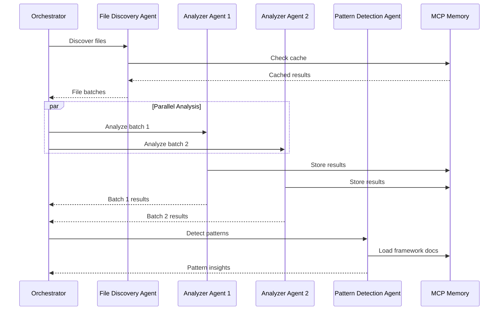

# Agent Decomposition Implementation Example

## Example: Decomposing the Analysis Phase

This example demonstrates how to decompose the current monolithic analysis
functionality into specialized sub-agents.

### Current Monolithic Code (Simplified)

```javascript
// In code-quality.md (lines 953-1453)
async function analyzeFilesBatch(batch, context, toolResults) {
  const batchResults = [];

  for (const filePath of batch) {
    try {
      const fullPath = join(context.packagePath, filePath);
      const content = await Read(fullPath);

      // Basic analysis
      const analysis = {
        filePath,
        lines: content.split("\n").length,
        imports: extractImports(content),
        exports: extractExports(content),
        complexity: calculateComplexity(content),
        typeErrors: extractTypeErrors(toolResults.typecheck, filePath),
        lintIssues: extractLintIssues(toolResults.lint, filePath),
        patterns: detectPatterns(content, filePath),
        qualityScore: 0
      };

      // Calculate quality score
      analysis.qualityScore = calculateQualityScore(analysis);

      // Increment context counters
      context.analyzedFiles++;
      context.issuesFound +=
        analysis.typeErrors.length +
        analysis.lintIssues.length +
        analysis.patterns.filter((p) => p.type === "issue").length;
      context.patternsDetected += analysis.patterns.length;

      batchResults.push(analysis);
    } catch (error) {
      console.warn(`⚠️ Failed to analyze ${filePath}: ${error.message}`);
    }
  }

  return batchResults;
}
```

### Decomposed Architecture

#### 1. File Discovery Agent (`code-quality--file-discovery.md`)

````markdown
---
name: code-quality--file-discovery
description:
  Discovers and prioritizes files for analysis. Handles file filtering, Git
  change detection, and batch creation.
tools:
  Read, LS, Glob, mcp__git__git_status, mcp__memory__search_nodes,
  mcp__memory__create_entities
model: sonnet
color: blue
---

You are a File Discovery Specialist that identifies and prioritizes files for
code quality analysis.

## Core Responsibilities

- Discover all relevant source files
- Filter out excluded paths
- Detect changed files via Git
- Create optimized analysis batches
- Cache file discovery results

## Main Function

```javascript
async function main(request) {
  const { packagePath, sessionId, excludePatterns, batchSize } = request;

  // Discover all files
  const allFiles = await discoverSourceFiles(packagePath, excludePatterns);

  // Get changed files from Git
  const changedFiles = await getChangedFiles(packagePath);

  // Check cache for already analyzed files
  const { toAnalyze, cachedFiles } = await filterAnalyzedFiles(
    allFiles,
    sessionId
  );

  // Prioritize changed files
  const prioritizedFiles = prioritizeFiles(toAnalyze, changedFiles);

  // Create batches
  const batches = await createOptimizedBatches(prioritizedFiles, batchSize);

  // Store discovery results
  await storeDiscoveryResults(sessionId, {
    totalFiles: allFiles.length,
    toAnalyze: prioritizedFiles.length,
    cachedFiles: cachedFiles.length,
    batches: batches.length
  });

  return {
    status: "success",
    data: {
      allFiles,
      toAnalyze: prioritizedFiles,
      cachedFiles,
      changedFiles,
      batches,
      cacheHitRate: calculateCacheHitRate(cachedFiles.length, allFiles.length)
    }
  };
}

async function discoverSourceFiles(packagePath, excludePatterns) {
  const patterns = ["**/*.{ts,tsx,js,jsx,mjs}"];
  const files = await Glob({ pattern: patterns.join(","), path: packagePath });

  // Apply exclusions
  return files.filter(
    (file) => !excludePatterns.some((pattern) => file.includes(pattern))
  );
}

async function createOptimizedBatches(files, targetBatchSize = 3000) {
  // Get file sizes for intelligent batching
  const filesWithSizes = await Promise.all(
    files.map(async (file) => {
      try {
        const content = await Read(file);
        return { file, lines: content.split("\n").length };
      } catch {
        return { file, lines: 100 }; // Default estimate
      }
    })
  );

  // Sort by size for better distribution
  filesWithSizes.sort((a, b) => b.lines - a.lines);

  // Create balanced batches
  const batches = [];
  let currentBatch = [];
  let currentSize = 0;

  for (const { file, lines } of filesWithSizes) {
    if (currentSize + lines > targetBatchSize && currentBatch.length > 0) {
      batches.push([...currentBatch]);
      currentBatch = [file];
      currentSize = lines;
    } else {
      currentBatch.push(file);
      currentSize += lines;
    }
  }

  if (currentBatch.length > 0) {
    batches.push(currentBatch);
  }

  return batches;
}
```
````

````

#### 2. Code Analysis Agent (`code-quality--analyzer.md`)

```markdown
---
name: code-quality--analyzer
description: Performs deep code analysis on file batches. Extracts metrics, detects issues, and calculates quality scores.
tools: Read, mcp__memory__create_entities
model: sonnet
color: green
---

You are a Code Analysis Specialist that performs detailed analysis on source files.

## Core Responsibilities
- Analyze code structure and complexity
- Extract imports and exports
- Calculate quality metrics
- Detect code patterns and anti-patterns
- Store analysis results

## Main Function

```javascript
async function main(request) {
  const { batch, packagePath, sessionId, toolResults } = request;
  const results = [];

  for (const filePath of batch) {
    try {
      const analysis = await analyzeFile(filePath, packagePath, toolResults);

      // Store individual file analysis
      await storeFileAnalysis(sessionId, filePath, analysis);

      results.push(analysis);
    } catch (error) {
      results.push({
        filePath,
        error: error.message,
        status: 'failed'
      });
    }
  }

  // Calculate batch metrics
  const batchMetrics = calculateBatchMetrics(results);

  return {
    status: 'success',
    data: {
      analyses: results,
      metrics: batchMetrics
    }
  };
}

async function analyzeFile(filePath, packagePath, toolResults) {
  const fullPath = join(packagePath, filePath);
  const content = await Read(fullPath);

  // Extract basic metrics
  const metrics = {
    lines: content.split('\n').length,
    characters: content.length,
    imports: extractImports(content),
    exports: extractExports(content),
    complexity: calculateCyclomaticComplexity(content),
    maintainabilityIndex: calculateMaintainabilityIndex(content)
  };

  // Extract issues from tools
  const issues = {
    typeErrors: extractTypeErrors(toolResults.typecheck, filePath),
    lintIssues: extractLintIssues(toolResults.lint, filePath),
    securityIssues: detectSecurityPatterns(content)
  };

  // Detect patterns
  const patterns = {
    antiPatterns: detectAntiPatterns(content),
    designPatterns: detectDesignPatterns(content),
    frameworkPatterns: detectFrameworkPatterns(content)
  };

  // Calculate quality score
  const qualityScore = calculateQualityScore(metrics, issues, patterns);

  return {
    filePath,
    metrics,
    issues,
    patterns,
    qualityScore,
    timestamp: Date.now()
  };
}

function calculateCyclomaticComplexity(content) {
  let complexity = 1;

  const complexityPatterns = [
    /\bif\s*\(/g,
    /\belse\s+if\s*\(/g,
    /\bfor\s*\(/g,
    /\bwhile\s*\(/g,
    /\bcase\s+/g,
    /\bcatch\s*\(/g,
    /\?\s*[^:]+:/g,
    /&&/g,
    /\|\|/g
  ];

  for (const pattern of complexityPatterns) {
    const matches = content.match(pattern);
    if (matches) {
      complexity += matches.length;
    }
  }

  return complexity;
}
````

````

#### 3. Pattern Detection Agent (`code-quality--patterns.md`)

```markdown
---
name: code-quality--patterns
description: Detects architectural patterns, anti-patterns, and framework-specific patterns in code.
tools: Read, mcp__memory__create_entities, mcp__context7__get-library-docs
model: sonnet
color: purple
---

You are a Pattern Detection Specialist that identifies architectural and code patterns.

## Core Responsibilities
- Detect architectural patterns
- Identify anti-patterns and code smells
- Recognize framework-specific patterns
- Suggest pattern improvements
- Store pattern analysis

## Main Function

```javascript
async function main(request) {
  const { fileAnalyses, packagePath, sessionId, frameworks } = request;

  // Load framework documentation for pattern matching
  const frameworkDocs = await loadFrameworkDocs(frameworks);

  // Analyze patterns across all files
  const patterns = {
    architectural: await detectArchitecturalPatterns(fileAnalyses),
    antiPatterns: await detectAntiPatterns(fileAnalyses),
    frameworkSpecific: await detectFrameworkPatterns(fileAnalyses, frameworkDocs),
    security: await detectSecurityPatterns(fileAnalyses),
    performance: await detectPerformancePatterns(fileAnalyses)
  };

  // Generate pattern insights
  const insights = generatePatternInsights(patterns);

  // Store pattern analysis
  await storePatternAnalysis(sessionId, patterns, insights);

  return {
    status: 'success',
    data: {
      patterns,
      insights,
      recommendations: generateRecommendations(patterns)
    }
  };
}

async function detectArchitecturalPatterns(fileAnalyses) {
  const patterns = {
    architecture: 'unknown',
    layers: [],
    components: [],
    services: []
  };

  // Analyze file structure
  const filePaths = fileAnalyses.map(f => f.filePath);

  // Detect architecture type
  if (filePaths.some(f => f.includes('/app/')) && filePaths.some(f => f.includes('layout.tsx'))) {
    patterns.architecture = 'nextjs-app-router';
  } else if (filePaths.some(f => f.includes('/pages/'))) {
    patterns.architecture = 'nextjs-pages-router';
  } else if (filePaths.some(f => f.includes('/src/components/')) && filePaths.some(f => f.includes('App.tsx'))) {
    patterns.architecture = 'react-spa';
  }

  // Detect layers
  const layers = new Set();
  for (const file of filePaths) {
    if (file.includes('/components/')) layers.add('presentation');
    if (file.includes('/services/') || file.includes('/api/')) layers.add('service');
    if (file.includes('/models/') || file.includes('/entities/')) layers.add('domain');
    if (file.includes('/repositories/') || file.includes('/db/')) layers.add('data');
  }
  patterns.layers = Array.from(layers);

  // Detect design patterns in code
  for (const analysis of fileAnalyses) {
    const content = await Read(analysis.filePath);

    // Singleton pattern
    if (content.match(/class\s+\w+\s*{[\s\S]*static\s+instance[\s\S]*getInstance/)) {
      patterns.components.push({
        type: 'singleton',
        file: analysis.filePath
      });
    }

    // Factory pattern
    if (content.match(/class\s+\w*Factory\s*{|function\s+create\w+/)) {
      patterns.components.push({
        type: 'factory',
        file: analysis.filePath
      });
    }

    // Observer pattern
    if (content.match(/addEventListener|subscribe|on\(/)) {
      patterns.components.push({
        type: 'observer',
        file: analysis.filePath
      });
    }
  }

  return patterns;
}

async function detectFrameworkPatterns(fileAnalyses, frameworkDocs) {
  const patterns = [];

  for (const analysis of fileAnalyses) {
    const content = await Read(analysis.filePath);

    // React patterns
    if (frameworkDocs.react) {
      // Hooks usage
      const hookMatches = content.match(/use[A-Z]\w+/g);
      if (hookMatches) {
        patterns.push({
          type: 'react-hooks',
          file: analysis.filePath,
          instances: hookMatches
        });
      }

      // Component patterns
      if (content.includes('React.memo')) {
        patterns.push({
          type: 'react-memoization',
          file: analysis.filePath
        });
      }
    }

    // Next.js patterns
    if (frameworkDocs.nextjs) {
      if (content.includes('use client')) {
        patterns.push({
          type: 'nextjs-client-component',
          file: analysis.filePath
        });
      }

      if (content.includes('export const metadata')) {
        patterns.push({
          type: 'nextjs-metadata',
          file: analysis.filePath
        });
      }
    }
  }

  return patterns;
}
````

````

### Main Orchestrator Integration

```javascript
// In the main orchestrator agent
async function runAnalysisPhase(context, sessionId) {
  console.log("🔍 Starting distributed analysis phase...");

  // Step 1: File Discovery
  const discoveryResult = await Task({
    subagent_type: 'code-quality--file-discovery',
    description: 'Discover files for analysis',
    prompt: JSON.stringify({
      packagePath: context.packagePath,
      sessionId,
      excludePatterns: [
        'node_modules', 'dist', 'build', '.next', 'coverage',
        '.turbo', '.git', 'out', '__tests__', '*.test.ts',
        '*.spec.ts', '*.d.ts', 'generated', '.cache'
      ],
      batchSize: 3000
    })
  });

  if (discoveryResult.data.toAnalyze.length === 0) {
    console.log("✅ No files need analysis");
    return { status: 'complete', filesAnalyzed: 0 };
  }

  // Step 2: Run analysis tools
  const toolResults = await runAnalysisTools(context.packagePath);

  // Step 3: Analyze batches in parallel
  const batches = discoveryResult.data.batches;
  const analysisPromises = batches.map((batch, index) =>
    Task({
      subagent_type: 'code-quality--analyzer',
      description: `Analyze batch ${index + 1}/${batches.length}`,
      prompt: JSON.stringify({
        batch,
        packagePath: context.packagePath,
        sessionId,
        toolResults
      })
    })
  );

  const batchResults = await Promise.all(analysisPromises);

  // Step 4: Pattern detection
  const allAnalyses = batchResults.flatMap(r => r.data.analyses);

  const patternResult = await Task({
    subagent_type: 'code-quality--patterns',
    description: 'Detect code patterns',
    prompt: JSON.stringify({
      fileAnalyses: allAnalyses,
      packagePath: context.packagePath,
      sessionId,
      frameworks: context.stack
    })
  });

  // Aggregate results
  return {
    status: 'success',
    filesAnalyzed: allAnalyses.length,
    patterns: patternResult.data.patterns,
    insights: patternResult.data.insights,
    metrics: aggregateMetrics(batchResults)
  };
}
````

### Benefits of This Decomposition

1. **Separation of Concerns**: Each agent has a single, well-defined
   responsibility
2. **Parallel Processing**: Batches can be analyzed in parallel by multiple
   analyzer agents
3. **Scalability**: Can spawn multiple instances of analyzer agents for large
   codebases
4. **Maintainability**: Each agent is smaller and easier to understand/modify
5. **Testability**: Each agent can be tested independently
6. **Reusability**: Pattern detection agent can be used by other workflows

### Communication Flow



### Error Handling Example

```javascript
// In each sub-agent
async function main(request) {
  const startTime = Date.now();
  let result;

  try {
    // Validate request
    validateRequest(request);

    // Execute main logic
    result = await executeAnalysis(request);

    // Validate result
    validateResult(result);

    return {
      status: "success",
      data: result,
      metadata: {
        executionTime: Date.now() - startTime,
        memoryUsage: process.memoryUsage(),
        agentVersion: "1.0.0"
      }
    };
  } catch (error) {
    // Log error details
    await logError(error, request);

    // Determine if error is recoverable
    if (isRecoverable(error)) {
      return {
        status: "partial",
        data: result || {},
        errors: [
          {
            code: error.code || "UNKNOWN",
            message: error.message,
            recoverable: true
          }
        ],
        metadata: {
          executionTime: Date.now() - startTime
        }
      };
    }

    // Non-recoverable error
    throw new AgentError(error.message, {
      cause: error,
      context: {
        agent: "code-quality--analyzer",
        request: sanitizeRequest(request)
      }
    });
  }
}
```

### State Sharing Example

```javascript
// Shared state management via MCP Memory
class SharedAnalysisState {
  constructor(sessionId) {
    this.sessionId = sessionId;
    this.namespace = `AnalysisState:${sessionId}`;
  }

  async updateProgress(phase, progress) {
    await mcp__memory__add_observations({
      observations: [
        {
          entityName: this.namespace,
          contents: [
            `phase:${phase}`,
            `progress:${JSON.stringify(progress)}`,
            `timestamp:${Date.now()}`
          ]
        }
      ]
    });
  }

  async getProgress() {
    const result = await mcp__memory__search_nodes({
      query: `${this.namespace} phase`
    });

    if (result?.entities?.length > 0) {
      return this.parseProgress(result.entities[0]);
    }

    return null;
  }

  async addResult(agentType, result) {
    await mcp__memory__create_entities([
      {
        name: `${this.namespace}:${agentType}:${Date.now()}`,
        entityType: "AnalysisResult",
        observations: [
          `session:${this.sessionId}`,
          `agent:${agentType}`,
          `status:${result.status}`,
          `data:${JSON.stringify(result.data)}`,
          `timestamp:${Date.now()}`
        ]
      }
    ]);
  }
}
```

This example demonstrates how the monolithic analysis functionality can be
effectively decomposed into specialized, reusable sub-agents while maintaining
the same capabilities and adding new benefits like parallel processing and
better error handling.
