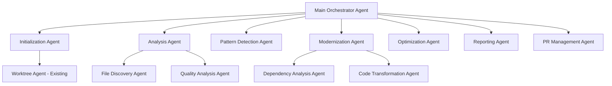

# Comprehensive Agent Decomposition Strategy

## Executive Summary

This document provides a comprehensive analysis and implementation strategy for
decomposing the large main agent file (`code-quality.md`) into multiple
specialized sub-agents while preserving full MCP (Model Context Protocol)
support and maintaining the unique architecture's data sharing capabilities.

## 1. Current Architecture Analysis

### 1.1 Main Agent Structure

The `code-quality.md` agent (4,347 lines) currently handles:

- **Initialization & Setup** (Lines 1-557)
- **Context Management** (Lines 558-752)
- **Session Management** (Lines 753-952)
- **File Discovery & Analysis** (Lines 953-1453)
- **Pattern Detection** (Lines 1454-1540)
- **Targeted Word Removal** (Lines 1541-2000)
- **Mock Centralization** (Lines 2001-2196)
- **Dependency Analysis** (Lines 2197-2471)
- **Vercel Optimization** (Lines 2472-2600)
- **Reporting & PR Creation** (Lines 2601-3819)
- **Main Execution** (Lines 3820-4347)

### 1.2 Existing Sub-agent Pattern

The `code-quality--worktree.md` (826 lines) demonstrates the current sub-agent
pattern:

- Specialized functionality (Git worktree management)
- Shared utilities with main agent
- Communication via `Task()` tool
- MCP tool access (git, memory)
- Returns structured data to main agent

### 1.3 Current MCP Usage

- **Memory MCP**: Entity storage, search, observations
- **Git MCP**: Status, diff, commit, push, worktree operations
- **Context7 MCP**: Library documentation, API resolution

## 2. Optimal Phase Boundaries for Decomposition

### 2.1 Proposed Sub-agent Architecture



### 2.2 Functional Boundaries

#### **Main Orchestrator Agent** (Target: ~800 lines)

- Overall workflow coordination
- Session management
- Progress tracking
- Error handling orchestration
- Final result aggregation

#### **Initialization Agent** (~600 lines)

- Context setup
- MCP availability checking
- Framework detection
- Documentation loading
- Initial configuration

#### **Analysis Agent** (~800 lines)

- File discovery
- Batch creation
- Tool execution (TypeScript, ESLint)
- Basic quality metrics

#### **Pattern Detection Agent** (~700 lines)

- Architectural pattern detection
- Code smell identification
- Anti-pattern detection
- Framework-specific patterns

#### **Modernization Agent** (~900 lines)

- Dependency analysis
- Deprecation detection
- Modern alternative suggestions
- Code transformation application

#### **Optimization Agent** (~500 lines)

- Vercel-specific optimizations
- Performance improvements
- Bundle size analysis
- Edge runtime compatibility

#### **Reporting Agent** (~600 lines)

- Quality report generation
- Metrics calculation
- Recommendation generation
- Markdown formatting

#### **PR Management Agent** (~400 lines)

- Git operations
- PR creation
- Branch management
- Cleanup operations

## 3. Inter-Agent Communication Protocol

### 3.1 Extended Task Protocol

```typescript
interface ExtendedTaskRequest {
  version: "2.0";
  subagent_type: string;
  action: string;
  context: {
    sessionId: string;
    packagePath: string;
    worktreePath?: string;
    parentAgentId: string;
  };
  payload: any;
  options: {
    timeout?: number;
    retryPolicy?: RetryPolicy;
    mcpAccess?: string[];
  };
}

interface ExtendedTaskResponse {
  version: "2.0";
  status: "success" | "error" | "partial";
  data: any;
  metadata: {
    executionTime: number;
    memoryUsage: MemoryMetrics;
    mcpCalls: number;
  };
  continuationToken?: string;
  errors?: ErrorDetail[];
}
```

### 3.2 Event-Based Communication

```typescript
interface AgentEvent {
  eventId: string;
  timestamp: number;
  source: string;
  target: string | "*";
  eventType: "progress" | "state_change" | "error" | "data_ready";
  payload: any;
}

// Shared event bus via MCP memory
class AgentEventBus {
  async publish(event: AgentEvent): Promise<void> {
    await mcp__memory__create_entities([
      {
        name: `Event:${event.eventId}`,
        entityType: "AgentEvent",
        observations: [
          `source:${event.source}`,
          `target:${event.target}`,
          `type:${event.eventType}`,
          `timestamp:${event.timestamp}`,
          `payload:${JSON.stringify(event.payload)}`
        ]
      }
    ]);
  }

  async subscribe(
    agentId: string,
    eventTypes: string[]
  ): Promise<AgentEvent[]> {
    const events = await mcp__memory__search_nodes({
      query: `AgentEvent target:${agentId} OR target:*`
    });
    return this.parseEvents(events);
  }
}
```

## 4. MCP Compatibility Layer

### 4.1 MCP Proxy Pattern

```typescript
class MCPProxy {
  private permissions: Map<string, Set<string>>;
  private rateLimiter: RateLimiter;
  private cache: MCPCache;

  constructor(agentId: string, allowedMCPs: string[]) {
    this.permissions = this.initializePermissions(agentId, allowedMCPs);
    this.rateLimiter = new RateLimiter();
    this.cache = new MCPCache();
  }

  async callMCP(mcpName: string, method: string, params: any): Promise<any> {
    // Permission check
    if (!this.hasPermission(mcpName, method)) {
      throw new Error(`Agent lacks permission for ${mcpName}.${method}`);
    }

    // Rate limiting
    await this.rateLimiter.acquire(mcpName);

    // Cache check
    const cacheKey = this.getCacheKey(mcpName, method, params);
    const cached = await this.cache.get(cacheKey);
    if (cached) return cached;

    // Execute MCP call
    const result = await this.executeMCPCall(mcpName, method, params);

    // Cache result if applicable
    if (this.isCacheable(mcpName, method)) {
      await this.cache.set(cacheKey, result);
    }

    return result;
  }

  private async executeMCPCall(
    mcpName: string,
    method: string,
    params: any
  ): Promise<any> {
    switch (mcpName) {
      case "memory":
        return this.callMemoryMCP(method, params);
      case "git":
        return this.callGitMCP(method, params);
      case "context7":
        return this.callContext7MCP(method, params);
      default:
        throw new Error(`Unknown MCP: ${mcpName}`);
    }
  }
}
```

### 4.2 MCP Transaction Support

```typescript
class MCPTransaction {
  private operations: MCPOperation[] = [];
  private rollbackHandlers: Map<string, () => Promise<void>> = new Map();

  async execute(): Promise<void> {
    const executedOps: string[] = [];

    try {
      for (const op of this.operations) {
        await op.execute();
        executedOps.push(op.id);

        if (op.rollbackHandler) {
          this.rollbackHandlers.set(op.id, op.rollbackHandler);
        }
      }
    } catch (error) {
      // Rollback in reverse order
      for (const opId of executedOps.reverse()) {
        const rollback = this.rollbackHandlers.get(opId);
        if (rollback) {
          await rollback();
        }
      }
      throw error;
    }
  }
}
```

## 5. Centralized State Management

### 5.1 State Architecture

```typescript
interface AgentState {
  sessionId: string;
  phase: string;
  context: AnalysisContext;
  progress: ProgressTracker;
  results: Map<string, any>;
  errors: ErrorLog[];
  metadata: StateMetadata;
}

class StateManager {
  private state: AgentState;
  private stateHistory: StateSnapshot[];
  private subscribers: Map<string, StateSubscriber>;

  async updateState(updates: Partial<AgentState>): Promise<void> {
    // Create snapshot for rollback
    this.createSnapshot();

    // Apply updates
    this.state = { ...this.state, ...updates };

    // Persist to MCP
    await this.persistState();

    // Notify subscribers
    await this.notifySubscribers(updates);
  }

  async getState(agentId: string): Promise<Partial<AgentState>> {
    // Return filtered state based on agent permissions
    return this.filterStateForAgent(agentId, this.state);
  }

  private async persistState(): Promise<void> {
    await mcp__memory__create_entities([
      {
        name: `State:${this.state.sessionId}`,
        entityType: "AgentState",
        observations: [
          `phase:${this.state.phase}`,
          `progress:${JSON.stringify(this.state.progress)}`,
          `timestamp:${Date.now()}`,
          `checksum:${this.calculateChecksum()}`
        ]
      }
    ]);
  }
}
```

### 5.2 Shared Context Pattern

```typescript
class SharedContext {
  private contextCache: Map<string, any> = new Map();
  private locks: Map<string, AsyncLock> = new Map();

  async acquireContext(key: string, agentId: string): Promise<ContextHandle> {
    const lock = this.getLock(key);
    await lock.acquire(agentId);

    const context = await this.loadContext(key);

    return new ContextHandle(key, context, () => {
      lock.release(agentId);
    });
  }

  async updateContext(
    key: string,
    updates: any,
    agentId: string
  ): Promise<void> {
    const lock = this.getLock(key);

    if (!lock.isHeldBy(agentId)) {
      throw new Error(`Agent ${agentId} does not hold lock for ${key}`);
    }

    const current = await this.loadContext(key);
    const updated = this.mergeContext(current, updates);

    await this.saveContext(key, updated);
    this.contextCache.set(key, updated);
  }
}
```

## 6. Error Handling and Rollback

### 6.1 Distributed Error Handling

```typescript
class DistributedErrorHandler {
  private errorHandlers: Map<string, ErrorHandler>;
  private compensationLog: CompensationAction[];

  async handleError(error: AgentError): Promise<void> {
    // Log error centrally
    await this.logError(error);

    // Determine error scope
    const scope = this.determineErrorScope(error);

    switch (scope) {
      case "local":
        await this.handleLocalError(error);
        break;
      case "phase":
        await this.handlePhaseError(error);
        break;
      case "global":
        await this.handleGlobalError(error);
        break;
    }
  }

  private async handlePhaseError(error: AgentError): Promise<void> {
    // Notify orchestrator
    await this.notifyOrchestrator(error);

    // Execute compensating actions
    for (const action of this.compensationLog.reverse()) {
      try {
        await action.execute();
      } catch (compensationError) {
        await this.logCompensationFailure(action, compensationError);
      }
    }

    // Update state to error
    await this.updatePhaseState(error.phase, "error");
  }
}
```

### 6.2 Saga Pattern Implementation

```typescript
class AgentSaga {
  private steps: SagaStep[];
  private compensations: Map<string, CompensationStep>;

  async execute(): Promise<void> {
    const executedSteps: string[] = [];

    try {
      for (const step of this.steps) {
        await step.execute();
        executedSteps.push(step.id);

        if (step.compensation) {
          this.compensations.set(step.id, step.compensation);
        }
      }
    } catch (error) {
      // Execute compensations in reverse order
      for (const stepId of executedSteps.reverse()) {
        const compensation = this.compensations.get(stepId);
        if (compensation) {
          await compensation.execute();
        }
      }
      throw error;
    }
  }
}
```

## 7. Plugin Architecture

### 7.1 Agent Plugin System

```typescript
interface AgentPlugin {
  name: string;
  version: string;
  type: "analyzer" | "transformer" | "reporter";
  dependencies: string[];

  initialize(context: PluginContext): Promise<void>;
  execute(input: any): Promise<any>;
  cleanup(): Promise<void>;
}

class PluginManager {
  private plugins: Map<string, AgentPlugin> = new Map();
  private loadOrder: string[] = [];

  async loadPlugin(pluginPath: string): Promise<void> {
    const plugin = await this.importPlugin(pluginPath);

    // Validate plugin
    this.validatePlugin(plugin);

    // Check dependencies
    await this.checkDependencies(plugin);

    // Initialize plugin
    const context = this.createPluginContext(plugin);
    await plugin.initialize(context);

    // Register plugin
    this.plugins.set(plugin.name, plugin);
    this.updateLoadOrder();
  }

  async executePlugin(name: string, input: any): Promise<any> {
    const plugin = this.plugins.get(name);
    if (!plugin) {
      throw new Error(`Plugin ${name} not found`);
    }

    // Create sandboxed execution environment
    const sandbox = this.createSandbox(plugin);

    try {
      return await sandbox.execute(() => plugin.execute(input));
    } finally {
      sandbox.cleanup();
    }
  }
}
```

### 7.2 Dynamic Agent Loading

```typescript
class AgentLoader {
  private agentRegistry: Map<string, AgentMetadata> = new Map();
  private loadedAgents: Map<string, Agent> = new Map();

  async loadAgent(agentType: string): Promise<Agent> {
    // Check if already loaded
    if (this.loadedAgents.has(agentType)) {
      return this.loadedAgents.get(agentType)!;
    }

    // Get agent metadata
    const metadata = await this.getAgentMetadata(agentType);

    // Load agent code
    const agentCode = await this.loadAgentCode(metadata.path);

    // Create agent instance
    const agent = this.createAgentInstance(agentCode, metadata);

    // Initialize agent
    await agent.initialize();

    // Cache loaded agent
    this.loadedAgents.set(agentType, agent);

    return agent;
  }

  async unloadAgent(agentType: string): Promise<void> {
    const agent = this.loadedAgents.get(agentType);
    if (agent) {
      await agent.cleanup();
      this.loadedAgents.delete(agentType);
    }
  }
}
```

## 8. Performance Optimization

### 8.1 Agent Pool Management

```typescript
class AgentPool {
  private pools: Map<string, AgentInstance[]> = new Map();
  private config: PoolConfig;

  async getAgent(type: string): Promise<AgentInstance> {
    const pool = this.getPool(type);

    // Try to get available agent
    const available = pool.find((a) => a.isAvailable());
    if (available) {
      available.markBusy();
      return available;
    }

    // Create new agent if under limit
    if (pool.length < this.config.maxPoolSize) {
      const agent = await this.createAgent(type);
      pool.push(agent);
      return agent;
    }

    // Wait for available agent
    return this.waitForAvailable(type);
  }

  async releaseAgent(agent: AgentInstance): Promise<void> {
    agent.markAvailable();

    // Clean up if pool is over minimum size
    const pool = this.getPool(agent.type);
    if (pool.length > this.config.minPoolSize) {
      const idleTime = Date.now() - agent.lastUsed;
      if (idleTime > this.config.idleTimeout) {
        await this.removeAgent(agent);
      }
    }
  }
}
```

### 8.2 Batch Processing Optimization

```typescript
class BatchProcessor {
  private batchQueue: Map<string, BatchItem[]> = new Map();
  private processors: Map<string, Processor> = new Map();

  async addToBatch(type: string, item: BatchItem): Promise<void> {
    const queue = this.getQueue(type);
    queue.push(item);

    // Process if batch is full
    if (queue.length >= this.getBatchSize(type)) {
      await this.processBatch(type);
    }

    // Schedule timeout processing
    this.scheduleTimeout(type);
  }

  private async processBatch(type: string): Promise<void> {
    const queue = this.getQueue(type);
    const batch = queue.splice(0, this.getBatchSize(type));

    if (batch.length === 0) return;

    const processor = this.processors.get(type);
    if (!processor) {
      throw new Error(`No processor for type ${type}`);
    }

    // Process in parallel with concurrency limit
    const results = await pLimit(this.getConcurrency(type))(
      batch.map((item) => () => processor.process(item))
    );

    // Handle results
    await this.handleResults(type, results);
  }
}
```

### 8.3 Memory Management

```typescript
class AgentMemoryManager {
  private memoryPools: Map<string, MemoryPool> = new Map();
  private gcScheduler: GCScheduler;

  async allocateMemory(agentId: string, size: number): Promise<MemoryHandle> {
    const pool = this.getPool(agentId);

    // Check if allocation would exceed limit
    if (pool.used + size > pool.limit) {
      // Trigger garbage collection
      await this.gcScheduler.collect(agentId);

      // Check again
      if (pool.used + size > pool.limit) {
        throw new Error(`Memory limit exceeded for agent ${agentId}`);
      }
    }

    // Allocate memory
    const handle = pool.allocate(size);

    // Track allocation
    this.trackAllocation(agentId, handle);

    return handle;
  }

  async releaseMemory(handle: MemoryHandle): Promise<void> {
    const pool = this.memoryPools.get(handle.agentId);
    if (pool) {
      pool.release(handle);
      this.untrackAllocation(handle);
    }
  }
}
```

## 9. Testing Framework

### 9.1 Distributed Agent Testing

```typescript
class DistributedAgentTestFramework {
  private testOrchestrator: TestOrchestrator;
  private mockMCPProvider: MockMCPProvider;
  private agentSimulator: AgentSimulator;

  async runTest(testCase: DistributedTestCase): Promise<TestResult> {
    // Setup test environment
    const env = await this.setupTestEnvironment(testCase);

    // Initialize mock MCPs
    await this.mockMCPProvider.initialize(testCase.mockConfig);

    // Start agent simulators
    const agents = await this.startAgents(testCase.agents);

    try {
      // Execute test scenario
      const result = await this.executeScenario(testCase.scenario);

      // Validate results
      const validation = await this.validateResults(
        result,
        testCase.expectations
      );

      return {
        passed: validation.passed,
        details: validation.details,
        metrics: this.collectMetrics()
      };
    } finally {
      // Cleanup
      await this.cleanup(env, agents);
    }
  }

  private async executeScenario(scenario: TestScenario): Promise<any> {
    const steps = scenario.steps;
    const results = [];

    for (const step of steps) {
      // Execute step
      const result = await this.executeStep(step);
      results.push(result);

      // Check assertions
      if (step.assertions) {
        await this.checkAssertions(step.assertions, result);
      }

      // Wait if needed
      if (step.wait) {
        await this.wait(step.wait);
      }
    }

    return results;
  }
}
```

### 9.2 Integration Testing

```typescript
class AgentIntegrationTest {
  async testInterAgentCommunication(): Promise<void> {
    // Create test agents
    const orchestrator = await this.createTestAgent("orchestrator");
    const analyzer = await this.createTestAgent("analyzer");

    // Setup communication channel
    const channel = await this.setupChannel(orchestrator, analyzer);

    // Test request-response
    const request = this.createTestRequest();
    const response = await orchestrator.sendRequest(analyzer.id, request);

    // Validate response
    expect(response.status).toBe("success");
    expect(response.data).toMatchSchema(ResponseSchema);

    // Test event propagation
    const event = this.createTestEvent();
    await analyzer.publishEvent(event);

    // Wait for event
    const received = await orchestrator.waitForEvent(event.type, 1000);
    expect(received).toBeDefined();
  }

  async testMCPCompatibility(): Promise<void> {
    // Create agent with MCP access
    const agent = await this.createTestAgent("test-agent", {
      mcpAccess: ["memory", "git"]
    });

    // Test memory MCP
    const entity = await agent.createMemoryEntity({
      name: "TestEntity",
      type: "Test",
      observations: ["test:true"]
    });
    expect(entity).toBeDefined();

    // Test git MCP
    const status = await agent.getGitStatus();
    expect(status).toHaveProperty("branch");
  }
}
```

## 10. Backward Compatibility

### 10.1 Compatibility Layer

```typescript
class BackwardCompatibilityLayer {
  private legacyAdapter: LegacyAdapter;
  private versionMapper: VersionMapper;

  async handleLegacyRequest(request: any): Promise<any> {
    // Detect request version
    const version = this.detectVersion(request);

    // Transform to current format
    const transformed = await this.transformRequest(request, version);

    // Execute with current system
    const result = await this.executeRequest(transformed);

    // Transform response back
    return this.transformResponse(result, version);
  }

  private async transformRequest(request: any, version: string): Promise<any> {
    const transformer = this.versionMapper.getTransformer(version);

    if (!transformer) {
      throw new Error(`No transformer for version ${version}`);
    }

    return transformer.transformRequest(request);
  }
}
```

### 10.2 Migration Support

```typescript
class MigrationManager {
  private migrations: Migration[] = [];

  async migrate(fromVersion: string, toVersion: string): Promise<void> {
    const path = this.getMigrationPath(fromVersion, toVersion);

    for (const migration of path) {
      console.log(`Running migration: ${migration.name}`);

      // Backup current state
      const backup = await this.createBackup();

      try {
        // Run migration
        await migration.up();

        // Validate migration
        await this.validateMigration(migration);

        // Update version
        await this.updateVersion(migration.toVersion);
      } catch (error) {
        // Rollback on failure
        console.error(`Migration failed: ${error.message}`);
        await this.restoreBackup(backup);
        throw error;
      }
    }
  }
}
```

## 11. Migration and Deployment Strategy

### 11.1 Phased Migration Plan

#### Phase 1: Infrastructure Setup (Week 1-2)

1. Implement core communication protocol
2. Create state management system
3. Setup MCP compatibility layer
4. Implement error handling framework

#### Phase 2: Agent Extraction (Week 3-4)

1. Extract Worktree Agent (already done)
2. Extract Initialization Agent
3. Extract Analysis Agent
4. Extract Pattern Detection Agent

#### Phase 3: Advanced Agents (Week 5-6)

1. Extract Modernization Agent
2. Extract Optimization Agent
3. Extract Reporting Agent
4. Extract PR Management Agent

#### Phase 4: Integration & Testing (Week 7-8)

1. Integration testing
2. Performance optimization
3. Load testing
4. Security audit

#### Phase 5: Deployment (Week 9-10)

1. Canary deployment
2. Gradual rollout
3. Monitoring setup
4. Documentation

### 11.2 Zero-Downtime Deployment

```typescript
class ZeroDowntimeDeployment {
  async deploy(newVersion: string): Promise<void> {
    // Phase 1: Deploy new agents alongside old
    await this.deployNewAgents(newVersion);

    // Phase 2: Route percentage of traffic
    await this.enableCanaryRouting(10); // 10% to new

    // Phase 3: Monitor metrics
    const metrics = await this.monitorCanary(30 * 60 * 1000); // 30 min

    // Phase 4: Gradual rollout
    if (metrics.healthy) {
      await this.gradualRollout([25, 50, 75, 100]);
    } else {
      await this.rollback();
    }

    // Phase 5: Cleanup old version
    await this.cleanupOldVersion();
  }

  private async gradualRollout(percentages: number[]): Promise<void> {
    for (const percentage of percentages) {
      await this.setRoutingPercentage(percentage);
      await this.monitorHealth(10 * 60 * 1000); // 10 min

      if (!(await this.isHealthy())) {
        await this.rollback();
        throw new Error("Rollout failed health check");
      }
    }
  }
}
```

### 11.3 Monitoring and Observability

```typescript
class AgentObservability {
  private metrics: MetricsCollector;
  private tracing: TracingSystem;
  private logging: LoggingSystem;

  async instrumentAgent(agent: Agent): Promise<void> {
    // Add metrics collection
    agent.on("request", (req) => {
      this.metrics.increment("agent.requests", {
        agent: agent.type,
        action: req.action
      });
    });

    // Add tracing
    agent.use(this.tracingMiddleware());

    // Add structured logging
    agent.logger = this.createLogger(agent.type);
  }

  private tracingMiddleware() {
    return async (req: any, next: Function) => {
      const span = this.tracing.startSpan("agent.request", {
        agent: req.agentType,
        action: req.action
      });

      try {
        const result = await next(req);
        span.setStatus("success");
        return result;
      } catch (error) {
        span.setStatus("error");
        span.setTag("error", error.message);
        throw error;
      } finally {
        span.finish();
      }
    };
  }
}
```

## 12. Implementation Checklist

### 12.1 Core Infrastructure

- [ ] Implement ExtendedTaskProtocol
- [ ] Create AgentEventBus
- [ ] Implement MCPProxy
- [ ] Create StateManager
- [ ] Implement SharedContext
- [ ] Create DistributedErrorHandler
- [ ] Implement AgentSaga pattern
- [ ] Create PluginManager
- [ ] Implement AgentLoader
- [ ] Create AgentPool
- [ ] Implement BatchProcessor
- [ ] Create AgentMemoryManager

### 12.2 Agent Implementation

- [ ] Create Main Orchestrator Agent
- [ ] Implement Initialization Agent
- [ ] Create Analysis Agent
- [ ] Implement Pattern Detection Agent
- [ ] Create Modernization Agent
- [ ] Implement Optimization Agent
- [ ] Create Reporting Agent
- [ ] Implement PR Management Agent

### 12.3 Testing & Quality

- [ ] Create unit tests for each agent
- [ ] Implement integration tests
- [ ] Create performance benchmarks
- [ ] Implement load tests
- [ ] Create chaos engineering tests
- [ ] Implement security tests

### 12.4 Deployment & Operations

- [ ] Create deployment scripts
- [ ] Implement monitoring dashboards
- [ ] Create alerting rules
- [ ] Implement log aggregation
- [ ] Create runbooks
- [ ] Implement rollback procedures

## Conclusion

This comprehensive strategy provides a clear path for decomposing the monolithic
code-quality agent into a distributed system of specialized sub-agents. The
approach maintains full MCP compatibility, improves maintainability, enables
better testing, and provides a foundation for future enhancements.

The phased migration plan ensures zero-downtime deployment while maintaining
backward compatibility. The proposed architecture supports horizontal scaling,
plugin extensibility, and robust error handling, making it suitable for
enterprise-grade deployments.
