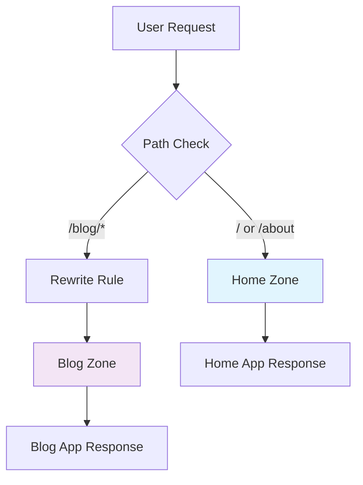

# Multi-Zone App Lab

A demonstration of Next.js Multi-Zone architecture, showcasing how to serve multiple Next.js applications from a single domain using micro-frontend patterns.

## Overview

The Multi-Zone App lab explores advanced Next.js deployment patterns where multiple independent Next.js applications work together as a single, cohesive web application. This approach enables micro-frontend architectures with independent development and deployment cycles.

<CardGroup cols={2}>
  <Card title="Micro-Frontend Pattern" icon="cubes">
    Independent deployment and development of home and blog zones
  </Card>
  <Card title="Smart Routing" icon="route">
    Home app routes /blog/* requests to blog app via rewrites
  </Card>
  <Card title="Asset Isolation" icon="shield">
    BasePath configuration prevents asset conflicts between zones
  </Card>
  <Card title="Independent Development" icon="users">
    Each zone has its own dependencies and build process
  </Card>
</CardGroup>

## Architecture

### Zone Configuration

The lab consists of two independent Next.js applications:

<AccordionGroup>
  <Accordion title="Home Zone" icon="home">
    - **Path Coverage**: Serves root paths (`/`, `/about`) - **Port**:
    Development server runs on port 3000 - **Routing**: Includes rewrites
    configuration to route `/blog/*` to blog zone - **Purpose**: Main
    application entry point and general pages
  </Accordion>

  <Accordion title="Blog Zone" icon="newspaper">
    - **Path Coverage**: Serves blog content (`/blog`, `/blog/post/[id]`) -
    **Port**: Development server runs on port 4000 - **BasePath**: Configured
    with `/blog` basePath for asset isolation - **Purpose**: Dedicated blog
    functionality with independent deployment
  </Accordion>
</AccordionGroup>

### How Multi-Zones Work



The architecture uses Next.js [`rewrites`](https://nextjs.org/docs/pages/api-reference/config/next-config-js/rewrites) feature to route specific paths to different applications while maintaining a single domain experience.

## Quick Start

### Development Setup

1. **Start Home Zone** (Terminal 1):

   ```bash
   cd home
   pnpm install && pnpm dev
   # Runs on http://localhost:3000
   ```

2. **Start Blog Zone** (Terminal 2):

   ```bash
   cd blog
   pnpm install && pnpm dev
   # Runs on http://localhost:4000/blog
   ```

3. **Access the Complete App**:
   - Home: `http://localhost:3000`
   - About: `http://localhost:3000/about`
   - Blog: `http://localhost:3000/blog` (routed via home)

## Configuration Details

### Home Zone Configuration

```javascript
// home/next.config.js
const nextConfig = {
  async rewrites() {
    return [
      {
        source: "/blog",
        destination: `${process.env.BLOG_URL}/blog`,
      },
      {
        source: "/blog/:path*",
        destination: `${process.env.BLOG_URL}/blog/:path*`,
      },
    ];
  },
};
```

### Blog Zone Configuration

```javascript
// blog/next.config.js
const nextConfig = {
  basePath: "/blog",

  // Asset prefix for production
  assetPrefix: process.env.NODE_ENV === "production" ? "/blog" : undefined,
};
```

## Environment Variables

### Development

```bash
# Optional: Custom development ports
HOME_PORT=3000  # Home zone development server
BLOG_PORT=4000  # Blog zone development server
```

### Production

```bash
# Blog app URL for production deployment
BLOG_URL=https://with-zones-blog.vercel.app
```

## Deployment Strategy

### 1. Deploy Blog Zone First

```bash
# Deploy blog zone to get domain URL
cd blog
vercel --prod
# Note the assigned domain (e.g., with-zones-blog.vercel.app)
```

### 2. Configure Home Zone

```bash
# home/.env
BLOG_URL="https://with-zones-blog.vercel.app"
```

### 3. Deploy Home Zone

```bash
# Deploy home zone with blog URL configured
cd home
vercel --prod
```

### Vercel Monorepo Setup

For automated deployments, configure each zone as a separate Vercel project:

<Tabs>
  <Tab title="Blog Project">
    - **Root Directory**: `blog` - **Build Command**: `pnpm build` - **Output
    Directory**: `.next` - **Install Command**: `pnpm install`
  </Tab>

  <Tab title="Home Project">
    - **Root Directory**: `home` - **Build Command**: `pnpm build` - **Output
    Directory**: `.next` - **Install Command**: `pnpm install` - **Environment
    Variables**: `BLOG_URL`
  </Tab>
</Tabs>

## Development Experience

### Advantages

<CardGroup cols={1}>
  <Card title="Independent Development" icon="user-friends">
    Teams can work on different zones without conflicts
  </Card>
  <Card title="Technology Flexibility" icon="wrench">
    Each zone can use different Next.js versions or configurations
  </Card>
  <Card title="Scalable Deployment" icon="rocket">
    Zones can be deployed and scaled independently
  </Card>
  <Card title="Fault Isolation" icon="shield-check">
    Issues in one zone don't affect others
  </Card>
</CardGroup>

### Considerations

<Warning>
**Path Management**: Ensure no path overlaps between zones to avoid routing conflicts.

**Asset Handling**: Use `basePath` properly to prevent asset collision between zones.

**SEO**: Consider sitemap generation and robots.txt for multi-zone architecture.

**State Management**: Global state sharing between zones requires careful planning.

</Warning>

## Advanced Patterns

### API Route Handling

```javascript
// home/next.config.js
async rewrites() {
  return [
    // Route blog API calls to blog zone
    {
      source: '/api/blog/:path*',
      destination: `${process.env.BLOG_URL}/api/blog/:path*`
    },

    // Route blog pages to blog zone
    {
      source: '/blog/:path*',
      destination: `${process.env.BLOG_URL}/blog/:path*`
    }
  ];
}
```

### Shared Components

```typescript
// Create shared component library
// packages/shared-ui/src/Header.tsx
export const Header = ({ zone }: { zone: 'home' | 'blog' }) => {
  return (
    <nav>
      <Link href="/">Home</Link>
      <Link href="/about">About</Link>
      <Link href="/blog">Blog</Link>
      {zone === 'blog' && <BlogNavigation />}
    </nav>
  );
};
```

### Cross-Zone Navigation

```typescript
// utils/navigation.ts
export const getZoneUrl = (path: string) => {
  if (path.startsWith("/blog")) {
    return process.env.NODE_ENV === "development"
      ? `http://localhost:4000${path}`
      : path; // In production, handled by rewrites
  }
  return path;
};
```

## Testing Multi-Zone Setup

### Integration Testing

```typescript
// tests/multi-zone.test.ts
describe("Multi-Zone Routing", () => {
  test("home zone serves root paths", async () => {
    const response = await fetch("http://localhost:3000/");
    expect(response.status).toBe(200);
  });

  test("blog paths route to blog zone", async () => {
    const response = await fetch("http://localhost:3000/blog");
    expect(response.status).toBe(200);
  });

  test("assets load from correct zones", async () => {
    const homeAsset = await fetch(
      "http://localhost:3000/_next/static/css/home.css",
    );
    const blogAsset = await fetch(
      "http://localhost:3000/blog/_next/static/css/blog.css",
    );

    expect(homeAsset.status).toBe(200);
    expect(blogAsset.status).toBe(200);
  });
});
```

## Monitoring and Analytics

### Zone Performance Tracking

```typescript
// utils/analytics.ts
export const trackZonePerformance = (zone: string, path: string) => {
  // Track performance metrics per zone
  analytics.track("zone_visit", {
    zone,
    path,
    timestamp: Date.now(),
  });
};
```

### Error Handling

```typescript
// home/pages/_error.tsx
function Error({ statusCode, hasGetInitialPropsRun, err, zone = 'home' }) {
  // Zone-specific error handling
  if (statusCode === 404 && zone === 'home') {
    // Check if path should be handled by blog zone
    if (err?.path?.startsWith('/blog')) {
      // Redirect to blog zone
      return <Redirect to={`${process.env.BLOG_URL}${err.path}`} />;
    }
  }

  return <ErrorPage statusCode={statusCode} zone={zone} />;
}
```

## Use Cases

### When to Use Multi-Zones

<AccordionGroup>
  <Accordion title="Large Enterprise Applications">
    Different teams managing separate sections of a large application with
    independent release cycles.
  </Accordion>

  <Accordion title="Micro-Frontend Architecture">
    Organizations adopting micro-frontend patterns for better scalability and
    team autonomy.
  </Accordion>

  <Accordion title="Legacy Migration">
    Gradually migrating from legacy systems by implementing new features as
    separate zones.
  </Accordion>

  <Accordion title="Performance Optimization">
    Separating heavy features (like admin panels) from main user-facing
    applications.
  </Accordion>
</AccordionGroup>

## Troubleshooting

### Common Issues

<AccordionGroup>
  <Accordion title="404 Errors on Blog Routes">
    - Verify `BLOG_URL` environment variable is set correctly - Check that blog
    zone is running and accessible - Ensure rewrites configuration matches blog
    paths
  </Accordion>

  <Accordion title="Asset Loading Issues">
    - Confirm `basePath` is configured in blog zone - Check that asset URLs
    include the correct base path - Verify public folder structure in each zone
  </Accordion>

  <Accordion title="Development Server Conflicts">
    - Ensure zones run on different ports (3000, 4000) - Check for port
    conflicts with other services - Restart both development servers if routing
    issues persist
  </Accordion>
</AccordionGroup>

This lab demonstrates advanced Next.js architecture patterns and provides a foundation for building scalable micro-frontend applications with independent deployment capabilities.
