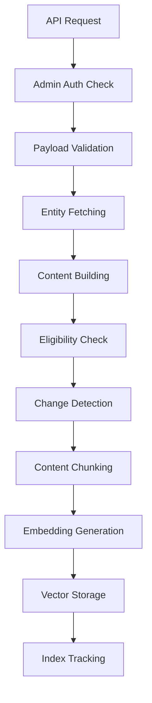

# CMS Vectorization System

The CMS Vectorization System provides intelligent vector search capabilities for
content management system entities. It automatically processes content from 13
different CMS entity types, generates semantic embeddings, and stores them in
Upstash Vector for fast similarity search.

## Overview

### Key Features

- **13 Entity Types**: Supports Brand, Collection, Product, ProductCategory,
  Fandom, Series, Story, Location, Media, CompanyContent, Article, Cast, and
  Taxonomy
- **Privacy-First**: Automatically excludes PII fields during content building
- **Change Detection**: Uses SHA-256 hashing to skip unchanged content
- **Batch Processing**: Efficient parent-child workflow pattern with
  configurable batch sizes
- **Retry Logic**: Exponential backoff with rate limiting for API resilience
- **Vector Management**: Automatic cleanup of stale vector chunks
- **Progress Tracking**: Optional Redis-based progress monitoring
- **Admin Security**: Role-based access control with Better Auth integration

### Architecture



## Entity Types and Eligibility

### Supported Models

| Entity Type       | Status Field | Eligible Values | Relationships               |
| ----------------- | ------------ | --------------- | --------------------------- |
| `brand`           | `status`     | `PUBLISHED`     | Children brands, products   |
| `collection`      | `status`     | `PUBLISHED`     | Products, media             |
| `product`         | `status`     | `ACTIVE`        | Variants, categories, brand |
| `productCategory` | `status`     | `PUBLISHED`     | Products, parent/children   |
| `fandom`          | `status`     | `PUBLISHED`     | Series, stories             |
| `series`          | `status`     | `PUBLISHED`     | Stories, fandom             |
| `story`           | `status`     | `PUBLISHED`     | Series, fandom, cast        |
| `location`        | `status`     | `PUBLISHED`     | Stories, media              |
| `media`           | `status`     | `PUBLISHED`     | Alt text required           |
| `companyContent`  | `status`     | `PUBLISHED`     | Company information         |
| `article`         | `status`     | `PUBLISHED`     | Blog posts, guides          |
| `cast`            | `status`     | `PUBLISHED`     | Stories, characters         |
| `taxonomy`        | `status`     | `PUBLISHED`     | Hierarchical categories     |

### Eligibility Rules

All entities must meet these criteria to be vectorized:

1. **Status Check**: Entity status must be in eligible values (see table above)
2. **Soft Delete**: `deletedAt` field must be `null`
3. **Content Quality**: Generated content must meet minimum length requirements
   (20 characters default)
4. **Privacy Compliance**: No PII fields are included in vector content

## Content Building

### Privacy-First Architecture

The content builders automatically exclude sensitive fields:

```typescript
// Excluded PII fields
const PII_FIELDS = [
  "email",
  "phone",
  "password",
  "token",
  "key",
  "secret",
  "api",
  "credential",
  "auth",
  "session"
];
```

### Content Structure

Each entity type has a specific content building pattern:

#### Brand Content

```
Brand: Nike
Identifier: nike
Type: APPAREL
Status: PUBLISHED
Website: https://nike.com
Description: Athletic wear and footwear brand
Sub-brands: Nike SB, Nike Air
```

#### Product Content

```
Product: Air Max 90
Type: SHOE
Status: ACTIVE
Brand: Nike
Category: Footwear
Price: 120 USD
Description: Classic running shoe
Variants: Air Max 90 - Red, Air Max 90 - Blue
```

#### Article Content

```
Article: How to Choose Running Shoes
Status: PUBLISHED
Content: [HTML/Markdown cleaned and formatted]
```

### Builder Version Tracking

All content builders use `BUILDER_VERSION` constant to track changes:

```typescript
export const BUILDER_VERSION = 1;

export interface BuilderResult {
  content: string;
  version: number;
}
```

When builder logic changes materially, increment `BUILDER_VERSION` to force
re-processing of all content.

## Chunking Strategy

### Configuration

```typescript
const DEFAULT_CHUNK_CONFIG = {
  minSize: 500, // Minimum chunk size
  maxSize: 1000, // Maximum chunk size
  overlap: 100, // Overlap between chunks
  minLength: 20 // Minimum content length
};
```

### Chunking Logic

1. **Boundary Detection**: Prefers paragraph breaks over sentence breaks
2. **Sentence Splitting**: Splits on `.`, `!`, `?` when paragraph breaks
   unavailable
3. **Word Boundaries**: Ensures chunks don't break mid-word
4. **Overlap Management**: Maintains context between adjacent chunks
5. **Length Validation**: Enforces minimum meaningful content length

### Vector ID Scheme

Each chunk gets a unique vector ID following this pattern:

```
cms:{entityType}:{entityId}:v{version}:chunk:{chunkIndex}
```

Examples:

- `cms:product:abc123:v1:chunk:0`
- `cms:brand:nike:v2:chunk:1`
- `cms:article:guide-123:v1:chunk:0`

## Change Detection

### Content Hashing

Uses SHA-256 for stable, deterministic change detection:

```typescript
function createContentHash(content: string): string {
  return crypto.createHash("sha256").update(content, "utf8").digest("hex");
}
```

### Hash Comparison

```typescript
function hasContentChanged(
  currentContent: string,
  storedHash: string
): boolean {
  return createContentHash(currentContent) !== storedHash;
}
```

Benefits:

- **Efficiency**: Skips unchanged content automatically
- **Accuracy**: Detects even minor content changes
- **Stability**: Same content always produces same hash
- **Performance**: Fast string comparison vs full content comparison

## Database Schema

### VectorIndex Model

```prisma
model VectorIndex {
  id               String              @id @default(cuid())
  entityType       String              // CMS entity type
  entityId         String              // CMS entity ID
  version          Int                 @default(1)
  contentHash      String              // SHA-256 hash of content
  chunkCount       Int                 @default(0)
  vectorIds        Json                @default("[]") // Array of vector IDs
  namespace        String              // Vector namespace
  status           VectorIndexStatus   @default(PENDING)
  lastError        String?             // Last error message
  metadata         Json?               @db.JsonB

  // Enhanced Performance & Retry Tracking Fields (v2)
  retryCount       Int                 @default(0)     // Number of retry attempts
  lastSyncedAt     DateTime?           // Last successful sync timestamp
  processingTimeMs Int?                // Processing duration in milliseconds
  contentLength    Int?                // Content length in characters

  createdAt        DateTime            @default(now())
  updatedAt        DateTime            @updatedAt

  @@unique([entityType, entityId])
  @@index([entityType, status])
  @@index([status, updatedAt])
  @@index([retryCount, status])        // For retry monitoring
  @@index([lastSyncedAt])              // For maintenance queries
}

enum VectorIndexStatus {
  PENDING     // Queued for processing
  PROCESSING  // Currently being processed
  SYNCED      // Successfully synchronized
  FAILED      // Processing failed (with retry tracking)
  SKIPPED     // Skipped due to conditions
  STALE       // Needs re-processing
}
```

### Index Strategy

- **Primary Key**: CUID for unique identification
- **Unique Constraint**: One index per entity (entityType + entityId)
- **Status Index**: Fast queries by processing status
- **Temporal Index**: Efficient cleanup and maintenance queries
- **Retry Index**: Monitor and query failed entities by retry count
- **Sync Index**: Track successful synchronization timestamps for maintenance

## API Endpoints

### Rate Limiting

All API endpoints include built-in rate limiting to prevent abuse:

```typescript
// Default rate limits (configurable via environment)
const RATE_LIMITS = {
  requests: 5, // Requests per window
  windowMs: 60000 // 1 minute window
};

// Environment configuration
CMS_VECTORIZATION_RATE_LIMIT_REQUESTS = 5;
CMS_VECTORIZATION_RATE_LIMIT_WINDOW_MS = 60000;
```

**Rate Limit Headers:**

- `X-RateLimit-Limit`: Total requests allowed per window
- `X-RateLimit-Remaining`: Remaining requests in current window
- `X-RateLimit-Reset`: Timestamp when window resets

### POST /api/workflows/v3/cms-vectorization

Execute vectorization workflow with authentication and validation.

#### Authentication

```typescript
// Admin role required
const session = await getSession();
if (!session?.user || session.user.role !== "admin") {
  return Response.json({ error: "Forbidden" }, { status: 403 });
}
```

#### Request Payload

```typescript
interface CmsVectorizationPayload {
  models: EntityType[]; // Required: Entity types to process
  options?: {
    batchSize?: number; // Batch size (1-500, default: 50)
    entityIds?: string[]; // Specific entities (optional)
    force?: boolean; // Force reprocessing (default: false)
    dryRun?: boolean; // Dry run mode (default: false)
  };
  metadata?: Record<string, unknown>; // Custom metadata
}
```

#### Response Format

```typescript
interface WorkflowResult {
  workflowId: string;
  status: "completed" | "partial" | "failed";
  startTime: Date;
  endTime: Date;
  totalExecutionTimeMs: number;

  // Entity Processing
  requestedModels: EntityType[];
  totalEntities: number;
  processedEntities: number;
  successfulEntities: number;
  failedEntities: number;
  skippedEntities: number;

  // Batch Processing
  totalBatches: number;
  completedBatches: number;

  // Vector Operations
  totalVectorsCreated: number;
  totalVectorsUpdated: number;
  totalVectorsDeleted: number;

  // Error Tracking
  errors: Array<{
    entityType: string;
    entityId: string;
    error: string;
    timestamp: Date;
  }>;
}
```

### GET /api/workflows/v3/cms-vectorization

Get workflow statistics and system status.

#### Query Parameters

- `?action=stats` (default) - Get vector index statistics
- `?action=progress&workflowId=xyz` - Get workflow progress (Redis required)
- `?action=result&workflowId=xyz` - Get completed workflow result
- `?action=active` - List all active workflows
- `?action=cleanup` - Cleanup orphaned indexes and old workflow data

#### Response

```typescript
interface WorkflowStats {
  totalIndexes: number;
  indexesByModel: Record<EntityType, number>;
  indexesByStatus: Record<VectorIndexStatus, number>;
  recentActivity: {
    last24h: number;
    last7d: number;
    last30d: number;
  };
  storageStats: {
    totalVectors: number;
    totalChunks: number;
    avgChunksPerEntity: number;
  };
}
```

### DELETE /api/workflows/v3/cms-vectorization

Cancel running workflow.

#### Query Parameters

- `?workflowId=xyz` - Required workflow ID to cancel

#### Requirements

- Redis tracking must be configured
- Admin authentication required
- Workflow must be in active state

```bash
curl -X DELETE "/api/workflows/v3/cms-vectorization?workflowId=workflow_123" \
  -H "Authorization: Bearer admin-token"
```

## Environment Configuration

### Required Variables

```bash
# Upstash Vector Configuration
UPSTASH_VECTOR_URL=https://your-vector-index.upstash.io
UPSTASH_VECTOR_TOKEN=your_vector_token

# OpenAI Configuration
OPENAI_API_KEY=sk-your_openai_key

# Optional: Embedding Model (default: text-embedding-3-small)
CMS_EMBEDDING_MODEL=text-embedding-3-small

# Optional: Batch Configuration
CMS_VECTORIZATION_BATCH_SIZE=50
CMS_VECTORIZATION_MAX_RETRIES=3
CMS_VECTORIZATION_RETRY_DELAY=1000

# Optional: Redis Progress Tracking
CMS_VECTORIZATION_REDIS_TRACKING=true
UPSTASH_REDIS_URL=redis://your-redis-url
UPSTASH_REDIS_TOKEN=your_redis_token
```

### Embedding Models

| Model                    | Dimensions | Use Case                       |
| ------------------------ | ---------- | ------------------------------ |
| `text-embedding-3-small` | 1536       | Default, balanced performance  |
| `text-embedding-3-large` | 3072       | Higher quality, more expensive |
| `text-embedding-ada-002` | 1536       | Legacy, still supported        |

### Performance Tuning

```bash
# Batch Processing
CMS_VECTORIZATION_BATCH_SIZE=50       # Entities per batch
CMS_VECTORIZATION_CHUNK_MIN_SIZE=500  # Minimum chunk size
CMS_VECTORIZATION_CHUNK_MAX_SIZE=1000 # Maximum chunk size
CMS_VECTORIZATION_CHUNK_OVERLAP=100   # Chunk overlap

# Rate Limiting
CMS_VECTORIZATION_RATE_LIMIT_RPM=3500    # Requests per minute
CMS_VECTORIZATION_RATE_LIMIT_TPM=1000000 # Tokens per minute

# Retry Configuration
CMS_VECTORIZATION_MAX_RETRIES=3    # Maximum retry attempts
CMS_VECTORIZATION_RETRY_DELAY=1000 # Base delay (ms)
CMS_VECTORIZATION_RETRY_BACKOFF=2  # Exponential backoff factor
```

## Usage Examples

### Basic Vectorization

```bash
# Vectorize all brands
curl -X POST /api/workflows/v3/cms-vectorization \
  -H "Content-Type: application/json" \
  -d '{
    "models": ["brand"],
    "metadata": {"source": "manual-trigger"}
  }'
```

### Batch Processing with Options

```bash
# Process specific products with small batches
curl -X POST /api/workflows/v3/cms-vectorization \
  -H "Content-Type: application/json" \
  -d '{
    "models": ["product"],
    "options": {
      "batchSize": 10,
      "entityIds": ["prod-1", "prod-2", "prod-3"],
      "force": true
    },
    "metadata": {"source": "product-update", "user": "admin"}
  }'
```

### Dry Run Testing

```bash
# Test processing without making changes
curl -X POST /api/workflows/v3/cms-vectorization \
  -H "Content-Type: application/json" \
  -d '{
    "models": ["article", "companyContent"],
    "options": {"dryRun": true}
  }'
```

### Check Status

```bash
# Get system statistics
curl /api/workflows/v3/cms-vectorization?stats=true

# Get brand-specific stats
curl /api/workflows/v3/cms-vectorization?model=brand &
stats=true
```

## Troubleshooting

### Common Issues

#### 1. Authentication Failures

```
Error: Invalid API key
Solution: Check OPENAI_API_KEY environment variable
```

#### 2. Dimension Mismatches

```
Error: Vector dimension mismatch: expected 1536, got 1024
Solution: Verify CMS_EMBEDDING_MODEL configuration matches Upstash Vector index
```

#### 3. Database Connection Issues

```
Error: P1008: Operations timed out
Solution: Check database connection, consider increasing connection pool size
```

#### 4. Rate Limiting

```
Error: Rate limit exceeded
Solution: Reduce batch size or implement longer delays between requests
```

### Debugging Steps

1. **Check Environment Variables**: Ensure all required vars are set
2. **Verify Database Schema**: Run `pnpm migrate` to ensure latest schema
3. **Test API Endpoints**: Use dry run mode to test without side effects
4. **Monitor Logs**: Check application logs for detailed error messages
5. **Inspect Vector Index**: Verify Upstash Vector configuration and dimensions
6. **Check Rate Limits**: Monitor `X-RateLimit-*` headers in API responses
7. **Review Retry Status**: Query failed entities with retry count tracking
8. **Validate Performance**: Check `processingTimeMs` and `contentLength`
   metrics

### Performance Optimization

#### Batch Size Tuning

- **Small Batches (10-25)**: Better error isolation, higher API overhead
- **Medium Batches (50-100)**: Balanced performance, recommended default
- **Large Batches (200-500)**: Higher throughput, risk of timeout failures

#### Memory Management

- Monitor memory usage during large batch processing
- Consider processing high-content entities (articles, products) separately
- Use smaller batch sizes for content-heavy entity types

#### Rate Limit Management

```typescript
// Recommended rate limits for OpenAI API
const RATE_LIMITS = {
  "text-embedding-3-small": { rpm: 3500, tpm: 1000000 },
  "text-embedding-3-large": { rpm: 3500, tpm: 1000000 },
  "text-embedding-ada-002": { rpm: 3000, tpm: 1000000 }
};
```

## Maintenance

### Regular Tasks

1. **Index Cleanup**: Remove stale vector indexes for deleted entities
2. **Performance Review**: Monitor processing times and adjust batch sizes
3. **Error Analysis**: Review error patterns and update retry logic
4. **Schema Updates**: Increment `BUILDER_VERSION` when content logic changes
5. **Retry Monitoring**: Track entities with high retry counts for investigation
6. **Rate Limit Analysis**: Review API rate limiting effectiveness and adjust
   limits
7. **Performance Metrics**: Monitor `processingTimeMs` trends for optimization

### Enhanced Queries

```sql
-- Find entities needing retry (failed with retries remaining)
SELECT entityType, entityId, retryCount, lastError, updatedAt
FROM "VectorIndex"
WHERE status = 'FAILED' AND retryCount < 3
ORDER BY retryCount ASC, updatedAt ASC;

-- Find stale entities (not synced recently)
SELECT entityType, entityId, lastSyncedAt, updatedAt
FROM "VectorIndex"
WHERE status = 'SYNCED'
  AND lastSyncedAt < NOW() - INTERVAL '7 days'
ORDER BY lastSyncedAt ASC;

-- Performance analysis
SELECT entityType,
       COUNT(*) as total_entities,
       AVG(processingTimeMs) as avg_processing_time,
       AVG(contentLength) as avg_content_length,
       AVG(chunkCount) as avg_chunks
FROM "VectorIndex"
WHERE status = 'SYNCED' AND processingTimeMs IS NOT NULL
GROUP BY entityType
ORDER BY avg_processing_time DESC;
```

### Automated Maintenance

```bash
# Clean up stale indexes (deleted entities)
curl -X DELETE /api/workflows/v3/cms-vectorization?cleanup=stale

# Re-process failed entities
curl -X POST /api/workflows/v3/cms-vectorization \
  -d '{"models": ["*"], "options": {"force": true, "statusFilter": "FAILED"}}'
```

### Backup and Recovery

- **Vector Data**: Managed by Upstash Vector service
- **Index Tracking**: Backed up with main database
- **Configuration**: Version controlled in application code

## Security Considerations

### Access Control

- **Admin Only**: All vectorization endpoints require admin role
- **API Authentication**: Uses Better Auth session validation
- **Rate Limiting**: Built-in protection against abuse

### Data Privacy

- **PII Exclusion**: Automatic filtering of sensitive fields
- **Content Sanitization**: HTML/script tag removal
- **Audit Logging**: Track all vectorization activities

### Network Security

- **HTTPS Only**: All API communications encrypted
- **API Key Protection**: Secure environment variable management
- **Network Isolation**: Upstash Vector accessed via secured endpoints

## Migration and Upgrades

### Version Management

When upgrading the vectorization system:

1. **Increment BUILDER_VERSION** for content logic changes
2. **Run migration** for database schema changes
3. **Force re-processing** for all entities if needed
4. **Test thoroughly** with dry run mode first

### Data Migration

```bash
# Force re-process all entities after upgrade
curl -X POST /api/workflows/v3/cms-vectorization \
  -d '{
    "models": ["brand", "product", "collection", "article"], 
    "options": {"force": true},
    "metadata": {"migration": "v2-to-v3"}
  }'
```

### Rollback Procedures

1. **Database Rollback**: Use database migration rollback
2. **Code Rollback**: Deploy previous application version
3. **Vector Cleanup**: Remove vectors created during failed migration
4. **Index Reset**: Reset VectorIndex status to previous state

---

For additional support and advanced configuration options, refer to the workflow
implementation files or contact the development team.
