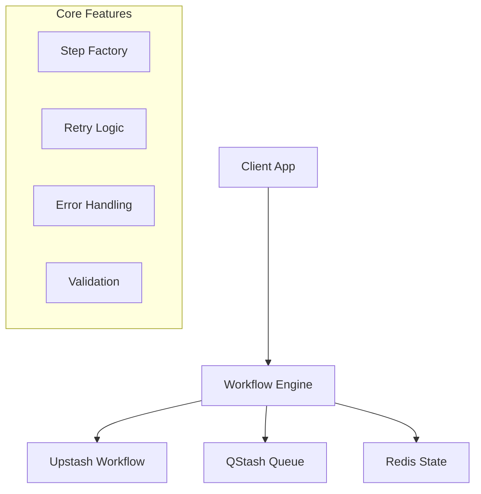

# Orchestration Package

Workflow orchestration system built on **Upstash Workflow** and **QStash** for
durable background job processing.

## Overview

The orchestration package provides a foundational workflow execution engine
with:

<CardGroup cols={2}>
  <Card title="Basic Workflow Engine" icon="cogs">
    Core workflow execution with step-based processing
  </Card>
  <Card title="Upstash Integration" icon="database">
    Built-in support for Upstash Workflow and QStash
  </Card>
  <Card title="Error Handling" icon="shield-alt">
    Basic error classification and retry patterns
  </Card>
  <Card title="Step Factory" icon="build">
    Utilities for creating and composing workflow steps
  </Card>
</CardGroup>

## Architecture



## Installation

The orchestration package is included in the monorepo. No additional
installation needed.

## Core Features

### Workflow Engine

The package provides a basic workflow execution engine:

```typescript
import { createWorkflowEngine } from "@repo/orchestration/server/next";

const engine = createWorkflowEngine({
  providers: [
    {
      name: "upstash",
      type: "upstash-workflow",
      config: {
        baseUrl: process.env.QSTASH_URL,
        qstashToken: process.env.QSTASH_TOKEN
      }
    }
  ]
});

// Initialize the engine
await engine.initialize();
```

### Step Factory

Create and compose workflow steps:

```typescript
import { createStep, withStepRetry } from "@repo/orchestration";

// Create a basic step
const downloadStep = createStep("download-file", async (url: string) => {
  return await downloadFile(url);
});

// Add retry logic
const robustDownload = withStepRetry(downloadStep, {
  maxAttempts: 3,
  backoffMs: 1000
});
```

### Error Handling

Basic error classification and handling utilities:

```typescript
import {
  createOrchestrationError,
  OrchestrationErrorCodes
} from "@repo/orchestration";

// Create typed errors
throw createOrchestrationError(
  "API_UNAVAILABLE",
  "External service is unavailable",
  { service: "payment-api", retryAfter: 30000 }
);

// Available error codes
const errorCodes = OrchestrationErrorCodes;
// VALIDATION_FAILED, PROVIDER_ERROR, WORKFLOW_EXECUTION_ERROR, etc.
```

### Retry Patterns

Basic retry patterns for workflow steps:

```typescript
import { withStepRetry, RETRY_STRATEGIES } from "@repo/orchestration";

// Apply retry to a step
const retriedStep = withStepRetry(myStep, {
  maxAttempts: 3,
  backoffMs: 1000,
  strategy: "exponential"
});

// Use predefined retry strategies
const robustStep = withStepRetry(myStep, RETRY_STRATEGIES.api);
```

## Example Usage

### Basic Workflow

```typescript
import { createWorkflowEngine } from "@repo/orchestration/server/next";
import { createStep, compose } from "@repo/orchestration";

// Create workflow steps
const fetchData = createStep("fetch", async (url: string) => {
  const response = await fetch(url);
  return response.json();
});

const processData = createStep("process", async (data: any) => {
  return data.map((item) => ({ ...item, processed: true }));
});

// Compose steps into a workflow
const pipeline = compose(fetchData, processData);

// Execute
const engine = createWorkflowEngine();
await engine.initialize();

const result = await engine.executeWorkflow(
  {
    id: "data-pipeline",
    steps: [pipeline]
  },
  { url: "https://api.example.com/data" }
);
```

### Provider Integration

```typescript
import { UpstashWorkflowProvider } from "@repo/orchestration/server/next";

// Create and configure a provider
const provider = new UpstashWorkflowProvider({
  baseUrl: process.env.QSTASH_URL!,
  qstash: {
    token: process.env.QSTASH_TOKEN!
  },
  enableRedis: true
});

// Register with the engine
const engine = createWorkflowEngine();
await engine.initialize();
await engine.manager.registerProvider("upstash", provider);
```

### Rate Limiting

```typescript
import { createRateLimiter, withRateLimit } from "@repo/orchestration";

// Create a rate limiter
const limiter = createRateLimiter({
  windowMs: 60000, // 1 minute
  maxRequests: 100
});

// Apply to workflow steps
const rateLimitedStep = withRateLimit(myStep, limiter);
```

## Utilities

### Validation

```typescript
import {
  validateWorkflowDefinition,
  validateWorkflowStep
} from "@repo/orchestration";

// Validate workflow definition
const isValid = validateWorkflowDefinition({
  id: "my-workflow",
  steps: [
    /* workflow steps */
  ]
});

// Validate individual steps
const stepValid = validateWorkflowStep(myStep);
```

### Batch Processing

Basic batch processing patterns:

```typescript
import { BatchManager, withBatch } from "@repo/orchestration/server/next";

// Create batch manager
const batchManager = new BatchManager({
  batchSize: 50,
  maxWaitMs: 5000
});

// Process items in batches
const batchedStep = withBatch(myProcessingStep, {
  batchSize: 100
});
```

### Circuit Breaker

```typescript
import {
  withCircuitBreaker,
  CircuitBreakerConfigs
} from "@repo/orchestration/server/next";

// Apply circuit breaker to steps
const protectedStep = withCircuitBreaker(myStep, {
  failureThreshold: 5,
  timeoutMs: 10000,
  resetTimeoutMs: 60000
});

// Use predefined configurations
const robustStep = withCircuitBreaker(myStep, CircuitBreakerConfigs.api);
```

## Monitoring

Basic monitoring and status tracking:

```typescript
import { createWorkflowEngine } from "@repo/orchestration/server/next";

const engine = createWorkflowEngine();

// Get engine status
const status = engine.getStatus();
console.log("Engine status:", status);

// Health check
const health = await engine.healthCheck();
console.log("Health check:", health);

// Get execution status
const execution = await engine.getExecution("execution-id");
console.log("Execution:", execution);
```

## Environment Configuration

The package requires basic environment configuration:

```bash
# QStash Configuration (Required)
QSTASH_URL="https://qstash.upstash.io"
QSTASH_TOKEN="your_qstash_token"
QSTASH_CURRENT_SIGNING_KEY="your_current_signing_key"
QSTASH_NEXT_SIGNING_KEY="your_next_signing_key"

# Upstash Redis Configuration (Optional)
UPSTASH_REDIS_REST_URL="https://your-redis-url.upstash.io"
UPSTASH_REDIS_REST_TOKEN="your_redis_token"

# Environment
NODE_ENV="development" # or "production"
```

### Environment Helper

```typescript
import { safeEnv } from "@repo/orchestration/env";

// Safely access environment variables
const env = safeEnv();
console.log("QStash URL:", env.QSTASH_URL);
```

## Testing

Basic testing utilities are available:

```typescript
// TODO: Testing utilities are in development
// Basic Vitest tests for core functionality are available in __tests__/

import { createWorkflowEngine } from "@repo/orchestration/server/next";

describe("Workflow Engine", () => {
  test("should create engine", () => {
    const engine = createWorkflowEngine();
    expect(engine).toBeDefined();
  });

  test("should get status", () => {
    const engine = createWorkflowEngine();
    const status = engine.getStatus();
    expect(status).toBeDefined();
  });
});
```

## API Reference

### Core Types

```typescript
export interface WorkflowDefinition {
  id: string;
  steps: WorkflowStep[];
  metadata?: Record<string, any>;
}

export interface WorkflowStep {
  id: string;
  name: string;
  type: string;
  config?: Record<string, any>;
}

export interface WorkflowExecution {
  id: string;
  workflowId: string;
  status: WorkflowExecutionStatus;
  startedAt: Date;
  completedAt?: Date;
  error?: WorkflowError;
}
```

### Available Utilities

```typescript
// Step creation and composition
export { createStep, compose, toSimpleStep } from "@repo/orchestration";

// Step enhancers
export {
  withStepRetry,
  withStepTimeout,
  withStepCircuitBreaker,
  withStepMonitoring
} from "@repo/orchestration";

// Validation
export {
  validateWorkflowDefinition,
  validateWorkflowStep
} from "@repo/orchestration";

// Error handling
export {
  createOrchestrationError,
  OrchestrationErrorCodes
} from "@repo/orchestration";
```

## Limitations & Roadmap

<Warning>
  **Current Status**: This package provides basic workflow orchestration. Many
  enterprise features shown in examples are planned but not yet implemented.
</Warning>

### ✅ Currently Available

- Basic workflow engine with step-based execution
- Upstash Workflow and QStash integration
- Step factory with composition utilities
- Basic error handling and retry patterns
- Rate limiting utilities
- Type definitions and validation

### 🚧 In Development

- Advanced monitoring and observability
- Pre-built workflow templates
- Enhanced error classification system
- Comprehensive testing utilities
- React hooks for status tracking

### 📋 Planned Features

- AI workflow templates
- SaaS automation workflows
- Data processing pipelines
- Advanced batch processing
- Real-time monitoring dashboard
- Server-sent events API

## Getting Started

1. **Configure Environment**

   ```bash
   # Add to your .env.local
   QSTASH_URL="https://qstash.upstash.io"
   QSTASH_TOKEN="your_token"
   ```

2. **Create a Simple Workflow**

   ```typescript
   import {
     createWorkflowEngine,
     createStep
   } from "@repo/orchestration/server/next";

   const myStep = createStep("hello", async (name: string) => {
     return `Hello, ${name}!`;
   });

   const engine = createWorkflowEngine();
   await engine.initialize();
   ```

3. **Execute Workflows**
   ```typescript
   const result = await engine.executeWorkflow(
     {
       id: "greeting-workflow",
       steps: [myStep]
     },
     "World"
   );
   ```

This package provides a solid foundation for workflow orchestration with room
for growth as your requirements evolve.
