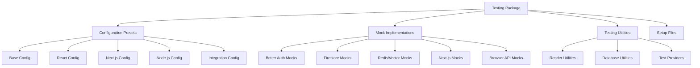

# Testing Package

Enterprise testing framework with **Vitest** configurations, **React Testing
Library** setup, comprehensive mocks, and specialized database testing
utilities.

## Overview

The testing package provides a complete testing infrastructure for the monorepo
with intelligent defaults and comprehensive mocking:

<CardGroup cols={2}>
  <Card title="Multi-Environment Configurations" icon="cog">
    Base, React, Next.js, Node.js, and Integration presets with optimized
    settings
  </Card>
  <Card title="Mantine UI Testing" icon="paintbrush">
    Pre-configured render functions with theme providers and dark mode support
  </Card>
  <Card title="Comprehensive Mocks" icon="mask">
    Better Auth, Firestore, Upstash Redis/Vector, Next.js APIs with realistic
    data
  </Card>
  <Card title="Database Testing" icon="database">
    Utilities for database setup, seeding, cleanup, and transaction testing
  </Card>
  <Card title="Performance Testing" icon="gauge">
    Memory usage and render time measurements with automated benchmarking
  </Card>
  <Card title="Type-Safe Testing" icon="code">
    Full TypeScript support with proper type definitions and custom matchers
  </Card>
</CardGroup>

## Architecture



## Installation

```bash
pnpm add -D @repo/qa
```

## Configuration Presets

### Next.js Applications

<CodeGroup>
```typescript vitest.config.ts (Recommended)
import { defineConfig } from 'vitest/config';
import { createNextConfig } from '@repo/qa/config/next';

export default defineConfig({
  ...createNextConfig({
    rootDir: process.cwd(),
    coverage: true,
  }),
});
```

```typescript Using Presets
import { defineConfig } from "vitest/config";
import { nextPreset } from "@repo/qa";

export default defineConfig({
  test: nextPreset
});
```

</CodeGroup>

### React Packages

<Tabs>
  <Tab title="React Library">
    ```typescript
    // vitest.config.ts
    import { defineConfig } from 'vitest/config';
    import { createReactConfig } from '@repo/qa/config/react';

    export default defineConfig({
      ...createReactConfig({
        environment: 'jsdom',
        setupFiles: ['./test-setup.ts'],
      }),
    });
    ```

  </Tab>

  <Tab title="Node.js Package">
    ```typescript
    // vitest.config.ts
    import { defineConfig } from 'vitest/config';
    import { createNodeConfig } from '@repo/qa/config/node';

    export default defineConfig({
      ...createNodeConfig({
        environment: 'node',
        coverage: true,
      }),
    });
    ```

  </Tab>
</Tabs>

### Available Presets

<AccordionGroup>
  <Accordion title="Configuration Presets" icon="cog">
    **Available presets:** - `nextPreset` - For Next.js applications with
    SSR/SSG support - `reactPreset` - For React packages and components -
    `nodePreset` - For Node.js packages and servers - `integrationPreset` - For
    integration tests across multiple services **Features included in each
    preset:** - Optimized Vitest configuration for environment - Automatic mock
    setup and cleanup - Performance testing utilities - TypeScript support with
    proper path resolution - Coverage configuration with sensible defaults
  </Accordion>
</AccordionGroup>

## React Component Testing

### Mantine UI Components

The package includes pre-configured providers for Mantine UI testing with theme
support:

<CodeGroup>
```typescript Basic Component Testing
import { render, screen, renderDark } from '@repo/qa';
import { Button } from '@mantine/core';

test('renders button with correct theme', () => { render(<Button>Click
me</Button>); expect(screen.getByRole('button')).toHaveTextContent('Click me');
});

test('renders in dark mode', () => { renderDark(<Button>Dark button</Button>);
// Button will be rendered with dark theme
expect(screen.getByRole('button')).toHaveClass('mantine-dark'); });

````

```typescript Custom Theme Testing
test('renders with custom theme', () => {
  render(
    <Button>Themed button</Button>,
    {
      theme: {
        primaryColor: 'violet',
        fontFamily: 'Arial',
      }
    }
  );

  expect(screen.getByRole('button')).toHaveStyle({
    fontFamily: 'Arial'
  });
});
````

</CodeGroup>

### Custom Test Providers

<AccordionGroup>
  <Accordion title="Test Providers Setup" icon="provider">
    ```typescript
    import { TestProviders } from '@repo/qa';

    function CustomWrapper({ children }: { children: React.ReactNode }) {
      return (
        <TestProviders
          colorScheme="dark"
          locale="es"
          theme={{ primaryColor: 'teal' }}
        >
          <MyContextProvider>
            {children}
          </MyContextProvider>
        </TestProviders>
      );
    }

    test('renders with custom providers', () => {
      render(<MyComponent />, { wrapper: CustomWrapper });
      // Component will be rendered with custom theme and context
    });
    ```

  </Accordion>
</AccordionGroup>

## Mock Implementations

### Redis Testing

The testing package includes comprehensive Redis testing capabilities:

<CardGroup cols={2}>
  <Card title="In-Memory Mocks" icon="memory">
    Fast, isolated testing without external dependencies
  </Card>
  <Card title="SRH Integration" icon="server">
    Real Redis behavior via HTTP proxy for CI/CD environments
  </Card>
  <Card title="Production Testing" icon="cloud">
    Test against actual Upstash Redis instances
  </Card>
  <Card title="Automatic Fallback" icon="arrows-alt">
    Seamless switching between implementations
  </Card>
</CardGroup>

#### Quick Redis Testing

```typescript
import { createRedisClient } from "@repo/qa/vitest/mocks/upstash-redis";

describe("Redis Operations", () => {
  let redis: ReturnType<typeof createRedisClient>;

  beforeEach(() => {
    redis = createRedisClient(); // Auto-detects environment
  });

  it("should handle basic operations", async () => {
    await redis.set("test:key", "test-value");
    const result = await redis.get("test:key");
    expect(result).toBe("test-value");
  });
});
```

#### SRH Integration

```typescript
import { withSRH } from "@repo/qa/vitest/setup/srh";
import { createRedisClient } from "@repo/qa/vitest/mocks/upstash-redis";

describe("Redis Integration Tests", () => {
  it("should work with real Redis via SRH", async () => {
    await withSRH(async () => {
      const redis = createRedisClient();

      // Test real Redis operations
      await redis.set("user:123", JSON.stringify({ name: "John" }));
      const user = JSON.parse((await redis.get("user:123")) || "{}");
      expect(user.name).toBe("John");
    });
  });
});
```

For detailed Redis testing documentation, see:

- **[Redis Testing Overview](/packages/qa/redis-testing-overview)** -
  Comprehensive Redis testing framework
- **[SRH Integration](/packages/qa/srh-integration)** - Serverless Redis HTTP
  testing
- **[Upstash Redis Testing](/packages/qa/upstash-redis)** - Detailed Redis
  testing patterns

### Better Auth Mocks

<CodeGroup>
```typescript Auth Mock Setup
import { mockAuth } from '@repo/qa/vitest/mocks/auth';

beforeEach(() => { mockAuth({ user: { id: 'user_123', email: 'test@example.com',
name: 'Test User', }, organization: { id: 'org_456', name: 'Test Org', role:
'admin', }, }); });

````

```typescript Auth Testing
import { auth } from '@repo/auth/server/next';

test('should get authenticated user', async () => {
  const session = await auth();

  expect(session?.user.id).toBe('user_123');
  expect(session?.organization?.name).toBe('Test Org');
});
````

</CodeGroup>

### Firestore Mocks

```typescript
import { mockFirestore } from "@repo/qa/vitest/mocks/firestore";

beforeEach(() => {
  mockFirestore({
    collections: {
      users: [
        { id: "user1", name: "John Doe", email: "john@example.com" },
        { id: "user2", name: "Jane Smith", email: "jane@example.com" }
      ],
      products: [
        { id: "prod1", name: "Product 1", price: 99.99 },
        { id: "prod2", name: "Product 2", price: 149.99 }
      ]
    }
  });
});
```

### Next.js API Mocks

```typescript
import { mockNextAPI } from "@repo/qa/vitest/mocks/next";

beforeEach(() => {
  mockNextAPI({
    "/api/users": {
      GET: { users: [{ id: "1", name: "John" }] },
      POST: { success: true, user: { id: "2", name: "Jane" } }
    },
    "/api/products": {
      GET: { products: [{ id: "1", name: "Product" }] }
    }
  });
});
```

## Database Testing

### Database Setup

```typescript
import {
  setupTestDatabase,
  cleanupTestDatabase
} from "@repo/qa/vitest/database";

describe("Database Tests", () => {
  beforeAll(async () => {
    await setupTestDatabase();
  });

  afterAll(async () => {
    await cleanupTestDatabase();
  });

  beforeEach(async () => {
    // Clean database between tests
    await cleanupTestDatabase();
  });
});
```

### Transaction Testing

```typescript
import { withTransaction } from "@repo/qa/vitest/database";

test("should handle database transactions", async () => {
  await withTransaction(async (tx) => {
    const user = await tx.user.create({
      data: { email: "test@example.com", name: "Test User" }
    });

    expect(user.email).toBe("test@example.com");

    // Transaction will be rolled back automatically
  });
});
```

## Performance Testing

### Memory Usage Testing

```typescript
import { measureMemoryUsage } from "@repo/qa/vitest/performance";

test("should not leak memory", async () => {
  const initialMemory = await measureMemoryUsage();

  // Perform operations that might cause memory leaks
  for (let i = 0; i < 1000; i++) {
    await performOperation();
  }

  const finalMemory = await measureMemoryUsage();
  const memoryIncrease = finalMemory - initialMemory;

  // Memory increase should be reasonable (less than 10MB)
  expect(memoryIncrease).toBeLessThan(10 * 1024 * 1024);
});
```

### Render Performance Testing

```typescript
import { measureRenderTime } from '@repo/qa/vitest/performance';

test('should render within performance budget', async () => {
  const renderTime = await measureRenderTime(() => {
    render(<ComplexComponent />);
  });

  // Component should render in less than 100ms
  expect(renderTime).toBeLessThan(100);
});
```

## Type-Safe Testing

### Custom Matchers

```typescript
import { expect } from "@repo/qa";

// Custom matchers for common assertions
expect.extend({
  toBeValidEmail(received) {
    const emailRegex = /^[^\s@]+@[^\s@]+\.[^\s@]+$/;
    const pass = emailRegex.test(received);

    return {
      message: () => `expected ${received} to be a valid email`,
      pass
    };
  }
});

test("should validate email format", () => {
  expect("user@example.com").toBeValidEmail();
  expect("invalid-email").not.toBeValidEmail();
});
```

### Type-Safe Mocks

```typescript
import { createTypedMock } from "@repo/qa/vitest/mocks";

interface UserService {
  getUser(id: string): Promise<User>;
  createUser(data: CreateUserData): Promise<User>;
}

const mockUserService = createTypedMock<UserService>({
  getUser: vi.fn().mockResolvedValue({ id: "1", name: "John" }),
  createUser: vi.fn().mockResolvedValue({ id: "2", name: "Jane" })
});
```

## Best Practices

### Test Organization

<CardGroup cols={2}>
  <Card title="Unit Tests" icon="flask">
    Use mocks for fast, isolated testing
  </Card>
  <Card title="Integration Tests" icon="link">
    Use real services for integration testing
  </Card>
  <Card title="Performance Tests" icon="gauge">
    Monitor performance regressions
  </Card>
  <Card title="E2E Tests" icon="globe">
    Test complete user workflows
  </Card>
</CardGroup>

### Mock Strategy

1. **Use Realistic Data**: Mocks should return data that resembles production
2. **Test Edge Cases**: Include error conditions and boundary cases
3. **Keep Mocks Simple**: Avoid complex mock logic that could introduce bugs
4. **Document Mock Behavior**: Clearly document what each mock does

### Performance Considerations

1. **Parallel Testing**: Use `--threads` flag for faster test execution
2. **Mock Cleanup**: Always clean up mocks between tests
3. **Database Isolation**: Use transactions or separate databases for isolation
4. **Memory Monitoring**: Track memory usage in long-running tests

## Documentation

For detailed information about specific testing capabilities:

- **[Redis Testing Overview](/packages/qa/redis-testing-overview)** -
  Comprehensive Redis testing framework
- **[SRH Integration](/packages/qa/srh-integration)** - Serverless Redis HTTP
  testing
- **[Upstash Redis Testing](/packages/qa/upstash-redis)** - Detailed Redis
  testing patterns

The testing package provides a comprehensive foundation for building reliable,
performant, and maintainable tests across the entire Forge platform.
