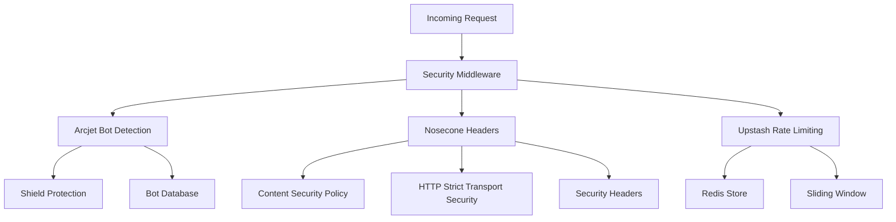

# Security Package

Production-ready security middleware powered by **Arcjet** for bot protection
and **Nosecone** for security headers, with **Upstash Redis** rate limiting.

<Info>
  **Implementation Status**: Core features (Arcjet bot protection, Nosecone
  headers, Upstash rate limiting) are fully implemented with graceful
  degradation in development.
</Info>

## Overview

The security package provides enterprise-grade security features with
intelligent defaults and graceful degradation:

<CardGroup cols={2}>
  <Card title="Arcjet Bot Protection" icon="robot">
    AI-powered bot detection with Shield protection and customizable allow/deny
    lists
  </Card>
  <Card title="Nosecone Security Headers" icon="header">
    Production-ready security headers with secure defaults and CSP configuration
  </Card>
  <Card title="Upstash Rate Limiting" icon="clock">
    Distributed rate limiting with sliding windows and Redis backend
  </Card>
  <Card title="Environment Aware" icon="settings">
    Graceful degradation in development with production validation
  </Card>
</CardGroup>

## Architecture



## Installation

```bash
pnpm add @repo/security
```

## Core Features

### Arcjet Bot Protection

AI-powered bot detection with configurable allow/block lists:

```typescript
import { secure } from "@repo/security";
import { logWarn } from "@repo/observability/server/next";

// API route protection
export async function POST(request: Request) {
  try {
    // Allow specific bots, block everything else
    await secure(["GOOGLEBOT", "BINGBOT"], request);

    // Request is legitimate, proceed
    return await processRequest(request);
  } catch (error) {
    if (error.message === "No bots allowed") {
      return new Response("Bot detected", { status: 403 });
    }
    if (error.message === "Rate limit exceeded") {
      return new Response("Too many requests", { status: 429 });
    }
    return new Response("Access denied", { status: 403 });
  }
}
```

### Advanced Bot Configuration

<AccordionGroup>
  <Accordion title="Custom Arcjet Setup" icon="cog">
    ```typescript
    import arcjet, { shield, detectBot } from '@arcjet/next';

    // Custom Arcjet configuration
    const aj = arcjet({
      key: process.env.ARCJET_KEY!,
      characteristics: ['ip.src'],
      rules: [
        // Protect against common attacks
        shield({
          mode: 'LIVE', // or 'DRY_RUN' for testing
        }),

        // Custom bot detection
        detectBot({
          mode: 'LIVE',
          allow: [
            'GOOGLEBOT',
            'BINGBOT',
            'CRAWLER', // Category: includes many crawlers
            'PREVIEW', // Category: social media preview bots
          ],
        }),
      ],
    });

    export async function middleware(request: Request) {
      const decision = await aj.protect(request);

      if (decision.isDenied()) {
        // Log the reason for debugging
        logWarn('Request blocked', {
          reason: decision.reason,
          ip: request.ip,
          path: request.path
        });

        if (decision.reason.isBot()) {
          return new Response('Bot access denied', { status: 403 });
        }

        if (decision.reason.isRateLimit()) {
          return new Response('Rate limited', {
            status: 429,
            headers: {
              'Retry-After': '60',
            },
          });
        }
      }

      return NextResponse.next();
    }
    ```

  </Accordion>

  <Accordion title="Available Bot Categories" icon="list">
    **Well-known Individual Bots:**
    - `GOOGLEBOT` - Google Search crawler
    - `BINGBOT` - Microsoft Bing crawler
    - `SLURP` - Yahoo Search crawler
    - `DUCKDUCKBOT` - DuckDuckGo crawler
    - `FACEBOOKBOT` - Facebook social preview
    - `TWITTERBOT` - Twitter/X social preview
    - `LINKEDINBOT` - LinkedIn social preview
    - `WHATSAPPBOT` - WhatsApp preview
    - `APPLEBOT` - Apple Search crawler
    - `YANDEXBOT` - Yandex Search crawler
    - `BAIDUBOT` - Baidu Search crawler

    **Bot Categories (allow multiple bots):**
    - `CRAWLER` - Search engine crawlers
    - `PREVIEW` - Social media preview bots
    - `MONITOR` - Uptime monitoring bots
    - `AI` - AI training/research bots
    - `SEO` - SEO analysis bots
    - `ARCHIVE` - Web archiving bots

    **Usage Example:**
    ```typescript
    await secure(['GOOGLEBOT', 'CRAWLER', 'PREVIEW']);
    ```

  </Accordion>
</AccordionGroup>

### Nosecone Security Headers

Production-ready security headers with secure defaults:

```typescript
import { noseconeMiddleware, noseconeOptions } from "@repo/security/middleware";

// Basic middleware setup
export const middleware = noseconeMiddleware(noseconeOptions);
```

<Tabs>
  <Tab title="Default Headers">
    **Secure Defaults Configuration:**
    ```typescript
    const securityHeaders = {
      // Content Security Policy disabled by default
      // (needs app-specific configuration)
      contentSecurityPolicy: false,

      // Cross-Origin policies
      crossOriginEmbedderPolicy: 'require-corp',
      crossOriginOpenerPolicy: 'same-origin',
      crossOriginResourcePolicy: 'cross-origin',

      // Security headers
      originAgentCluster: '?1',
      referrerPolicy: 'no-referrer',
      strictTransportSecurity: 'max-age=31536000; includeSubDomains',
      xContentTypeOptions: 'nosniff',
      xDnsPrefetchControl: 'off',
      xDownloadOptions: 'noopen',
      xFrameOptions: 'DENY',
      xPermittedCrossDomainPolicies: 'none',
      xXssProtection: '0',
    };
    ```

  </Tab>

  <Tab title="Custom CSP">
    ```typescript
    import { createMiddleware } from '@nosecone/next';

    // Custom Content Security Policy
    const customMiddleware = createMiddleware({
      contentSecurityPolicy: {
        directives: {
          'default-src': ["'self'"],
          'script-src': [
            "'self'",
            "'unsafe-eval'", // Next.js requires this
            "'unsafe-inline'", // For inline scripts (avoid if possible)
            'https://vercel.live', // Vercel Toolbar
          ],
          'style-src': [
            "'self'",
            "'unsafe-inline'", // CSS-in-JS requires this
            'https://fonts.googleapis.com',
          ],
          'img-src': [
            "'self'",
            'data:', // Base64 images
            'https:', // External images
            'blob:', // Generated images
          ],
          'font-src': ["'self'", 'https://fonts.gstatic.com'],
          'connect-src': [
            "'self'",
            'https://api.example.com', // Your API
            'https://vitals.vercel-insights.com', // Vercel Analytics
          ],
          'media-src': ["'self'"],
          'object-src': ["'none'"],
          'base-uri': ["'self'"],
          'form-action': ["'self'"],
          'frame-ancestors': ["'none'"],
          'upgrade-insecure-requests': [],
        },
      },

      // Override other headers as needed
      xFrameOptions: 'SAMEORIGIN', // Allow embedding from same origin
    });

    export const middleware = customMiddleware;
    ```

  </Tab>
</Tabs>

### Upstash Rate Limiting

Distributed rate limiting with Redis backend:

<CodeGroup>

```typescript Basic Rate Limiting
import { createRateLimiter } from "@repo/security/server/next";
import { Ratelimit } from "@upstash/ratelimit";

// Create rate limiters
const authLimiter = createRateLimiter({
  limiter: Ratelimit.slidingWindow(5, "10 s"),
  prefix: "auth"
});

const apiLimiter = createRateLimiter({
  limiter: Ratelimit.slidingWindow(100, "1 m"),
  prefix: "api"
});
```

```typescript API Route Usage
// Usage in API routes
export async function POST(request: Request) {
  const ip = request.headers.get("x-forwarded-for") ?? "anonymous";

  // Apply rate limiting
  const result = await authLimiter.limit(`auth:${ip}`);

  if (!result.success) {
    return new Response("Too many requests", {
      status: 429,
      headers: {
        "X-RateLimit-Limit": result.limit.toString(),
        "X-RateLimit-Remaining": result.remaining.toString(),
        "X-RateLimit-Reset": new Date(result.reset).toISOString()
      }
    });
  }

  return await processAuthRequest(request);
}
```

</CodeGroup>

### Rate Limiting Strategies

<AccordionGroup>
  <Accordion title="Limiter Types" icon="clock">
    ```typescript
    import { Ratelimit } from '@upstash/ratelimit';

    // Available limiter types
    const limiters = {
      // Fixed window: 10 requests per minute
      fixedWindow: Ratelimit.fixedWindow(10, '1 m'),

      // Sliding window: 10 requests per minute (more precise)
      slidingWindow: Ratelimit.slidingWindow(10, '1 m'),

      // Token bucket: burst allowance with refill rate
      tokenBucket: Ratelimit.tokenBucket(10, '1 s', 20), // 10/sec, burst 20

      // Sliding logs: exact request tracking (memory intensive)
      slidingLogs: Ratelimit.slidingLogs(10, '1 m'),
    };
    ```

  </Accordion>

  <Accordion title="Multiple Rate Limiters" icon="list">
    ```typescript
    // Use with different prefixes for different endpoints
    const rateLimiters = {
      auth: createRateLimiter({
        limiter: Ratelimit.slidingWindow(5, '15 m'),
        prefix: 'auth',
      }),

      api: createRateLimiter({
        limiter: Ratelimit.slidingWindow(1000, '1 h'),
        prefix: 'api',
      }),

      upload: createRateLimiter({
        limiter: Ratelimit.slidingWindow(10, '1 h'), // 10 per hour
        prefix: 'upload',
      }),
    };
    ```

  </Accordion>

  <Accordion title="Graceful Degradation" icon="shield-check">
    **When Redis is not configured, rate limiting is disabled:**

    - This allows development without Redis setup
    - The createRateLimiter returns a no-op limiter that always allows requests
    - In development without Redis:
      - `limit()` always returns `{ success: true, remaining: 999999 }`
      - No errors are thrown
      - Console warning is logged once

  </Accordion>
</AccordionGroup>

## Environment Configuration

Type-safe environment variable handling with intelligent defaults:

<Tabs>
  <Tab title="Environment Variables">
    ```typescript
    interface SecurityEnv {
      // Arcjet bot protection (optional in development)
      ARCJET_KEY?: string; // Format: ajkey_...

      // Upstash Redis rate limiting (optional in development)
      UPSTASH_REDIS_REST_URL?: string;
      UPSTASH_REDIS_REST_TOKEN?: string;
    }
    ```

  </Tab>

  <Tab title="Production Setup">
    ```bash
    # Production (required)
    ARCJET_KEY="ajkey_xxxxxxxxxxxxx"
    UPSTASH_REDIS_REST_URL="https://xxxxx.upstash.io"
    UPSTASH_REDIS_REST_TOKEN="xxxxxxxxxx"
    ```

  </Tab>

  <Tab title="Development Setup">
    ```bash
    # Development (optional - package gracefully degrades)
    # Leave empty for local development

    # Optional: Add to .env.local for testing
    # ARCJET_KEY="ajkey_test_xxxxxxxxxxxxx"
    # UPSTASH_REDIS_REST_URL="..."
    # UPSTASH_REDIS_REST_TOKEN="..."
    ```

  </Tab>
</Tabs>

### Environment Validation Logic

<Note>
  **Smart Environment Detection**: The package automatically detects production
  vs development and only enforces strict validation in production when
  variables are present.
</Note>

```typescript
// Smart environment detection
const isProduction = process.env.NODE_ENV === "production";
const hasArcjetVars = Boolean(process.env.ARCJET_KEY);
const hasUpstashVars = Boolean(
  process.env.UPSTASH_REDIS_REST_TOKEN && process.env.UPSTASH_REDIS_REST_URL
);

// Only require in production when vars are present
const requireArcjetInProduction = isProduction && hasArcjetVars;
const requireUpstashInProduction = isProduction && hasUpstashVars;

// This allows:
// - Development with .env.local files (optional)
// - Production with full validation
// - Staging environments with partial configs
```

## Comprehensive Example

Complete security middleware implementation:

<AccordionGroup>
  <Accordion title="Complete Middleware" icon="code">
    ```typescript
    // middleware.ts
    import { NextRequest, NextResponse } from 'next/server';
    import {
      secure,
      createRateLimiter,
      noseconeMiddleware,
      noseconeOptions,
    } from '@repo/security/server/next';
    import { Ratelimit } from '@upstash/ratelimit';
    import { logWarn } from '@repo/observability/server/next';

    // Rate limiters for different endpoints
    const globalLimiter = createRateLimiter({
      limiter: Ratelimit.slidingWindow(100, '1 m'),
      prefix: 'global',
    });

    const authLimiter = createRateLimiter({
      limiter: Ratelimit.slidingWindow(5, '15 m'),
      prefix: 'auth',
    });

    const apiLimiter = createRateLimiter({
      limiter: Ratelimit.slidingWindow(1000, '1 h'),
      prefix: 'api',
    });

    export async function middleware(request: NextRequest) {
      const { pathname } = request.nextUrl;
      const ip = request.ip ?? request.headers.get('x-forwarded-for') ?? 'anonymous';

      // Apply security headers first
      const response = NextResponse.next();

      // Apply Nosecone security headers
      const secureResponse = await noseconeMiddleware(noseconeOptions)(request);

      // Copy security headers to our response
      secureResponse.headers.forEach((value, key) => {
        response.headers.set(key, value);
      });

      try {
        // Bot protection for all routes
        await secure(['GOOGLEBOT', 'BINGBOT', 'CRAWLER', 'PREVIEW'], request);

        // Rate limiting based on route
        let rateLimiter = globalLimiter;
        let identifier = `global:${ip}`;

        if (pathname.startsWith('/api/auth')) {
          rateLimiter = authLimiter;
          identifier = `auth:${ip}`;
        } else if (pathname.startsWith('/api/')) {
          rateLimiter = apiLimiter;
          identifier = `api:${ip}`;
        }

        const rateLimit = await rateLimiter.limit(identifier);

        if (!rateLimit.success) {
          return new NextResponse('Too many requests', {
            status: 429,
            headers: {
              'X-RateLimit-Limit': rateLimit.limit.toString(),
              'X-RateLimit-Remaining': rateLimit.remaining.toString(),
              'X-RateLimit-Reset': new Date(rateLimit.reset).toISOString(),
              'Retry-After': Math.round((rateLimit.reset - Date.now()) / 1000).toString(),
            },
          });
        }

        // Add rate limit info to successful responses
        response.headers.set('X-RateLimit-Limit', rateLimit.limit.toString());
        response.headers.set('X-RateLimit-Remaining', rateLimit.remaining.toString());
        response.headers.set('X-RateLimit-Reset', new Date(rateLimit.reset).toISOString());
      } catch (error) {
        // Handle security violations
        logWarn('Security violation detected', {
          ip: ip,
          pathname: pathname,
          error: error.message,
          type: error.type,
          severity: error.severity,
        });

        if (error.message === 'No bots allowed') {
          return new NextResponse('Bot access denied', {
            status: 403,
            headers: {
              'X-Security-Reason': 'bot-detected',
            },
          });
        }

        if (error.message === 'Rate limit exceeded') {
          return new NextResponse('Rate limited by Arcjet', {
            status: 429,
            headers: {
              'X-Security-Reason': 'rate-limit-arcjet',
            },
          });
        }

        return new NextResponse('Access denied', {
          status: 403,
          headers: {
            'X-Security-Reason': 'security-violation',
          },
        });
      }

      return response;
    }

    // Configure matcher to exclude static files
    export const config = {
      matcher: [
        /*
         * Match all request paths except for the ones starting with:
         * - api (API routes)
         * - _next/static (static files)
         * - _next/image (image optimization files)
         * - favicon.ico (favicon file)
         */
        {
          source: '/((?!_next/static|_next/image|favicon.ico).*)',
          missing: [
            { type: 'header', key: 'next-router-prefetch' },
            { type: 'header', key: 'purpose', value: 'prefetch' },
          ],
        },
      ],
    };
    ```

  </Accordion>
</AccordionGroup>

## API Route Protection

Protect individual API routes with authentication and rate limiting:

```typescript
// app/api/protected/route.ts
import { secure, createRateLimiter } from "@repo/security/server/next";
import { Ratelimit } from "@upstash/ratelimit";

const limiter = createRateLimiter({
  limiter: Ratelimit.slidingWindow(10, "1 m"),
  prefix: "protected-api"
});

export async function POST(request: Request) {
  const ip = request.headers.get("x-forwarded-for") ?? "anonymous";

  try {
    // Bot protection
    await secure(["GOOGLEBOT"], request);

    // Rate limiting by IP
    const result = await limiter.limit(`protected:${ip}`);
    if (!result.success) {
      return Response.json(
        { error: "Too many requests" },
        {
          status: 429,
          headers: {
            "X-RateLimit-Remaining": result.remaining.toString(),
            "Retry-After": "60"
          }
        }
      );
    }

    // Your protected logic here
    return Response.json({
      message: "Success",
      timestamp: Date.now()
    });
  } catch (error) {
    return Response.json({ error: "Access denied" }, { status: 403 });
  }
}
```

## Migration Guide

### From Basic Security Headers

<Tabs>
  <Tab title="Before: Manual Headers">
    ```typescript
    // Before: Manual security headers
    export function middleware(request: NextRequest) {
      const response = NextResponse.next();

      response.headers.set('X-Frame-Options', 'DENY');
      response.headers.set('X-Content-Type-Options', 'nosniff');
      // ... manual header configuration

      return response;
    }
    ```

  </Tab>

  <Tab title="After: Nosecone">
    ```typescript
    // After: Nosecone-powered headers
    import { noseconeMiddleware, noseconeOptions } from '@repo/security/middleware';

    export const middleware = noseconeMiddleware(noseconeOptions);
    ```

  </Tab>
</Tabs>

### From Custom Rate Limiting

<Tabs>
  <Tab title="Before: Custom Redis">
    ```typescript
    // Before: Custom Redis rate limiting
    const redis = new Redis({ url: process.env.REDIS_URL });

    export async function rateLimit(key: string) {
      const count = await redis.incr(key);
      if (count === 1) {
        await redis.expire(key, 60);
      }
      return count <= 10;
    }
    ```

  </Tab>

  <Tab title="After: Upstash Rate Limiting">
    ```typescript
    // After: Upstash Rate Limiting
    import { createRateLimiter } from '@repo/security/server/next';
    import { Ratelimit } from '@upstash/ratelimit';

    const limiter = createRateLimiter({
      limiter: Ratelimit.slidingWindow(10, '1 m'),
      prefix: 'api',
    });

    export async function rateLimit(key: string) {
      const result = await limiter.limit(key);
      return result.success;
    }
    ```

  </Tab>
</Tabs>

## Best Practices

<Warning>
  **Security Best Practices:** - Always set `ARCJET_KEY` in production -
  Configure Redis for rate limiting in production - Use separate Arcjet keys for
  different environments - Monitor rate limiting and bot detection events
</Warning>

### Recommended Practices

1. **Content Security Policy**
   - Configure CSP based on your app's specific needs
   - Start with restrictive policies and gradually allow necessary sources
   - Use `'nonce-'` or `'sha256-'` instead of `'unsafe-inline'` when possible

2. **Rate Limiting Strategy**
   - Use different rate limits for different endpoints
   - Implement stricter limits for authentication endpoints
   - Consider user-based limits in addition to IP-based limits

3. **Bot Management**
   - Regularly review Arcjet logs to understand bot traffic
   - Adjust allow lists based on legitimate bot requirements
   - Use DRY_RUN mode to test new bot detection rules

4. **Monitoring and Alerting**
   - Monitor rate limit violations
   - Set up alerts for unusual bot detection patterns
   - Track security header compliance

## Testing

The package includes comprehensive tests for all security features:

```typescript
describe("Security Package", () => {
  describe("Arcjet Integration", () => {
    test("should block bots when not in allow list");
    test("should allow legitimate requests");
    test("should handle missing Arcjet key gracefully");
  });

  describe("Rate Limiting", () => {
    test("should enforce rate limits with Redis");
    test("should gracefully degrade without Redis");
    test("should use correct prefixes for different limiters");
  });

  describe("Security Headers", () => {
    test("should apply Nosecone security headers");
    test("should support Vercel Toolbar in development");
    test("should disable CSP by default");
  });
});
```

## Features Summary

The security package provides production-ready security with:

- **Arcjet AI Bot Protection** with intelligent bot detection and customizable
  allow lists
- **Nosecone Security Headers** with secure defaults for production deployment
- **Upstash Rate Limiting** with Redis backend and graceful degradation
- **Environment-aware Configuration** with smart validation in production
- **TypeScript Safety** with Zod validation and SafeEnv pattern
- **Graceful Degradation** in development when external services aren't
  configured

This makes it suitable for production applications requiring robust security
while maintaining excellent developer experience.
