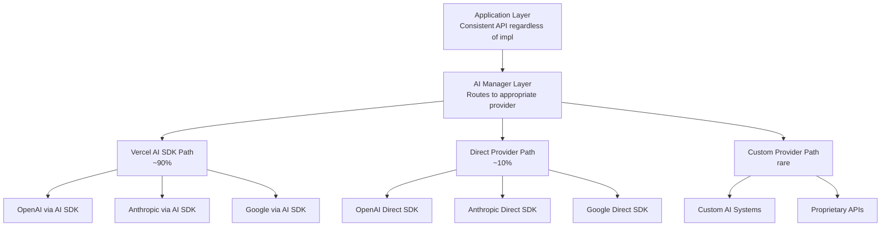

# AI Package Architecture

Framework-agnostic AI integration system that supports multiple implementation
paths for maximum flexibility and optimal performance across different use
cases.

## Overview

The `@repo/ai` package provides a unified interface for AI operations while
supporting different implementation strategies based on specific needs and
requirements.

<CardGroup cols={2}>
  <Card title="Vercel AI SDK" icon="zap">
    Standard path for ~90% of use cases with excellent developer experience
  </Card>
  <Card title="Direct Provider SDKs" icon="link">
    Direct access to provider-specific features and advanced capabilities
  </Card>
  <Card title="Custom Implementations" icon="code">
    Specialized solutions for unique requirements and proprietary systems
  </Card>
  <Card title="Smart Routing" icon="route">
    Automatic provider selection based on capabilities and requirements
  </Card>
</CardGroup>

## Core Philosophy

> "Use the right tool for the job, but keep the interface consistent"

We recognize that while Vercel AI SDK is excellent for most use cases, sometimes
you need direct access to provider-specific features (like Anthropic's advanced
moderation or OpenAI's latest beta features).

## Architecture Layers



## Usage Examples

### Standard Configuration

<Tabs>
  <Tab title="Basic Setup">
    ```typescript
    import { createAI } from '@repo/ai';
    import { logInfo, logWarn } from '@repo/observability/server/next';

    const ai = createAI({
      providers: [
        // OpenAI via Vercel AI SDK (recommended for most cases)
        {
          name: 'openai',
          type: 'ai-sdk',
          config: { apiKey: process.env.OPENAI_KEY },
        },
        // Anthropic direct SDK (for advanced features)
        {
          name: 'anthropic',
          type: 'direct',
          config: { apiKey: process.env.ANTHROPIC_KEY },
        },
        // Google via AI SDK
        {
          name: 'google',
          type: 'ai-sdk',
          config: { apiKey: process.env.GOOGLE_KEY },
        },
      ],
      defaultProvider: 'openai',
    });
    ```

  </Tab>

  <Tab title="Advanced Configuration">
    ```typescript
    const ai = createAI({
      providers: [...],

      // Automatic routing based on capabilities
      routing: {
        'moderate': 'anthropic-direct',
        'image-generation': 'openai-direct',
        'text-generation': 'openai-ai-sdk',
        'classification': 'anthropic-direct',
        'default': 'openai-ai-sdk'
      },

      // Global configuration
      defaults: {
        temperature: 0.7,
        maxTokens: 1000,
        timeout: 30000,
      },

      // Middleware
      middleware: [
        rateLimiter({ requests: 100, window: '1m' }),
        logger({ level: 'info' }),
        errorHandler({ retries: 3 }),
      ],
    });
    ```

  </Tab>
</Tabs>

### Using Different Implementation Paths

<CodeGroup>
```typescript Standard Completions
// Standard completion - uses AI SDK
const response = await ai.complete({
  prompt: 'Explain quantum computing in simple terms',
  provider: 'openai', // AI SDK implementation
  temperature: 0.7,
  maxTokens: 500,
});

// Response logging logInfo('AI response received', { text: response.text,
totalTokens: response.usage.totalTokens });

logInfo('AI response received', { text: response.text, totalTokens:
response.usage.totalTokens });

````

```typescript Provider-Specific Features
// Anthropic with special features - uses direct SDK
const analysis = await ai.complete({
  prompt: 'Analyze this content for sentiment and safety',
  provider: 'anthropic', // Direct implementation
  // Can access Anthropic-specific options
  anthropicOptions: {
    moderation: true,
    sentiment: true,
    safetyLevel: 'strict',
  },
});

// Provider-specific features
if (ai.hasFeature('anthropic', 'moderate')) {
  const moderation = await ai.providers.anthropic.moderate(content);

  if (moderation.harmful) {
    logWarn('Content moderation flags', { categories: moderation.categories });
  }
}

// Content moderation
const moderation = await ai.moderate(content);
if (moderation.flagged) {
  logWarn('Content flagged by moderation', {
    categories: moderation.categories,
    scores: moderation.categoryScores,
    content: content.substring(0, 100), // First 100 chars for context
  });
}
````

</CodeGroup>

### Streaming Support

<Tabs>
  <Tab title="AI SDK Streaming">
    ```typescript
    // AI SDK streaming
    const stream = await ai.stream({
      prompt: 'Write a detailed story about space exploration',
      provider: 'openai',
      temperature: 0.8,
    });

    // Same interface for consumption regardless of provider
    for await (const chunk of stream) {
      process.stdout.write(chunk.text);
    }
    ```

  </Tab>

  <Tab title="Direct SDK Streaming">
    ```typescript
    // Direct SDK streaming
    const stream = await ai.stream({
      prompt: 'Write a poem about artificial intelligence',
      provider: 'anthropic',
      maxTokens: 800,
    });

    // Handle streaming with metadata
    for await (const chunk of stream) {
      if (chunk.type === 'text') {
        process.stdout.write(chunk.text);
      } else if (chunk.type === 'metadata') {
        logInfo('Stream chunk received', { metadata: chunk.data });
      }
    }
    ```

  </Tab>

  <Tab title="React Integration">
    ```typescript
    import { useAIStream } from '@repo/ai/client/next';

    export function StreamingChat() {
      const { stream, isStreaming, text, error } = useAIStream();

      const handleSubmit = async (message: string) => {
        await stream({
          prompt: message,
          provider: 'openai',
        });
      };

      return (
        <div>
          <div className="messages">
            {text && <div className="ai-response">{text}</div>}
          </div>

          {isStreaming && <div className="loading">AI is typing...</div>}
          {error && <div className="error">Error: {error.message}</div>}

          <ChatInput onSubmit={handleSubmit} disabled={isStreaming} />
        </div>
      );
    }
    ```

  </Tab>
</Tabs>

### Smart Routing

<CodeGroup>
```typescript Automatic Routing
const ai = createAI({
  providers: [...],
  // Automatic routing based on capabilities
  routing: {
    'moderate': 'anthropic-direct',
    'image-generation': 'openai-direct',
    'classification': 'anthropic-direct',
    'default': 'openai-ai-sdk'
  }
});

// Automatically routes to anthropic-direct const moderation = await
ai.moderate("content to check");

// Automatically routes to openai-direct const image = await ai.generateImage({
prompt: "A beautiful sunset over the ocean", size: "1024x1024" });

// Uses default (openai-ai-sdk) const text = await ai.complete({ prompt: "Hello,
world!" });

````

```typescript Capability-Based Selection
// Check provider capabilities
const providers = ai.getCapableProviders('image-generation');
console.log(providers); // ['openai-direct', 'stability-ai']

// Use best provider for specific task
const bestProvider = ai.selectProvider({
  capability: 'text-generation',
  criteria: {
    speed: 'high',
    cost: 'low',
    quality: 'medium'
  }
});

const result = await ai.complete({
  prompt: "Generate a product description",
  provider: bestProvider,
});
````

</CodeGroup>

## Provider Implementation Pattern

### Base Provider Interface

<AccordionGroup>
  <Accordion title="Provider Interface" icon="code">
    ```typescript
    // Base interface that all providers implement
    interface AIProvider {
      readonly name: string;
      readonly type: 'ai-sdk' | 'direct' | 'custom';
      readonly capabilities: Set<Capability>;

      // Standard methods
      complete(options: CompletionOptions): Promise<CompletionResponse>;
      stream(options: StreamOptions): AsyncIterableIterator<StreamChunk>;
      embed(options: EmbedOptions): Promise<EmbeddingResponse>;

      // Optional methods
      generateObject?<T>(options: ObjectOptions<T>): Promise<T>;
      moderate?(content: string): Promise<ModerationResult>;
      classify?(text: string, labels: string[]): Promise<Classification>;
      generateImage?(options: ImageOptions): Promise<ImageResponse>;

      // Provider-specific extensions
      extensions?: Record<string, Function>;

      // Health and monitoring
      healthCheck?(): Promise<HealthStatus>;
      getUsage?(): Promise<UsageStats>;
    }
    ```

  </Accordion>

  <Accordion title="Capability Types" icon="puzzle">
    ```typescript
    type Capability =
      | 'complete'           // Text completion
      | 'stream'            // Streaming responses
      | 'embed'             // Text embeddings
      | 'moderate'          // Content moderation
      | 'classify'          // Text classification
      | 'generate-object'   // Structured object generation
      | 'generate-image'    // Image generation
      | 'generate-audio'    // Audio generation
      | 'analyze-image'     // Image analysis
      | 'tools'             // Function calling
      | 'multimodal';       // Multi-modal inputs

    interface ProviderCapabilities {
      [providerName: string]: {
        capabilities: Set<Capability>;
        metadata: {
          maxTokens?: number;
          supportedModels: string[];
          pricing?: PricingInfo;
          rateLimits?: RateLimitInfo;
        };
      };
    }
    ```

  </Accordion>
</AccordionGroup>

### Implementation Examples

<Tabs>
  <Tab title="AI SDK Provider">
    ```typescript
    // Example: OpenAI via Vercel AI SDK
    export class OpenAIAISDKProvider implements AIProvider {
      readonly name = 'openai';
      readonly type = 'ai-sdk' as const;
      readonly capabilities = new Set<Capability>([
        'complete', 'stream', 'embed', 'tools', 'generate-object'
      ]);

      constructor(private config: OpenAIConfig) {}

      async complete(options: CompletionOptions) {
        // Uses Vercel AI SDK
        return generateText({
          model: openai(options.model || 'gpt-4'),
          prompt: options.prompt,
          temperature: options.temperature,
          maxTokens: options.maxTokens,
        });
      }

      async stream(options: StreamOptions) {
        // Streaming via AI SDK
        return streamText({
          model: openai(options.model || 'gpt-4'),
          prompt: options.prompt,
          temperature: options.temperature,
        });
      }

      async generateObject<T>(options: ObjectOptions<T>) {
        return generateObject({
          model: openai(options.model || 'gpt-4'),
          schema: options.schema,
          prompt: options.prompt,
        });
      }
    }
    ```

  </Tab>

  <Tab title="Direct Provider">
    ```typescript
    // Example: Anthropic with direct SDK
    export class AnthropicDirectProvider implements AIProvider {
      readonly name = 'anthropic';
      readonly type = 'direct' as const;
      readonly capabilities = new Set<Capability>([
        'complete', 'stream', 'moderate', 'classify', 'tools'
      ]);

      constructor(private client: AnthropicSDK) {}

      async complete(options: CompletionOptions) {
        // Direct Anthropic SDK call
        const response = await this.client.messages.create({
          model: options.model || 'claude-3-sonnet-20240229',
          max_tokens: options.maxTokens || 1000,
          messages: [{ role: 'user', content: options.prompt }],
          temperature: options.temperature,
        });

        return {
          text: response.content[0].text,
          usage: {
            promptTokens: response.usage.input_tokens,
            completionTokens: response.usage.output_tokens,
            totalTokens: response.usage.input_tokens + response.usage.output_tokens,
          },
          provider: this.name,
        };
      }

      async moderate(content: string) {
        // Anthropic-specific moderation feature
        return this.client.moderate({
          content,
          categories: ['harmful', 'harassment', 'illegal'],
        });
      }

      async classify(text: string, labels: string[]) {
        // Advanced classification with Claude
        const prompt = `Classify the following text into one of these categories: ${labels.join(', ')}\n\nText: ${text}`;

        const response = await this.complete({ prompt });
        return {
          classification: response.text.trim(),
          confidence: 0.95, // Could be enhanced with actual confidence scoring
        };
      }
    }
    ```

  </Tab>

  <Tab title="Custom Provider">
    ```typescript
    // Example: Custom internal AI system
    export class CustomAIProvider implements AIProvider {
      readonly name = 'custom-internal';
      readonly type = 'custom' as const;
      readonly capabilities = new Set<Capability>([
        'complete', 'classify', 'moderate'
      ]);

      constructor(private endpoint: string, private apiKey: string) {}

      async complete(options: CompletionOptions) {
        const response = await fetch(`${this.endpoint}/complete`, {
          method: 'POST',
          headers: {
            'Authorization': `Bearer ${this.apiKey}`,
            'Content-Type': 'application/json',
          },
          body: JSON.stringify({
            prompt: options.prompt,
            temperature: options.temperature,
            max_tokens: options.maxTokens,
          }),
        });

        const data = await response.json();

        return {
          text: data.text,
          usage: data.usage,
          provider: this.name,
          metadata: data.metadata,
        };
      }

      async classify(text: string, labels: string[]) {
        // Custom classification logic
        const response = await fetch(`${this.endpoint}/classify`, {
          method: 'POST',
          headers: {
            'Authorization': `Bearer ${this.apiKey}`,
            'Content-Type': 'application/json',
          },
          body: JSON.stringify({ text, labels }),
        });

        return response.json();
      }
    }
    ```

  </Tab>
</Tabs>

## When to Use Which Path

### Use Vercel AI SDK When:

<CardGroup cols={1}>
  <Card title="Standard Use Cases">
    - Text completions and chat interfaces - Streaming responses for real-time
    UX - Standard embeddings and vector operations - Function calling and tool
    usage - Object generation with structured output
  </Card>
</CardGroup>

**Benefits:**

- Automatic retries and error handling
- Consistent streaming interface
- Built-in React hooks and utilities
- Type-safe object generation
- Standardized response formats

### Use Direct Provider SDK When:

<CardGroup cols={1}>
  <Card title="Advanced Features">
    - Provider-specific features (Anthropic moderation, OpenAI beta features) -
    Maximum control over API parameters - Custom fine-tuned models - Specialized
    use cases requiring provider optimizations - Access to latest provider
    features before AI SDK support
  </Card>
</CardGroup>

**Benefits:**

- Full access to provider APIs
- Provider-specific optimizations
- Latest feature availability
- Custom parameter control
- Provider-specific response metadata

### Use Custom Providers When:

<CardGroup cols={1}>
  <Card title="Specialized Systems">
    - Proprietary AI systems and models - Domain-specific AI solutions -
    Internal AI infrastructure - Specialized processing pipelines - Integration
    with existing ML systems
  </Card>
</CardGroup>

**Benefits:**

- Complete customization
- Internal system integration
- Specialized processing logic
- Custom response handling
- Domain-specific optimizations

## Advanced Features

### Error Handling and Resilience

<CodeGroup>
```typescript Automatic Failover
const ai = createAI({
  providers: [
    { name: 'openai', type: 'ai-sdk', priority: 1 },
    { name: 'anthropic', type: 'direct', priority: 2 },
    { name: 'google', type: 'ai-sdk', priority: 3 },
  ],

failover: { enabled: true, retries: 3, backoff: 'exponential', conditions:
['rate_limit', 'timeout', 'server_error'], }, });

// Automatically fails over if primary provider fails const result = await
ai.complete({ prompt: "Generate a summary", // Will try openai -> anthropic ->
google if failures occur });

````

```typescript Custom Error Handling
ai.onError('rate_limit', async (error, options) => {
  // Custom rate limit handling
  logWarn('Rate limit hit', { provider: error.provider, retryAfter: error.retryAfter });
  await new Promise(resolve => setTimeout(resolve, 60000));
  return ai.retry(options);
});

ai.onError('timeout', async (error, options) => {
  // Increase timeout and retry
  return ai.retry({
    ...options,
    timeout: options.timeout * 2,
  });
});

// Rate limiting handling
try {
  await ai.complete(prompt);
} catch (error) {
  if (error.code === 'RATE_LIMIT') {
    logWarn('AI rate limit hit', {
      provider: error.provider,
      retryAfter: error.retryAfter,
      limit: error.limit,
    });
    // Handle rate limiting...
  }
}
````

</CodeGroup>

### Performance Monitoring

<Tabs>
  <Tab title="Usage Tracking">
    ```typescript
    // Built-in usage tracking
    const usage = await ai.getUsage();
    logInfo('Usage statistics', { usage });
    // {
    //   providers: {
    //     openai: { requests: 150, tokens: 45000, cost: 2.35 },
    //     anthropic: { requests: 23, tokens: 12000, cost: 1.20 }
    //   },
    //   total: { requests: 173, tokens: 57000, cost: 3.55 }
    // }

    // Real-time monitoring
    ai.on('request', ({ provider, tokens, cost }) => {
      metrics.record('ai.request', 1, { provider });
      metrics.record('ai.tokens', tokens, { provider });
      metrics.record('ai.cost', cost, { provider });
    });

    // Usage statistics
    const usage = await ai.getUsage();
    logInfo('AI usage statistics', {
      totalTokens: usage.totalTokens,
      totalCost: usage.totalCost,
      byModel: usage.byModel,
      byProvider: usage.byProvider,
    });
    ```

  </Tab>

  <Tab title="Performance Metrics">
    ```typescript
    // Performance tracking
    ai.on('complete', ({ provider, duration, tokens }) => {
      const tokensPerSecond = tokens / (duration / 1000);

      metrics.record('ai.latency', duration, { provider });
      metrics.record('ai.throughput', tokensPerSecond, { provider });
    });

    // Health monitoring
    const health = await ai.healthCheck();
    logInfo('Health check results', { health });
    // {
    //   providers: {
    //     openai: { healthy: true, latency: 234, uptime: 99.9 },
    //     anthropic: { healthy: true, latency: 456, uptime: 99.8 }
    //   },
    //   overall: { healthy: true, avgLatency: 345 }
    // }

    // Health check
    const health = await ai.checkHealth();
    logInfo('AI system health status', {
      status: health.status,
      latency: health.latency,
      providers: health.providers.map(p => ({
        name: p.name,
        status: p.status,
        latency: p.latency,
      })),
    });
    ```

  </Tab>
</Tabs>

## Migration Benefits

<CodeGroup>
```typescript Before (Tightly Coupled)
// Old code (tightly coupled to one approach)
import { openai } from '@ai-sdk/openai';
import { generateText } from 'ai';

const result = await generateText({ model: openai('gpt-4'), prompt: "Hello
world" });

// Hard to switch providers or access provider-specific features

````

```typescript After (Flexible Architecture)
// New code (flexible and extensible)
import { createAI } from '@repo/ai';

const ai = createAI(config);
const result = await ai.complete({
  prompt: "Hello world",
  provider: 'openai'
});

// Easy to switch implementations
const result2 = await ai.complete({
  prompt: "Hello world",
  provider: 'anthropic-direct'
});

// Access provider-specific features when needed
if (ai.hasFeature('anthropic', 'moderate')) {
  const moderation = await ai.moderate(content);
}

// Available providers
const providers = await ai.getAvailableProviders();
logInfo('Available AI providers', { providers }); // ['openai-direct', 'stability-ai']

// Usage statistics
const usage = await ai.getUsage();
logInfo('AI usage statistics', {
  totalTokens: usage.totalTokens,
  totalCost: usage.totalCost,
  byModel: usage.byModel,
  byProvider: usage.byProvider,
});

// Health check
const health = await ai.checkHealth();
logInfo('AI health check results', {
  health
});
````

</CodeGroup>

## Best Practices

<Warning>
  **AI Integration Guidelines:** - Use AI SDK for standard use cases (90% of the
  time) - Switch to direct providers only when you need specific features -
  Implement proper error handling and failover strategies - Monitor usage and
  costs across all providers - Use appropriate models for different tasks (speed
  vs quality) - Implement rate limiting and caching where appropriate
</Warning>

### Recommended Patterns

1. **Provider Selection Strategy**
   - Start with AI SDK providers for development
   - Identify specific features that require direct providers
   - Use custom providers only for specialized needs

2. **Performance Optimization**
   - Cache responses where appropriate
   - Use streaming for long-form generation
   - Monitor token usage and costs
   - Implement request batching for efficiency

3. **Error Resilience**
   - Configure automatic failover between providers
   - Implement exponential backoff for retries
   - Handle rate limits gracefully
   - Monitor provider health and performance

4. **Development Workflow**
   - Use consistent interfaces across all providers
   - Test with multiple providers during development
   - Monitor usage patterns and optimize accordingly
   - Keep provider configurations flexible for easy switching

This architecture provides maximum flexibility while maintaining a clean,
consistent interface for the 90% of use cases that work well with Vercel AI SDK,
while enabling seamless access to advanced provider-specific features when
needed.
