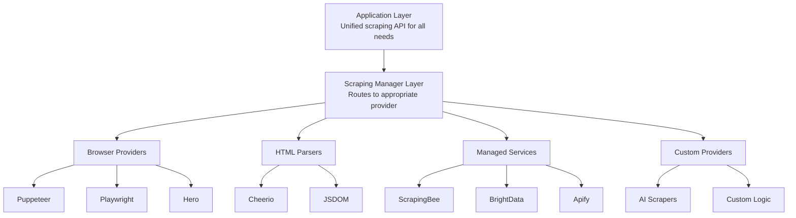

# Scraping Package Architecture

Modern, multi-provider web scraping system that supports various scraping
strategies from lightweight HTML parsing to full browser automation and managed
scraping services.

## Overview

The `@repo/scraping` package provides a unified interface for web scraping while
supporting different implementation strategies optimized for specific use cases
and performance requirements.

<CardGroup cols={2}>
  <Card title="Browser Automation" icon="browser">
    Full JavaScript execution with Puppeteer, Playwright, and Hero
  </Card>
  <Card title="HTML Parsing" icon="code">
    Fast static content extraction with Cheerio and JSDOM
  </Card>
  <Card title="Managed Services" icon="cloud">
    ScrapingBee, BrightData, and Apify for scale and reliability
  </Card>
  <Card title="Smart Routing" icon="route">
    Automatic provider selection based on site requirements
  </Card>
</CardGroup>

## Core Design Principles

1. **Provider Agnostic**: Switch between scraping strategies based on needs
2. **Performance First**: Use the lightest tool that gets the job done
3. **Reliability**: Automatic retries, failover, and error recovery
4. **Developer Experience**: Clean APIs, good defaults, helpful errors
5. **Extensible**: Easy to add new providers and capabilities

## Architecture Layers



## Provider Categories

### Browser Automation Providers

For JavaScript-heavy sites, complex interactions, screenshots, and dynamic
content.

<Tabs>
  <Tab title="Capabilities">
    **Core Features:** - Full JavaScript execution and DOM manipulation - User interactions (click,
    type, scroll, hover) - Screenshot and PDF generation - Cookie and session management - Network
    request interception and modification - Geolocation and device emulation - File downloads and
    uploads **Advanced Features:** - Mobile device emulation - Network throttling simulation -
    Custom browser extensions - Proxy support and rotation - CAPTCHA solving integration
  </Tab>

  <Tab title="Use Cases">
    **Ideal for:** - Single Page Applications (SPAs) with dynamic content - Sites requiring user
    authentication and login flows - E-commerce sites with infinite scroll or lazy loading - Social
    media platforms with dynamic feeds - Sites with complex JavaScript interactions - When visual
    verification or screenshots are needed - Testing user workflows and form submissions
    **Performance Considerations:** - Higher resource usage (CPU, memory) - Slower execution
    compared to HTML parsing - Better for accuracy over speed
  </Tab>
</Tabs>

### HTML Parsing Providers

For static content, high performance, and simple data extraction.

<Tabs>
  <Tab title="Capabilities">
    **Core Features:** - Fast HTML parsing and DOM traversal - CSS selectors and XPath support -
    Basic data extraction and transformation - Low resource usage and high throughput - Text
    processing and cleanup utilities **Advanced Features:** - Custom parser configurations -
    Multi-encoding support - Streaming parsing for large documents - Memory-efficient processing
  </Tab>

  <Tab title="Use Cases">
    **Ideal for:** - Static HTML websites and blogs - RSS/XML feeds and sitemaps - High-volume
    scraping operations - Server-side rendered content only - News sites and article extraction -
    Product catalogs with static content - API documentation and reference sites **Performance
    Benefits:** - Extremely fast execution - Low memory footprint - High concurrent processing -
    Cost-effective for large-scale operations
  </Tab>
</Tabs>

### Managed Service Providers

For scale, reliability, proxy management, and anti-bot protection.

<Tabs>
  <Tab title="Capabilities">
    **Infrastructure Features:** - Built-in proxy rotation and management - Automatic CAPTCHA
    solving - Geographic distribution and IP rotation - No local infrastructure required -
    Enterprise-grade reliability and uptime **Anti-Detection Features:** - Browser fingerprint
    randomization - User agent rotation - Request timing optimization - Cookie and session
    management - Advanced anti-bot evasion
  </Tab>

  <Tab title="Use Cases">
    **Ideal for:** - Large-scale scraping operations (1000+ pages/day) - Sites with sophisticated
    anti-bot protection - Need for different geographic locations - Limited local computational
    resources - Sites requiring CAPTCHA solving - High-reliability commercial applications -
    Compliance with rate limiting requirements **Business Benefits:** - Reduced infrastructure costs
    - Improved success rates - Built-in compliance features - Professional support and SLAs
  </Tab>
</Tabs>

## Usage Patterns

### Automatic Provider Selection

<CodeGroup>
```typescript Smart Routing Configuration
const scraper = createServerScraping({
  providers: [
    { name: 'cheerio', type: 'html', priority: 1 },
    { name: 'playwright', type: 'browser', priority: 2 },
    { name: 'scrapingbee', type: 'managed', priority: 3 },
  ],

routing: { // Use Cheerio for static sites static: 'cheerio', // Use Playwright
for SPAs dynamic: 'playwright', // Use managed service for protected sites
protected: 'scrapingbee', // Default fallback default: 'playwright', },

// Automatic detection rules detection: { javascript: { patterns: ['React',
'Vue', 'Angular', 'spa'], provider: 'playwright', }, protection: { patterns:
['Cloudflare', 'captcha', 'rate-limit'], provider: 'scrapingbee', }, static: {
patterns: ['server-rendered', 'static-html'], provider: 'cheerio', }, }, });

// Scraper automatically selects best provider const data = await
scraper.scrape('https://example.com', { hint: 'static', // Optional hint for
provider selection autoDetect: true, // Enable automatic detection });

````

```typescript Manual Provider Selection
// Force specific provider for known requirements
const results = await Promise.all([
  // Fast static content scraping
  scraper.scrape('https://news-site.com', {
    provider: 'cheerio',
    selectors: {
      title: 'h1',
      content: '.article-body',
      author: '.author-name',
    },
  }),

  // JavaScript-heavy e-commerce site
  scraper.scrape('https://spa-shop.com', {
    provider: 'playwright',
    waitForSelector: '.products-loaded',
    interactions: [
      { type: 'scroll', target: 'bottom' },
      { type: 'wait', duration: 2000 },
    ],
  }),

  // Protected site requiring proxy rotation
  scraper.scrape('https://protected-site.com', {
    provider: 'scrapingbee',
    premium: true,
    country: 'US',
    renderJs: true,
  }),
]);
````

</CodeGroup>

### Concurrent Scraping Strategies

<Tabs>
  <Tab title="Load Balancing">
    ```typescript
    // Distribute load across multiple providers
    const results = scraper.scrapeMultiple(urls, {
      concurrent: 15,
      providers: ['cheerio', 'playwright', 'scrapingbee'],
      distribution: {
        cheerio: 0.6,    // 60% with Cheerio (fast static)
        playwright: 0.3,  // 30% with Playwright (dynamic)
        scrapingbee: 0.1, // 10% with managed service (protected)
      },

      // Adaptive distribution based on success rates
      adaptive: true,

      // Fallback chain
      fallback: ['cheerio', 'playwright', 'scrapingbee'],
    });

    for await (const result of results) {
      if (result.success) {
        logInfo('Scraping result', {
          url: result.url,
          title: result.data.title,
          status: 'success'
        });
      } else {
        logError('Scraping failed', {
          url: result.url,
          error: result.error.message
        });
      }
    }
    ```

  </Tab>

  <Tab title="Resource Management">
    ```typescript
    const scraper = createServerScraping({
      providers: [
        {
          name: 'cheerio',
          type: 'html',
          instances: 20,        // High concurrency for HTML parsing
          rateLimit: '100/min', // Requests per minute
        },
        {
          name: 'playwright',
          type: 'browser',
          instances: 5,         // Limited browser instances
          rateLimit: '30/min',  // Conservative rate limiting
          recycleAfter: 50,     // Recycle browser after 50 pages
        },
        {
          name: 'scrapingbee',
          type: 'managed',
          instances: 3,         // API-limited instances
          rateLimit: '10/min',  // Respect API limits
        },
      ],

      // Global resource limits
      resources: {
        maxConcurrent: 25,
        maxMemory: '2GB',
        timeout: 30000,
      },
    });
    ```

  </Tab>
</Tabs>

### Advanced Extraction Patterns

<CodeGroup>
```typescript Schema-Based Extraction
const extracted = await scraper.extract('https://e-commerce.com/products', {
  schema: {
    products: {
      selector: '.product-card',
      multiple: true,
      fields: {
        name: {
          selector: 'h3',
          transform: 'trim'
        },
        price: {
          selector: '.price',
          transform: (text) => {
            const cleaned = text.replace(/[^0-9.]/g, '');
            return parseFloat(cleaned);
          },
        },
        image: {
          selector: 'img',
          attribute: 'src',
          transform: (src) => new URL(src, 'https://e-commerce.com').href,
        },
        inStock: {
          selector: '.availability',
          transform: (text) => !text.toLowerCase().includes('out of stock'),
        },
        rating: {
          selector: '.rating',
          transform: (text) => {
            const match = text.match(/(\d+\.?\d*)/);
            return match ? parseFloat(match[1]) : null;
          },
        },
      },
    },

    pagination: {
      next: 'a.next-page',
      limit: 10,
      delay: 1000, // Delay between pages
    },

    metadata: {
      category: { selector: '.breadcrumb .category' },
      totalProducts: {
        selector: '.results-count',
        transform: (text) => parseInt(text.match(/(\d+)/)?.[1] || '0'),
      },
    },

},

// Advanced options options: { waitForContent: true, retryFailedPages: true,
validateSchema: true, }, });

logInfo('Extraction complete', { productCount: extracted.products.length,
category: extracted.metadata.category });

````

```typescript AI-Powered Extraction
import { createAI } from '@repo/ai';

// Combine scraping with AI for intelligent data extraction
const aiScraper = scraper.withAI({
  provider: createAI({ defaultProvider: 'openai' }),
});

const result = await aiScraper.scrape('https://complex-site.com', {
  provider: 'playwright',
  aiExtraction: {
    prompt: `
      Extract the following information from this webpage:
      1. Main product or service being offered
      2. Key features or benefits (list)
      3. Contact information
      4. Pricing information if available
      5. Company description

      Format as JSON with clear field names.
    `,
    model: 'gpt-4',
    schema: {
      type: 'object',
      properties: {
        product: { type: 'string' },
        features: { type: 'array', items: { type: 'string' } },
        contact: {
          type: 'object',
          properties: {
            email: { type: 'string' },
            phone: { type: 'string' },
            address: { type: 'string' },
          },
        },
        pricing: { type: 'string' },
        description: { type: 'string' },
      },
    },
  },
});
````

</CodeGroup>

## Error Handling and Resilience

### Automatic Error Recovery

<Tabs>
  <Tab title="Retry Strategies">
    ```typescript
    const scraper = createServerScraping({
      providers: [...],

      errorHandling: {
        retries: {
          max: 3,
          delay: 1000,
          backoff: 'exponential',
          jitter: true,
        },

        // Condition-specific retry logic
        conditions: {
          'TIMEOUT': { retries: 2, delay: 5000 },
          'RATE_LIMIT': { retries: 3, delay: 60000 },
          'CAPTCHA': { retries: 1, provider: 'scrapingbee' },
          'BLOCKED': { retries: 2, provider: 'scrapingbee' },
          'JS_ERROR': { retries: 1, provider: 'playwright' },
        },

        // Automatic failover
        failover: {
          enabled: true,
          chain: ['cheerio', 'playwright', 'scrapingbee'],
        },
      },
    });
    ```

  </Tab>

  <Tab title="Custom Error Handling">
    ```typescript
    // Custom error handlers for specific scenarios
    scraper.onError('CAPTCHA_DETECTED', async ({ url, error, attempt }) => {
      logWarn('CAPTCHA detected', {
        url,
        action: 'switching to managed service'
      });

      return scraper.scrape(url, {
        provider: 'scrapingbee',
        solveCaptcha: true,
        premium: true,
      });
    });

    scraper.onError('RATE_LIMIT', async ({ url, error, attempt }) => {
      const delay = Math.min(60000 * attempt, 300000); // Max 5 min
      logWarn('Rate limit encountered', {
        delay,
        action: 'waiting before retry'
      });

      await new Promise(resolve => setTimeout(resolve, delay));
      return scraper.retry(url);
    });

    scraper.onError('JAVASCRIPT_REQUIRED', async ({ url }) => {
      logWarn('Static scraping failed', {
        url,
        action: 'switching to browser'
      });

      return scraper.scrape(url, {
        provider: 'playwright',
        waitForContent: true,
      });
    });
    ```

  </Tab>
</Tabs>

### Monitoring and Health Checks

<CodeGroup>
```typescript Real-time Monitoring
// Event-based monitoring
scraper.on('scrape:start', ({ url, provider }) => {
  logInfo('Scraping started', {
    url,
    provider,
    timestamp: new Date().toISOString()
  });
});

scraper.on('scrape:complete', ({ url, duration, provider, dataSize }) => { const
metrics = { duration, provider, success: true, dataSize, };

// Send to monitoring service analytics.track('scrape.completed', metrics);

logInfo('Scraping completed', { url, provider, duration, dataSize, timestamp:
new Date().toISOString() }); });

scraper.on('scrape:error', ({ url, error, provider, attempt }) => {
logError('Scraping failed', { url, provider, attempt, timestamp: new
Date().toISOString() }); });

scraper.on('provider:health', ({ provider, healthy, latency }) => {
logInfo('Provider health status', { provider, healthy, latency, timestamp: new
Date().toISOString() }); });

````

```typescript Health Monitoring
// Comprehensive health monitoring
const health = await scraper.healthCheck();

logInfo('Health check results', { health });
// {
//   overall: { healthy: true, score: 0.85 },
//   providers: {
//     cheerio: {
//       healthy: true,
//       latency: 12,
//       successRate: 0.98,
//       requestsPerMinute: 45
//     },
//     playwright: {
//       healthy: true,
//       latency: 234,
//       successRate: 0.89,
//       activeInstances: 3,
//       memoryUsage: '512MB'
//     },
//     scrapingbee: {
//       healthy: true,
//       latency: 456,
//       successRate: 0.95,
//       remainingCredits: 9876,
//       quotaUsage: '23%'
//     }
//   },
//   resources: {
//     memory: '1.2GB / 2GB',
//     cpu: '45%',
//     activeRequests: 12,
//   }
// }

// Performance metrics
const stats = await scraper.getStats();
logInfo('Scraping statistics', {
  successRate: stats.successRate * 100,
  averageLatency: stats.averageLatency,
  requestsPerHour: stats.requestsPerHour
});

// ... existing code ...
logInfo('Scraping progress', {
  progressPercent: progress.toFixed(1),
  errorCount: errors,
  timestamp: new Date().toISOString()
});

// ... existing code ...
logInfo('Batch progress', {
  current,
  total,
  percentComplete: (current / total * 100).toFixed(1)
});

// ... existing code ...
logInfo('URL completed', {
  url: result.url,
  timestamp: new Date().toISOString()
});

logError('URL failed', {
  url: error.url,
  error: error.message,
  timestamp: new Date().toISOString()
});
```

</CodeGroup>

## Performance Optimization

### Resource Management

<Tabs>
  <Tab title="Browser Optimization">
    ```typescript
    const scraper = createServerScraping({
      providers: [
        {
          name: 'playwright',
          type: 'browser',
          config: {
            // Performance optimizations
            headless: true,

            // Block unnecessary resources
            blockResources: ['image', 'font', 'stylesheet', 'media'],

            // Browser pool management
            poolSize: 3,
            recycleAfter: 100, // Pages per browser instance
            maxAge: 600000,    // 10 minutes max age

            // Memory management
            memoryLimit: '512MB',
            autoGarbageCollect: true,

            // Network optimizations
            timeout: 30000,
            navigationTimeout: 15000,

            // User agent rotation
            rotateUserAgent: true,
          },
        },
      ],
    });
    ```
  </Tab>

  <Tab title="Caching Strategies">
    ```typescript
    // Multi-layer caching
    const cachedScraper = scraper
      .withCache({
        // Response caching
        response: {
          store: 'redis',
          ttl: '1h',
          key: (url, options) => `scrape:${url}:${hash(options)}`,
          compress: true,
        },

        // HTML caching (for repeated processing)
        html: {
          store: 'memory',
          ttl: '15m',
          maxSize: '100MB',
        },

        // Extracted data caching
        data: {
          store: 'redis',
          ttl: '24h',
          key: (url, schema) => `data:${url}:${hash(schema)}`,
        },
      })
      .withRateLimit({
        requests: 100,
        window: '1m',
        strategy: 'sliding-window',
      });

    // Cache-aware scraping
    const result = await cachedScraper.scrape(url, {
      cache: {
        read: true,
        write: true,
        ttl: '2h',
      },
    });
    ```

  </Tab>

  <Tab title="Parallel Processing">
    ```typescript
    // Optimized concurrent processing
    const urls = [...]; // 1000 URLs to scrape

    const results = await scraper.scrapeMultiple(urls, {
      // Concurrent processing
      concurrent: {
        cheerio: 20,      // High concurrency for HTML parsing
        playwright: 5,    // Limited browser instances
        scrapingbee: 3,   // API rate limits
      },

      // Batch processing
      batchSize: 50,
      batchDelay: 1000,

      // Queue management
      queue: {
        priority: (url) => url.includes('priority') ? 10 : 1,
        retryQueue: true,
        deadLetterQueue: true,
      },

      // Progress tracking
      onProgress: (completed, total, errors) => {
        const progress = (completed / total) * 100;
        logInfo('Scraping progress', {
          progressPercent: progress.toFixed(1),
          errorCount: errors,
          timestamp: new Date().toISOString()
        });
      },
    });

    // Process results as they come in
    for await (const result of results) {
      if (result.success) {
        await processData(result.data);
      } else {
        await handleError(result.error);
      }
    }
    ```

  </Tab>
</Tabs>

## Next.js Integration

### Server-Side Integration

<CodeGroup>
```typescript API Routes
// app/api/scrape/route.ts
import { createServerScraping } from '@repo/scraping/server/next';
import { logInfo, logError, logWarn } from '@repo/observability/server/next';

const scraper = await createServerScraping({ providers: [ { name: 'cheerio',
type: 'html' }, { name: 'playwright', type: 'browser' }, ], });

export async function POST(request: Request) {
  try {
    const { url, options } = await request.json();

    const result = await scraper.scrape(url, {
      provider: options.provider || 'auto',
      timeout: 30000,
      ...options,
    });

    logInfo('Scraping result', {
      url: result.url,
      title: result.data.title,
      status: 'success'
    });

    return Response.json({
      success: true,
      data: result.data,
      metadata: {
        provider: result.provider,
        duration: result.duration,
        timestamp: new Date().toISOString(),
      },
    });

} catch (error) {
  logError('Scraping failed', {
    url: url,
    error: { message: error.message, code: error.code, },
  });
  return Response.json({ success: false, error: { message:
error.message, code: error.code, }, }, { status: 500 }); } }

````

```typescript Server Actions
// app/actions/scraping.ts
"use server";

import { createServerScraping } from "@repo/scraping/server/next";
import { logInfo, logError, logWarn } from "@repo/observability/server/next";

export async function scrapeProduct(url: string) {
  const scraper = await createServerScraping();

  const result = await scraper.extract(url, {
    schema: {
      product: {
        name: { selector: "h1" },
        price: { selector: ".price", transform: "price" },
        image: { selector: "img.main", attribute: "src" },
        description: { selector: ".description" }
      }
    }
  });

  logInfo("Extraction complete", {
    productCount: result.products.length,
    category: result.metadata.category
  });

  return result.product;
}
```

</CodeGroup>

### Client-Side Integration

<Tabs>
  <Tab title="React Hooks">
    ```typescript
    'use client';
    import { useScraper } from '@repo/scraping/client/next';
    import { logInfo, logError, logWarn } from '@repo/observability/server/next';

    export function ScraperComponent() {
      const {
        scrape,
        isLoading,
        data,
        error,
        progress,
        cancel,
      } = useScraper();

      const handleScrape = async (url: string) => {
        await scrape(url, {
          provider: 'auto',
          onProgress: (current, total) => {
            logInfo('Scraping progress', {
              progressPercent: (current / total * 100).toFixed(1),
              errorCount: 0, // No errors in this example
              timestamp: new Date().toISOString()
            });
          },
        });
      };

      return (
        <div>
          <input
            type="url"
            placeholder="Enter URL to scrape"
            onKeyDown={(e) => {
              if (e.key === 'Enter') {
                handleScrape(e.currentTarget.value);
              }
            }}
          />

          {isLoading && (
            <div>
              Scraping... {progress && `${progress.percent}%`}
              <button onClick={cancel}>Cancel</button>
            </div>
          )}

          {error && (
            <div className="error">
              Error: {error.message}
            </div>
          )}

          {data && (
            <div className="results">
              <h3>Scraped Data:</h3>
              <pre>{JSON.stringify(data, null, 2)}</pre>
            </div>
          )}
        </div>
      );
    }
    ```

  </Tab>

  <Tab title="Real-time Updates">
    ```typescript
    'use client';
    import { useScrapingStream } from '@repo/scraping/client/next';
    import { logInfo, logError, logWarn } from '@repo/observability/server/next';

    export function BulkScrapingComponent() {
      const {
        scrapeMultiple,
        results,
        isActive,
        progress,
        stats,
      } = useScrapingStream();

      const urls = ['url1', 'url2', 'url3', /* ... */];

      const handleBulkScrape = () => {
        scrapeMultiple(urls, {
          concurrent: 5,
          onResult: (result) => {
            logInfo('URL completed', {
              url: result.url,
              timestamp: new Date().toISOString()
            });
          },
          onError: (error) => {
            logError('URL failed', {
              url: error.url,
              error: error.message,
              timestamp: new Date().toISOString()
            });
          },
        });
      };

      return (
        <div>
          <button onClick={handleBulkScrape} disabled={isActive}>
            {isActive ? 'Scraping...' : 'Start Bulk Scrape'}
          </button>

          {isActive && (
            <div className="progress">
              <div>Progress: {progress.completed}/{progress.total}</div>
              <div>Success Rate: {stats.successRate}%</div>
              <div>Average Time: {stats.averageTime}ms</div>
            </div>
          )}

          <div className="results">
            {results.map((result, index) => (
              <div key={index} className={result.success ? 'success' : 'error'}>
                <strong>{result.url}</strong>
                {result.success ? (
                  <span>✅ Success</span>
                ) : (
                  <span>❌ {result.error.message}</span>
                )}
              </div>
            ))}
          </div>
        </div>
      );
    }
    ```

  </Tab>
</Tabs>

## Security and Compliance

### Anti-Detection Measures

<CodeGroup>
```typescript Browser Fingerprinting
const scraper = createServerScraping({
  providers: [
    {
      name: 'playwright',
      type: 'browser',
      config: {
        // Fingerprint randomization
        fingerprinting: {
          userAgent: 'rotate',     // Rotate user agents
          viewport: 'random',      // Random viewport sizes
          timezone: 'random',      // Random timezones
          locale: 'rotate',        // Rotate locales
          webgl: 'noise',          // Add WebGL noise
          canvas: 'noise',         // Add canvas noise
        },

        // Request patterns
        behavior: {
          scrolling: 'human',      // Human-like scrolling
          mouseMovement: 'random', // Random mouse movement
          typingSpeed: 'human',    // Human typing speed
          pageLoadDelay: 'random', // Random page load delays
        },

        // Session management
        sessions: {
          isolate: true,           // Isolate cookies/sessions
          rotate: 100,             // Rotate session every 100 requests
          clearCache: true,        // Clear cache between sessions
        },
      },
    },

], });

````

```typescript Proxy Management
const scraper = createServerScraping({
  providers: [
    {
      name: "playwright",
      type: "browser",
      config: {
        proxies: {
          enabled: true,
          rotation: "round-robin", // or 'random', 'sticky'
          providers: [
            {
              type: "http",
              endpoints: [
                "http://proxy1:8080",
                "http://proxy2:8080",
                "http://proxy3:8080"
              ],
              auth: {
                username: process.env.PROXY_USER,
                password: process.env.PROXY_PASS
              }
            },
            {
              type: "residential",
              provider: "brightdata",
              config: {
                username: process.env.BRIGHTDATA_USER,
                password: process.env.BRIGHTDATA_PASS,
                endpoint: "proxy.brightdata.com:22225",
                sessionId: "random"
              }
            }
          ],

          // Health monitoring
          healthCheck: {
            interval: 60000, // Check every minute
            timeout: 5000, // 5 second timeout
            retries: 3 // Retry failed proxies
          }
        }
      }
    }
  ]
});
````

</CodeGroup>

## Best Practices

<Warning>
  **Web Scraping Guidelines:** - Always respect robots.txt files and website
  terms of service - Implement reasonable delays between requests to avoid
  server overload - Use appropriate User-Agent strings that identify your bot -
  Monitor your scraping impact and adjust accordingly - Consider reaching out to
  site owners for high-volume scraping - Comply with data protection regulations
  (GDPR, CCPA, etc.) - Implement proper error handling and graceful degradation
</Warning>

### Recommended Patterns

1. **Provider Selection Strategy**
   - Start with HTML parsing for static content
   - Use browser automation only when JavaScript is required
   - Switch to managed services for protected or high-volume scraping
   - Implement automatic fallback chains

2. **Performance Optimization**
   - Use appropriate concurrency limits for each provider
   - Implement caching at multiple levels
   - Block unnecessary resources in browser automation
   - Monitor and optimize resource usage

3. **Reliability and Monitoring**
   - Implement comprehensive error handling and retry logic
   - Monitor provider health and performance
   - Set up alerting for failures and performance issues
   - Track success rates and adjust strategies accordingly

4. **Security and Compliance**
   - Use proxy rotation and fingerprint randomization
   - Respect rate limits and implement proper delays
   - Maintain session isolation and rotate identities
   - Follow ethical scraping practices and legal requirements

This architecture provides maximum flexibility for web scraping needs while
maintaining clean, predictable APIs and excellent performance characteristics
across different use cases and scale requirements.
