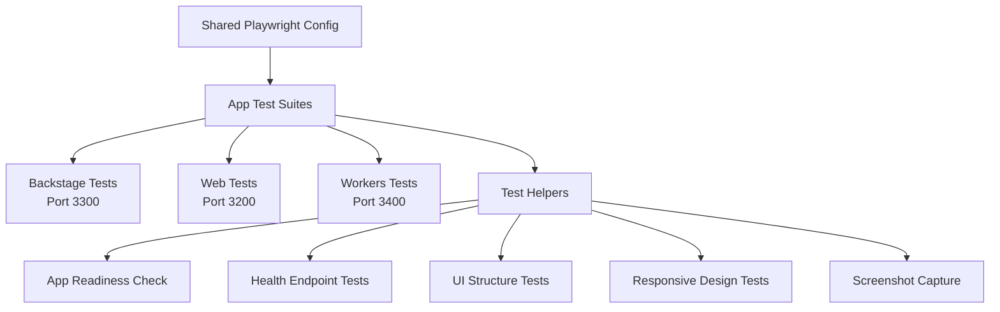

# Integration Testing with Playwright

This document describes the app-level integration test suite using Playwright for end-to-end testing
across the monorepo.

## Overview

Each Next.js app in the monorepo has its own Playwright integration test suite that:

1. **Starts the Next.js app** automatically
2. **Opens a browser** and runs basic UI checks
3. **Verifies the app is running** and accessible
4. **Tests core functionality** without authentication
5. **Takes screenshots** for visual verification
6. **Cleans up** and closes the browser

## Architecture

The integration testing setup uses a shared configuration from `@repo/testing/playwright`:



## Running Tests

### Run All App Integration Tests

```bash
# Run all apps' e2e tests in parallel
pnpm test:e2e

# Run with UI mode for debugging
pnpm test:e2e:ui

# Run in headed mode (see browser)
pnpm test:e2e:headed
```

### Run Individual App Tests

```bash
# Backstage app
cd apps/backstage
pnpm test:e2e

# Web app
cd apps/web
pnpm test:e2e

# Workers app
cd apps/workers
pnpm test:e2e
```

### Development Mode

```bash
# Run with Playwright UI for interactive debugging
pnpm test:e2e:ui

# Run in headed mode to see the browser
pnpm test:e2e:headed

# Run specific test file
playwright test e2e/app.spec.ts

# Run with debug mode (workers app has this)
cd apps/workers
pnpm test:e2e:debug
```

## What Each Test Suite Verifies

### Common Checks (All Apps)

✅ **App Health**: App loads successfully and returns 200 status  
✅ **Basic UI**: HTML structure, no critical JavaScript errors  
✅ **Authentication Routes**: Sign-in, sign-up, API auth endpoints  
✅ **Health Endpoints**: `/health`, `/api/health` if they exist  
✅ **Responsive Design**: Desktop, tablet, mobile viewports  
✅ **Navigation**: Can navigate between pages without errors  
✅ **Screenshots**: Visual verification captures

### Backstage-Specific Checks

✅ **Admin Elements**: Dashboard, navigation, admin-specific components  
✅ **Protected Routes**: Admin pages require authentication  
✅ **User Management**: Admin interface elements

### Web-Specific Checks

✅ **Internationalization**: Locale-based routing (en, es, etc.)  
✅ **Public Pages**: Homepage, about, demo accessible without auth  
✅ **Search Functionality**: Search page and input validation  
✅ **Mobile-First**: Enhanced mobile responsiveness testing

### Workers-Specific Checks

✅ **Workflow Endpoints**: `/api/workflows/*` accessibility  
✅ **Background Services**: QStash integration (if running)  
✅ **Observability**: Monitoring and observability endpoints  
✅ **Webhook Endpoints**: Workflow status webhooks

## Test Configuration

### Shared Playwright Config

All apps use a shared configuration from `@repo/testing/playwright`:

```typescript
import { createAppPlaywrightConfig } from '@repo/testing/playwright';

export default createAppPlaywrightConfig({
  name: 'app-name',
  baseURL: 'http://localhost:PORT',
  port: PORT,
  devCommand: 'pnpm dev',
  appDirectory: '/path/to/app',
});
```

### Browser Support

Tests run on:

- **Chromium** (Desktop Chrome)
- **Firefox** (Desktop Firefox)
- **WebKit** (Desktop Safari)
- **Mobile Chrome** (Pixel 5)
- **Mobile Safari** (iPhone 12)

### Test Helpers

The `AppTestHelpers` class provides common utilities:

```typescript
const helpers = new AppTestHelpers(appConfig);

// Wait for app to be ready
await helpers.waitForApp(page);

// Check app health
await helpers.checkAppHealth(page);

// Verify basic UI structure
await helpers.checkBasicUI(page);

// Test authentication routes
const authResults = await helpers.checkAuthRoutes(page);

// Take screenshots
await helpers.takeScreenshot(page, 'homepage');
```

## CI/CD Integration

### Environment Variables

- `CI=true`: Enables CI-specific settings (retries, parallel workers)
- `PLAYWRIGHT_BASE_URL`: Override base URL for tests

### CI Configuration

In CI environments:

- **Retries**: 2 retries on failure
- **Workers**: Single worker to avoid conflicts
- **Reporter**: HTML + JSON reports
- **Screenshots**: Only on failure
- **Video**: Retained on failure

### GitHub Actions Example

```yaml
name: E2E Tests
on: [push, pull_request]

jobs:
  test:
    runs-on: ubuntu-latest
    steps:
      - uses: actions/checkout@v4

      - uses: pnpm/action-setup@v4
        with:
          version: 10.6.3

      - name: Install dependencies
        run: pnpm install

      - name: Install Playwright browsers
        run: pnpm playwright install --with-deps

      - name: Run E2E tests
        run: pnpm test:e2e
        env:
          CI: true

      - uses: actions/upload-artifact@v4
        if: failure()
        with:
          name: playwright-report
          path: playwright-report/
          retention-days: 7
```

## Writing Integration Tests

### Basic Test Structure

```typescript
import { test, expect } from '@playwright/test';
import { AppTestHelpers } from '@repo/testing/playwright';

const helpers = new AppTestHelpers({
  name: 'my-app',
  baseURL: 'http://localhost:3000',
});

test.describe('My App Integration Tests', () => {
  test('homepage loads successfully', async ({ page }) => {
    await page.goto('/');
    await helpers.waitForApp(page);

    expect(await page.title()).toBe('My App');
    await expect(page.locator('h1')).toHaveText('Welcome');
  });

  test('responsive design works', async ({ page }) => {
    await page.goto('/');

    // Test desktop
    await page.setViewportSize({ width: 1920, height: 1080 });
    await expect(page.locator('.desktop-menu')).toBeVisible();

    // Test mobile
    await page.setViewportSize({ width: 375, height: 667 });
    await expect(page.locator('.mobile-menu')).toBeVisible();
  });
});
```

### Testing User Flows

```typescript
test('user can complete registration', async ({ page }) => {
  await page.goto('/sign-up');

  // Fill registration form
  await page.fill('[name="email"]', 'test@example.com');
  await page.fill('[name="password"]', 'secure-password-123');
  await page.fill('[name="confirmPassword"]', 'secure-password-123');

  // Submit form
  await page.click('[type="submit"]');

  // Verify redirect to dashboard
  await page.waitForURL('/dashboard');
  await expect(page.locator('h1')).toHaveText('Dashboard');
});
```

### Testing API Endpoints

```typescript
test('API health check returns 200', async ({ request }) => {
  const response = await request.get('/api/health');
  expect(response.status()).toBe(200);

  const data = await response.json();
  expect(data).toHaveProperty('status', 'healthy');
});

test('protected API requires authentication', async ({ request }) => {
  const response = await request.get('/api/protected');
  expect(response.status()).toBe(401);
});
```

## Debugging Failed Tests

### Local Debugging

```bash
# Run with UI mode to see test execution
pnpm test:e2e:ui

# Run in headed mode to see browser
pnpm test:e2e:headed

# Run specific test with debug
playwright test e2e/app.spec.ts --debug

# Generate trace for debugging
playwright test --trace on
```

### Common Issues

1. **App Not Starting**: Ensure no other processes on the port

   ```bash
   # Check what's running on the port
   lsof -i :3300  # or 3200, 3400

   # Kill the process
   kill -9 PID
   ```

2. **Health Check Fails**: Verify `/health` endpoint exists or app responds to `/`

3. **JavaScript Errors**: Check browser console and filter out non-critical errors

   ```typescript
   // Filter out common non-critical errors
   page.on('console', (msg) => {
     if (msg.type() === 'error') {
       const text = msg.text();
       if (!text.includes('favicon.ico') && !text.includes('extension')) {
         console.error('Console error:', text);
       }
     }
   });
   ```

4. **Auth Redirects**: Tests expect 200 or 3xx responses for auth routes

5. **Mobile Layout**: Responsive tests may fail if mobile CSS is missing

### Screenshots and Videos

Failed tests automatically capture:

- **Screenshots**: Full page captures on failure
- **Videos**: Browser recording (retained on failure)
- **Traces**: Playwright traces for debugging

Find them in:

- `test-results/` directory in each app
- HTML report: `playwright-report/`

## Best Practices

### Writing Tests

1. **Independent Tests**: Each test should work standalone
2. **No State Sharing**: Tests shouldn't depend on previous test state
3. **Responsive Testing**: Always test multiple viewports
4. **Error Filtering**: Filter out non-critical errors (favicon, extensions)
5. **Soft Assertions**: Use console.warn for optional elements

### Test Organization

```typescript
test.describe('Feature: User Authentication', () => {
  test.beforeEach(async ({ page }) => {
    await page.goto('/');
  });

  test('sign in with valid credentials', async ({ page }) => {
    // Test implementation
  });

  test('sign in with invalid credentials', async ({ page }) => {
    // Test implementation
  });
});
```

### Maintenance

1. **Update Selectors**: Keep selectors up to date with UI changes
2. **Add New Routes**: Test new pages as they're added
3. **Environment Sync**: Ensure test env matches development
4. **Regular Updates**: Run tests regularly to catch regressions

## Extending Tests

### Adding New App Tests

1. Create `playwright.config.ts` using shared config:

   ```typescript
   import { createAppPlaywrightConfig } from '@repo/testing/playwright';

   export default createAppPlaywrightConfig({
     name: 'new-app',
     baseURL: 'http://localhost:3500',
     port: 3500,
     devCommand: 'pnpm dev',
     appDirectory: __dirname,
   });
   ```

2. Add `e2e/` directory with test files

3. Add e2e scripts to `package.json`:

   ```json
   {
     "scripts": {
       "test:e2e": "playwright test",
       "test:e2e:ui": "playwright test --ui",
       "test:e2e:headed": "playwright test --headed"
     }
   }
   ```

4. Update root `package.json` to include new app

### Adding Custom Tests

```typescript
test('custom functionality', async ({ page }) => {
  await page.goto('/custom-page');

  // Test specific functionality
  const button = page.locator('[data-testid="custom-button"]');
  await expect(button).toBeVisible();
  await button.click();

  // Verify result
  await expect(page.locator('.success-message')).toBeVisible();
});
```

### Environment-Specific Tests

```typescript
test.describe.configure({ mode: 'parallel' });

test('production-only feature', async ({ page }) => {
  test.skip(process.env.NODE_ENV !== 'production');
  // Test production-only functionality
});

test('development-only debug panel', async ({ page }) => {
  test.skip(process.env.NODE_ENV === 'production');
  // Test development-only features
});
```

## Troubleshooting

### Database Issues

Workers app tests may need database setup:

```bash
cd apps/workers
pnpm test:setup  # Run setup script
```

### QStash Local Issues

Workers app uses QStash for background jobs:

```bash
# Start QStash dev server manually
npx @upstash/qstash-cli dev
```

### Clear Test Cache

```bash
# Clear Playwright cache
npx playwright uninstall && npx playwright install

# Clear browser cache
rm -rf test-results/ playwright-report/
```

## Advanced Patterns

### Visual Regression Testing

```typescript
test('visual regression', async ({ page }) => {
  await page.goto('/');
  await page.waitForLoadState('networkidle');

  // Take screenshot for comparison
  await expect(page).toHaveScreenshot('homepage.png', {
    fullPage: true,
    animations: 'disabled',
  });
});
```

### Performance Testing

```typescript
test('page loads within performance budget', async ({ page }) => {
  const startTime = Date.now();

  await page.goto('/');
  await page.waitForLoadState('networkidle');

  const loadTime = Date.now() - startTime;
  expect(loadTime).toBeLessThan(3000); // 3 second budget
});
```

### Accessibility Testing

```typescript
test('meets accessibility standards', async ({ page }) => {
  await page.goto('/');

  // Use Playwright's built-in accessibility testing
  const accessibilitySnapshot = await page.accessibility.snapshot();
  expect(accessibilitySnapshot).toBeTruthy();

  // Check for specific a11y attributes
  const buttons = page.locator('button');
  const count = await buttons.count();

  for (let i = 0; i < count; i++) {
    const button = buttons.nth(i);
    const ariaLabel = await button.getAttribute('aria-label');
    const text = await button.textContent();

    expect(ariaLabel || text).toBeTruthy();
  }
});
```

## Summary

Integration testing with Playwright provides comprehensive end-to-end testing for all apps in the
monorepo. The shared configuration and test helpers ensure consistent testing patterns across all
applications while allowing for app-specific customizations.

Key benefits:

- **Automated browser testing** across multiple browsers and devices
- **Visual verification** with screenshots and videos
- **CI/CD integration** with proper reporting and artifacts
- **Debugging tools** for quick issue resolution
- **Extensible architecture** for adding new tests and apps
