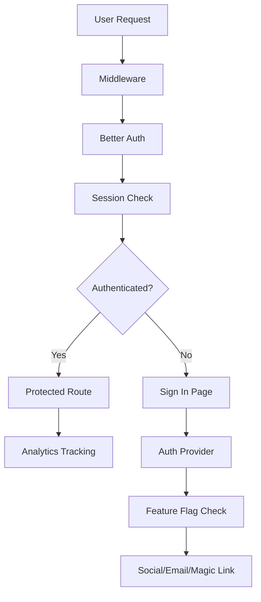
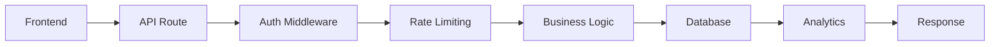
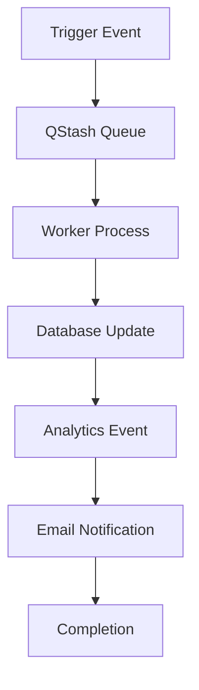

# 🏗️ Architecture Overview

Forge follows a **strict layered architecture** designed to prevent circular dependencies and ensure
clean separation of concerns. Each layer can only depend on packages from lower layers.

## Project Structure

```
forge/
├── apps/                    # Layer 7: Applications
│   ├── web/                # Marketing website (Port 3200)
│   ├── backstage/          # Admin panel (Port 3300)
│   ├── workers/            # Background jobs (Port 3400)
│   ├── storybook/          # Component docs (Port 3700)
│   └── nextra/             # Documentation (Port 3800)
├── packages/               # Layers 1-6: Shared packages
│   ├── typescript-config/  # Layer 1: Foundation
│   ├── eslint-config/      # Layer 1: Foundation
│   ├── database/           # Layer 3: Data
│   ├── auth/               # Layer 5: Business Logic
│   ├── analytics/          # Layer 4: Core Services
│   └── design-system/      # Layer 6: UI
└── infra/                  # Infrastructure as code
```

## Dependency Layers

### Layer 1: Foundation (Core Infrastructure)

No dependencies on other internal packages.

- `@repo/typescript-config` - Shared TypeScript configurations
- `@repo/eslint-config` - ESLint rules and configurations
- `@repo/next-config` - Next.js configuration wrapper

### Layer 2: Core Services

Low-level services that other packages depend on.

- `@repo/testing` - Vitest configuration and test utilities
- `@repo/security` - Security headers and middleware
- `@repo/rate-limit` - API rate limiting
- `@repo/observability` - Sentry error tracking and monitoring

### Layer 3: Data Management

Core data services.

- `@repo/database` - Prisma ORM with PostgreSQL

### Layer 4: Core Business Services

Services implementing core functionality.

- `@repo/analytics` - Multi-provider analytics + Feature Flags
- `@repo/email` - Email templates with React Email and Resend
- `@repo/notifications` - Knock (backend) and Mantine (frontend) notifications

### Layer 5: Business Logic

Higher-level services that compose core services.

- `@repo/auth` - Better Auth with organizations, teams, and API keys
- `@repo/payments` - Stripe integration for subscriptions and credits
- `@repo/orchestration` - Workflow execution and job processing
- `@repo/seo` - SEO metadata and structured data generation
- `@repo/internationalization` - Multi-language support

### Layer 5.5: Specialized Services

Domain-specific services that may depend on multiple business logic packages.

- `@repo/ai` - AI/LLM integrations and utilities
- `@repo/scraping` - Web scraping utilities
- `@repo/storage` - File storage abstraction

### Layer 6: UI Layer

Frontend packages that consume all other services.

- `@repo/design-system` - Composite UI components

### Layer 7: Applications

End-user applications that consume all packages.

## Module System

**CRITICAL**: Forge uses **ESM modules only** (no CommonJS).

### Package Configuration

- **Packages** (`/packages/*`) MUST have `"type": "module"` in package.json
- **Apps** (`/apps/*`) should NOT have `"type": "module"` - Next.js handles ESM automatically

### Import Rules

- All internal imports use `@repo/*` namespace
- Packages are consumed directly from source (no build step required)
- No circular dependencies allowed

### Example Package Structure

```typescript
// packages/auth/package.json
{
  "name": "@repo/auth",
  "type": "module",  // Required for packages
  "exports": {
    ".": "./index.ts",
    "./server": "./server.ts",
    "./client": "./client.ts"
  }
}

// apps/web importing auth package
import { auth } from '@repo/auth/server';
import { signIn } from '@repo/auth/client';
```

## Feature Flag Architecture

Feature flags are integrated into the analytics package to avoid circular dependencies:

```typescript
// In packages - import types only
import type { FLAGS } from '@repo/analytics/types/flags';

// In apps - full functionality
import { useFlag, flag, getAuthFlags } from '@repo/analytics';
```

## Authentication Flow



## Data Flow



## Workflow Architecture



## Key Design Principles

1. **Strict Layering**: Higher layers depend only on lower layers
2. **No Circular Dependencies**: Enforced through architecture and tooling
3. **Feature Flags at App Level**: Packages provide functionality, apps control enablement
4. **Type Safety**: Full TypeScript coverage with strict checking
5. **ESM Only**: Modern module system throughout
6. **Shared Configurations**: Consistent tooling across all packages
7. **Testing First**: Comprehensive test coverage with Vitest
8. **Security by Design**: Rate limiting, authentication, and monitoring built-in

## Port Assignments

- **3100**: Template app
- **3200**: Web marketing site
- **3300**: Backstage admin panel
- **3400**: Workers background jobs
- **3500**: Email template preview
- **3600**: Prisma Studio
- **3700**: Storybook
- **3800**: Documentation (Nextra)

## Secret Management with Doppler

This project uses Doppler for centralized secret management in CI/CD environments. Doppler replaces
local `.env.local` files with a centralized secret management system, while maintaining type-safe
validation with `@t3-oss/env-nextjs` and Zod.

### Doppler Architecture

The monorepo uses a hierarchical Doppler configuration defined in `doppler.yaml`:

- Each app has its own Doppler project (e.g., `forge-app`, `forge-web`)
- Packages with runtime secrets have their own projects (e.g., `forge-database`, `forge-auth`)
- Common secrets can be shared across projects using Doppler's secret referencing

### Project Hierarchy

```
forge-common (shared secrets)
├── DATABASE_URL
├── BETTER_AUTH_SECRET
└── NEXT_PUBLIC_APP_URL

forge-app (inherits from forge-common)
├── STRIPE_SECRET_KEY
├── STRIPE_WEBHOOK_SECRET
└── LIVEBLOCKS_SECRET

forge-web (inherits from forge-common)
├── RESEND_TOKEN
└── GA_MEASUREMENT_ID
```

### Environment Variable Validation

Our existing validation system remains unchanged. Each app's `env.ts` file still validates all
environment variables:

```typescript
// apps/web/env.ts
import { createEnv } from '@t3-oss/env-nextjs';
import { keys as auth } from '@repo/auth/keys';
import { keys as database } from '@repo/database/keys';

export const env = createEnv({
  extends: [auth(), database()],
  // ... app-specific validation
});
```

The only change is that Doppler provides these variables at runtime instead of reading from
`.env.local`.

### Local Development

- **`.env.local` files**: For local development (no Doppler required)
- **Doppler**: For CI/CD and production environments
- **Setup**: Run `pnpm doppler:pull:all` to download all secrets to `.env.local` files

### Build Options

- `pnpm build` - Production build with Doppler (for CI/CD)
- `pnpm build:local` - Local build using `.env.local` files

### Security Best Practices

1. **Service Tokens**: Use scoped service tokens for CI/CD with minimal permissions
2. **Access Control**: Limit developer access to production secrets
3. **Rotation**: Regularly rotate sensitive credentials
4. **Audit Logs**: Monitor secret access through Doppler's audit logs

## Next Steps

- [Get Started](/get-started) - Set up your development environment
- [Packages](/packages) - Learn about individual packages
- [Authentication](/auth) - Understand the auth system
- [Analytics](/analytics) - Configure feature flags and tracking
- [Deployment](/deployment) - Deploy your applications
