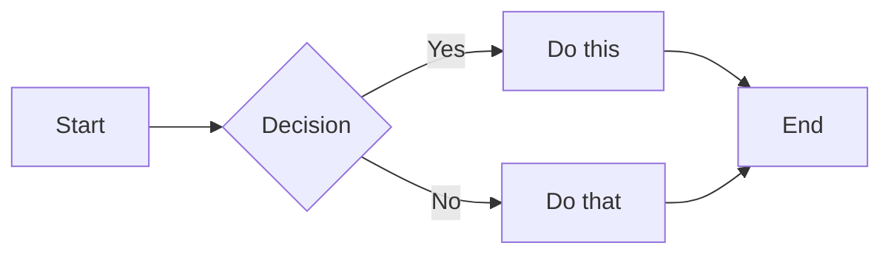

import { Callout, Cards, Steps, Tabs, FileTree, Bleed } from 'nextra/components';

# Nextra 4 Complete Example

This page demonstrates all Nextra 4 features and components in a single reference.

## 1. Callouts

<Callout>**Default callout** - Use for general information.</Callout>

<Callout type="info" emoji="ℹ️">
  **Info callout** - For additional context or tips.
</Callout>

<Callout type="warning" emoji="⚠️">
  **Warning callout** - Alert users to important information.
</Callout>

<Callout type="error" emoji="🚨">
  **Error callout** - Highlight critical issues.
</Callout>

## 2. Cards Component

<Cards>
  <Cards.Card title="First Card" icon="📚" href="#">
    Cards display content in a grid layout
  </Cards.Card>
  <Cards.Card title="Second Card" icon="🚀" href="#">
    Perfect for feature showcases
  </Cards.Card>
  <Cards.Card title="Third Card" icon="⚡" href="#">
    Responsive and accessible
  </Cards.Card>
</Cards>

## 3. Steps Component

<Steps>
### Install Nextra
```bash
npm install nextra nextra-theme-docs
```

### Configure Next.js

Create your `next.config.ts` file

### Start Writing

Create MDX files in your content directory

</Steps>

## 4. Tabs Component

<Tabs items={['npm', 'yarn', 'pnpm', 'bun']}>
  <Tabs.Tab>```bash npm install nextra ```</Tabs.Tab>
  <Tabs.Tab>```bash yarn add nextra ```</Tabs.Tab>
  <Tabs.Tab>```bash pnpm add nextra ```</Tabs.Tab>
  <Tabs.Tab>```bash bun add nextra ```</Tabs.Tab>
</Tabs>

## 5. File Tree Component

<FileTree>
  <FileTree.Folder name="app" defaultOpen>
    <FileTree.Folder name="[lang]">
      <FileTree.File name="layout.tsx" />
      <FileTree.Folder name="[[...mdxPath]]">
        <FileTree.File name="page.tsx" active />
      </FileTree.Folder>
    </FileTree.Folder>
  </FileTree.Folder>
  <FileTree.Folder name="content">
    <FileTree.File name="_meta.ts" />
    <FileTree.File name="index.mdx" />
  </FileTree.Folder>
</FileTree>

## 6. Code Blocks

### Basic Syntax Highlighting

```typescript filename="example.ts"
interface User {
  name: string;
  email: string;
}

const greeting = (user: User): string => {
  return `Hello, ${user.name}!`;
};
```

### Line Highlighting

```tsx {2,5-7} filename="app.tsx"
import React from 'react';
// This line is highlighted

function App() {
  // These lines
  // are also
  // highlighted
  return <div>Hello</div>;
}
```

### Line Numbers

```python showLineNumbers filename="script.py"
def fibonacci(n):
    if n <= 0:
        return []
    elif n == 1:
        return [0]
    else:
        fib = [0, 1]
        for i in range(2, n):
            fib.append(fib[-1] + fib[-2])
        return fib
```

### Diff View

```diff
- const old = 'removed line'
+ const new = 'added line'
  const unchanged = 'stays the same'
```

### Copy Button

```bash copy
git clone https://github.com/shuding/nextra.git
cd nextra
pnpm install
```

## 7. Tables

| Feature   | Description          | Status                |
| --------- | -------------------- | --------------------- |
| MDX 3     | Latest MDX support   | ✅ Stable             |
| i18n      | Internationalization | ✅ Built-in           |
| Search    | Full-text search     | ✅ Multiple providers |
| Dark Mode | Theme switching      | ✅ Automatic          |

## 8. Task Lists

- [x] Set up Nextra
- [x] Create documentation structure
- [ ] Write content
- [ ] Deploy to production

## 9. Bleed Component

<Bleed>
  <div
    style={{
      background: 'linear-gradient(135deg, #667eea 0%, #764ba2 100%)',
      padding: '3rem',
      textAlign: 'center',
      color: 'white',
    }}
  >
    This content extends beyond the normal content width
  </div>
</Bleed>

## 10. Math Expressions

Inline math: $E = mc^2$

Block math equation:

$$
\int_{-\infty}^{\infty} e^{-x^2} dx = \sqrt{\pi}
$$

## 11. Mermaid Diagrams



## 12. Footnotes

This is a statement with a footnote[^1]. Here's another one[^2].

[^1]: First footnote content

[^2]: Second footnote with [a link](https://nextra.site)

## 13. Details/Accordion

<details>
  <summary>Click to expand this section</summary>
  Hidden content that's revealed when clicked. ```js // Can include code blocks console.log('Hidden
  code') ```
</details>

## 14. Keyboard Shortcuts

- Press <kbd>⌘</kbd> + <kbd>K</kbd> for search
- Press <kbd>⌘</kbd> + <kbd>⇧</kbd> + <kbd>P</kbd> for command palette

## 15. Links

- [Internal link to home](/)
- [External link](https://nextra.site)
- <a href="https://example.com/file.pdf" download>
    Download link
  </a>
- <a href="https://github.com" target="_blank">
    Open in new tab
  </a>

## 16. Images

 _Image caption text_

## 17. Blockquotes

> This is a blockquote. It can contain **markdown** and even `code`.
>
> — Citation Source

## 18. Horizontal Rule

Content above

---

Content below

## 19. Lists

### Unordered List

- First item
  - Nested item
  - Another nested item
- Second item
- Third item

### Ordered List

1. First step
   1. Sub-step A
   2. Sub-step B
2. Second step
3. Third step

## 20. Inline Elements

- **Bold text**
- _Italic text_
- **_Bold and italic_**
- `inline code`
- ~~Strikethrough~~
- <mark>Highlighted text</mark>
- Subscript: H<sub>2</sub>O
- Superscript: X<sup>2</sup>

## 21. Emojis

You can use emojis directly: 🎉 🚀 💡 ⚡ 🔥

## 22. HTML Elements

<div style={{ padding: '1rem', border: '2px solid #e2e8f0', borderRadius: '8px' }}>
  <p>You can use HTML elements with inline styles</p>
  <div
    style={{
      background: '#3182ce',
      color: 'white',
      padding: '0.5rem 1rem',
      borderRadius: '4px',
      display: 'inline-block',
    }}
  >
    Styled Element
  </div>
</div>

## 23. Badges


## 24. YouTube Embeds

<iframe
  width="100%"
  height="430"
  src="https://www.youtube.com/embed/dQw4w9WgXcQ"
  frameBorder="0"
  allow="autoplay; encrypted-media"
  allowFullScreen
/>

## 25. Custom Components

You can import and use React components:

export const CustomBadge = ({ children }) => (
  <span
    style={{
      background: '#8b5cf6',
      color: 'white',
      padding: '4px 12px',
      borderRadius: '6px',
      fontSize: '14px',
      fontWeight: '500',
    }}
  >
    {children}
  </span>
);

<CustomBadge>Custom Badge Component</CustomBadge>

---

This example covers all major Nextra 4 features. Use it as a reference when building your
documentation!
