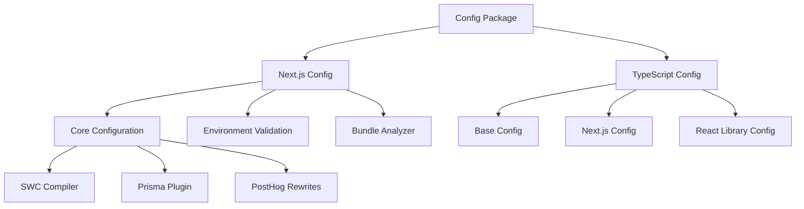

# Config Package

Comprehensive configuration system providing **Next.js optimization**, **TypeScript presets**, and
**environment validation** for the monorepo.

## Overview

The config package provides a dual-purpose configuration system:

1. **Next.js Configuration** (`@repo/config/next`): Production-optimized Next.js settings with SWC,
   bundle analysis, and PostHog integration
2. **TypeScript Configuration** (`@repo/config/typescript`): Standardized TypeScript presets for
   different contexts (base, Next.js, React libraries)

## Architecture



## Installation

```bash
pnpm add @repo/config
```

## Next.js Configuration

### Core Configuration

The Next.js config provides production-optimized settings with SWC compilation:

```typescript
import config from '@repo/config/next';

export default config({
  // Your custom config will be merged
});
```

### Features

#### 1. SWC Optimization

```typescript
experimental: {
  typedRoutes: true,
  forceSwcTransforms: true, // Force SWC even if Babel config exists
  optimizePackageImports: ['@mantine/core', '@mantine/hooks'],
}
```

#### 2. Production Compiler Settings

```typescript
compiler: {
  // Remove properties in production
  reactRemoveProperties: process.env.NODE_ENV === 'production',

  // Remove console logs except errors/warnings
  removeConsole: process.env.NODE_ENV === 'production'
    ? { exclude: ['error', 'warn'] }
    : false,
}
```

#### 3. Image Optimization

```typescript
images: {
  formats: ['image/avif', 'image/webp'],
  remotePatterns: [], // Add your domains here
}
```

#### 4. PostHog Proxy Configuration

Built-in rewrites for PostHog analytics to avoid ad blockers:

```typescript
async rewrites() {
  return {
    beforeFiles: [
      {
        source: '/ingest/static/:path*',
        destination: 'https://us-assets.i.posthog.com/static/:path*',
      },
      {
        source: '/ingest/:path*',
        destination: 'https://us.i.posthog.com/:path*',
      },
      {
        source: '/ingest/decide',
        destination: 'https://us.i.posthog.com/decide',
      },
    ],
  };
}
```

#### 5. Prisma Monorepo Support

Automatic Prisma client handling for monorepos:

```typescript
webpack(config, { isServer }) {
  if (isServer) {
    config.plugins.push(new PrismaPlugin());
  }

  // Suppress OpenTelemetry warnings
  config.ignoreWarnings = [
    { module: /@opentelemetry\/instrumentation/ },
    { module: /require-in-the-middle/ }
  ];

  return config;
}
```

#### 6. Bundle Analysis

Optional bundle analyzer integration:

```typescript
import { withAnalyzer } from '@repo/config/next';

const config = {
  // Your config
};

// Enable with ANALYZE=true
export default process.env.ANALYZE === 'true' ? withAnalyzer(config) : config;
```

### Environment Validation

The package includes T3 Env validation for Next.js apps:

```typescript
import { keys } from '@repo/config/next/keys';

const env = keys();

// Validated environment variables:
// - NEXT_PUBLIC_APP_URL (required in production)
// - NEXT_PUBLIC_WEB_URL (required in production)
// - NEXT_PUBLIC_API_URL (optional)
// - NEXT_PUBLIC_DOCS_URL (optional)
// - ANALYZE (optional)
// - NEXT_RUNTIME (optional: 'nodejs' | 'edge')
```

### Usage Patterns

#### Basic Usage

```typescript
// next.config.ts
import config from '@repo/config/next';

export default config({
  // Merged with base config
  images: {
    remotePatterns: [{ hostname: 'images.example.com' }],
  },
});
```

#### With Bundle Analysis

```typescript
// next.config.ts
import baseConfig, { withAnalyzer } from '@repo/config/next';

const config = {
  ...baseConfig,
  // Your custom config
};

export default process.env.ANALYZE === 'true' ? withAnalyzer(config) : config;
```

#### With Environment Validation

```typescript
// app/layout.tsx or env.ts
import { keys } from '@repo/config/next/keys';

const env = keys();

export default function RootLayout() {
  return (
    <html>
      <body>
        {/* env.NEXT_PUBLIC_APP_URL is validated */}
        <a href={env.NEXT_PUBLIC_APP_URL}>App</a>
      </body>
    </html>
  );
}
```

## TypeScript Configuration

### Available Presets

The package provides four TypeScript configuration presets:

#### 1. Base Configuration (`base.json`)

Core TypeScript settings for all projects:

```json
{
  "extends": "@repo/config/typescript/base.json"
}
```

**Features**:

- ES2022 target with ESNext modules
- Strict type checking enabled
- Module resolution: bundler
- Declaration maps for better IDE support
- Isolated modules for faster builds

#### 2. Next.js Configuration (`nextjs.json`)

Extends base with Next.js specific settings:

```json
{
  "extends": "@repo/config/typescript/nextjs.json"
}
```

**Features**:

- Next.js plugin integration
- JSX preserve mode
- Path aliases configured (`@/*`, `@repo/*`)
- No emit (Next.js handles compilation)
- Allow JS files

#### 3. React Library Configuration (`react-library.json`)

For building React component libraries:

```json
{
  "extends": "@repo/config/typescript/react-library.json"
}
```

**Features**:

- React JSX transform
- Suitable for publishing packages
- Declaration generation enabled

### TypeScript Compiler Options

#### Base Settings

```typescript
{
  "compilerOptions": {
    // Modern JavaScript
    "target": "ES2022",
    "lib": ["es2022", "DOM", "DOM.Iterable"],
    "module": "ESNext",
    "moduleResolution": "bundler",

    // Type Safety
    "strict": true,
    "strictNullChecks": true,
    "forceConsistentCasingInFileNames": true,
    "isolatedModules": true,

    // Interop
    "esModuleInterop": true,
    "resolveJsonModule": true,
    "allowSyntheticDefaultImports": true,

    // Output
    "declaration": true,
    "declarationMap": true,
    "skipLibCheck": true,
    "incremental": false
  }
}
```

### Usage Examples

#### Next.js App

```json
// tsconfig.json
{
  "extends": "@repo/config/typescript/nextjs.json",
  "compilerOptions": {
    "baseUrl": ".",
    "paths": {
      "@/*": ["./src/*"],
      "@repo/*": ["../../packages/*"]
    }
  },
  "include": ["next-env.d.ts", "**/*.ts", "**/*.tsx"],
  "exclude": ["node_modules"]
}
```

#### React Component Library

```json
// tsconfig.json
{
  "extends": "@repo/config/typescript/react-library.json",
  "compilerOptions": {
    "outDir": "./dist",
    "rootDir": "./src"
  },
  "include": ["src"],
  "exclude": ["node_modules", "dist", "**/*.test.tsx"]
}
```

## Advanced Features

### Custom Next.js Plugins

Add custom webpack plugins while preserving base configuration:

```typescript
import config from '@repo/config/next';

export default {
  ...config,
  webpack(webpackConfig, options) {
    // Call base webpack config first
    const modifiedConfig = config.webpack?.(webpackConfig, options) || webpackConfig;

    // Add your custom plugins
    modifiedConfig.plugins.push(new MyCustomPlugin());

    return modifiedConfig;
  },
};
```

### Environment-Specific TypeScript

Use different configs for development and production:

```json
// tsconfig.json
{
  "extends": "@repo/config/typescript/nextjs.json",
  "compilerOptions": {
    "strict": true
  }
}

// tsconfig.prod.json
{
  "extends": "./tsconfig.json",
  "compilerOptions": {
    "removeComments": true,
    "sourceMap": false
  }
}
```

### PostHog Configuration

The built-in PostHog rewrites support custom endpoints:

```typescript
import baseConfig from '@repo/config/next';

export default {
  ...baseConfig,
  async rewrites() {
    const baseRewrites = await baseConfig.rewrites();

    return {
      ...baseRewrites,
      beforeFiles: [
        ...baseRewrites.beforeFiles,
        // Add custom rewrites
        {
          source: '/api/telemetry/:path*',
          destination: 'https://custom-endpoint.com/:path*',
        },
      ],
    };
  },
};
```

## Best Practices

### 1. Next.js Configuration

- **Always extend base config**: Don't replace it entirely
- **Use environment variables**: Leverage the built-in validation
- **Enable bundle analysis**: Use `ANALYZE=true` for optimization
- **Keep custom webpack minimal**: Preserve base optimizations

### 2. TypeScript Configuration

- **Choose appropriate preset**: Use the most specific one for your use case
- **Don't override module settings**: Unless you have specific requirements
- **Keep strict mode enabled**: For better type safety
- **Use path aliases consistently**: Follow monorepo conventions

### 3. Monorepo Integration

```typescript
// Root tsconfig.json
{
  "files": [],
  "references": [
    { "path": "./apps/web" },
    { "path": "./apps/backstage" },
    { "path": "./packages/auth" },
    // ... other packages
  ]
}

// Package tsconfig.json
{
  "extends": "@repo/config/typescript/base.json",
  "compilerOptions": {
    "composite": true,
    "rootDir": "src",
    "outDir": "dist"
  }
}
```

## Troubleshooting

### Common Issues

1. **Module Resolution Errors**

   ```json
   // Ensure moduleResolution matches your bundler
   {
     "compilerOptions": {
       "moduleResolution": "bundler" // for Next.js/Vite
     }
   }
   ```

2. **Prisma Client Issues**

   - The PrismaPlugin is automatically included for server builds
   - Ensure `@prisma/client` is installed in your app

3. **PostHog Rewrites Not Working**

   - Check `skipTrailingSlashRedirect: true` is set
   - Verify your PostHog initialization uses `/ingest` endpoints

4. **TypeScript Performance**
   - Use `skipLibCheck: true` (included by default)
   - Enable `incremental: true` for faster rebuilds
   - Exclude test files from production builds

## Configuration Options Summary

### Next.js Config Exports

- `config` - Base Next.js configuration object
- `withAnalyzer` - HOC for bundle analysis

### TypeScript Presets

- `@repo/config/typescript/base.json` - Universal base settings
- `@repo/config/typescript/nextjs.json` - Next.js applications
- `@repo/config/typescript/react-library.json` - React packages

### Environment Variables (via keys)

- `NEXT_PUBLIC_APP_URL` - Application URL (required in production)
- `NEXT_PUBLIC_WEB_URL` - Marketing site URL (required in production)
- `NEXT_PUBLIC_API_URL` - API endpoint (optional)
- `NEXT_PUBLIC_DOCS_URL` - Documentation URL (optional)
- `ANALYZE` - Enable bundle analysis (optional)
- `NEXT_RUNTIME` - Deployment runtime (optional)

This configuration package provides a robust foundation for Next.js applications and TypeScript
projects with production-ready optimizations and consistent settings across the monorepo.
