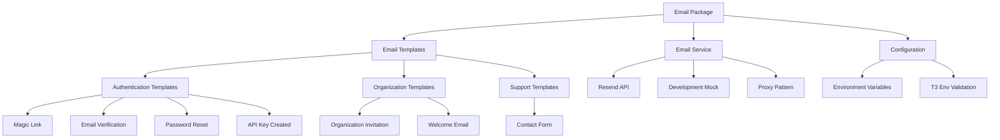

# Email Package

Enterprise email system with **React Email** templates, **Resend** delivery service, and
comprehensive transactional email workflows.

## Overview

The email package provides a complete, production-ready email solution for authentication,
organization management, and user communication:

- **7 Professional Templates**: Complete authentication and organization workflow coverage
- **React Email Framework**: Modern, responsive templates built with React components
- **Resend Integration**: Enterprise email delivery with high deliverability rates
- **Security-First Design**: Built-in security warnings, expiration notices, and best practices
- **Graceful Degradation**: Mock email service for development environments
- **Type-Safe Implementation**: Full TypeScript support with comprehensive interfaces
- **Accessibility Focused**: Preview text, fallback links, and proper content hierarchy

## Architecture



## Installation

```bash
pnpm add @repo/email
```

## Configuration

### Environment Variables

```typescript
// .env.local (development)
RESEND_FROM=noreply@yourdomain.com
RESEND_TOKEN=re_your_resend_api_token

// .env.production (required in production)
RESEND_FROM=noreply@yourdomain.com # Must be valid email
RESEND_TOKEN=re_your_resend_api_token # Must start with 're_'
```

### T3 Env Validation

The package uses T3 Env with dynamic validation based on environment:

```typescript
// Automatic validation
const { RESEND_FROM, RESEND_TOKEN } = keys();

// Production: Required and validated
// Development: Optional with graceful degradation
```

## Email Templates

### 1. Authentication Templates

#### Magic Link Authentication

```typescript
import { sendMagicLinkEmail, MagicLinkTemplate } from '@repo/email';

// Send magic link email
await sendMagicLinkEmail({
  email: 'user@example.com',
  magicLink: 'https://yourapp.com/auth/verify?token=abc123',
  name: 'John Doe', // Optional
  expiresIn: '20 minutes', // Default: '20 minutes'
});

// Template component for preview/testing
<MagicLinkTemplate
  email="user@example.com"
  magicLink="https://yourapp.com/auth/verify?token=abc123"
  name="John Doe"
  expiresIn="20 minutes"
/>
```

**Features**:

- 20-minute default expiration with customizable duration
- Security warnings about device/browser verification
- Fallback for users without names
- "Ignore if not you" security notice

#### Email Verification

```typescript
import { sendVerificationEmail, VerificationTemplate } from '@repo/email';

await sendVerificationEmail({
  email: 'user@example.com',
  verificationLink: 'https://yourapp.com/verify?token=abc123',
  name: 'John Doe', // Optional
});
```

**Features**:

- 24-hour expiration window
- Registration completion workflow guidance
- Clear call-to-action button

#### Password Reset

```typescript
import { sendPasswordResetEmail, PasswordResetTemplate } from '@repo/email';

await sendPasswordResetEmail({
  email: 'user@example.com',
  resetLink: 'https://yourapp.com/reset?token=abc123',
  name: 'John Doe', // Optional
});
```

**Features**:

- 1-hour expiration notice
- Security reassurance for non-requesters
- Device security reminders

### 2. Organization Templates

#### Organization Invitation

```typescript
import { sendOrganizationInvitationEmail, OrganizationInvitationTemplate } from '@repo/email';

await sendOrganizationInvitationEmail({
  email: 'newmember@example.com',
  inviteLink: 'https://yourapp.com/invite?token=abc123',
  organizationName: 'Acme Corporation',
  inviterName: 'Jane Smith', // Optional
  inviterEmail: 'jane@acme.com',
  expiresIn: '48 hours', // Default: '48 hours'
});
```

**Features**:

- Clear inviter identification with fallback to email
- Organization context and branding
- 48-hour default expiration
- Fallback plaintext URL for accessibility

#### Welcome Email

```typescript
import { sendWelcomeEmail, WelcomeTemplate } from '@repo/email';

await sendWelcomeEmail({
  email: 'user@example.com',
  name: 'John Doe',
  organizationName: 'Acme Corporation',
  dashboardUrl: 'https://yourapp.com/dashboard', // Optional
});
```

**Features**:

- Organization-specific branding
- Onboarding checklist with next steps
- Dashboard link for immediate access
- Personalized welcome message

### 3. Security & Support Templates

#### API Key Created Notification

```typescript
import { sendApiKeyCreatedEmail, ApiKeyCreatedTemplate } from '@repo/email';

await sendApiKeyCreatedEmail({
  email: 'user@example.com',
  name: 'John Doe',
  apiKeyName: 'Production API Key',
  apiKeyId: 'ak_1234567890',
  dashboardUrl: 'https://yourapp.com/api-keys', // Optional
});
```

**Features**:

- Security-focused design with warning alerts
- API key details display with styled code blocks
- Security best practices and reminders
- Dashboard link for key management

#### Contact Form Submission

```typescript
import { sendContactEmail, ContactTemplate } from '@repo/email';

await sendContactEmail({
  email: 'user@example.com',
  name: 'John Doe',
  message: 'I need help with my account settings.',
  to: 'support@yourcompany.com', // Optional, defaults to 'contact@example.com'
});
```

**Features**:

- Clean message display for support teams
- Contact information preservation
- Internal routing support

## Design System

### Consistent Visual Architecture

All templates share a unified design language:

```typescript
// Color Scheme: Zinc-based palette
- Background: zinc-50
- Container: zinc-200 border with white interior
- Text: zinc-500 (secondary), zinc-950 (primary)
- Accents: Consistent across all templates

// Layout Structure
<Tailwind>
  <Html>
    <Head />
    <Preview>{preview text}</Preview>
    <Body className="bg-zinc-50 font-sans">
      <Container className="mx-auto py-12">
        <Section className="mt-8 rounded-md bg-zinc-200 p-px">
          <Section className="rounded-[5px] bg-white p-8">
            {/* Template content */}
          </Section>
        </Section>
      </Container>
    </Body>
  </Html>
</Tailwind>
```

### Typography & Spacing

- **Headers**: 2xl font size with proper hierarchy
- **Body Text**: Sans-serif with readable line height
- **Buttons**: Consistent padding and border radius
- **Spacing**: 8-unit grid system (p-8, py-12, etc.)

### Component Usage

React Email components utilized across templates:

```typescript
import {
  Body,
  Button,
  Code, // For API key display
  Container,
  Head,
  Hr,
  Html,
  Preview,
  Section,
  Tailwind,
  Text,
} from '@react-email/components';
```

## Advanced Features

### Development Mode

The package provides graceful degradation when Resend is not configured:

```typescript
// Proxy pattern for development
export const resend = new Proxy({ emails: {} } as Resend, {
  get(_, prop) {
    const { RESEND_TOKEN } = keys();

    if (!RESEND_TOKEN) {
      console.warn('Resend email service is disabled: Missing RESEND_TOKEN');
      return {
        create: () => Promise.resolve({ data: { id: 'mock-email-id' }, error: null }),
        send: () => Promise.resolve({ data: { id: 'mock-email-id' }, error: null }),
      };
    }

    // Initialize real Resend instance
    if (!resendInstance) {
      resendInstance = new Resend(RESEND_TOKEN);
    }

    return resendInstance[prop as keyof Resend];
  },
});
```

### Error Handling

Comprehensive error handling with meaningful messages:

```typescript
export const sendMagicLinkEmail = async (data: MagicLinkData) => {
  try {
    const html = render(MagicLinkTemplate(data));
    const result = await resend.emails.send({
      from: RESEND_FROM || 'noreply@example.com',
      html,
      subject: 'Your magic link to sign in',
      to: data.email,
    });
    return result;
  } catch (error) {
    console.error('Failed to send magic link email:', error);
    throw new Error('Failed to send magic link email');
  }
};
```

### Template Testing & Development

Export templates for testing and preview:

```typescript
// All templates exported for testing
export {
  ApiKeyCreatedTemplate,
  ContactTemplate,
  MagicLinkTemplate,
  OrganizationInvitationTemplate,
  PasswordResetTemplate,
  VerificationTemplate,
  WelcomeTemplate,
};

// Example usage in Storybook or preview
import { MagicLinkTemplate } from '@repo/email';

export default function EmailPreview() {
  return (
    <MagicLinkTemplate
      email="demo@example.com"
      magicLink="https://example.com/verify"
      name="Demo User"
      expiresIn="20 minutes"
    />
  );
}
```

## Security Considerations

### Built-in Security Features

1. **No Sensitive Data**: Templates explicitly avoid including actual API keys or secrets
2. **Expiration Notices**: All time-sensitive emails include clear expiration times
3. **Security Warnings**: Templates include "ignore if not you" text
4. **Device Binding**: Magic link mentions device/browser security
5. **Validation**: T3 Env validates email formats and API token formats

### Best Practices

```typescript
// Secure email sending
await sendApiKeyCreatedEmail({
  email: user.email,
  name: user.name,
  apiKeyName: apiKey.name,
  apiKeyId: apiKey.id, // ID only, never the actual key
  dashboardUrl: process.env.DASHBOARD_URL,
});

// Never include sensitive data
❌ apiKeyValue: apiKey.secret  // Never do this
✅ apiKeyId: apiKey.id        // Safe to include
```

## Accessibility Features

### Screen Reader Support

- **Preview Text**: Descriptive preview text for all templates
- **Semantic Structure**: Proper heading hierarchy and content organization
- **Alt Text**: Images include appropriate alt attributes
- **Fallback Links**: Plaintext URLs included where appropriate

### Email Client Compatibility

```typescript
// Responsive design patterns
<Container className="mx-auto py-12 px-4">
  <Section className="max-w-md mx-auto">
    {/* Content adapts to various email clients */}
  </Section>
</Container>
```

## Usage Patterns

### Integration with Better Auth

```typescript
// In your auth flow
import { sendMagicLinkEmail, sendVerificationEmail } from '@repo/email';

export async function handleMagicLinkRequest(email: string) {
  const token = await generateMagicLinkToken(email);
  const magicLink = `${process.env.BASE_URL}/auth/verify?token=${token}`;

  await sendMagicLinkEmail({
    email,
    magicLink,
    expiresIn: '20 minutes',
  });
}

export async function handleUserRegistration(user: User) {
  const verificationToken = await generateVerificationToken(user.email);
  const verificationLink = `${process.env.BASE_URL}/verify?token=${verificationToken}`;

  await sendVerificationEmail({
    email: user.email,
    name: user.name,
    verificationLink,
  });
}
```

### Organization Workflows

```typescript
// Organization invitation flow
import { sendOrganizationInvitationEmail, sendWelcomeEmail } from '@repo/email';

export async function inviteToOrganization({ email, organizationId, inviterId }: InviteData) {
  const invitation = await createInvitation({ email, organizationId, inviterId });
  const inviteLink = `${process.env.BASE_URL}/invite/accept?token=${invitation.token}`;

  await sendOrganizationInvitationEmail({
    email,
    inviteLink,
    organizationName: invitation.organization.name,
    inviterName: invitation.inviter.name,
    inviterEmail: invitation.inviter.email,
    expiresIn: '48 hours',
  });
}

export async function handleOrganizationCreated(organization: Organization, creator: User) {
  await sendWelcomeEmail({
    email: creator.email,
    name: creator.name,
    organizationName: organization.name,
    dashboardUrl: `${process.env.BASE_URL}/dashboard`,
  });
}
```

## Testing

### Template Testing

```typescript
import { render } from '@react-email/render';
import { MagicLinkTemplate } from '@repo/email';

test('magic link template renders correctly', () => {
  const html = render(
    MagicLinkTemplate({
      email: 'test@example.com',
      magicLink: 'https://example.com/verify?token=test',
      name: 'Test User',
      expiresIn: '20 minutes',
    })
  );

  expect(html).toContain('Your magic link to sign in');
  expect(html).toContain('test@example.com');
  expect(html).toContain('20 minutes');
});
```

### Email Service Testing

```typescript
import { vi } from 'vitest';
import { sendMagicLinkEmail } from '@repo/email';

// Mock Resend in tests
vi.mock('resend', () => ({
  Resend: vi.fn().mockImplementation(() => ({
    emails: {
      send: vi.fn().mockResolvedValue({ data: { id: 'test-email-id' }, error: null }),
    },
  })),
}));

test('sends magic link email', async () => {
  const result = await sendMagicLinkEmail({
    email: 'test@example.com',
    magicLink: 'https://example.com/verify',
    name: 'Test User',
  });

  expect(result.data?.id).toBe('test-email-id');
});
```

## Configuration Options

### Custom Sender Addresses

```typescript
// Environment-specific sender addresses
RESEND_FROM=noreply@yourdomain.com        # Production
RESEND_FROM=dev+noreply@yourdomain.com    # Development
RESEND_FROM=staging+noreply@yourdomain.com # Staging
```

### Custom Expiration Times

```typescript
// Override default expiration times
await sendMagicLinkEmail({
  email: 'user@example.com',
  magicLink: 'https://example.com/verify',
  expiresIn: '1 hour', // Override default 20 minutes
});

await sendOrganizationInvitationEmail({
  email: 'user@example.com',
  inviteLink: 'https://example.com/invite',
  organizationName: 'Acme Corp',
  inviterEmail: 'admin@acme.com',
  expiresIn: '7 days', // Override default 48 hours
});
```

### Custom Dashboard URLs

```typescript
// Environment-specific dashboard URLs
await sendWelcomeEmail({
  email: 'user@example.com',
  name: 'John Doe',
  organizationName: 'Acme Corp',
  dashboardUrl: process.env.DASHBOARD_URL || 'https://yourapp.com/dashboard',
});
```

## Enterprise Features Summary

The email package provides a comprehensive, enterprise-ready email solution with:

- **Complete Template Library** covering authentication, organization management, and support
  workflows
- **Security-First Design** with built-in warnings, expiration notices, and best practices
- **Production-Ready Integration** with Resend API and graceful development fallbacks
- **Accessibility & Compatibility** across email clients with responsive design
- **Type-Safe Implementation** with comprehensive TypeScript interfaces
- **Consistent Design System** with professional styling and branding options
- **Developer Experience** with template exports, error handling, and testing utilities

This makes it ideal for production applications requiring reliable, professional transactional
emails with minimal setup and maximum security.
