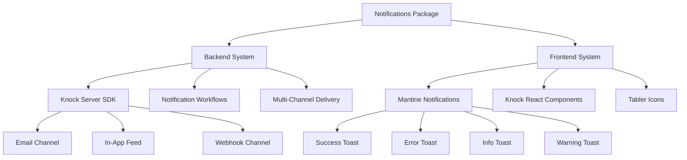

# Notifications Package

Dual notification system combining **Knock** for backend transactional notifications and **Mantine**
for frontend UI notifications.

## Overview

The notifications package provides a comprehensive notification solution with two complementary
systems:

- **Backend Notifications** (Knock): Server-side transactional notifications for email, in-app
  feeds, and webhooks
- **Frontend Notifications** (Mantine): Client-side UI notifications for immediate user feedback
- **Graceful Degradation**: Both systems work independently with optional configuration
- **Type-Safe**: Full TypeScript support with environment validation
- **React Components**: Pre-built notification feed UI with real-time updates
- **Consistent Styling**: Unified design across all notification types

## Architecture



## Installation

```bash
pnpm add @repo/notifications
```

## Configuration

### Environment Variables

All environment variables are optional - the package gracefully degrades when not configured:

```typescript
// .env.local

// Backend (Knock) - Server-side only
KNOCK_SECRET_API_KEY = sk_your_secret_key;

// Frontend (Knock) - Client-side
NEXT_PUBLIC_KNOCK_API_KEY = pk_your_public_key;
NEXT_PUBLIC_KNOCK_FEED_CHANNEL_ID = your_feed_channel_id;
```

### Type-Safe Environment

The package uses T3 Env for validation:

```typescript
import { keys } from '@repo/notifications/keys';

const env = keys();
// All keys are optional with proper types
```

## Frontend Notifications (Mantine)

### Basic Usage

```typescript
import { notify } from '@repo/notifications/mantine-notifications';

// Success notification
notify.success('User created successfully');

// Error notification with title
notify.error('Failed to save changes', {
  title: 'Database Error',
});

// Info notification with custom duration
notify.info('Processing your request...', {
  autoClose: 10000, // 10 seconds
});

// Warning notification
notify.warning('Your session will expire in 5 minutes');
```

### Advanced Options

```typescript
// Custom notification with all options
notify.custom({
  title: 'Custom Notification',
  message: 'With custom styling and behavior',
  color: 'violet',
  icon: <CustomIcon />,
  autoClose: false, // Requires manual dismissal
  withCloseButton: true,
  loading: false,
});

// Update existing notification
const id = notify.info('Loading...', {
  loading: true,
  autoClose: false,
});

// Update the notification
notify.update({
  id,
  title: 'Complete!',
  message: 'Operation finished successfully',
  color: 'green',
  loading: false,
  autoClose: 5000,
});
```

### Notification Management

```typescript
import { notify } from '@repo/notifications/mantine-notifications';

// Hide specific notification
notify.hide('notification-id');

// Clear all notifications
notify.clean();

// Clear notification queue
notify.cleanQueue();
```

### Default Configuration

All notifications have these defaults:

- **Position**: Top-right corner
- **Auto-close**: 5 seconds
- **Close button**: Always visible
- **Icons**: Tabler icons for each type
- **Colors**: Consistent with Mantine theme

## Backend Notifications (Knock)

### Server-Side Usage

```typescript
import { notifications } from '@repo/notifications';

// Send a workflow notification
await notifications.notify('user-onboarding', {
  actor: 'system',
  recipients: ['user-123'],
  data: {
    userName: 'John Doe',
    signupDate: new Date(),
  },
});

// Send to multiple recipients
await notifications.notify('team-invitation', {
  actor: 'user-456',
  recipients: ['user-789', 'user-012'],
  data: {
    teamName: 'Engineering',
    inviterName: 'Jane Smith',
  },
});

// With tenant context
await notifications.notify('billing-alert', {
  actor: 'billing-system',
  recipients: ['admin-user'],
  tenant: 'org-123',
  data: {
    amount: 1000,
    dueDate: '2024-01-15',
  },
});
```

### Workflow Management

```typescript
// Cancel notifications
await notifications.cancel({
  workflow: 'reminder-workflow',
  recipients: ['user-123'],
});

// Bulk operations
await notifications.bulkNotify([
  {
    workflow: 'weekly-digest',
    recipients: ['user-1', 'user-2', 'user-3'],
    data: { week: 52 },
  },
  {
    workflow: 'monthly-report',
    recipients: ['admin-1', 'admin-2'],
    data: { month: 'December' },
  },
]);
```

### User Management

```typescript
// Create/update user
await notifications.users.create({
  id: 'user-123',
  email: 'user@example.com',
  name: 'John Doe',
  phoneNumber: '+1234567890',
});

// Set user preferences
await notifications.preferences.set('user-123', {
  workflows: {
    'marketing-emails': {
      channel_types: {
        email: false,
        in_app_feed: true,
      },
    },
  },
});
```

## React Components

### Notification Provider

Wrap your app with the notifications provider:

```typescript
import { NotificationsProvider } from '@repo/notifications/components/provider';

export default function RootLayout({ children }) {
  return (
    <NotificationsProvider
      userId={user.id}
      userToken={user.knockToken} // Optional for signed users
    >
      {children}
    </NotificationsProvider>
  );
}
```

### Notification Feed

Add the notification bell icon with dropdown feed:

```typescript
import { NotificationsTrigger } from '@repo/notifications/components/trigger';

export default function Header() {
  return (
    <header>
      <nav>
        {/* Other navigation items */}
        <NotificationsTrigger />
      </nav>
    </header>
  );
}
```

### Custom Feed Implementation

```typescript
import {
  KnockProvider,
  KnockFeedProvider,
  NotificationFeedPopover
} from '@knocklabs/react';

export function CustomNotificationFeed({ userId }) {
  return (
    <KnockProvider
      apiKey={process.env.NEXT_PUBLIC_KNOCK_API_KEY}
      userId={userId}
    >
      <KnockFeedProvider feedId={process.env.NEXT_PUBLIC_KNOCK_FEED_CHANNEL_ID}>
        <NotificationFeedPopover
          buttonIcon={<BellIcon />}
          colorMode="dark"
          onNotificationClick={(notification) => {
            // Handle notification click
            console.log('Clicked:', notification);
          }}
        />
      </KnockFeedProvider>
    </KnockProvider>
  );
}
```

## Styling

### Custom CSS Variables

The package uses CSS custom properties for theming:

```css
/* Customize in your global CSS */
:root {
  --knock-icon-size-sm: 16px;
  --knock-icon-size-md: 20px;
  --knock-icon-size-lg: 24px;
}
```

### Mantine Theme Integration

```typescript
import { MantineProvider } from '@mantine/core';
import { Notifications } from '@mantine/notifications';

export function ThemeProvider({ children }) {
  return (
    <MantineProvider
      theme={{
        components: {
          Notification: {
            styles: {
              root: {
                '&[data-type="success"]': {
                  backgroundColor: 'var(--mantine-color-green-0)',
                  borderColor: 'var(--mantine-color-green-6)',
                },
              },
            },
          },
        },
      }}
    >
      <Notifications />
      {children}
    </MantineProvider>
  );
}
```

## Patterns & Best Practices

### 1. Graceful Degradation

The package handles missing configuration gracefully:

```typescript
// Server-side: Returns no-op functions if Knock not configured
const result = await notifications.notify('test', {
  recipients: ['user-1'],
});
// result is undefined if KNOCK_SECRET_API_KEY missing

// Client-side: Shows local notifications only
notify.success('Saved!'); // Works without Knock configuration
```

### 2. Error Handling

```typescript
// Wrap backend calls in try-catch
try {
  await notifications.notify('critical-alert', {
    recipients: [userId],
    data: { error: errorMessage },
  });
} catch (error) {
  console.error('Failed to send notification:', error);
  // Fallback to UI notification
  notify.error('Failed to send alert notification');
}
```

### 3. Loading States

```typescript
// Show loading notification during async operations
const loadingId = notify.info('Processing...', {
  loading: true,
  autoClose: false,
});

try {
  const result = await processData();

  notify.update({
    id: loadingId,
    title: 'Success!',
    message: 'Data processed successfully',
    color: 'green',
    loading: false,
    autoClose: 5000,
  });
} catch (error) {
  notify.update({
    id: loadingId,
    title: 'Error',
    message: error.message,
    color: 'red',
    loading: false,
  });
}
```

### 4. Notification Context

Create notification helpers for specific contexts:

```typescript
// notification-helpers.ts
export const notifyAuth = {
  loginSuccess: () => notify.success('Welcome back!'),
  loginError: (error: string) => notify.error(error, { title: 'Login Failed' }),
  logoutSuccess: () => notify.info('You have been logged out'),
  sessionExpired: () => notify.warning('Your session has expired'),
};

// Usage
import { notifyAuth } from '@/lib/notification-helpers';

notifyAuth.loginSuccess();
```

## Testing

### Mock Implementations

```typescript
// Mock Mantine notifications
vi.mock('@repo/notifications/mantine-notifications', () => ({
  notify: {
    success: vi.fn(),
    error: vi.fn(),
    info: vi.fn(),
    warning: vi.fn(),
    clean: vi.fn(),
  },
}));

// Mock Knock backend
vi.mock('@repo/notifications', () => ({
  notifications: {
    notify: vi.fn().mockResolvedValue(undefined),
    cancel: vi.fn().mockResolvedValue(undefined),
    users: {
      create: vi.fn().mockResolvedValue(undefined),
    },
  },
}));
```

### Testing Components

```typescript
import { render, screen } from '@testing-library/react';
import { NotificationsProvider } from '@repo/notifications/components/provider';

test('renders notification provider', () => {
  render(
    <NotificationsProvider userId="test-user">
      <div>Test Content</div>
    </NotificationsProvider>
  );

  expect(screen.getByText('Test Content')).toBeInTheDocument();
});
```

## Advanced Features

### 1. Batch Notifications

```typescript
// Send multiple notifications efficiently
await notifications.bulkNotify([
  {
    workflow: 'daily-summary',
    recipients: activeUsers.map((u) => u.id),
    data: { date: new Date() },
  },
  {
    workflow: 'weekly-report',
    recipients: adminUsers.map((u) => u.id),
    data: { week: currentWeek },
  },
]);
```

### 2. Scheduled Notifications

```typescript
// Schedule notifications via Knock workflows
await notifications.notify('reminder', {
  recipients: ['user-123'],
  data: {
    reminderTime: '2024-01-15T10:00:00Z',
    message: "Don't forget your meeting!",
  },
  // Configure delay in Knock workflow
});
```

### 3. Notification Templates

Knock workflows support rich templates:

```typescript
// In Knock dashboard, create templates with variables
await notifications.notify('order-confirmation', {
  recipients: [customer.id],
  data: {
    orderNumber: '12345',
    items: cart.items,
    total: cart.total,
    estimatedDelivery: '3-5 business days',
  },
});
```

### 4. Multi-Channel Delivery

Configure channels in Knock workflows:

- **Email**: Via SendGrid, Postmark, etc.
- **In-App**: Real-time feed updates
- **Push**: Mobile push notifications
- **SMS**: Via Twilio
- **Webhooks**: External integrations

## Troubleshooting

### Common Issues

1. **Notifications not appearing in feed**

   - Check `NEXT_PUBLIC_KNOCK_API_KEY` is set
   - Verify `NEXT_PUBLIC_KNOCK_FEED_CHANNEL_ID` matches Knock config
   - Ensure user is identified in NotificationsProvider

2. **Backend notifications failing silently**

   - Check `KNOCK_SECRET_API_KEY` is set
   - Verify workflow key exists in Knock
   - Check recipient user IDs are valid

3. **Mantine notifications styling issues**

   - Ensure `<Notifications />` is rendered in your app
   - Check MantineProvider theme configuration
   - Verify CSS imports are correct

4. **TypeScript errors**
   - Run `pnpm typecheck` to regenerate types
   - Ensure all dependencies are installed

## Summary

The notifications package provides a complete notification solution with:

- **Dual System Architecture**: Backend (Knock) and frontend (Mantine) working together
- **Graceful Degradation**: Works without configuration for development
- **Type Safety**: Full TypeScript support with environment validation
- **Rich Features**: Multi-channel delivery, real-time updates, and batching
- **Consistent UX**: Pre-configured styling and behavior
- **Easy Testing**: Built-in mocks and test utilities

This makes it ideal for applications requiring both transactional notifications (emails, webhooks)
and immediate user feedback (toasts, alerts) with minimal setup.
