# Orchestration Package

Enterprise-grade workflow orchestration platform built on **Upstash Workflow** and **QStash** for
durable, distributed background job processing with advanced enterprise features.

## Overview

The orchestration package is a comprehensive workflow execution engine that provides:

- **Durable Workflows**: Checkpoint-based execution with automatic recovery
- **Advanced QStash Features**: Batch processing, DLQ, flow control, and exponential backoff
- **Enterprise Error Handling**: 14 classified error types with intelligent retry strategies
- **Production Monitoring**: Real-time status tracking with observability integration
- **Pre-built Workflows**: AI processing, data pipelines, and SaaS automation workflows
- **Multi-Provider Support**: Anthropic AI, email services, billing systems, and more

## Architecture

```mermaid
graph TB
    Client[Client App] --> Runtime[Enhanced Runtime]
    Runtime --> Upstash[Upstash Workflow]
    Runtime --> QStash[QStash Queue]
    Runtime --> Monitor[Monitoring System]

    subgraph "Workflow Features"
        Dedup[Deduplication]
        Retry[Retry Logic]
        Error[Error Handling]
        Valid[Validation]
    end

    subgraph "Pre-built Workflows"
        AI[AI Workflows]
        Data[Data Processing]
        SaaS[SaaS Operations]
    end
```



## Installation

```bash
pnpm add @repo/orchestration
```

## Core Features

### Enhanced Runtime

The package provides an enhanced runtime that wraps Upstash Workflow with enterprise features:

```typescript
import { createEnhancedRuntime } from '@repo/orchestration/runtime';

const runtime = createEnhancedRuntime({
  qstashToken: process.env.QSTASH_TOKEN,
  baseUrl: process.env.QSTASH_URL,
  retries: 3,
  timeout: '5m',
});
```

### Durable Workflow Execution

Workflows automatically checkpoint state and can recover from failures:

```typescript
import { serve } from '@upstash/workflow/nextjs';
import { withEnhancedContext } from '@repo/orchestration/runtime';

export const { POST } = serve(async (context) => {
  return withEnhancedContext(context, async (enhancedContext) => {
    // Automatic checkpointing between steps
    const step1 = await enhancedContext.run('download', async () => {
      return await downloadFile(enhancedContext.requestPayload.url);
    });

    const step2 = await enhancedContext.run('process', async () => {
      return await processFile(step1.filePath);
    });

    return { result: step2 };
  });
});
```

### Advanced Error Classification

14 sophisticated error types with intelligent retry strategies:

```typescript
import {
  WorkflowErrorType,
  createWorkflowError,
  RETRY_CONFIGS,
} from '@repo/orchestration/utils/monitoring';

// Automatic error classification
try {
  await externalApiCall();
} catch (error) {
  const classified = classifyWorkflowError(error);
  // Returns: NETWORK, TIMEOUT, RATE_LIMIT, etc.

  const shouldRetry = isRetryableError(classified);
  // Intelligent retry decision based on error type
}

// Create typed errors with context
throw createWorkflowError.rateLimit('OpenAI API', 60000); // 60s retry after
throw createWorkflowError.validation(['name is required', 'email invalid']);
throw createWorkflowError.timeout('database query', 30000);
```

Error Types:

- `AUTHENTICATION` - Invalid credentials (no retry)
- `RATE_LIMIT` - Rate limits exceeded (exponential backoff)
- `NETWORK` - Network connectivity issues (exponential backoff)
- `TIMEOUT` - Request timeouts (constant delay retry)
- `VALIDATION` - Input validation errors (no retry)
- `NOT_FOUND` - Resource not found (no retry)
- `CONFLICT` - Data conflicts (no retry)
- `PERMISSION` - Authorization failures (no retry)
- `EXTERNAL_API` - Third-party API errors (exponential backoff)
- `UNAVAILABLE` - Service unavailable (exponential backoff)
- `RESOURCE_EXHAUSTED` - Quota/limit exceeded (exponential backoff)
- `DATA_CORRUPTION` - Data integrity issues (no retry)
- `CONFIGURATION` - Setup/config errors (no retry)
- `INTERNAL` - Internal application errors (no retry)

### Comprehensive Retry Configuration

Pre-configured retry strategies for different scenarios:

```typescript
import { RETRY_CONFIGS, retryOperation } from '@repo/orchestration/utils/retry';

// Aggressive retries for critical operations
await retryOperation(
  () => criticalApiCall(),
  RETRY_CONFIGS.aggressive, // 5 attempts, up to 30s delay
  { operation: 'critical-api' }
);

// Conservative retries for external APIs
await retryOperation(
  () => externalService.call(),
  RETRY_CONFIGS.api, // 3 attempts, up to 15s delay
  { service: 'external-api' }
);

// Network-only retries
await retryOperation(
  () => networkOperation(),
  RETRY_CONFIGS.networkOnly, // Only retry network/timeout errors
  { operation: 'network-call' }
);
```

## Pre-built Workflows

### AI Workflows

#### Product Classification with Anthropic

```typescript
import { productClassificationWorkflow } from '@repo/orchestration/workflows/ai';

// Auto-classify products using Claude
const result = await productClassificationWorkflow({
  name: 'Nike Air Max 90 Running Shoes',
  description: 'Premium athletic footwear with visible air cushioning',
  imageUrl: 'https://example.com/product.jpg',
  additionalData: {
    brand: 'Nike',
    price: 120.0,
    sku: 'NM90-001',
  },
});

// Returns: {
//   category: 'Footwear',
//   subcategory: 'Athletic Shoes',
//   tags: ['running', 'nike', 'air-max'],
//   confidence: 0.95,
//   reasoning: 'Product shows classic athletic shoe design...'
// }
```

#### Content Generation

```typescript
import { contentGenerationWorkflow } from '@repo/orchestration/workflows/ai';

const content = await contentGenerationWorkflow({
  type: 'product-description',
  input: {
    name: 'Eco-Friendly Water Bottle',
    features: ['BPA-free', 'Double-wall insulated', '24oz capacity'],
    targetAudience: 'fitness enthusiasts',
    tone: 'energetic',
  },
  requirements: {
    length: 150,
    includeKeywords: ['sustainable', 'hydration', 'fitness'],
    format: 'html',
  },
});
```

### SaaS Operations Workflows

#### Multi-tenant User Provisioning

```typescript
import { userProvisioningWorkflow } from '@repo/orchestration/workflows/saas';

const provision = await userProvisioningWorkflow({
  user: {
    email: 'user@company.com',
    name: 'John Doe',
    role: 'admin',
  },
  organization: {
    id: 'org-123',
    plan: 'enterprise',
    features: ['advanced-analytics', 'custom-branding'],
  },
  integrations: {
    billing: true,
    analytics: true,
    notifications: true,
  },
});

// Handles: user creation, role assignment, billing setup,
// feature flag configuration, welcome emails, audit logging
```

#### Subscription Lifecycle Management

```typescript
import { subscriptionWorkflow } from '@repo/orchestration/workflows/saas';

// Handle subscription upgrades/downgrades
await subscriptionWorkflow({
  action: 'upgrade',
  subscription: {
    id: 'sub-456',
    currentPlan: 'starter',
    newPlan: 'professional',
  },
  billing: {
    prorationMode: 'create_prorations',
    paymentMethod: 'pm_card_123',
  },
  notifications: {
    email: true,
    inApp: true,
    webhook: 'https://app.example.com/webhooks/subscription',
  },
});
```

### Data Processing Workflows

#### Chart and Analytics Pipeline

```typescript
import { chartDataPipeline } from '@repo/orchestration/workflows/data';

const analytics = await chartDataPipeline({
  dataSource: {
    type: 'database',
    connection: 'analytics-db',
    query: 'SELECT * FROM user_events WHERE date >= ?',
    parameters: ['2024-01-01'],
  },
  transformations: [
    { type: 'aggregate', groupBy: 'date', metrics: ['count', 'unique_users'] },
    { type: 'filter', condition: 'count > 10' },
    { type: 'sort', field: 'date', order: 'asc' },
  ],
  output: {
    format: 'json',
    destination: 's3://charts-bucket/analytics/',
    metadata: { generated_at: new Date().toISOString() },
  },
});
```

#### Bulk Data Import/Export

```typescript
import { dataImportWorkflow } from '@repo/orchestration/workflows/data';

const importResult = await dataImportWorkflow({
  source: {
    type: 'csv',
    url: 'https://data-source.com/export.csv',
    headers: true,
    delimiter: ',',
  },
  validation: {
    schema: {
      name: { type: 'string', required: true },
      email: { type: 'email', required: true },
      age: { type: 'number', min: 0, max: 120 },
    },
    onError: 'continue', // or 'stop'
    errorThreshold: 0.05, // Stop if >5% error rate
  },
  destination: {
    type: 'database',
    table: 'imported_users',
    batchSize: 1000,
    mode: 'upsert',
  },
  notifications: {
    onComplete: 'admin@company.com',
    onError: 'alerts@company.com',
  },
});
```

## Advanced Features

### Deduplication

Automatic workflow deduplication prevents duplicate executions:

```typescript
import { withDeduplication } from '@repo/orchestration/runtime/deduplication';

const result = await withDeduplication(
  context,
  async () => {
    // This logic will only run once per dedupId
    return await expensiveOperation();
  },
  {
    dedupId: `process-order-${orderId}`, // Custom dedup key
    ttl: 3600, // 1 hour deduplication window
    debug: process.env.NODE_ENV === 'development',
  }
);
```

### Batch Processing with QStash

Efficient bulk operations using QStash batch API:

```typescript
import { createBatchProcessor } from '@repo/orchestration/utils/batch';

const processor = createBatchProcessor({
  batchSize: 100,
  concurrency: 5,
  destination: '/api/workflows/process-items',
  delay: 1000, // 1s between batches
  onBatch: async (items, metadata) => {
    console.log(`Processing batch ${metadata.batchNumber} with ${items.length} items`);
  },
  onError: async (error, batch) => {
    console.error(`Batch ${batch.id} failed:`, error);
    // Items automatically moved to DLQ
  },
});

// Add items for processing
const largeDataset = await getLargeDataset();
for (const item of largeDataset) {
  await processor.add(item);
}

// Wait for all batches to complete
const results = await processor.flush();
console.log(`Processed ${results.totalItems} items in ${results.batchCount} batches`);
```

### Flow Control with QStash

Advanced message routing and conditional workflows:

```typescript
import { createFlowController } from '@repo/orchestration/utils/flow';

const flowController = createFlowController({
  rules: [
    {
      condition: (message) => message.priority === 'high',
      destination: '/api/workflows/high-priority',
      delay: 0,
    },
    {
      condition: (message) => message.type === 'analytics',
      destination: '/api/workflows/analytics',
      delay: 300000, // 5 minute delay for batching
    },
  ],
  defaultDestination: '/api/workflows/default',
  dlq: '/api/workflows/dlq',
});

// Route messages based on conditions
await flowController.route({
  type: 'order',
  priority: 'high',
  data: { orderId: '12345' },
});
```

## Monitoring and Observability

### Real-time Workflow Monitoring

```typescript
import { createWorkflowMonitor } from '@repo/orchestration/utils/monitoring';

const monitor = createWorkflowMonitor();

// Get workflow status
const status = await monitor.getStatus('workflow-run-123');
console.log('Current state:', status?.state); // RUN_STARTED, RUN_SUCCESS, etc.

// List active workflows
const activeWorkflows = await monitor.listActiveWorkflows(50);
console.log(`${activeWorkflows.length} workflows currently running`);

// Cancel a workflow
await monitor.cancelWorkflow('workflow-run-456');

// Get detailed logs
const logs = await monitor.getWorkflowLogs('workflow-run-123', 100);
```

### React Hooks for Real-time Status

Pre-built React hooks for workflow monitoring in Next.js apps:

```typescript
import { useWorkflowStatus } from '@repo/orchestration/hooks';

function WorkflowTracker({ workflowRunId }: { workflowRunId: string }) {
  const { status, loading, error } = useWorkflowStatus(workflowRunId);

  if (loading) return <div>Loading workflow status...</div>;
  if (error) return <div>Error: {error}</div>;

  return (
    <div>
      <h3>Workflow Status: {status?.state}</h3>
      {status?.steps?.map((step, i) => (
        <div key={i}>
          Step {i + 1}: {step.status}
        </div>
      ))}
    </div>
  );
}
```

### Server-Sent Events API

Real-time workflow updates via SSE:

```typescript
// API route: /api/workflows/[workflowRunId]/status
import { createWorkflowStatusStream } from '@repo/orchestration/utils/monitoring';

export const GET = createWorkflowStatusStream();

// Client-side usage
const eventSource = new EventSource(`/api/workflows/${workflowRunId}/status`);
eventSource.onmessage = (event) => {
  const status = JSON.parse(event.data);
  console.log('Workflow update:', status);
};
```

### Development Utilities

Comprehensive development logging and debugging:

```typescript
import { devLog } from '@repo/orchestration/utils/monitoring';

// Development-only logging (automatically disabled in production)
devLog.workflow(context, 'Processing started', { itemCount: items.length });
devLog.error('Operation failed', { error: error.message, context });
devLog.info('Checkpoint reached', { step: 'validation', data: truncatedData });
```

## Environment Configuration

The package requires extensive environment configuration for enterprise features:

```bash
# Core QStash Configuration (Required)
QSTASH_TOKEN="qstash_token_here"
QSTASH_URL="https://qstash.upstash.io"

# Request Signing (Recommended for Production)
QSTASH_CURRENT_SIGNING_KEY="current_signing_key"
QSTASH_NEXT_SIGNING_KEY="next_signing_key"
QSTASH_CLOCK_TOLERANCE="300"

# AI Integration - Anthropic (Required for AI workflows)
ANTHROPIC_API_KEY="anthropic_api_key"
ANTHROPIC_MODEL="claude-3-sonnet-20240229"
ANTHROPIC_MAX_TOKENS="1000"
ANTHROPIC_TEMPERATURE="0.1"
ANTHROPIC_BASE_URL="https://api.anthropic.com"

# Dead Letter Queue Configuration (Production)
AI_DLQ_ENDPOINT="/api/dlq/ai"
SAAS_DLQ_ENDPOINT="/api/dlq/saas"
EVENT_DLQ_ENDPOINT="/api/dlq/events"
PIPELINE_FAILURE_WEBHOOK_URL="https://alerts.company.com/pipeline-failure"
ORDER_FAILURE_WEBHOOK_URL="https://alerts.company.com/order-failure"

# SaaS Multi-Tenant Operations
SAAS_API_BASE="https://api.your-saas.com"
SAAS_API_TOKEN="saas_api_token"
BILLING_API_BASE="https://billing.your-saas.com"
BILLING_API_TOKEN="billing_api_token"
FEATURE_FLAGS_API="https://flags.your-saas.com"
FEATURE_FLAGS_TOKEN="flags_token"

# Email Service Integration
EMAIL_SERVICE_URL="https://email.your-saas.com"
EMAIL_SERVICE_TOKEN="email_service_token"

# External Service APIs
ANALYTICS_API="https://analytics.company.com/api"
SEARCH_API="https://search.company.com/api"
CDN_API="https://cdn.company.com/api"

# Payment Processing (Stripe)
STRIPE_KEY="pk_live_..."
STRIPE_SECRET_KEY="sk_live_..."

# Development and Testing
SKIP_WORKFLOW_DEDUPLICATION="false"
SKIP_AUTO_APPROVAL="false"
WORKFLOW_DEV_MODE="true"

# Redis Configuration (Production Rate Limiting)
REDIS_URL="redis://localhost:6379"
REDIS_TOKEN="redis_token"
```

## Testing

Comprehensive testing utilities for workflow validation:

```typescript
import { createTestWorkflowRunner } from '@repo/orchestration/testing';

describe('Product Classification Workflow', () => {
  const runner = createTestWorkflowRunner({
    mockAI: true, // Mock AI responses
    timeout: 30000,
  });

  test('should classify product correctly', async () => {
    const result = await runner.execute(productClassificationWorkflow, {
      name: 'Nike Air Max 90',
      description: 'Running shoe with air cushioning',
    });

    expect(result.status).toBe('success');
    expect(result.data.category).toBe('Footwear');
    expect(result.data.confidence).toBeGreaterThan(0.8);
  });

  test('should handle validation errors', async () => {
    const result = await runner.execute(productClassificationWorkflow, {
      // Missing required fields
    });

    expect(result.status).toBe('failed');
    expect(result.error).toContain('validation');
  });

  test('should retry on rate limits', async () => {
    runner.mockError(createWorkflowError.rateLimit('Anthropic API', 1000));

    const result = await runner.execute(productClassificationWorkflow, {
      name: 'Test Product',
      description: 'Test description',
    });

    expect(runner.getRetryCount()).toBeGreaterThan(0);
    expect(result.status).toBe('success'); // Eventually succeeds
  });
});
```

## Performance and Scalability

### Batch Processing Optimization

```typescript
// Optimal batch sizes for different operations
const BATCH_CONFIGS = {
  database: { size: 1000, concurrency: 3 },
  api: { size: 50, concurrency: 5 },
  ai: { size: 10, concurrency: 2 }, // Rate limit friendly
  email: { size: 100, concurrency: 4 },
};

const processor = createBatchProcessor(BATCH_CONFIGS.ai);
```

### Memory Management

```typescript
// Automatic memory cleanup for large datasets
import { createStreamProcessor } from '@repo/orchestration/utils/stream';

const processor = createStreamProcessor({
  source: largeDataStream,
  chunkSize: 1000,
  onChunk: async (chunk) => {
    await processChunk(chunk);
    // Memory automatically freed after each chunk
  },
});
```

### Horizontal Scaling

```typescript
// Distributed processing across multiple workers
const distributedProcessor = createDistributedProcessor({
  workers: 5,
  strategy: 'round-robin', // or 'least-loaded'
  healthCheck: '/api/health',
  failover: true,
});
```

## Migration Guide

### From Simple Job Queues

```typescript
// Before: Simple job queue
queue.add('process-order', { orderId: '123' });

// After: Durable workflow with checkpoints
export const { POST } = serve(async (context) => {
  return withEnhancedContext(context, async (ctx) => {
    const order = await ctx.run('fetch-order', () => fetchOrder(ctx.requestPayload.orderId));

    const payment = await ctx.run('process-payment', () => processPayment(order.paymentMethod));

    const fulfillment = await ctx.run('fulfill-order', () => fulfillOrder(order.items));

    return { order, payment, fulfillment };
  });
});
```

### From Basic Error Handling

```typescript
// Before: Basic try/catch
try {
  await apiCall();
} catch (error) {
  console.error('API failed:', error);
  // Manual retry logic
}

// After: Intelligent error classification and retry
await retryOperation(() => apiCall(), RETRY_CONFIGS.api, { api: 'external-service' });
// Automatic classification, intelligent retries, DLQ handling
```

## Best Practices

### 1. Workflow Design

- **Keep steps atomic**: Each step should be independently retryable
- **Use descriptive step names**: `fetch-user-profile` vs `step1`
- **Implement idempotency**: Steps should be safe to run multiple times
- **Handle partial failures**: Design for graceful degradation

### 2. Error Handling

- **Use typed errors**: Leverage the 14 error classification types
- **Set appropriate retry strategies**: Match retry config to operation type
- **Implement circuit breakers**: For unreliable external services
- **Monitor error rates**: Set up alerts for error thresholds

### 3. Performance Optimization

- **Batch similar operations**: Use batch processors for bulk operations
- **Implement timeouts**: Set realistic timeouts for each step
- **Use parallel processing**: When steps are independent
- **Cache frequently accessed data**: Reduce redundant API calls

### 4. Production Deployment

- **Enable request signing**: For security in production
- **Configure DLQ endpoints**: Handle failed workflows appropriately
- **Set up monitoring**: Use real-time status tracking
- **Implement health checks**: Monitor workflow system health

### 5. Development and Testing

- **Use development mode**: Enable verbose logging and debugging
- **Mock external services**: For reliable testing
- **Test error scenarios**: Validate retry and error handling logic
- **Validate environment config**: Ensure all required variables are set

## Enterprise Features Summary

The orchestration package provides enterprise-grade workflow orchestration with:

- **Durable execution** with automatic checkpointing and recovery
- **Advanced error handling** with 14 classified error types and intelligent retry strategies
- **Pre-built workflows** for AI processing, SaaS operations, and data pipelines
- **Real-time monitoring** with React hooks and SSE support
- **Batch processing** optimization with QStash batch API
- **Production hardening** with request signing, DLQ, and comprehensive observability
- **Developer experience** with TypeScript support, testing utilities, and development logging
- **Horizontal scaling** support for distributed processing across multiple workers

This makes it suitable for production SaaS applications requiring reliable, scalable background job
processing with comprehensive error handling and monitoring capabilities.
