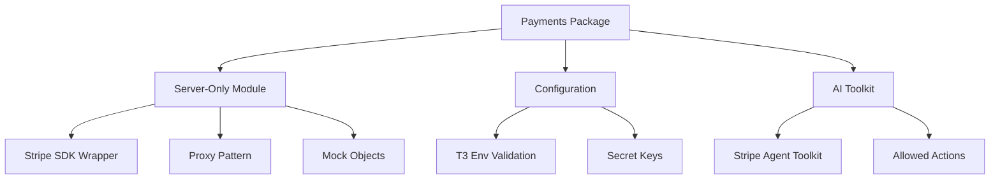

# Payments Package

Minimal **Stripe SDK wrapper** with graceful degradation and **AI agent toolkit** integration for
payment processing.

## Overview

The payments package provides a lightweight Stripe integration with:

- **Server-Only Implementation**: Secure server-side Stripe SDK wrapper
- **Graceful Degradation**: Works without configuration for development
- **AI Agent Toolkit**: Stripe AI SDK for automated payment operations
- **Type-Safe Configuration**: Environment validation with T3 Env
- **Lazy Initialization**: Stripe client initialized on first use
- **Mock Responses**: Development-friendly mock objects when unconfigured

## Architecture



## Installation

```bash
pnpm add @repo/payments
```

## Configuration

### Environment Variables

```typescript
// .env.local (optional for development)
STRIPE_SECRET_KEY = sk_test_your_stripe_secret_key;
STRIPE_WEBHOOK_SECRET = whsec_your_webhook_secret;

// Production (required)
STRIPE_SECRET_KEY = sk_live_your_stripe_secret_key;
STRIPE_WEBHOOK_SECRET = whsec_your_webhook_secret;
```

### Type-Safe Environment

The package validates environment variables using T3 Env:

```typescript
import { keys } from '@repo/payments/keys';

const env = keys();
// STRIPE_SECRET_KEY: string | undefined (must start with 'sk_')
// STRIPE_WEBHOOK_SECRET: string | undefined (must start with 'whsec_')
```

## Basic Usage

### Stripe SDK Access

The package exports a proxied Stripe instance with graceful degradation:

```typescript
import { stripe } from '@repo/payments';

// Create a customer
const customer = await stripe.customers.create({
  email: 'customer@example.com',
  name: 'John Doe',
});

// Create a product
const product = await stripe.products.create({
  name: 'Premium Plan',
  description: 'Full access to all features',
});

// Create a price
const price = await stripe.prices.create({
  product: product.id,
  unit_amount: 2999, // $29.99
  currency: 'usd',
  recurring: {
    interval: 'month',
  },
});

// Create a checkout session
const session = await stripe.checkout.sessions.create({
  customer: customer.id,
  line_items: [
    {
      price: price.id,
      quantity: 1,
    },
  ],
  mode: 'subscription',
  success_url: 'https://example.com/success',
  cancel_url: 'https://example.com/cancel',
});
```

### Graceful Degradation

When `STRIPE_SECRET_KEY` is not configured, the package returns mock objects:

```typescript
// In development without Stripe configuration
const customer = await stripe.customers.create({
  email: 'test@example.com',
});
console.log(customer); // { id: 'mock_customers_id' }

// Mock methods available for:
// - checkout
// - customers
// - invoices
// - paymentIntents
// - prices
// - products
// - subscriptions
```

## AI Agent Toolkit

The package includes Stripe's AI Agent Toolkit for automated payment operations:

```typescript
import { paymentsAgentToolkit } from '@repo/payments/ai';

// Only available when STRIPE_SECRET_KEY is configured
if (paymentsAgentToolkit) {
  // Use with AI agents for automated payment tasks
  const tools = paymentsAgentToolkit.getTools();

  // Allowed actions:
  // - paymentLinks.create
  // - prices.create
  // - products.create
}
```

### AI Integration Example

```typescript
import { openai } from '@ai-sdk/openai';
import { generateText } from 'ai';
import { paymentsAgentToolkit } from '@repo/payments/ai';

// Create payment link via AI
const result = await generateText({
  model: openai('gpt-4'),
  tools: paymentsAgentToolkit?.getTools() || [],
  prompt: 'Create a payment link for a $50 one-time purchase of Premium Access',
});
```

## Common Patterns

### Subscription Management

```typescript
import { stripe } from '@repo/payments';

// Create subscription
export async function createSubscription(customerId: string, priceId: string) {
  return await stripe.subscriptions.create({
    customer: customerId,
    items: [{ price: priceId }],
    payment_behavior: 'default_incomplete',
    expand: ['latest_invoice.payment_intent'],
  });
}

// Cancel subscription
export async function cancelSubscription(subscriptionId: string) {
  return await stripe.subscriptions.update(subscriptionId, {
    cancel_at_period_end: true,
  });
}

// Update subscription
export async function updateSubscription(subscriptionId: string, newPriceId: string) {
  const subscription = await stripe.subscriptions.retrieve(subscriptionId);

  return await stripe.subscriptions.update(subscriptionId, {
    items: [
      {
        id: subscription.items.data[0].id,
        price: newPriceId,
      },
    ],
  });
}
```

### Payment Methods

```typescript
// Attach payment method
export async function attachPaymentMethod(paymentMethodId: string, customerId: string) {
  await stripe.paymentMethods.attach(paymentMethodId, {
    customer: customerId,
  });

  // Set as default
  await stripe.customers.update(customerId, {
    invoice_settings: {
      default_payment_method: paymentMethodId,
    },
  });
}

// List payment methods
export async function listPaymentMethods(customerId: string) {
  return await stripe.paymentMethods.list({
    customer: customerId,
    type: 'card',
  });
}
```

### Webhook Handling

```typescript
import { stripe } from '@repo/payments';
import { keys } from '@repo/payments/keys';

export async function handleWebhook(body: string, signature: string) {
  const { STRIPE_WEBHOOK_SECRET } = keys();

  if (!STRIPE_WEBHOOK_SECRET) {
    throw new Error('Webhook secret not configured');
  }

  try {
    const event = stripe.webhooks.constructEvent(body, signature, STRIPE_WEBHOOK_SECRET);

    switch (event.type) {
      case 'customer.subscription.created':
        // Handle new subscription
        break;

      case 'customer.subscription.deleted':
        // Handle cancelled subscription
        break;

      case 'invoice.payment_succeeded':
        // Handle successful payment
        break;

      case 'invoice.payment_failed':
        // Handle failed payment
        break;
    }

    return { received: true };
  } catch (err) {
    throw new Error(`Webhook error: ${err.message}`);
  }
}
```

### Usage-Based Billing

```typescript
// Track usage for metered billing
export async function recordUsage(
  subscriptionItemId: string,
  quantity: number,
  action: string = 'increment'
) {
  return await stripe.subscriptions.createUsageRecord(subscriptionItemId, {
    quantity,
    action,
    timestamp: Math.floor(Date.now() / 1000),
  });
}

// Create usage-based price
export async function createMeteredPrice(productId: string) {
  return await stripe.prices.create({
    product: productId,
    unit_amount: 10, // $0.10 per unit
    currency: 'usd',
    recurring: {
      interval: 'month',
      usage_type: 'metered',
      aggregate_usage: 'sum',
    },
  });
}
```

## Type Safety

The package exports Stripe types for type-safe usage:

```typescript
import type { Stripe } from '@repo/payments';

// Type-safe Stripe objects
function processCustomer(customer: Stripe.Customer) {
  console.log(customer.email);
  console.log(customer.metadata);
}

// Type-safe responses
async function getInvoice(id: string): Promise<Stripe.Invoice> {
  return await stripe.invoices.retrieve(id);
}
```

## Best Practices

### 1. Error Handling

Always wrap Stripe calls in try-catch blocks:

```typescript
try {
  const customer = await stripe.customers.create({
    email: user.email,
  });
} catch (error) {
  if (error instanceof Stripe.errors.StripeError) {
    // Handle Stripe-specific errors
    console.error('Stripe error:', error.message);
  } else {
    // Handle other errors
    console.error('Unexpected error:', error);
  }
}
```

### 2. Idempotency

Use idempotency keys for critical operations:

```typescript
const payment = await stripe.paymentIntents.create(
  {
    amount: 1000,
    currency: 'usd',
    customer: customerId,
  },
  {
    idempotencyKey: `payment-${orderId}`,
  }
);
```

### 3. Expand Relations

Use expand to reduce API calls:

```typescript
const subscription = await stripe.subscriptions.retrieve(id, {
  expand: ['customer', 'latest_invoice', 'items.data.price.product'],
});
```

### 4. Webhook Security

Always verify webhook signatures:

```typescript
// Never use the raw body after parsing
app.post('/webhook', express.raw({ type: 'application/json' }), handleWebhook);
```

## Testing

### Mock Stripe in Tests

```typescript
import { vi } from 'vitest';

vi.mock('@repo/payments', () => ({
  stripe: {
    customers: {
      create: vi.fn().mockResolvedValue({ id: 'cus_test123' }),
      retrieve: vi.fn().mockResolvedValue({ id: 'cus_test123' }),
    },
    checkout: {
      sessions: {
        create: vi.fn().mockResolvedValue({
          id: 'cs_test123',
          url: 'https://checkout.stripe.com/test',
        }),
      },
    },
  },
}));
```

### Test Webhook Handler

```typescript
import { handleWebhook } from './webhook-handler';

test('processes valid webhook', async () => {
  const event = {
    type: 'customer.subscription.created',
    data: { object: { id: 'sub_123' } },
  };

  const body = JSON.stringify(event);
  const signature = 'valid_signature';

  const result = await handleWebhook(body, signature);
  expect(result).toEqual({ received: true });
});
```

## Common Issues

### 1. Development Setup

- Ensure you're using test keys (starting with `sk_test_`)
- Set up webhook endpoints in Stripe dashboard
- Use Stripe CLI for local webhook testing

### 2. Production Checklist

- [ ] Use live keys (starting with `sk_live_`)
- [ ] Configure webhook endpoints
- [ ] Set up proper error monitoring
- [ ] Enable Stripe Radar for fraud protection
- [ ] Configure tax settings if applicable

### 3. API Version

The package uses Stripe API version `2025-05-28.basil`. To use a different version:

```typescript
// Not recommended - override at your own risk
const customStripe = new Stripe(key, {
  apiVersion: '2024-11-20.acacia',
});
```

## Limitations

This minimal wrapper provides:

1. **Basic Stripe SDK access** - No high-level abstractions
2. **Graceful degradation** - Returns mocks when unconfigured
3. **AI toolkit integration** - Limited to specific actions
4. **Server-only** - No client-side components

For more complex payment flows, you'll need to implement additional logic on top of this foundation.

## Summary

The payments package provides a minimal, production-ready Stripe integration with:

- **Simple SDK Wrapper**: Direct access to Stripe's full API
- **Development Friendly**: Graceful degradation with mock objects
- **AI Ready**: Integration with Stripe's AI agent toolkit
- **Type Safe**: Full TypeScript support with proper types
- **Secure by Default**: Server-only implementation

This lightweight approach gives you full control over your payment implementation while providing
helpful defaults for development.
