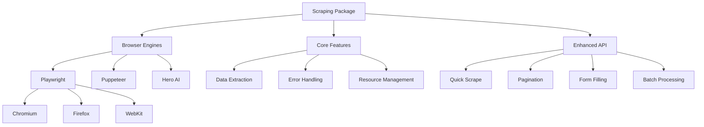

# Scraping Package

Enterprise web scraping framework with **multi-engine support**, **AI-powered extraction**, and
**enhanced automation patterns**.

## Overview

The scraping package provides a comprehensive web scraping solution with:

- **Multi-Engine Support**: Playwright, Puppeteer, and Hero browser automation
- **Enhanced API**: High-level abstractions for common scraping patterns
- **AI-Powered Extraction**: Hero integration for intelligent data extraction
- **Type-Safe Architecture**: Full TypeScript support with runtime validation
- **Human-Like Behavior**: Built-in CAPTCHA detection and anti-bot measures
- **Resource Management**: Automatic cleanup and performance optimizations

## Architecture



## Installation

```bash
pnpm add @repo/scraping

# Install browser engines (as needed)
pnpm add playwright     # For Playwright
pnpm add puppeteer     # For Puppeteer
pnpm add @ulixee/hero  # For Hero (experimental)
```

## Quick Start

### Basic Usage

```typescript
import { createScraper } from '@repo/scraping';

// Create a scraper instance
const scraper = createScraper('playwright'); // or 'puppeteer', 'hero'

// Launch browser and scrape
await scraper.launch();
const result = await scraper.scrape('https://example.com');
console.log(result.content); // HTML content
console.log(result.title); // Page title
await scraper.close();
```

### Enhanced API (Playwright Only)

```typescript
import { createEnhancedPlaywrightScraper } from '@repo/scraping/playwright/enhanced';

const scraper = createEnhancedPlaywrightScraper();

// One-line scraping with selectors
const data = await scraper.quickScrape('https://example.com', {
  title: 'h1',
  price: { selector: '.price', attribute: 'data-value' },
  features: { selector: '.feature', multiple: true },
});

// Automatic cleanup
await scraper.withAutoClose(async (page) => {
  await page.goto('https://example.com');
  const title = await scraper.getText('h1');
  return title;
});
```

## Core Features

### 1. Data Extraction

#### Selector-Based Extraction

```typescript
const result = await scraper.scrape('https://example.com', {
  waitUntil: 'networkidle',
  extract: {
    title: 'h1',
    price: {
      selector: '.price',
      attribute: 'data-value',
      transform: (value) => parseFloat(value),
    },
    images: {
      selector: 'img',
      attribute: 'src',
      multiple: true,
    },
    description: {
      selector: '.description',
      transform: (text) => text.trim().toLowerCase(),
    },
  },
});

console.log(result.data);
// {
//   title: 'Product Name',
//   price: 29.99,
//   images: ['image1.jpg', 'image2.jpg'],
//   description: 'product description'
// }
```

#### AI-Powered Extraction (Hero Only)

```typescript
import { createHeroScraper } from '@repo/scraping/hero';

const scraper = createHeroScraper();
await scraper.launch();

const result = await scraper.scrape('https://example.com');
const aiData = await scraper.extractWithAI('Extract product details and pricing');
console.log(aiData); // Structured data extracted by AI
```

### 2. Advanced Navigation

#### Form Filling

```typescript
const enhanced = createEnhancedPlaywrightScraper();

await enhanced.withAutoClose(async (page) => {
  await page.goto('https://example.com/form');

  // Human-like form filling
  await enhanced.fillForm({
    '#name': 'John Doe',
    '#email': 'john@example.com',
    '#age': '25',
    'select#country': 'US',
    'input[type="checkbox"]': true,
  });

  await page.click('button[type="submit"]');
});
```

#### Pagination Handling

```typescript
const allData = await enhanced.scrapeWithPagination('https://example.com/products', {
  productSelector: '.product',
  nextButtonSelector: '.pagination .next',
  maxPages: 5,
  extractFromPage: async (page) => {
    return await enhanced.extract({
      products: {
        selector: '.product',
        multiple: true,
        extract: {
          name: '.product-name',
          price: '.product-price',
        },
      },
    });
  },
});
```

### 3. Performance Optimization

#### Resource Blocking

```typescript
const result = await scraper.scrape('https://example.com', {
  blockResources: ['image', 'stylesheet', 'font'],
  // Reduces bandwidth and improves speed
});
```

#### Concurrent Scraping

```typescript
const urls = [
  'https://example.com/page1',
  'https://example.com/page2',
  'https://example.com/page3',
];

const results = await enhanced.scrapeMultiple(urls, {
  concurrency: 3,
  extract: {
    title: 'h1',
    content: '.main-content',
  },
});
```

### 4. Anti-Bot Measures

#### Human-Like Behavior

```typescript
const result = await scraper.scrape('https://example.com', {
  // Random user agent rotation
  userAgent: 'random',

  // Human-like delays
  humanLikeDelays: true,
  minDelay: 1000,
  maxDelay: 3000,

  // Viewport settings
  viewport: {
    width: 1920,
    height: 1080,
  },
});
```

#### CAPTCHA Detection

```typescript
const result = await scraper.scrape('https://example.com');

if (result.captchaDetected) {
  console.log('CAPTCHA detected:', result.captchaType);
  // Handle CAPTCHA (manual intervention, service, etc.)
}
```

### 5. Session Management

#### Cookie Handling

```typescript
// Set cookies for authentication
await scraper.scrape('https://example.com', {
  cookies: [
    {
      name: 'session',
      value: 'abc123',
      domain: 'example.com',
    },
  ],
});

// Get cookies after navigation
const result = await scraper.scrape('https://example.com/dashboard');
const cookies = await scraper.getCookies();
```

#### Proxy Support

```typescript
const result = await scraper.scrape('https://example.com', {
  proxy: {
    server: 'http://proxy.example.com:8080',
    username: 'user',
    password: 'pass',
  },
});
```

## Error Handling

### Custom Error Types

```typescript
import { ScrapingError, SCRAPING_ERROR_CODES } from '@repo/scraping';

try {
  await scraper.scrape('https://example.com');
} catch (error) {
  if (error instanceof ScrapingError) {
    switch (error.code) {
      case SCRAPING_ERROR_CODES.NAVIGATION_FAILED:
        console.error('Failed to navigate:', error.context?.url);
        break;

      case SCRAPING_ERROR_CODES.TIMEOUT:
        console.error('Operation timed out');
        break;

      case SCRAPING_ERROR_CODES.CAPTCHA_DETECTED:
        console.error('CAPTCHA blocking access');
        break;

      case SCRAPING_ERROR_CODES.SELECTOR_NOT_FOUND:
        console.error('Element not found:', error.context?.selector);
        break;
    }
  }
}
```

### Retry Logic

```typescript
const result = await scraper.scrape('https://example.com', {
  retries: 3,
  retryDelay: 2000, // Exponential backoff
  onRetry: (error, attempt) => {
    console.log(`Retry attempt ${attempt} after error:`, error.message);
  },
});
```

## Engine-Specific Features

### Playwright Features

```typescript
const playwright = createPlaywrightScraper();

// Multi-browser support
await playwright.launch({ browser: 'firefox' }); // or 'webkit'

// Network interception
await playwright.page.route('**/*.png', (route) => route.abort());

// Mobile emulation
await playwright.scrape('https://example.com', {
  viewport: { width: 375, height: 667 },
  userAgent: 'Mozilla/5.0 (iPhone...)',
});
```

### Puppeteer Features

```typescript
const puppeteer = createPuppeteerScraper();

// PDF generation
await puppeteer.launch();
const page = await puppeteer.getPage();
await page.goto('https://example.com');
await page.pdf({ path: 'page.pdf', format: 'A4' });
```

### Hero Features

```typescript
const hero = createHeroScraper();

// AI-powered waiting
await hero.launch();
await hero.scrape('https://example.com', {
  waitForStable: true, // Waits for page to stop changing
});

// Extract with natural language
const data = await hero.extractWithAI('Find all product prices and convert to USD');
```

## Advanced Patterns

### 1. Workflow Integration

```typescript
import { createScraper } from '@repo/scraping';
import { workflow } from '@repo/orchestration';

workflow.define('scrape-products', async () => {
  const scraper = createScraper('playwright');

  await workflow.step('launch-browser', async () => {
    await scraper.launch();
  });

  const products = await workflow.step('extract-products', async () => {
    return await scraper.scrape('https://example.com/products', {
      extract: {
        products: {
          selector: '.product',
          multiple: true,
          extract: {
            name: '.name',
            price: '.price',
            inStock: '.stock-status',
          },
        },
      },
    });
  });

  await workflow.step('cleanup', async () => {
    await scraper.close();
  });

  return products;
});
```

### 2. Progress Tracking

```typescript
const enhanced = createEnhancedPlaywrightScraper();

const results = await enhanced.scrapeMultiple(urls, {
  concurrency: 5,
  onProgress: (completed, total, current) => {
    console.log(`Progress: ${completed}/${total} - Current: ${current.url}`);
  },
  onError: (error, url) => {
    console.error(`Failed to scrape ${url}:`, error.message);
  },
});
```

### 3. Custom Extraction Logic

```typescript
const scraper = createScraper('playwright');

await scraper.launch();
const page = await scraper.getPage();
await page.goto('https://example.com');

// Custom extraction with page context
const customData = await page.evaluate(() => {
  // This runs in the browser context
  const elements = document.querySelectorAll('.item');
  return Array.from(elements).map((el) => ({
    text: el.textContent,
    position: el.getBoundingClientRect(),
    styles: window.getComputedStyle(el),
  }));
});
```

## Testing

### Mock Browser

```typescript
import { vi } from 'vitest';

vi.mock('@repo/scraping', () => ({
  createScraper: () => ({
    launch: vi.fn(),
    scrape: vi.fn().mockResolvedValue({
      content: '<html>Mock content</html>',
      title: 'Mock Page',
      data: { mocked: true },
    }),
    close: vi.fn(),
  }),
}));
```

### Integration Testing

```typescript
import { createScraper } from '@repo/scraping';

test('scrapes product data', async () => {
  const scraper = createScraper('playwright');

  await scraper.launch({ headless: true });

  const result = await scraper.scrape('https://example.com/test', {
    extract: {
      title: 'h1',
      price: '.price',
    },
  });

  expect(result.data.title).toBeDefined();
  expect(result.data.price).toMatch(/\$\d+\.\d{2}/);

  await scraper.close();
});
```

## Best Practices

### 1. Resource Management

Always ensure proper cleanup:

```typescript
// Manual management
const scraper = createScraper('playwright');
try {
  await scraper.launch();
  // ... scraping logic
} finally {
  await scraper.close();
}

// Automatic with enhanced API
const enhanced = createEnhancedPlaywrightScraper();
await enhanced.withAutoClose(async (page) => {
  // Browser automatically closed after this block
});
```

### 2. Rate Limiting

Respect website resources:

```typescript
const results = await enhanced.scrapeMultiple(urls, {
  concurrency: 2, // Limit concurrent requests
  delay: 1000, // Delay between requests
});
```

### 3. Error Recovery

```typescript
const scrapeWithRecovery = async (url: string, maxAttempts = 3) => {
  for (let i = 0; i < maxAttempts; i++) {
    try {
      return await scraper.scrape(url);
    } catch (error) {
      if (i === maxAttempts - 1) throw error;

      // Exponential backoff
      await new Promise((r) => setTimeout(r, Math.pow(2, i) * 1000));
    }
  }
};
```

### 4. Selector Strategies

```typescript
// Use data attributes when possible
const selectors = {
  price: '[data-testid="product-price"]',
  // Fallback to semantic HTML
  title: 'h1, h2, [role="heading"]',
  // Multiple strategies
  addToCart: 'button[data-action="add-to-cart"], .add-to-cart-btn',
};
```

## Performance Tips

1. **Block unnecessary resources**: Images, fonts, stylesheets
2. **Use specific wait conditions**: Don't wait for 'load' if 'domcontentloaded' suffices
3. **Cache browser instances**: Reuse for multiple pages
4. **Limit concurrent operations**: Prevent memory issues
5. **Use CDP features**: Direct Chrome DevTools Protocol for advanced use cases

## Limitations

1. **Hero implementation**: Experimental with limited features
2. **HTML extraction**: Placeholder implementation (returns null)
3. **Robots.txt**: Compliance checking not implemented
4. **Mobile emulation**: Limited to viewport/user-agent changes

## Summary

The scraping package provides a robust, multi-engine web scraping solution with:

- **Flexible Architecture**: Choose between Playwright, Puppeteer, or Hero
- **Enhanced API**: High-level abstractions for common patterns
- **Production Ready**: Error handling, retries, and resource management
- **Type Safe**: Full TypeScript support with runtime validation
- **Anti-Bot Features**: CAPTCHA detection and human-like behavior
- **Performance Optimized**: Resource blocking and concurrent processing

This makes it suitable for everything from simple data extraction to complex web automation
workflows.
