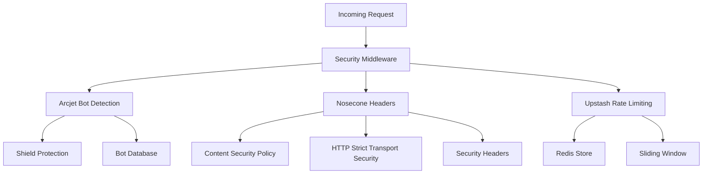

# Security Package

Production-ready security middleware powered by **Arcjet** for bot protection and **Nosecone** for
security headers, with **Upstash Redis** rate limiting.

## Overview

The security package provides enterprise-grade security features:

- **Arcjet Bot Protection**: AI-powered bot detection with Shield protection
- **Nosecone Security Headers**: Configurable security headers
- **Upstash Rate Limiting**: Distributed rate limiting with sliding windows
- **Production Environment Handling**: Graceful degradation in development
- **TypeScript Environment Validation**: Type-safe configuration with Zod

## Architecture



## Installation

```bash
pnpm add @repo/security
```

## Core Features

### Arcjet Bot Protection

AI-powered bot detection with configurable allow/block lists:

```typescript
import { secure } from '@repo/security';

// API route protection
export async function POST(request: Request) {
  try {
    // Allow specific bots, block everything else
    await secure(['GOOGLEBOT', 'BINGBOT'], request);

    // Request is legitimate, proceed
    return await processRequest(request);
  } catch (error) {
    if (error.message === 'No bots allowed') {
      return new Response('Bot detected', { status: 403 });
    }
    if (error.message === 'Rate limit exceeded') {
      return new Response('Too many requests', { status: 429 });
    }
    return new Response('Access denied', { status: 403 });
  }
}
```

#### Advanced Bot Configuration

```typescript
import arcjet, { shield, detectBot } from '@arcjet/next';

// Custom Arcjet configuration
const aj = arcjet({
  key: process.env.ARCJET_KEY!,
  characteristics: ['ip.src'],
  rules: [
    // Protect against common attacks
    shield({
      mode: 'LIVE', // or 'DRY_RUN' for testing
    }),

    // Custom bot detection
    detectBot({
      mode: 'LIVE',
      allow: [
        'GOOGLEBOT',
        'BINGBOT',
        'CRAWLER', // Category: includes many crawlers
        'PREVIEW', // Category: social media preview bots
      ],
    }),
  ],
});

export async function middleware(request: Request) {
  const decision = await aj.protect(request);

  if (decision.isDenied()) {
    // Log the reason for debugging
    console.warn('Request blocked:', decision.reason);

    if (decision.reason.isBot()) {
      return new Response('Bot access denied', { status: 403 });
    }

    if (decision.reason.isRateLimit()) {
      return new Response('Rate limited', {
        status: 429,
        headers: {
          'Retry-After': '60',
        },
      });
    }
  }

  return NextResponse.next();
}
```

#### Available Bot Categories

```typescript
// Well-known individual bots
type WellKnownBot =
  | 'GOOGLEBOT'
  | 'BINGBOT'
  | 'SLURP' // Yahoo
  | 'DUCKDUCKBOT'
  | 'FACEBOOKBOT'
  | 'TWITTERBOT'
  | 'LINKEDINBOT'
  | 'WHATSAPPBOT'
  | 'APPLEBOT'
  | 'YANDEXBOT'
  | 'BAIDUBOT';

// Bot categories (allow multiple bots at once)
type BotCategory =
  | 'CRAWLER' // Search engine crawlers
  | 'PREVIEW' // Social media preview bots
  | 'MONITOR' // Uptime monitoring bots
  | 'AI' // AI training/research bots
  | 'SEO' // SEO analysis bots
  | 'ARCHIVE'; // Web archiving bots

// Usage
await secure(['GOOGLEBOT', 'CRAWLER', 'PREVIEW']);
```

### Nosecone Security Headers

Production-ready security headers:

```typescript
import { noseconeMiddleware, noseconeOptions } from '@repo/security/middleware';

// Basic middleware setup
export const middleware = noseconeMiddleware(noseconeOptions);
```

#### Default Security Headers

The package provides secure defaults:

```typescript
// Default Nosecone configuration
const securityHeaders = {
  // Content Security Policy disabled by default
  // (needs app-specific configuration)
  contentSecurityPolicy: false,

  // Cross-Origin policies
  crossOriginEmbedderPolicy: 'require-corp',
  crossOriginOpenerPolicy: 'same-origin',
  crossOriginResourcePolicy: 'cross-origin',

  // Security headers
  originAgentCluster: '?1',
  referrerPolicy: 'no-referrer',
  strictTransportSecurity: 'max-age=31536000; includeSubDomains',
  xContentTypeOptions: 'nosniff',
  xDnsPrefetchControl: 'off',
  xDownloadOptions: 'noopen',
  xFrameOptions: 'DENY',
  xPermittedCrossDomainPolicies: 'none',
  xXssProtection: '0',
};
```

#### Custom CSP Configuration

```typescript
import { createMiddleware } from '@nosecone/next';

// Custom Content Security Policy
const customMiddleware = createMiddleware({
  contentSecurityPolicy: {
    directives: {
      'default-src': ["'self'"],
      'script-src': [
        "'self'",
        "'unsafe-eval'", // Next.js requires this
        "'unsafe-inline'", // For inline scripts (avoid if possible)
        'https://vercel.live', // Vercel Toolbar
      ],
      'style-src': [
        "'self'",
        "'unsafe-inline'", // CSS-in-JS requires this
        'https://fonts.googleapis.com',
      ],
      'img-src': [
        "'self'",
        'data:', // Base64 images
        'https:', // External images
        'blob:', // Generated images
      ],
      'font-src': ["'self'", 'https://fonts.gstatic.com'],
      'connect-src': [
        "'self'",
        'https://api.example.com', // Your API
        'https://vitals.vercel-insights.com', // Vercel Analytics
      ],
      'media-src': ["'self'"],
      'object-src': ["'none'"],
      'base-uri': ["'self'"],
      'form-action': ["'self'"],
      'frame-ancestors': ["'none'"],
      'upgrade-insecure-requests': [],
    },
  },

  // Override other headers as needed
  xFrameOptions: 'SAMEORIGIN', // Allow embedding from same origin
});

export const middleware = customMiddleware;
```

### Upstash Rate Limiting

Distributed rate limiting with Redis backend:

```typescript
import { createRateLimiter, slidingWindow } from '@repo/security/rate-limit';

// Create a rate limiter
const authLimiter = createRateLimiter({
  limiter: slidingWindow(5, '10 s'), // 5 requests per 10 seconds
  prefix: 'auth',
});

const apiLimiter = createRateLimiter({
  limiter: slidingWindow(100, '1 m'), // 100 requests per minute
  prefix: 'api',
});

// Usage in API routes
export async function POST(request: Request) {
  const ip = request.headers.get('x-forwarded-for') ?? 'anonymous';

  // Apply rate limiting
  const result = await authLimiter.limit(`auth:${ip}`);

  if (!result.success) {
    return new Response('Too many requests', {
      status: 429,
      headers: {
        'X-RateLimit-Limit': result.limit.toString(),
        'X-RateLimit-Remaining': result.remaining.toString(),
        'X-RateLimit-Reset': new Date(result.reset).toISOString(),
      },
    });
  }

  return await processAuthRequest(request);
}
```

#### Rate Limiting Strategies

```typescript
import { Ratelimit } from '@upstash/ratelimit';

// Available limiter types
const limiters = {
  // Fixed window: 10 requests per minute
  fixedWindow: Ratelimit.fixedWindow(10, '1 m'),

  // Sliding window: 10 requests per minute (more precise)
  slidingWindow: Ratelimit.slidingWindow(10, '1 m'),

  // Token bucket: burst allowance with refill rate
  tokenBucket: Ratelimit.tokenBucket(10, '1 s', 20), // 10/sec, burst 20

  // Sliding logs: exact request tracking (memory intensive)
  slidingLogs: Ratelimit.slidingLogs(10, '1 m'),
};

// Use with different prefixes for different endpoints
const rateLimiters = {
  auth: createRateLimiter({
    limiter: Ratelimit.slidingWindow(5, '15 m'),
    prefix: 'auth',
  }),

  api: createRateLimiter({
    limiter: Ratelimit.slidingWindow(1000, '1 h'),
    prefix: 'api',
  }),

  upload: createRateLimiter({
    limiter: Ratelimit.tokenBucket(1, '10 s', 3), // 1 per 10s, burst 3
    prefix: 'upload',
  }),
};
```

#### Graceful Degradation

The package gracefully handles missing Redis configuration:

```typescript
// When Redis is not configured, rate limiting is disabled
// This allows development without Redis setup

// The createRateLimiter returns a no-op limiter that always allows requests
const limiter = createRateLimiter({
  limiter: slidingWindow(10, '1 m'),
});

// In development without Redis:
// - limit() always returns { success: true, remaining: 999999 }
// - No errors are thrown
// - Console warning is logged once
```

## Environment Configuration

Type-safe environment variable handling with intelligent defaults:

```typescript
// Environment variables with validation
interface SecurityEnv {
  // Arcjet bot protection (optional in development)
  ARCJET_KEY?: string; // Format: ajkey_...

  // Upstash Redis rate limiting (optional in development)
  UPSTASH_REDIS_REST_URL?: string;
  UPSTASH_REDIS_REST_TOKEN?: string;

  // Service API key for service-to-service auth (optional)
  SERVICE_API_KEY?: string; // Minimum 32 characters
}
```

Environment setup:

```bash
# Production (required)
ARCJET_KEY="ajkey_xxxxxxxxxxxxx"
UPSTASH_REDIS_REST_URL="https://xxxxx.upstash.io"
UPSTASH_REDIS_REST_TOKEN="xxxxxxxxxx"

# Service authentication (recommended for production)
SERVICE_API_KEY="your-32-character-minimum-secure-key"

# Generate a secure service key:
# openssl rand -base64 32

# Development (optional - package gracefully degrades)
# Leave empty for local development
```

### Environment Validation Logic

```typescript
// Smart environment detection
const isProduction = process.env.NODE_ENV === 'production';
const hasArcjetVars = Boolean(process.env.ARCJET_KEY);
const hasUpstashVars = Boolean(
  process.env.UPSTASH_REDIS_REST_TOKEN && process.env.UPSTASH_REDIS_REST_URL
);

// Only require in production when vars are present
const requireArcjetInProduction = isProduction && hasArcjetVars;
const requireUpstashInProduction = isProduction && hasUpstashVars;

// This allows:
// - Development with .env.local files (optional)
// - Production with full validation
// - Staging environments with partial configs
```

## Comprehensive Example

Complete security middleware implementation:

```typescript
// middleware.ts
import { NextRequest, NextResponse } from 'next/server';
import {
  secure,
  createRateLimiter,
  slidingWindow,
  noseconeMiddleware,
  noseconeOptionsWithToolbar,
} from '@repo/security';

// Rate limiters for different endpoints
const globalLimiter = createRateLimiter({
  limiter: slidingWindow(100, '1 m'),
  prefix: 'global',
});

const authLimiter = createRateLimiter({
  limiter: slidingWindow(5, '15 m'),
  prefix: 'auth',
});

const apiLimiter = createRateLimiter({
  limiter: slidingWindow(1000, '1 h'),
  prefix: 'api',
});

export async function middleware(request: NextRequest) {
  const { pathname } = request.nextUrl;
  const ip = request.ip ?? request.headers.get('x-forwarded-for') ?? 'anonymous';

  // Apply security headers first
  const response = NextResponse.next();

  // Apply Nosecone security headers
  const secureResponse = await noseconeMiddleware(
    process.env.NODE_ENV === 'development' ? noseconeOptionsWithToolbar : noseconeOptions
  )(request);

  // Copy security headers to our response
  secureResponse.headers.forEach((value, key) => {
    response.headers.set(key, value);
  });

  try {
    // Bot protection for all routes
    await secure(['GOOGLEBOT', 'BINGBOT', 'CRAWLER', 'PREVIEW'], request);

    // Rate limiting based on route
    let rateLimiter = globalLimiter;
    let identifier = `global:${ip}`;

    if (pathname.startsWith('/api/auth')) {
      rateLimiter = authLimiter;
      identifier = `auth:${ip}`;
    } else if (pathname.startsWith('/api/')) {
      rateLimiter = apiLimiter;
      identifier = `api:${ip}`;
    }

    const rateLimit = await rateLimiter.limit(identifier);

    if (!rateLimit.success) {
      return new NextResponse('Too many requests', {
        status: 429,
        headers: {
          'X-RateLimit-Limit': rateLimit.limit.toString(),
          'X-RateLimit-Remaining': rateLimit.remaining.toString(),
          'X-RateLimit-Reset': new Date(rateLimit.reset).toISOString(),
          'Retry-After': Math.round((rateLimit.reset - Date.now()) / 1000).toString(),
        },
      });
    }

    // Add rate limit info to successful responses
    response.headers.set('X-RateLimit-Limit', rateLimit.limit.toString());
    response.headers.set('X-RateLimit-Remaining', rateLimit.remaining.toString());
    response.headers.set('X-RateLimit-Reset', new Date(rateLimit.reset).toISOString());
  } catch (error) {
    // Handle security violations
    console.warn(`Security violation for ${ip} on ${pathname}:`, error.message);

    if (error.message === 'No bots allowed') {
      return new NextResponse('Bot access denied', {
        status: 403,
        headers: {
          'X-Security-Reason': 'bot-detected',
        },
      });
    }

    if (error.message === 'Rate limit exceeded') {
      return new NextResponse('Rate limited by Arcjet', {
        status: 429,
        headers: {
          'X-Security-Reason': 'rate-limit-arcjet',
        },
      });
    }

    return new NextResponse('Access denied', {
      status: 403,
      headers: {
        'X-Security-Reason': 'security-violation',
      },
    });
  }

  return response;
}

// Configure matcher to exclude static files
export const config = {
  matcher: [
    /*
     * Match all request paths except for the ones starting with:
     * - api (API routes)
     * - _next/static (static files)
     * - _next/image (image optimization files)
     * - favicon.ico (favicon file)
     */
    {
      source: '/((?!_next/static|_next/image|favicon.ico).*)',
      missing: [
        { type: 'header', key: 'next-router-prefetch' },
        { type: 'header', key: 'purpose', value: 'prefetch' },
      ],
    },
  ],
};
```

## API Route Protection

Protect individual API routes with authentication and rate limiting:

```typescript
// app/api/protected/route.ts
import { secure, createRateLimiter, slidingWindow } from '@repo/security';
import { requireAuth } from '@/lib/auth';

const limiter = createRateLimiter({
  limiter: slidingWindow(10, '1 m'),
  prefix: 'protected-api',
});

export async function POST(request: Request) {
  // Require authentication first (API key or session)
  const authResult = await requireAuth(request);
  if (authResult instanceof NextResponse) {
    return authResult; // 401 Unauthorized
  }

  const { user } = authResult;
  const ip = request.headers.get('x-forwarded-for') ?? 'anonymous';

  try {
    // Bot protection (skip for service accounts)
    if (user.id !== 'service') {
      await secure(['GOOGLEBOT'], request);
    }

    // Rate limiting by user or IP
    const rateLimitKey =
      user.id === 'service' ? `protected:service:${ip}` : `protected:user:${user.id}`;

    const result = await limiter.limit(rateLimitKey);
    if (!result.success) {
      return Response.json(
        { error: 'Too many requests' },
        {
          status: 429,
          headers: {
            'X-RateLimit-Remaining': result.remaining.toString(),
            'Retry-After': '60',
          },
        }
      );
    }

    // Your protected logic here
    return Response.json({
      message: 'Success',
      userId: user.id,
      isServiceAccount: user.id === 'service',
    });
  } catch (error) {
    return Response.json({ error: 'Access denied' }, { status: 403 });
  }
}
```

## Testing

The package includes comprehensive tests for all security features:

```typescript
// Example test structure
describe('Security Package', () => {
  describe('Arcjet Integration', () => {
    it('should block bots when not in allow list');
    it('should allow legitimate requests');
    it('should handle missing Arcjet key gracefully');
  });

  describe('Rate Limiting', () => {
    it('should enforce rate limits with Redis');
    it('should gracefully degrade without Redis');
    it('should use correct prefixes for different limiters');
  });

  describe('Security Headers', () => {
    it('should apply Nosecone security headers');
    it('should support Vercel Toolbar in development');
    it('should disable CSP by default');
  });
});
```

## Security Best Practices

1. **Production Environment Variables**

   - Always set `ARCJET_KEY` in production
   - Configure `UPSTASH_REDIS_REST_URL` and `UPSTASH_REDIS_REST_TOKEN` for rate limiting
   - Use separate Arcjet keys for different environments
   - Set `SERVICE_API_KEY` for service-to-service authentication (minimum 32 characters)

2. **Content Security Policy**

   - Configure CSP based on your app's specific needs
   - Start with restrictive policies and gradually allow necessary sources
   - Use `'nonce-'` or `'sha256-'` instead of `'unsafe-inline'` when possible

3. **Rate Limiting Strategy**

   - Use different rate limits for different endpoints
   - Implement stricter limits for authentication endpoints
   - Consider user-based limits in addition to IP-based limits

4. **Bot Management**

   - Regularly review Arcjet logs to understand bot traffic
   - Adjust allow lists based on legitimate bot requirements
   - Use DRY_RUN mode to test new bot detection rules

5. **Monitoring and Alerting**
   - Monitor rate limit violations
   - Set up alerts for unusual bot detection patterns
   - Track security header compliance

## Migration Guide

### From Basic Security Headers

```typescript
// Before: Manual security headers
export function middleware(request: NextRequest) {
  const response = NextResponse.next();

  response.headers.set('X-Frame-Options', 'DENY');
  response.headers.set('X-Content-Type-Options', 'nosniff');
  // ... manual header configuration

  return response;
}

// After: Nosecone-powered headers
import { noseconeMiddleware, noseconeOptions } from '@repo/security/middleware';

export const middleware = noseconeMiddleware(noseconeOptions);
```

### From Custom Rate Limiting

```typescript
// Before: Custom Redis rate limiting
const redis = new Redis({ url: process.env.REDIS_URL });

export async function rateLimit(key: string) {
  const count = await redis.incr(key);
  if (count === 1) {
    await redis.expire(key, 60);
  }
  return count <= 10;
}

// After: Upstash Rate Limiting
import { createRateLimiter, slidingWindow } from '@repo/security/rate-limit';

const limiter = createRateLimiter({
  limiter: slidingWindow(10, '1 m'),
  prefix: 'api',
});

export async function rateLimit(key: string) {
  const result = await limiter.limit(key);
  return result.success;
}
```

## Enterprise Features Summary

The security package provides production-ready security with:

- **Arcjet AI Bot Protection** with intelligent bot detection and customizable policies
- **Nosecone Security Headers** with secure defaults and Vercel Toolbar compatibility
- **Upstash Rate Limiting** with multiple strategies and distributed Redis backend
- **Service API Key Support** for secure service-to-service authentication
- **Environment-aware Configuration** with graceful degradation in development
- **TypeScript Safety** with Zod validation and comprehensive type definitions
- **Production Hardening** with proper error handling and security event logging

This makes it suitable for production applications requiring enterprise-grade security without
compromising developer experience.

## Service API Keys

The security package works seamlessly with the authentication system to support service API keys:

### Configuration

```bash
# .env.local or production environment
SERVICE_API_KEY=your-32-character-minimum-secure-key
```

### Usage with Authentication

```typescript
// app/lib/auth.ts
import { auth } from '@repo/auth/server';
import { env } from '../env';

export async function requireAuth(request: Request) {
  const providedApiKey = request.headers.get('x-api-key');

  // Check service API key first
  if (providedApiKey && env.SERVICE_API_KEY) {
    if (providedApiKey === env.SERVICE_API_KEY) {
      return {
        user: { id: 'service', email: 'service@system', name: 'Service Account' },
        session: { id: 'service-session', userId: 'service', activeOrganizationId: 'system' },
      };
    }
  }

  // Otherwise check user auth
  const session = await auth.api.getSession({ headers: request.headers });
  if (!session) {
    return NextResponse.json({ error: 'Unauthorized' }, { status: 401 });
  }

  return session;
}
```

### Benefits

1. **Doppler Integration**: Service keys can be rotated via Doppler without code changes
2. **Service Accounts**: Bypass user authentication for automated systems
3. **Monitoring**: Track service vs user requests separately
4. **Rate Limiting**: Apply different limits for service accounts
5. **Bot Protection**: Skip bot detection for trusted service accounts

## Summary

The security package provides:

- **Arcjet Bot Protection** with AI-powered detection
- **Nosecone Security Headers** with secure defaults
- **Upstash Rate Limiting** with distributed storage
- **Production Environment Handling** with graceful degradation
- **TypeScript Environment Validation** with Zod schemas
