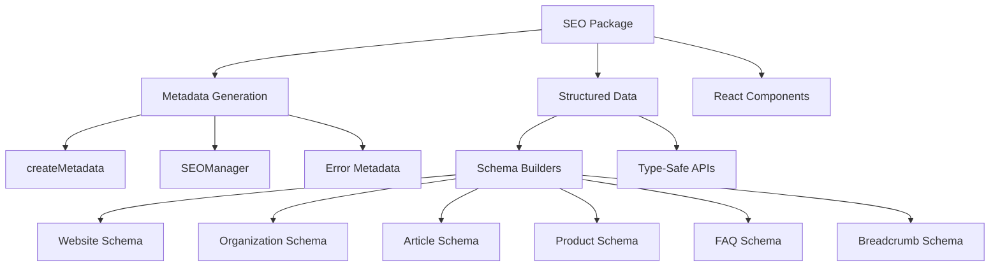

# SEO Package

Comprehensive SEO toolkit with **Next.js metadata generation**, **structured data helpers**, and
**JSON-LD schema** for optimal search engine visibility.

## Overview

The SEO package provides a complete SEO solution with:

- **Metadata Generation**: Type-safe Next.js metadata with sensible defaults
- **Enhanced SEO Manager**: Advanced metadata class with i18n and article support
- **Structured Data Builders**: Pre-configured schema.org generators
- **JSON-LD Components**: React components for structured data injection
- **Mobile Optimization**: Enhanced viewport configuration
- **Social Media**: Open Graph and Twitter Card optimization

## Architecture



## Installation

```bash
pnpm add @repo/seo
```

## Basic Metadata Generation

### Simple Metadata

```typescript
import { createMetadata } from '@repo/seo/metadata';
import type { Metadata } from 'next';

export const metadata: Metadata = createMetadata({
  title: 'About Us',
  description: 'Learn more about our company and mission',
  image: '/images/about-hero.jpg', // Optional
});

// Generated metadata includes:
// - Title: "About Us | forge"
// - Open Graph tags
// - Twitter Card tags
// - Apple Web App tags
// - Format detection
// - Author information
```

### Configuration

The basic metadata generator uses these defaults:

```typescript
const applicationName = 'forge';
const author = {
  name: 'Hayden Bleasel',
  url: 'https://haydenbleasel.com/',
};
const publisher = 'Hayden Bleasel';
const twitterHandle = '@haydenbleasel';
```

## Enhanced SEO Manager

For more advanced use cases, use the SEOManager class:

```typescript
import { SEOManager, viewport } from '@repo/seo/metadata-enhanced';

// Initialize SEO manager with your config
const seo = new SEOManager({
  applicationName: 'MyApp',
  author: {
    name: 'Your Name',
    url: 'https://yoursite.com',
  },
  publisher: 'Your Company',
  twitterHandle: '@yourhandle',
  keywords: ['saas', 'productivity', 'tools'], // Base keywords
  locale: 'en_US',
  themeColor: '#6366f1',
});

// Export viewport for mobile optimization
export { viewport };

// Generate metadata
export const metadata = seo.createMetadata({
  title: 'Features',
  description: 'Explore our powerful features',
  keywords: ['features', 'capabilities'], // Page-specific keywords
  image: {
    url: '/images/features-og.jpg',
    alt: 'Feature overview screenshot',
    width: 1200,
    height: 630,
  },
  canonical: 'https://example.com/features',
  alternates: {
    languages: {
      'en-US': 'https://example.com/features',
      'es-ES': 'https://example.com/es/features',
    },
  },
});
```

### Advanced Features

#### Article Metadata

```typescript
export const metadata = seo.createMetadata({
  title: 'How to Improve Your SEO',
  description: 'A comprehensive guide to SEO best practices',
  article: {
    publishedTime: '2024-01-15T10:00:00Z',
    modifiedTime: '2024-01-20T15:30:00Z',
    authors: ['John Doe', 'Jane Smith'],
    section: 'Marketing',
    tags: ['SEO', 'Marketing', 'Guide'],
  },
});
```

#### Error Page Metadata

```typescript
// Automatic error page metadata
export const metadata = seo.createErrorMetadata(404);
// Generates appropriate title, sets noindex/nofollow

// Supported status codes: 404, 500, 503
```

#### Robots Configuration

```typescript
export const metadata = seo.createMetadata({
  title: 'Private Page',
  description: 'This page should not be indexed',
  noIndex: true,
  noFollow: true,
});

// Generates comprehensive robots directives:
// - robots: index/follow settings
// - googleBot specific settings with max-snippet, max-image-preview
```

## Structured Data

### JSON-LD Component

```typescript
import { JsonLd } from '@repo/seo/json-ld';
import type { WithContext, Article } from 'schema-dts';

export default function BlogPost({ post }) {
  const structuredData: WithContext<Article> = {
    '@context': 'https://schema.org',
    '@type': 'Article',
    headline: post.title,
    description: post.excerpt,
    datePublished: post.publishedAt,
    author: {
      '@type': 'Person',
      name: post.author.name,
    },
  };

  return (
    <>
      <JsonLd code={structuredData} />
      <article>{/* Post content */}</article>
    </>
  );
}
```

### Schema Builders

The package provides type-safe builders for common schema types:

```typescript
import { structuredData, JsonLd } from '@repo/seo/structured-data';

// Website with search action
const websiteSchema = structuredData.website({
  name: 'My SaaS App',
  url: 'https://example.com',
  description: 'Professional tools for teams',
  potentialAction: {
    target: 'https://example.com/search?q={search_term}',
    queryInput: 'search_term',
  },
});

// Organization with contact
const orgSchema = structuredData.organization({
  name: 'Acme Corporation',
  url: 'https://acme.com',
  logo: 'https://acme.com/logo.png',
  sameAs: [
    'https://twitter.com/acme',
    'https://linkedin.com/company/acme',
  ],
  contactPoint: {
    telephone: '+1-555-123-4567',
    contactType: 'customer service',
    areaServed: ['US', 'CA'],
    availableLanguage: ['English', 'Spanish'],
  },
});

// Article with full metadata
const articleSchema = structuredData.article({
  headline: 'Ultimate Guide to SEO',
  description: 'Everything you need to know about SEO',
  image: ['https://example.com/seo-guide.jpg'],
  datePublished: '2024-01-15T10:00:00Z',
  dateModified: '2024-01-20T15:30:00Z',
  author: {
    name: 'Jane Doe',
    url: 'https://example.com/authors/jane',
  },
  publisher: {
    name: 'Tech Blog',
    logo: 'https://example.com/logo.png',
  },
  mainEntityOfPage: 'https://example.com/blog/seo-guide',
});

// Render multiple schemas
<JsonLd data={[websiteSchema, orgSchema]} id="homepage-schema" />
```

### Available Schema Builders

#### 1. Breadcrumbs

```typescript
const breadcrumbs = structuredData.breadcrumbs([
  { name: 'Home', url: 'https://example.com' },
  { name: 'Blog', url: 'https://example.com/blog' },
  { name: 'SEO Guide', url: 'https://example.com/blog/seo-guide' },
]);
```

#### 2. FAQ

```typescript
const faq = structuredData.faq([
  {
    question: 'What is SEO?',
    answer: 'SEO stands for Search Engine Optimization...',
  },
  {
    question: 'Why is SEO important?',
    answer: 'SEO helps your website rank higher in search results...',
  },
]);
```

#### 3. Product

```typescript
const product = structuredData.product({
  name: 'Premium Plan',
  description: 'Our most popular subscription',
  image: 'https://example.com/premium-plan.jpg',
  brand: 'Acme SaaS',
  offers: {
    price: '49.99',
    priceCurrency: 'USD',
    availability: 'https://schema.org/InStock',
    seller: 'Acme Corporation',
  },
  aggregateRating: {
    ratingValue: 4.8,
    reviewCount: 1250,
  },
});
```

## Complete Page Example

```typescript
import { SEOManager, viewport } from '@repo/seo/metadata-enhanced';
import { structuredData, JsonLd } from '@repo/seo/structured-data';

const seo = new SEOManager({
  applicationName: 'TechBlog',
  author: { name: 'Tech Team', url: 'https://techblog.com' },
  publisher: 'TechBlog Inc.',
  twitterHandle: '@techblog',
  themeColor: '#0ea5e9',
});

// Export viewport
export { viewport };

// Export metadata
export const metadata = seo.createMetadata({
  title: 'Ultimate TypeScript Guide',
  description: 'Master TypeScript with our comprehensive guide',
  keywords: ['typescript', 'programming', 'javascript'],
  image: '/images/typescript-guide-og.jpg',
  article: {
    publishedTime: '2024-01-15T10:00:00Z',
    authors: ['John Developer'],
    section: 'Programming',
    tags: ['TypeScript', 'JavaScript', 'Web Development'],
  },
});

export default function ArticlePage({ article }) {
  // Create structured data
  const schemas = [
    structuredData.article({
      headline: article.title,
      description: article.excerpt,
      image: article.featuredImage,
      datePublished: article.publishedAt,
      dateModified: article.updatedAt,
      author: article.author.name,
      publisher: {
        name: 'TechBlog',
        logo: 'https://techblog.com/logo.png',
      },
    }),
    structuredData.breadcrumbs([
      { name: 'Home', url: 'https://techblog.com' },
      { name: 'Guides', url: 'https://techblog.com/guides' },
      { name: article.title, url: `https://techblog.com/guides/${article.slug}` },
    ]),
  ];

  return (
    <>
      <JsonLd data={schemas} />
      <article>
        <h1>{article.title}</h1>
        {/* Article content */}
      </article>
    </>
  );
}
```

## Best Practices

### 1. Metadata Strategy

- **Always include**: Title, description, and canonical URL
- **Use images**: 1200x630px for optimal social sharing
- **Keywords**: Include base keywords in SEOManager, add page-specific ones
- **Localization**: Use alternates for multi-language sites

### 2. Structured Data

- **Multiple schemas**: Combine relevant schemas on each page
- **Validation**: Test with Google's Rich Results Test
- **Keep updated**: Ensure dateModified is accurate for articles
- **Complete data**: Fill all recommended fields for rich snippets

### 3. Performance

- **Static generation**: Generate metadata at build time when possible
- **Reuse SEOManager**: Initialize once and reuse across pages
- **Minimize schemas**: Only include relevant structured data

### 4. Mobile Optimization

```typescript
// Always export the enhanced viewport
export { viewport } from '@repo/seo/metadata-enhanced';

// Provides optimal mobile experience:
// - Responsive viewport
// - Pinch-to-zoom enabled (accessibility)
// - Cover viewport-fit for notched devices
```

## Type Safety

The package provides full TypeScript support:

```typescript
import type { WithContext, Thing } from '@repo/seo/structured-data';

// Type-safe schema creation
function createCustomSchema<T extends Thing>(
  type: string,
  data: Omit<T, '@context' | '@type'>
): WithContext<T> {
  return createStructuredData(type, data);
}

// Strongly typed metadata options
interface MetadataOptions {
  title: string;
  description: string;
  // All options are typed
}
```

## Testing

### Unit Tests

```typescript
import { createMetadata } from '@repo/seo/metadata';

test('generates correct metadata', () => {
  const metadata = createMetadata({
    title: 'Test Page',
    description: 'Test description',
  });

  expect(metadata.title).toBe('Test Page | forge');
  expect(metadata.openGraph?.title).toBe('Test Page | forge');
});
```

### Structured Data Validation

```typescript
import { structuredData } from '@repo/seo/structured-data';

test('generates valid article schema', () => {
  const schema = structuredData.article({
    headline: 'Test Article',
    datePublished: '2024-01-01',
    author: 'Test Author',
    publisher: { name: 'Test Publisher' },
  });

  expect(schema['@type']).toBe('Article');
  expect(schema['@context']).toBe('https://schema.org');
});
```

## Common Patterns

### Dynamic Metadata

```typescript
export async function generateMetadata({ params }): Promise<Metadata> {
  const post = await getPost(params.slug);

  return seo.createMetadata({
    title: post.title,
    description: post.excerpt,
    image: post.featuredImage,
    article: {
      publishedTime: post.publishedAt,
      modifiedTime: post.updatedAt,
      authors: [post.author.name],
      tags: post.tags,
    },
  });
}
```

### E-commerce Product Pages

```typescript
const schemas = [
  structuredData.product({
    name: product.name,
    description: product.description,
    image: product.images,
    brand: product.brand,
    offers: {
      price: product.price.toString(),
      priceCurrency: 'USD',
      availability: product.inStock
        ? 'https://schema.org/InStock'
        : 'https://schema.org/OutOfStock',
    },
    aggregateRating: product.rating && {
      ratingValue: product.rating.average,
      reviewCount: product.rating.count,
    },
  }),
  structuredData.breadcrumbs([
    { name: 'Home', url: '/' },
    { name: product.category, url: `/products/${product.category}` },
    { name: product.name, url: `/products/${product.slug}` },
  ]),
];
```

## Summary

The SEO package provides a comprehensive toolkit for Next.js applications with:

- **Flexible Metadata Generation**: From simple to advanced use cases
- **Type-Safe Schema Builders**: Pre-configured structured data helpers
- **React Components**: Easy JSON-LD injection
- **Mobile Optimization**: Enhanced viewport configuration
- **Best Practices**: Built-in SEO best practices and sensible defaults

This makes it easy to implement proper SEO with minimal configuration while maintaining flexibility
for advanced use cases.
