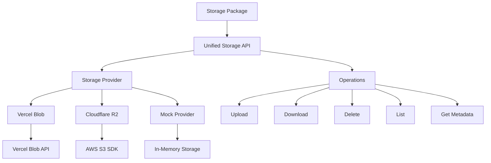

# Storage Package

Multi-provider cloud storage abstraction with support for **Vercel Blob** and **Cloudflare R2**,
featuring unified API, type safety, and graceful fallback for development.

## Overview

The storage package provides a flexible abstraction layer over cloud storage providers with:

- **Dual Provider Support**: Vercel Blob and Cloudflare R2 (S3-compatible)
- **Unified Interface**: Consistent API across all providers
- **Type Safety**: Full TypeScript support with strongly typed operations
- **Development Mode**: Mock provider when no configuration exists
- **Lazy Initialization**: Providers initialized only when first used
- **Graceful Degradation**: Continues working without configuration

## Architecture



## Installation

```bash
pnpm add @repo/storage
```

## Configuration

### Environment Variables

```bash
# Storage provider selection
STORAGE_PROVIDER="vercel-blob" # or "cloudflare-r2"

# Vercel Blob configuration
BLOB_READ_WRITE_TOKEN="vercel_blob_rw_xxxxxxxxxx"

# Cloudflare R2 configuration
R2_ACCOUNT_ID="your-account-id"
R2_ACCESS_KEY_ID="your-access-key"
R2_SECRET_ACCESS_KEY="your-secret-key"
R2_BUCKET="your-bucket-name"
```

## Basic Usage

### Simple Storage Operations

```typescript
import { storage } from '@repo/storage';

// Upload a file
const uploadedFile = await storage.upload('documents/report.pdf', pdfBlob, {
  contentType: 'application/pdf',
  metadata: {
    userId: '123',
    category: 'reports',
  },
});
console.log('File URL:', uploadedFile.url);

// Download a file
const blob = await storage.download('documents/report.pdf');
const file = new File([blob], 'report.pdf', { type: blob.type });

// Check if file exists
const exists = await storage.exists('documents/report.pdf');

// Delete a file
await storage.delete('documents/report.pdf');

// List files
const files = await storage.list({
  prefix: 'documents/',
  limit: 10,
});
```

### Advanced Usage

#### Custom Provider Initialization

```typescript
import { createStorageProvider } from '@repo/storage';

// Create Vercel Blob provider
const vercelStorage = createStorageProvider({
  provider: 'vercel-blob',
  vercelBlob: {
    token: process.env.BLOB_READ_WRITE_TOKEN!,
  },
});

// Create Cloudflare R2 provider
const r2Storage = createStorageProvider({
  provider: 'cloudflare-r2',
  cloudflareR2: {
    accountId: process.env.R2_ACCOUNT_ID!,
    accessKeyId: process.env.R2_ACCESS_KEY_ID!,
    secretAccessKey: process.env.R2_SECRET_ACCESS_KEY!,
    bucket: process.env.R2_BUCKET!,
  },
});
```

#### Streaming Uploads

```typescript
// Upload from a stream
const stream = fs.createReadStream('large-file.zip');
const webStream = Readable.toWeb(stream);

await storage.upload('archives/large-file.zip', webStream, {
  contentType: 'application/zip',
  cacheControl: 3600, // Cache for 1 hour
});
```

#### Metadata Operations

```typescript
// Get file metadata without downloading
const metadata = await storage.getMetadata('images/logo.png');
console.log({
  size: metadata.size,
  contentType: metadata.contentType,
  lastModified: metadata.lastModified,
  etag: metadata.etag, // Only for R2
});

// Generate temporary URL (R2 only)
const tempUrl = await storage.getUrl('private/document.pdf', {
  expiresIn: 3600, // 1 hour
});
```

## Provider Details

### Vercel Blob

Vercel's blob storage with automatic CDN distribution:

```typescript
// Vercel Blob specific features
const result = await storage.upload('image.jpg', imageBlob, {
  public: true, // Vercel Blob always public
  cacheControl: 31536000, // 1 year cache
});

// URLs are permanent and CDN-backed
console.log(result.url); // https://[id].public.blob.vercel-storage.com/image.jpg
```

**Features**:

- Automatic CDN distribution
- Permanent public URLs
- No signed URL support (always public)
- Integrated with Vercel platform

### Cloudflare R2

S3-compatible object storage with egress-free bandwidth:

```typescript
// R2 specific features
const result = await storage.upload('data.json', jsonBlob, {
  metadata: {
    'x-amz-meta-version': '1.0',
    'x-amz-meta-author': 'system',
  },
});

// Generate signed URL for private access
const signedUrl = await storage.getUrl('private/data.json', {
  expiresIn: 7200, // 2 hours
});
```

**Features**:

- S3-compatible API
- Signed URL generation
- Custom metadata support
- ETags for cache validation
- No egress fees

## Development Mode

When no storage provider is configured, the package uses a mock provider:

```typescript
// Development without configuration
// Logs: "Storage service is disabled: Missing STORAGE_PROVIDER configuration"

const result = await storage.upload('test.txt', new Blob(['Hello']));
console.log(result.url); // https://mock-storage.example.com/test.txt

// All operations work but data is only in memory
const exists = await storage.exists('test.txt'); // true
const files = await storage.list(); // Returns mock data
```

## Type Definitions

```typescript
interface StorageObject {
  key: string;
  url: string;
  size: number;
  contentType?: string;
  lastModified?: Date;
  etag?: string; // Only for R2
}

interface UploadOptions {
  contentType?: string;
  cacheControl?: number; // in seconds
  metadata?: Record<string, string>;
  public?: boolean; // Ignored by Vercel Blob (always public)
}

interface ListOptions {
  prefix?: string;
  limit?: number;
  cursor?: string; // For pagination
}

interface StorageProvider {
  upload(key: string, data: UploadData, options?: UploadOptions): Promise<StorageObject>;
  download(key: string): Promise<Blob>;
  delete(key: string): Promise<void>;
  exists(key: string): Promise<boolean>;
  list(options?: ListOptions): Promise<StorageObject[]>;
  getMetadata(key: string): Promise<StorageObject>;
  getUrl(key: string, options?: { expiresIn?: number }): Promise<string>;
}

type UploadData = Buffer | Blob | File | ArrayBuffer | ReadableStream;
```

## Client-Side Usage

For Vercel Blob client-side uploads:

```typescript
import { upload } from '@repo/storage/client';

// Direct client upload (Vercel Blob only)
const blob = await upload('profile.jpg', file, {
  access: 'public',
  handleUploadUrl: '/api/upload', // Your upload handler
});
```

## Best Practices

### 1. Error Handling

```typescript
try {
  await storage.upload('file.pdf', data);
} catch (error) {
  if (error.message.includes('token is required')) {
    // Missing configuration
  } else if (error.message.includes('not found')) {
    // File doesn't exist
  }
  // Handle other errors
}
```

### 2. File Organization

```typescript
// Use consistent key patterns
const key = `users/${userId}/uploads/${timestamp}-${filename}`;
const key2 = `public/images/${category}/${slug}.jpg`;

// List by prefix
const userFiles = await storage.list({
  prefix: `users/${userId}/`,
});
```

### 3. Content Types

```typescript
import mime from 'mime-types';

const contentType = mime.lookup(filename) || 'application/octet-stream';
await storage.upload(key, data, { contentType });
```

### 4. Caching Strategy

```typescript
// Static assets - long cache
await storage.upload('assets/logo.png', logoData, {
  cacheControl: 31536000, // 1 year
  contentType: 'image/png',
});

// Dynamic content - short cache
await storage.upload('data/prices.json', priceData, {
  cacheControl: 300, // 5 minutes
  contentType: 'application/json',
});
```

## Testing

```typescript
import { MockStorageProvider } from '@repo/storage/test';

// Use mock provider in tests
const mockStorage = new MockStorageProvider();

// Test upload
const result = await mockStorage.upload('test.txt', Buffer.from('test'));
expect(result.url).toContain('mock-storage');

// Verify in-memory storage
expect(await mockStorage.exists('test.txt')).toBe(true);
```

## Summary

The storage package provides:

- **Unified Interface**: Same API for Vercel Blob and Cloudflare R2
- **Type Safety**: Full TypeScript support with detailed types
- **Graceful Fallback**: Mock provider for development
- **Flexible Configuration**: Environment-based or programmatic
- **Production Ready**: Used across apps for file uploads and storage

Choose Vercel Blob for simplicity and CDN integration, or Cloudflare R2 for S3 compatibility and
cost-effective storage at scale.
