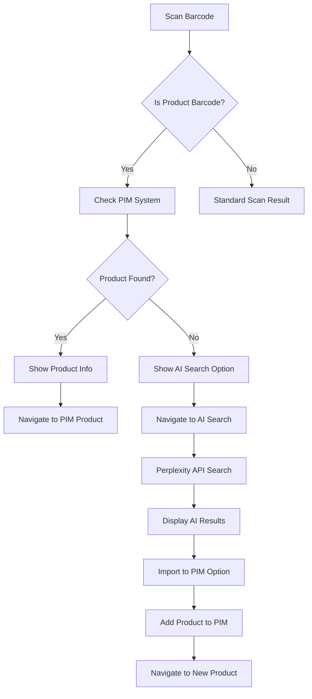

# Enhanced Barcode Scanner Integration

This document outlines the complete barcode scanner integration with PIM lookup and AI-powered search functionality.

## Overview

The enhanced barcode scanner now provides intelligent product lookup capabilities:

1. **Scan Barcode** → **Check PIM System** → **If Found: Open Product** | **If Not Found: AI Search**
2. **AI Search** → **Perplexity Lookup** → **Display Results** → **Import to PIM**

## Architecture



## Components

### 1. ProductLookupService (`src/services/productLookupService.ts`)

**Core service for product management and AI integration using Prisma ORM:**

- `findProductByBarcode(barcode)` - Search existing PIM products in database
- `searchProductWithAI(barcode)` - Query Perplexity for product info
- `addProductToPIM(aiResult, barcode)` - Import AI results to PIM database
- `getAllProducts()` - Get all PIM products from database
- `updateProduct(id, updates)` - Update existing products in database
- `saveScanHistory()` - Track scan history in database
- `searchProducts()` - Full-text search across products

**Database Integration:**
- Uses `@repo/database` package with Prisma ORM
- Supports product barcodes, attributes, and scan history
- Transactional operations for data consistency
- Barcode variation matching for UPC formats

### 2. AI Search Page (`app/search/page.tsx` + `SearchClient.tsx`)

**Dedicated page for AI-powered product lookup:**

- Server component for SEO and initial data loading
- Client component for interactive AI search
- Real-time confidence scoring
- Source attribution
- Import functionality with validation

**Features:**
- Loading states with progress indicators
- Error handling with retry options
- Confidence-based import restrictions
- Manual entry fallback options

### 3. API Endpoint (`app/api/ai/product-search/route.ts`)

**Backend integration for Perplexity API:**

- RESTful API endpoint for AI searches
- Mock responses for development
- Error handling and validation
- Structured response format

**Response Format:**
```typescript
{
  productName: string
  brand: string
  category: string
  description: string
  specifications: Record<string, any>
  imageUrl?: string
  confidence: number
  sources: string[]
}
```

### 4. Enhanced Scanner Components

**Updated scanner components with product lookup:**

- `NativeScanner.tsx` - iOS/Android camera integration
- `WebScanner.tsx` - Browser camera API
- `ResultDisplay.tsx` - Enhanced with product lookup UI
- `ScannerClient.tsx` - Orchestrates scanner flow

**New Features:**
- Automatic product barcode detection
- Real-time PIM system lookup
- Visual feedback for product status
- Direct navigation to PIM or AI search

## User Flow

### Scenario 1: Product Found in PIM

1. User scans barcode `123456789012`
2. System detects numeric barcode pattern
3. Automatic lookup in PIM system
4. Product found: "Wireless Bluetooth Headphones"
5. Display product info with "View in PIM" button
6. User clicks → Navigate to `/pim/products/1`

### Scenario 2: Product Not Found - AI Search

1. User scans barcode `999999999999`
2. System detects numeric barcode pattern
3. Automatic lookup in PIM system
4. Product not found
5. Display "Search with AI" option
6. User clicks → Navigate to `/search?barcode=999999999999`
7. AI search performs Perplexity lookup
8. Display results with confidence score
9. User can import to PIM if confidence > 30%

### Scenario 3: Non-Product Barcode

1. User scans QR code with URL
2. System detects non-product pattern
3. Standard scan result display
4. Options to open URL, copy, etc.

## Configuration

### Mock Products for Testing

The system includes several test barcodes:

- `123456789012` - Wireless Bluetooth Headphones (Found in PIM)
- `987654321098` - Organic Cotton T-Shirt (Found in PIM)
- `456789123456` - Smart Home Security Camera (Found in PIM)
- `111111111111` - Apple iPhone 15 Pro (AI Mock Response)
- `222222222222` - Nike Air Max 270 (AI Mock Response)

### AI Integration

Currently uses mock responses for development. To integrate with real Perplexity API:

1. Set up environment variables for API keys
2. Replace mock responses in `generateMockResponse()`
3. Implement actual Perplexity API calls
4. Configure rate limiting and error handling

## iOS-Specific Features

### Camera Permissions

Configured in `app.json`:
```json
{
  "ios": {
    "infoPlist": {
      "NSCameraUsageDescription": "This app uses the camera to scan barcodes and QR codes for product management.",
      "NSMicrophoneUsageDescription": "This app may use the microphone for video recording features."
    }
  }
}
```

### Native Scanner Integration

- Uses `expo-barcode-scanner` for native camera access
- Supports multiple barcode formats (UPC, EAN, Code 128, QR, etc.)
- Optimized for iOS camera performance
- Automatic focus and exposure adjustment

### Universal Components

All scanner components work across:
- iOS (native camera)
- Android (native camera)
- Web (browser camera API)

## Development Testing

### Test Barcodes

Use these barcodes to test different scenarios:

**Products in PIM:**
- `123456789012` - Will find existing product
- `987654321098` - Will find existing product
- `456789123456` - Will find existing product

**AI Search Testing:**
- `111111111111` - High confidence AI result
- `222222222222` - Medium confidence AI result
- `999999999999` - Low confidence AI result

**Non-Product Codes:**
- Any QR code with URL
- Text-based codes
- Short numeric codes (< 8 digits)

### Database Setup

1. **Generate Prisma Client:**
   ```bash
   cd packages/database
   pnpm prisma generate
   ```

2. **Run Database Migrations:**
   ```bash
   cd packages/database
   pnpm prisma migrate dev
   ```

3. **Seed Test Products:**
   ```bash
   cd packages/database
   npx tsx prisma/seed-products.ts
   ```

### Running the Scanner

1. **Web Development:**
   ```bash
   cd apps/hedwig
   pnpm run dev
   # Navigate to /scanner
   ```

2. **iOS Simulator:**
   ```bash
   cd apps/hedwig
   pnpm run ios
   ```

3. **iOS Device:**
   ```bash
   cd apps/hedwig
   pnpm run ios --device
   ```

## Future Enhancements

### Real Perplexity Integration

Replace mock API with actual Perplexity integration:

```typescript
// Using @repo/ai package
import { useCompletion } from '@repo/ai'

const { complete, completion, isLoading } = useCompletion({
  api: '/api/ai/product-search',
})
```

### Enhanced Product Matching

- Fuzzy barcode matching
- Multiple barcode formats per product
- Barcode validation and check digit verification
- Support for internal SKU codes

### Advanced AI Features

- Image recognition for products without barcodes
- Batch product import from AI results
- Confidence-based auto-import thresholds
- Learning from user corrections

### Analytics Integration

- Scan frequency tracking
- Product lookup success rates
- AI search accuracy metrics
- User behavior analysis

## Troubleshooting

### Common Issues

1. **Camera Permission Denied**
   - Check device settings
   - Verify app.json configuration
   - Test on different devices

2. **Product Lookup Fails**
   - Check network connectivity
   - Verify mock data is loaded
   - Test with known barcodes

3. **AI Search Not Working**
   - Check API endpoint availability
   - Verify request/response format
   - Test with mock responses

4. **Navigation Issues**
   - Ensure all routes are properly configured
   - Check for TypeScript errors
   - Verify component imports

### Debug Mode

Enable debug logging:

```typescript
// In ProductLookupService
console.log('Product lookup for barcode:', barcode)
console.log('AI search result:', result)
```

## Security Considerations

- API rate limiting for Perplexity calls
- Input validation for barcode data
- Sanitization of AI response data
- User permission handling for camera access

## Performance Optimization

- Debounced barcode scanning
- Cached product lookups
- Optimized image processing
- Lazy loading of AI search components

This integration provides a seamless experience for users to scan barcodes and either find existing products in their PIM system or discover new products through AI-powered search, with the ability to import findings directly into their product catalog.
