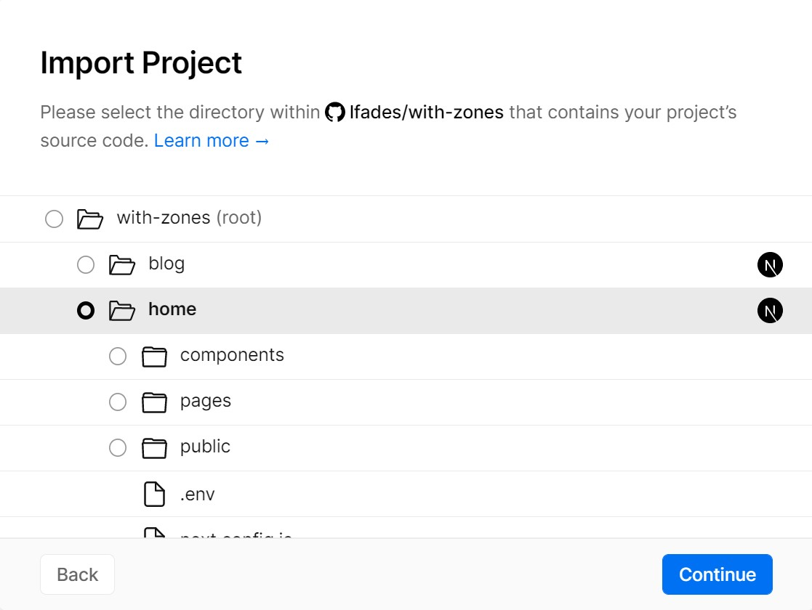

# @labs/with-zones-app - Multi-Zone Next.js

- _Can build:_ **YES** (Multiple Next.js Apps)

- _AI Hints:_

  ```typescript
  // Primary: Multi-zone Next.js architecture - micro-frontends with domain routing
  // Home: runs on :3000, serves root paths and routes /blog/* to blog app
  // Blog: runs on :4000, serves /blog/* with basePath configuration
  // Config: rewrites in home/next.config.js route requests to blog app
  // ❌ NEVER: Use overlapping paths between zones or skip basePath setup
  ```

- _Key Features:_
  - **Multi-Zone Architecture**: Separate Next.js apps serving different paths from single domain
  - **Micro-Frontend Pattern**: Independent deployment and development of home and blog zones
  - **Smart Routing**: Home app routes /blog/* requests to blog app via rewrites
  - **Asset Isolation**: BasePath configuration prevents asset conflicts between zones
  - **Independent Development**: Each zone has its own dependencies and build process

- _Zone Configuration:_
  - **Home Zone**: Main app serving root paths (/, /about), includes routing to blog
  - **Blog Zone**: Secondary app with basePath '/blog' serving blog content
  - **Routing**: Home app rewrites /blog/* requests to blog app on different port
  - **Assets**: Each zone has isolated Next.js assets and public files

Multi-Zone Next.js demonstration - serving multiple Next.js applications from a single domain using [Multi Zones](https://nextjs.org/docs/advanced-features/multi-zones) architecture.

- _Environment Variables:_
  ```bash
  # Blog app URL for production deployment
  BLOG_URL=https://with-zones-blog.vercel.app
  
  # Development ports
  HOME_PORT=3000  # Home zone development server
  BLOG_PORT=4000  # Blog zone development server
  ```

- _Quick Setup:_
  ```bash
  # Start home zone (terminal 1)
  cd home
  pnpm install && pnpm dev
  # Runs on http://localhost:3000
  
  # Start blog zone (terminal 2)  
  cd blog
  pnpm install && pnpm dev
  # Runs on http://localhost:4000/blog
  
  # Access complete app
  # Visit http://localhost:3000 for home
  # Visit http://localhost:3000/blog for blog (routed via home)
  ```

- _Architecture Details:_
  - **Home Zone**: Main application with rewrites configuration routing /blog/* to blog app
  - **Blog Zone**: Secondary app with basePath '/blog' for asset isolation
  - **Path Routing**: Home serves /, /about; Blog serves /blog, /blog/post/[id]
  - **Asset Isolation**: BasePath prevents conflicts between zones' Next.js assets
  - **Independent Builds**: Each zone builds and deploys separately

- _Deployment Strategy:_
  - Deploy blog zone first to get domain URL
  - Configure BLOG_URL environment variable in home zone
  - Deploy home zone with rewrites pointing to blog domain
  - Both zones run independently but appear as single domain

## Architecture Overview

Multi-Zone applications work by having one application route requests for specific paths to other applications using the [`rewrites` feature](https://nextjs.org/docs/pages/api-reference/config/next-config-js/rewrites). All URL paths must be unique across zones:

## How to use

Execute [`create-next-app`](https://github.com/vercel/next.js/tree/canary/packages/create-next-app) with [npm](https://docs.npmjs.com/cli/init), [Yarn](https://yarnpkg.com/lang/en/docs/cli/create/), or [pnpm](https://pnpm.io) to bootstrap the example:

```bash
npx create-next-app --example with-zones with-zones-app
```

```bash
yarn create next-app --example with-zones with-zones-app
```

```bash
pnpm create next-app --example with-zones with-zones-app
```

With multi zones you have multiple Next.js apps over a single app, therefore every app has its own dependencies and it runs independently.

To start the `/home` run the following commands from the root directory:

```bash
cd home
npm install && npm run dev
# or
cd home
yarn && yarn dev
# or
cd home
pnpm install && pnpm dev
```

The `/home` app should be up and running in [http://localhost:3000](http://localhost:3000)!

Starting the `/blog` app follows a very similar process. In a new terminal, run the following commands from the root directory :

```bash
cd blog
npm install && npm run dev
# or
cd blog
yarn && yarn dev
# or
cd blog
pnpm install && pnpm dev
```

The `blog` app should be up and running in [http://localhost:4000/blog](http://localhost:4000/blog)!

## Deploy your own

[](https://vercel.com/new/clone?repository-url=https://github.com/vercel/next.js/tree/canary/examples/with-zones&project-name=with-zones&repository-name=with-zones)

### Deploy Your Local Project

To deploy the apps to Vercel, we'll use [monorepos support](https://vercel.com/blog/monorepos) to create a new project for each app.

To get started, push the example to GitHub/GitLab/Bitbucket and [import your repo to Vercel](https://vercel.com/new?utm_source=github&utm_medium=readme&utm_campaign=next-example). We're not interested in the root directory, so make sure to select the `blog` directory (do not start with `home`):


Click continue and finish the import process. After that's done copy the domain URL that was assigned to your project, paste it on `home/.env`, and push the change to your repo:

```bash
# Replace this URL with the URL of your blog app
BLOG_URL="https://with-zones-blog.vercel.app"
```

Now we'll go over the [import flow](https://vercel.com/new?utm_source=github&utm_medium=readme&utm_campaign=next-example) again using the same repo but this time select the `home` directory instead:



With the `home` app deployed you should now be able to see both apps running under the same domain!

Any future commits to the repo will trigger a deployment to the connected Vercel projects. See the [blog post about monorepos](https://vercel.com/blog/monorepos) to learn more.
