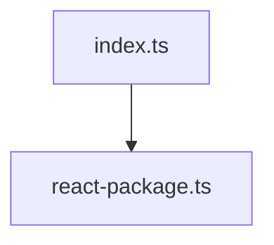
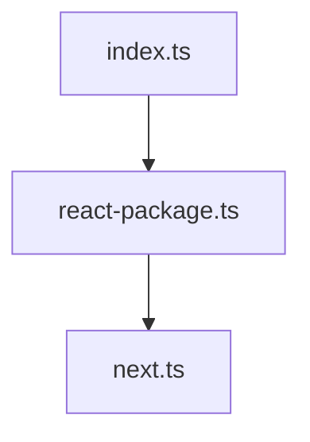
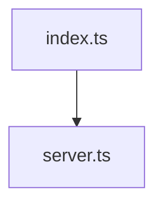
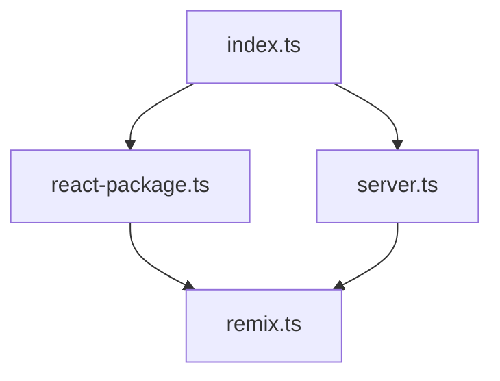

m# `@repo/eslint-config`

Collection of internal ESLint configurations for our monorepo, using ESLint 9's
flat config system.

## Configurations

### Base (`index.ts`)

The foundation configuration that all other configs extend from. Provides:

- TypeScript support with modern rules and type-checking
- Comprehensive code organization and sorting:
  - Automated import organization with grouping and spacing
  - Object property sorting with custom grouping
  - TypeScript interface and type sorting
  - JSX props ordering with semantic grouping (key, ref, callbacks, styling)
  - Enum members and array sorting
- Auto-remove unused imports
- Security scanning for common issues
- Prettier integration
- Promise error handling checks
- Common ignore patterns
- Performance optimizations

### React (`react-package.ts`)

Extends base config with React-specific rules:



- JSX support
- React Hooks rules
- React best practices
- Component patterns
- A11y/accessibility compliance
- Self-closing components
- Fragment syntax rules
- Testing Library and Jest DOM rules for test files

### Next.js (`next.ts`)

Extends React config with Next.js specifics:



#### Core Features

- Page/App router conventions
- Browser environment
- Next.js file patterns (`pages/**/*`, `app/**/*`, `middleware.*`)
- Relaxed type boundaries
- Default export handling for pages and components

#### Next.js 15 Optimizations

- **App Router Patterns**:
  - Server/client boundary enforcement
  - Server Component rules (`app/**/page.tsx`, `app/**/layout.tsx`, etc.)
  - Client Component rules (files with `use client` directive)
  - Server Action patterns (`app/**/actions.ts`)
- **React 19 Integration**:
  - Support for new hooks (`useActionState`, `useOptimistic`)
  - Server action usage validation
- **Performance Rules**:
  - Image optimization enforcement
  - Font loading best practices
  - Script loading optimization
  - Link component validation

#### Modular Architecture

The Next.js configuration uses a modular approach with named rule sets:

```typescript
// File pattern constants
const APP_ROUTER_FILES = ["app/**/*.{js,jsx,ts,tsx}"];
const SERVER_COMPONENT_FILES = ["app/**/page.{js,jsx,ts,tsx}" /* ... */];
// ...more pattern constants

// Rule sets grouped by purpose
const baseNextRules = {
  /* ... */
};
const performanceRules = {
  /* ... */
};
const serverComponentRules = {
  /* ... */
};
// ...more rule sets

// Combined configuration
const config = [
  ...reactConfig,
  baseNextRules,
  performanceRules,
  serverComponentRules,
  // ...more rule sets
];
```

This modular structure:

- Improves readability by grouping related rules
- Reduces duplication of file patterns and rules
- Makes maintenance easier by organizing rules by purpose
- Provides clear separation of concerns

### Server (`server.ts`)

Extends base config for server-side packages:



- Node.js environment and best practices
- Advanced Node.js security checks
- Stricter TypeScript rules for backend code
- Promise error handling
- Comprehensive test file configurations
- Server-specific security rules

### Remix (`remix.ts`)

Extends both server and React configs for fullstack apps:



- Fullstack environment support
- Remix file conventions (`app/routes/**/*`, `app/root.*`, `app/entry.*`)
- Route patterns with default export handling
- Mixed client/server rules
- Remix-specific import patterns (`~/**`)
- Server-side code rules for `app/server/**`, `app/models/**`, `app/services/**`

## Usage

In your package's `eslint.config.ts`:

```typescript
// For React libraries
import reactConfig from "@repo/eslint-config/react-package";
export default reactConfig;

// For Next.js apps
import nextConfig from "@repo/eslint-config/next";
export default nextConfig;

// For Next.js 15 apps with custom overrides
import nextConfig from "@repo/eslint-config/next";
export default [
  ...nextConfig,
  {
    // Project-specific overrides
    files: ["app/**/*.tsx"],
    rules: {
      // Customize specific rules if needed
      "@next/next/no-img-element": "warn", // Downgrade to warning if needed
    },
  },
];

// For server packages
import serverConfig from "@repo/eslint-config/server";
export default serverConfig;

// For Remix apps
import remixConfig from "@repo/eslint-config/remix";
export default remixConfig;
```

## Key Features

- ESLint 9 flat config system
- TypeScript-first approach with type-checking
- Comprehensive code organization with perfectionist:
  - Automatic import sorting with customizable groups
  - Object property ordering with semantic prioritization
  - TypeScript interface/type member organization
  - JSX props ordering (key/id/ref first, then callbacks, styling)
  - Enum and named exports/imports sorting
- Unused imports detection and auto-fix
- A11y/accessibility checking for React components
- Comprehensive security scanning
- Enhanced promise error handling
- Prettier compatibility
- Vitest testing-specific rules
- Monorepo-aware configurations

## Plugins Included

- `eslint-plugin-perfectionist` - Advanced sorting and code organization
- `@typescript-eslint` - TypeScript rules and parser
- `eslint-plugin-import` - Import validation
- `eslint-plugin-unused-imports` - Auto-fix for unused imports
- `eslint-plugin-react` & `eslint-plugin-react-hooks` - React best practices
- `eslint-plugin-jsx-a11y` - Accessibility checking for JSX
- `eslint-plugin-testing-library` - Testing Library best practices
- `eslint-plugin-jest-dom` - Jest DOM assertions best practices
- `@eslint/markdown` - Markdown linting and code block validation
- `eslint-plugin-cypress` - Cypress E2E and component testing
- `eslint-plugin-node` - Node.js best practices
- `eslint-plugin-security` - Security scanning
- `eslint-plugin-promise` - Promise error handling
- `eslint-plugin-only-warn` - Convert errors to warnings

## Dependencies

This package manages shared ESLint dependencies for all configurations.
Individual projects don't need to install additional ESLint plugins when using
these configs.

## Type Declarations

All configurations are exported with proper TypeScript type declarations:

```typescript
import type { Linter } from "eslint";

/**
 * ESLint configurations for the monorepo
 *
 * This package provides several ESLint configurations:
 *
 * - Default export: Base configuration with TypeScript, security, and code organization
 * - react-package: For React libraries with JSX, hooks, and accessibility rules
 * - next: For Next.js applications with App Router, Server Components, and React 19 support
 * - server: For server-side TypeScript with Node.js best practices
 * - remix: For Remix applications combining React and server-side rules
 *
 * All configurations are provided as ESLint v9 flat config arrays.
 */

declare const config: Linter.FlatConfig[];
export default config;
```

This ensures type safety when extending or customizing the configurations.

## Rule References

### Next.js 15 Rules

The Next.js configuration includes specialized rules for Next.js 15
applications:

### App Router Rules

| Rule                                    | Purpose                                           |
| --------------------------------------- | ------------------------------------------------- |
| `@next/next/no-html-link-for-pages`     | Ensures internal links use Next.js Link component |
| `@next/next/no-sync-scripts`            | Prevents synchronous scripts that block rendering |
| `@next/next/no-page-custom-font`        | Encourages proper font loading patterns           |
| `@next/next/no-styled-jsx-in-document`  | Prevents styled-jsx in custom document            |
| `@next/next/no-server-import-in-page`   | Prevents server imports in client components      |
| `@next/next/no-document-import-in-page` | Prevents document imports in regular pages        |

### Server Component Rules

| Rule                                                   | Purpose                                         |
| ------------------------------------------------------ | ----------------------------------------------- |
| `@next/next/no-client-only-import-in-server-component` | Prevents client-only code in server components  |
| `@next/next/no-img-element`                            | Forces use of optimized Next.js Image component |

### Client Component Rules

| Rule                              | Purpose                                   |
| --------------------------------- | ----------------------------------------- |
| `@next/next/use-client-directive` | Ensures 'use client' directive is present |

### React 19 Integration

| Rule                                                 | Purpose                                     |
| ---------------------------------------------------- | ------------------------------------------- |
| `react-hooks/exhaustive-deps` with `additionalHooks` | Supports React 19 hooks like useActionState |
| `@next/next/no-server-action-in-use-effect`          | Prevents server actions in useEffect        |

### Server Action Rules

| Rule                                                | Purpose                                     |
| --------------------------------------------------- | ------------------------------------------- |
| `@next/next/use-server-directive`                   | Ensures 'use server' directive is present   |
| `@next/next/export-server-actions-only`             | Ensures server actions export properly      |
| `@next/next/no-client-only-import-in-server-action` | Prevents client-side code in server actions |

### Next.js Configuration Files

| Rule                                               | Purpose                                 |
| -------------------------------------------------- | --------------------------------------- |
| `@typescript-eslint/explicit-function-return-type` | Ensures middleware is properly typed    |
| `@next/next/no-client-only-import-in-middleware`   | Prevents client-only code in middleware |

### Testing Library Rules

The React and Next.js configurations include Testing Library rules for test
files:

| Rule                                              | Purpose                                        |
| ------------------------------------------------- | ---------------------------------------------- |
| `testing-library/await-async-queries`             | Ensures async queries are properly awaited     |
| `testing-library/no-container`                    | Discourages direct container access            |
| `testing-library/no-debugging-utils`              | Warns against leaving debugging utils in tests |
| `testing-library/prefer-screen-queries`           | Encourages using screen queries                |
| `testing-library/render-result-naming-convention` | Enforces consistent naming                     |

### Jest DOM Rules

The React and Next.js configurations include Jest DOM rules for test files:

| Rule                                | Purpose                                            |
| ----------------------------------- | -------------------------------------------------- |
| `jest-dom/prefer-checked`           | Prefers toBeChecked() over checking attributes     |
| `jest-dom/prefer-to-have-class`     | Prefers toHaveClass() over checking className      |
| `jest-dom/prefer-to-have-value`     | Prefers toHaveValue() over checking value property |
| `jest-dom/prefer-in-document`       | Prefers toBeInTheDocument()                        |
| `jest-dom/prefer-to-have-attribute` | Prefers toHaveAttribute()                          |

### Markdown Rules

The base configuration includes Markdown linting rules:

| Rule                             | Purpose                                |
| -------------------------------- | -------------------------------------- |
| `markdown/fenced-code-language`  | Ensures code blocks specify a language |
| `markdown/no-html`               | Warns against raw HTML in Markdown     |
| `markdown/no-duplicate-headings` | Prevents duplicate section titles      |

Code blocks within Markdown files are also linted with relaxed rules to allow
for documentation examples.

### Cypress Rules

The React and Next.js configurations include Cypress testing rules:

| Rule                                 | Purpose                                                   |
| ------------------------------------ | --------------------------------------------------------- |
| `cypress/no-unnecessary-waiting`     | Prevents arbitrary wait times                             |
| `cypress/no-assigning-return-values` | Prevents assigning return values from commands            |
| `cypress/no-async-tests`             | Prevents async/await in Cypress tests                     |
| `cypress/unsafe-to-chain-command`    | Prevents chaining commands that return different subjects |
| `cypress/require-data-selectors`     | Encourages using data-\* attributes for selectors         |

### Security Rules

The base configuration includes security scanning rules:

| Rule                                   | Purpose                                              |
| -------------------------------------- | ---------------------------------------------------- |
| `security/detect-unsafe-regex`         | Prevents regex patterns vulnerable to ReDoS          |
| `security/detect-buffer-noassert`      | Prevents unsafe buffer methods                       |
| `security/detect-child-process`        | Flags potentially dangerous child process executions |
| `security/detect-eval-with-expression` | Prevents dynamic code evaluation                     |
| `security/detect-non-literal-require`  | Flags dynamic module loading                         |

### Next.js Testing Overrides

The Next.js configuration includes specific overrides for testing Next.js
components:

| Context           | Overrides                                                             |
| ----------------- | --------------------------------------------------------------------- |
| Server Components | Disables client-only rules like `testing-library/await-async-queries` |
| App Router Tests  | Relaxes `testing-library/no-node-access` for server component testing |
| Cypress Tests     | Disables `@next/next/no-img-element` and allows regular links         |
