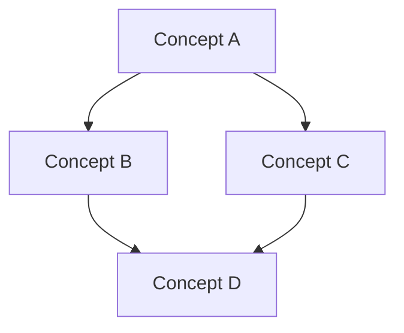

# Rule Synchronization Guide: Clinerules to Cursor

This guide explains how to synchronize content from `.clinerules` to Cursor
rules (`.cursor/rules`) in the Next-Forge monorepo.

## Overview

The Next-Forge project uses two sets of rule documentation:

1. **Clinerules** (`.clinerules/`) - The primary rule documentation
2. **Cursor Rules** (`.cursor/rules/`) - Cursor-specific rule format with
   frontmatter

This guide helps maintain consistency between these two rule sets.

## Rule Mapping

The following table shows the mapping between clinerules and Cursor rules:

| Clinerules                                   | Cursor Rules                         | Description              |
| -------------------------------------------- | ------------------------------------ | ------------------------ |
| `.clinerules/global.md`                      | `.cursor/rules/001_workspace.mdc`    | Global monorepo rules    |
| `.clinerules/typescript/types.md`            | `.cursor/rules/010_typescript.mdc`   | TypeScript ESM standards |
| `.clinerules/code-quality.md`                | `.cursor/rules/015_code_quality.mdc` | Code quality standards   |
| `.clinerules/testing/configuration.md`       | `.cursor/rules/020_testing.mdc`      | Testing configuration    |
| `.clinerules/environment/structure.md`       | `.cursor/rules/030_environment.mdc`  | Environment variables    |
| `.clinerules/monorepo/structure.md`          | `.cursor/rules/040_monorepo.mdc`     | Monorepo structure       |
| `.clinerules/nextjs/configuration.md`        | `.cursor/rules/050_nextjs.mdc`       | Next.js configuration    |
| `.clinerules/core/architecture.md`           | `.cursor/rules/060_architecture.mdc` | Architecture standards   |
| `.clinerules/interaction/task-completion.md` | `.cursor/rules/070_interaction.mdc`  | Interaction guidelines   |

Note: Some clinerules directories contain additional supporting files that
provide more detailed documentation. The files listed above are the primary
files that map to Cursor rules.

## Manual Synchronization Process

When updating rules, follow these steps to ensure consistency:

1. **Update Clinerules First**: Always make changes to `.clinerules/` files
   first
2. **Identify Affected Cursor Rules**: Find the corresponding `.cursor/rules/`
   file
3. **Convert Format**: Follow the conversion guidelines below
4. **Update Cursor Rules**: Apply the changes to the Cursor rule file
5. **Test Rules**: Ensure the rules appear correctly in Cursor

## Conversion Guidelines

### 1. Frontmatter

Cursor rules require frontmatter in this format:

```
---
description: "Brief description of the rule"
globs: ["**/*.ts", "**/*.tsx", "**/*.js", "**/*.jsx"]
---
```

Common glob patterns:

- TypeScript/JS files: `["**/*.ts", "**/*.tsx", "**/*.js", "**/*.jsx"]`
- Config files: Add `"**/package.json", "**/tsconfig.json", "**/*.config.*"`
- Test files: Add `"**/*.test.ts", "**/*.spec.ts", "**/*.cy.ts"`

### 2. Content Structure

Transform clinerules content to Cursor format:

- **Add a Purpose Section**: Begin with a clear statement of purpose
- **Use Proper Headers**: Maintain consistent header hierarchies
- **Format Code Blocks**: Ensure code blocks have proper language tags
- **Add Examples**: Include practical examples where helpful
- **Include Cross-References**: Add links to related rule files

### 3. Mermaid Diagrams

When appropriate, convert bullet points to mermaid diagrams:



### 4. Common Issues & Solutions Section

Add a "Common Issues and Solutions" section for practical guidance:

```
## Common Issues and Solutions

### Problem: Description of the problem
- **Cause**: What causes this issue
- **Solution**: How to solve it

### Problem: Another common issue
- **Cause**: The root cause
- **Solution**: Step-by-step solution
```

## Example Conversion

### Clinerules:

```markdown
# Module Format

## Core Requirements

- All packages MUST be written in TypeScript
- All packages MUST use ESM format
- Add "type": "module" to all package.json files
```

### Cursor Rules:

```markdown
---
description: 'TypeScript ESM Standards'
globs: ['**/*.ts', '**/*.tsx']
---

# TypeScript ESM Standards

## Purpose

This document defines the standard module format requirements for all packages
in the Next-Forge monorepo, ensuring consistent TypeScript and ESM usage.

## Core Requirements

- All packages MUST be written in TypeScript, not JavaScript
- All packages MUST use ESM format with direct TypeScript consumption
- Add `"type": "module"` to all package.json files
- NO CommonJS modules (`require`/`module.exports`) should be used
```
