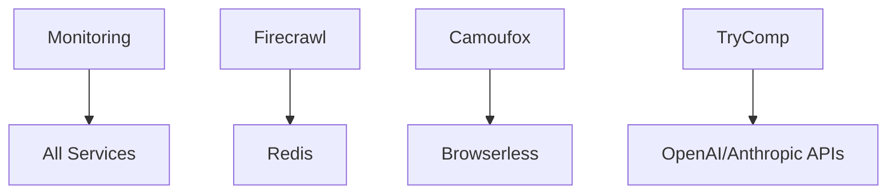

# Railway Deployment Guide

This directory contains multiple services configured for deployment on Railway. Each service
includes a `railway.json` configuration and `Dockerfile` for seamless deployment.

## 🚀 Services Overview

### Custom Services (Wrapper Services)

#### 1. **OpenGrep** - Static Code Analysis

- **Path**: `/services/opengrep/`
- **Port**: 3000
- **Description**: Semgrep-powered static code analysis service
- **Features**: Security scanning, custom rules, repository analysis

#### 2. **TryComp** - AI Code Comparison

- **Path**: `/services/trycomp/`
- **Port**: 3000
- **Description**: AI-powered code comparison and analysis
- **Features**: OpenAI/Anthropic integration, code diff analysis

#### 3. **Camoufox** - Stealth Browser Automation

- **Path**: `/services/camoufox/`
- **Port**: 3000
- **Description**: Anti-detection browser automation with Rust optimization
- **Features**: Canvas fingerprinting resistance, WebGL spoofing, Playwright

#### 4. **Firecrawl** - Web Scraping Service

- **Path**: `/services/firecrawl/`
- **Port**: 3002
- **Description**: Local Firecrawl deployment with Docker management
- **Features**: AI-powered content extraction, crawling, Docker orchestration

#### 5. **Monitoring** - Complete Observability Stack

- **Path**: `/services/monitoring/`
- **Ports**: 3000 (Grafana), 9090 (Prometheus), 3100 (Loki)
- **Description**: Combined Grafana + Prometheus + Loki monitoring
- **Features**: Metrics, logs, alerts, dashboards

### Open Source Services (Cloned Repositories)

#### 6. **NextFaster** - High-Performance E-commerce

- **Path**: `/services/nextfaster-repo/`
- **Port**: 3000
- **Repository**: ethanniser/nextfaster
- **Features**: Next.js 15, Partial Prerendering, 1M+ products

#### 7. **Postiz** - Social Media Management

- **Path**: `/services/postiz-app/`
- **Port**: 3000
- **Repository**: gitroomhq/postiz-app
- **Features**: Social scheduling, multi-platform posting

#### 8. **Browserless** - Browser Automation

- **Path**: `/services/browserless/`
- **Port**: 3000
- **Repository**: browserless/browserless
- **Features**: Headless Chrome, automation APIs

#### 9. **ActivePieces** - Workflow Automation

- **Path**: `/services/activepieces/`
- **Port**: 80
- **Repository**: activepieces/activepieces
- **Features**: No-code workflows, integrations

#### 10. **Dub** - Link Management

- **Path**: `/services/dub/`
- **Port**: 3000
- **Repository**: dubinc/dub
- **Features**: URL shortening, analytics, branded domains

## 🛠️ Deployment Instructions

### Prerequisites

- Railway account
- Railway CLI installed: `npm install -g @railway/cli`

### Individual Service Deployment

1. **Login to Railway**

   ```bash
   railway login
   ```

2. **Navigate to service directory**

   ```bash
   cd services/[service-name]
   ```

3. **Initialize Railway project**

   ```bash
   railway init
   ```

4. **Deploy the service**
   ```bash
   railway up
   ```

### Bulk Deployment Script

Create a deployment script to deploy all services:

```bash
#!/bin/bash
# deploy-all-services.sh

SERVICES=(
  "opengrep"
  "trycomp"
  "camoufox"
  "firecrawl"
  "monitoring"
  "nextfaster-repo"
  "postiz-app"
  "browserless"
  "activepieces"
  "dub"
)

for service in "${SERVICES[@]}"; do
  echo "🚀 Deploying $service..."

  cd "services/$service"

  # Initialize if needed
  if [ ! -f "railway.toml" ]; then
    railway init --name "$service"
  fi

  # Deploy
  railway up --detach

  cd "../.."

  echo "✅ $service deployed"
done

echo "🎉 All services deployed!"
```

## ⚙️ Environment Variables

### Required for All Services

```bash
NODE_ENV=production
PORT=3000
```

### Service-Specific Variables

#### OpenGrep

```bash
SEMGREP_TIMEOUT=300
SEMGREP_MAX_MEMORY=2048
```

#### TryComp

```bash
OPENAI_API_KEY=your_openai_key
ANTHROPIC_API_KEY=your_anthropic_key
```

#### Camoufox

```bash
HEADLESS=true
MAX_CONCURRENT_SESSIONS=5
```

#### Firecrawl

```bash
REDIS_URL=redis://localhost:6379
PLAYWRIGHT_MICROSERVICE_URL=http://localhost:3000
```

#### Monitoring

```bash
GRAFANA_ADMIN_USER=admin
GRAFANA_ADMIN_PASSWORD=secure_password
PROMETHEUS_RETENTION=30d
```

#### NextFaster

```bash
DATABASE_URL=postgresql://...
VERCEL_BLOB_READ_WRITE_TOKEN=...
```

#### Postiz

```bash
DATABASE_URL=postgresql://...
REDIS_URL=redis://...
JWT_SECRET=...
```

#### Browserless

```bash
MAX_CONCURRENT_SESSIONS=10
WORKSPACE_DELETE_EXPIRED=true
```

#### ActivePieces

```bash
DATABASE_URL=postgresql://...
REDIS_URL=redis://...
AP_ENCRYPTION_KEY=...
```

#### Dub

```bash
DATABASE_URL=postgresql://...
NEXTAUTH_SECRET=...
UPSTASH_REDIS_REST_URL=...
```

## 🔧 Railway Configuration Details

### Build Configuration

All services use Docker builder with custom Dockerfiles:

```json
{
  "build": {
    "builder": "DOCKER",
    "dockerfilePath": "Dockerfile"
  }
}
```

### Deployment Configuration

```json
{
  "deploy": {
    "numReplicas": 1,
    "sleepApplication": true,
    "restartPolicyType": "ON_FAILURE"
  }
}
```

**🔋 Sleep Mode Enabled**: All services are configured with `"sleepApplication": true` for maximum
cost optimization. Services will automatically sleep when not receiving traffic and wake up on the
first request.

#### Sleep Mode Behavior

- **Sleep Trigger**: After ~5 minutes of no incoming requests
- **Wake Trigger**: Any incoming HTTP request
- **Wake Time**: ~2-3 seconds for most services
- **Cost**: $0 while sleeping (only pay for active usage)
- **Data Persistence**: All data persists during sleep

#### Services That Benefit Most from Sleep Mode

- **Development/Testing**: OpenGrep, TryComp, Camoufox
- **Batch Processing**: Firecrawl, Browserless
- **Seasonal**: ActivePieces workflows, Dub campaigns
- **On-Demand**: Monitoring (wake when needed)

## 🏗️ Architecture Considerations

### Resource Requirements

#### Lightweight Services

- **OpenGrep**: 512MB RAM, 1 vCPU
- **TryComp**: 512MB RAM, 1 vCPU
- **Firecrawl**: 1GB RAM, 1 vCPU

#### Medium Services

- **Camoufox**: 2GB RAM, 2 vCPU (browser automation)
- **Browserless**: 2GB RAM, 2 vCPU (browser automation)
- **NextFaster**: 1GB RAM, 1 vCPU
- **Dub**: 1GB RAM, 1 vCPU

#### Heavy Services

- **Monitoring**: 4GB RAM, 2 vCPU (multiple services)
- **Postiz**: 2GB RAM, 2 vCPU (full-stack app)
- **ActivePieces**: 2GB RAM, 2 vCPU (workflow engine)

### Database Requirements

Services requiring PostgreSQL:

- NextFaster
- Postiz
- ActivePieces
- Dub

Services requiring Redis:

- Firecrawl
- Monitoring
- Postiz
- ActivePieces

## 🔗 Service Dependencies

### Internal Dependencies



### External Dependencies

- **Database**: Railway PostgreSQL
- **Cache**: Railway Redis
- **Storage**: Railway Volumes
- **DNS**: Railway Custom Domains

## 📊 Monitoring & Observability

### Health Checks

All services include health check endpoints:

```bash
curl https://[service-name].railway.app/health
```

### Logging

Railway automatically captures:

- Application logs
- Build logs
- Deployment logs

### Metrics

The monitoring service provides:

- **Grafana**: Dashboards and visualization
- **Prometheus**: Metrics collection
- **Loki**: Log aggregation
- **AlertManager**: Alert handling

## 🚨 Troubleshooting

### Common Issues

1. **Build Failures**

   ```bash
   # Check build logs
   railway logs --tail 100

   # Rebuild service
   railway up --force
   ```

2. **Memory Issues**

   ```bash
   # Scale up resources in Railway dashboard
   # Or reduce concurrent processes in Dockerfile
   ```

3. **Database Connection**

   ```bash
   # Verify DATABASE_URL environment variable
   railway variables

   # Test connection
   railway run -- npm run db:test
   ```

4. **Port Conflicts**
   - Ensure `PORT` environment variable is set
   - Check Railway assigns ports automatically

### Service-Specific Issues

#### Camoufox/Browserless

- Increase memory if browsers crash
- Enable headless mode for production
- Limit concurrent sessions

#### Monitoring

- Services may take 2-3 minutes to start
- Check all containers are running
- Verify supervisor configuration

#### Database Services

- Ensure migrations run on deployment
- Check connection strings
- Verify database permissions

## 🔄 Updates & Maintenance

### Updating Services

```bash
# Pull latest changes
git pull origin main

# Redeploy specific service
cd services/[service-name]
railway up

# Or redeploy all
./deploy-all-services.sh
```

### Backup Considerations

- Railway automatically backs up PostgreSQL
- Custom backup scripts for application data
- Monitor service configurations in git

## 📈 Scaling

### Horizontal Scaling

```bash
# Scale replicas via Railway dashboard
# Or via CLI
railway scale --replicas 3
```

### Vertical Scaling

- Adjust resource limits in Railway dashboard
- Monitor performance metrics
- Consider service splitting for high load

## 🔐 Security

### Best Practices

- Use Railway environment variables for secrets
- Enable Railway's built-in security features
- Regularly update dependencies
- Monitor security alerts

### Access Control

- Limit Railway team access
- Use least-privilege principles
- Enable audit logging
- Secure custom domains with SSL

## 💰 Cost Management

### ✅ Built-in Cost Optimizations

All services are pre-configured with these cost-saving features:

- **🔋 Sleep Mode**: `"sleepApplication": true` on all services
- **⚡ Auto-Wake**: Services wake up automatically on first request
- **💸 Zero Cost When Idle**: No charges when services are sleeping
- **🚀 Fast Wake-up**: ~2-3 second cold start time

### Additional Optimization Tips

- **📊 Monitor Usage**: Railway dashboard shows real-time costs
- **🚨 Set Alerts**: Configure usage alerts at 80% of budget
- **🐳 Optimize Images**: Use multi-stage builds and Alpine Linux
- **🗄️ Share Resources**: Use shared PostgreSQL/Redis for multiple services
- **⏰ Schedule Batch Jobs**: Use Railway cron for non-urgent tasks
- **🔄 Resource Limits**: Set CPU/memory limits to prevent overages

### Cost Estimation (with Sleep Mode)

- **Idle Services**: $0/month (sleeping)
- **Light Usage**: ~$1-3/month per service
- **Active Services**: ~$5-15/month per service
- **Shared Database**: ~$5/month (vs $5 per service)
- **Total Estimated**: $20-50/month for all services (vs $100+ without sleep)

### Resource Monitoring

- Track CPU/memory usage
- Monitor network bandwidth
- Review monthly usage reports
- Set up cost alerts

## 🎯 Next Steps

1. **Deploy core services first**: OpenGrep, TryComp, Monitoring
2. **Set up databases**: PostgreSQL and Redis instances
3. **Configure environment variables** for all services
4. **Test service connections** and health checks
5. **Set up custom domains** for production
6. **Configure monitoring** and alerting
7. **Document service interactions** and APIs

## 📞 Support

- **Railway Docs**: https://docs.railway.app/
- **Service Issues**: Check individual README files
- **Infrastructure**: Railway support channels
- **Custom Services**: Repository maintainers

---

**Ready to deploy?** Start with the monitoring service to track all other deployments! 🚀
